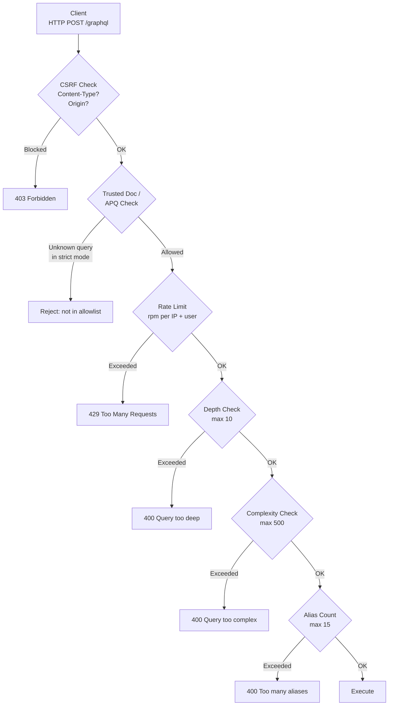

# Security

## Category

GraphQL — Security & Auth

## Context

GraphQL's flexibility is also its primary attack surface. A single endpoint that executes arbitrary client-constructed queries creates risks that do not exist in REST: **deeply nested queries** cause exponential resolver fan-out, **introspection** exposes the full data model to attackers, and **alias batching** allows brute-force attacks across a single request. Production GraphQL deployments require layered defences.

### Threat Model

| Threat | Attack Vector | Mitigation |
|--------|-------------|------------|
| **Deeply nested query** | `{ loans { borrower { loans { borrower { loans ... } } } } }` — exponential resolver calls | Query depth limit |
| **Overly broad query** | Client fetches every field across every type | Field count / query complexity limit |
| **Alias batching** | `{ a: login(email:"a"), b: login(email:"b"), ... }` — brute force via single request | Alias count limit + rate limiting |
| **Introspection leak** | `{ __schema { types { ... } } }` — full schema in one request | Disable introspection in production |
| **Batch operation abuse** | Array of 1000 mutations in one HTTP request | Max operations per batch limit |
| **Query amplification** | DataLoader `load()` called with unbound list keys | Cap `maxBatchSize` on DataLoaders |
| **CSRF** | Cross-site request from browser targeting `/graphql` | Require `Content-Type: application/json`; use CSRF token for GET |
| **Injection via variables** | Malicious input in mutation variables | Input validation at the resolver boundary — same as REST |

### Complexity Calculation

Query complexity assigns a cost to each field. The total cost must be below the configured maximum:

```
query {
  loans(first: 20) {     # cost: 1 (base) × 20 (multiplier) = 20
    borrower {            # cost: 1 × 20 = 20
      loans(first: 10) { # cost: 1 × 20 × 10 = 200  ← dangerous nesting
        id
      }
    }
  }
}
# Total: 240 — exceeds threshold of 100 → rejected
```

## Pros

- Depth and complexity limits are computed **before** execution — no resolvers are called for rejected queries
- Disabling introspection in production prevents schema reconnaissance without requiring any auth changes
- Trusted documents (persisted query allowlist) is the strongest defence — arbitrary query execution is disabled entirely
- `graphql-armour` combines all defences (depth, complexity, aliases, field count) in a single plugin

## Cons

- Overly strict complexity limits break legitimate deep queries — requires careful tuning per schema
- Disabling introspection breaks GraphiQL and Apollo Studio local dev — typically only disabled in production
- Complexity calculation requires explicit cost annotations on expensive fields — default cost of 1 per field underweights DataLoader-resolved list fields
- Trusted documents require all clients to pre-register queries — not suitable for APIs consumed by third parties building arbitrary queries

## Design Diagram



## Code Sample

### TypeScript — `graphql-armour` all-in-one protection (GraphQL Yoga)

```typescript
import { createYoga } from 'graphql-yoga';
import { ArmourPlugin } from '@escape.tech/graphql-armour';

const yoga = createYoga({
  schema,
  plugins: [
    ArmourPlugin({
      maxDepth: {
        enabled: true,
        n: 10,               // max nesting depth
        ignoreIntrospection: true,
      },
      maxTokens: {
        enabled: true,
        n: 1000,             // max tokens in query string
      },
      maxAliases: {
        enabled: true,
        n: 15,               // max alias count
      },
      maxDirectives: {
        enabled: true,
        n: 50,
      },
      costLimit: {
        enabled: true,
        maxCost: 500,
        objectCost: 2,       // each object type field = 2
        scalarCost: 1,       // each scalar field = 1
        depthCostFactor: 1.5 // cost multiplied by depth
      },
      blockFieldSuggestion: {
        // Do not hint at valid field names in error messages
        enabled: true,
        mask: '<redacted>',
      },
    }),
  ],
});
```

### TypeScript — Disable introspection in production

```typescript
import { createYoga, useDisableIntrospection } from 'graphql-yoga';

const yoga = createYoga({
  schema,
  plugins: [
    // Disable introspection in production; allow in development and for known API consumers
    useDisableIntrospection({
      isDisabled: (context) => {
        const ctx = context as AppContext;
        // Allow introspection for internal tooling (identified by header)
        if (process.env.NODE_ENV !== 'production') return false;
        if (ctx.user?.roles.includes('INTERNAL_TOOLING')) return false;
        return true;
      },
    }),
  ],
});
```

### TypeScript — Trusted documents (persisted query allowlist)

```typescript
import { usePersistedOperations } from '@graphql-yoga/plugin-persisted-operations';

// Build the allowlist map: hash → query string
// Generated by graphql-codegen or by running rover persisted-queries compile
import persistedOperations from './persisted-queries.json' assert { type: 'json' };

const yoga = createYoga({
  schema,
  plugins: [
    usePersistedOperations({
      getPersistedOperation(sha256Hash: string) {
        return persistedOperations[sha256Hash] ?? null;
      },

      // In strict mode, reject any operation NOT in the allowlist
      allowArbitraryOperations: process.env.NODE_ENV === 'development',

      // Custom error when unknown query is sent in production
      getNotFoundError(id) {
        return new Error(`Unknown persisted operation: ${id}`);
      },
    }),
  ],
});
```

### TypeScript — CSRF protection middleware (Express)

```typescript
import express from 'express';

const app = express();

// GraphQL CSRF protection:
// Reject GET requests with query parameter (allow only APQ GET with hash)
// Reject POST requests without application/json Content-Type
app.use('/graphql', (req, res, next) => {
  // Allow OPTIONS for CORS preflight
  if (req.method === 'OPTIONS') return next();

  const contentType = req.headers['content-type'] ?? '';

  if (req.method === 'POST' && !contentType.includes('application/json') && !contentType.includes('multipart/form-data')) {
    res.status(400).json({ errors: [{ message: 'Invalid Content-Type' }] });
    return;
  }

  // Reject cross-origin requests from non-allowed origins
  const origin = req.headers.origin;
  const allowedOrigins = (process.env.ALLOWED_ORIGINS ?? '').split(',');
  if (origin && !allowedOrigins.includes(origin)) {
    res.status(403).json({ errors: [{ message: 'Origin not allowed' }] });
    return;
  }

  next();
});
```

## References

- [OWASP GraphQL Security Cheat Sheet](https://cheatsheetseries.owasp.org/cheatsheets/GraphQL_Cheat_Sheet.html)
- [graphql-armour](https://escape.tech/graphql-armor/)
- [Trusted Documents / Persisted Queries](https://the-guild.dev/graphql/yoga-server/docs/features/persisted-operations)
- [Disabling Introspection](https://the-guild.dev/graphql/yoga-server/docs/security/disable-introspection)
- [Apollo Router Security](https://www.apollographql.com/docs/router/configuration/overview/#security)
