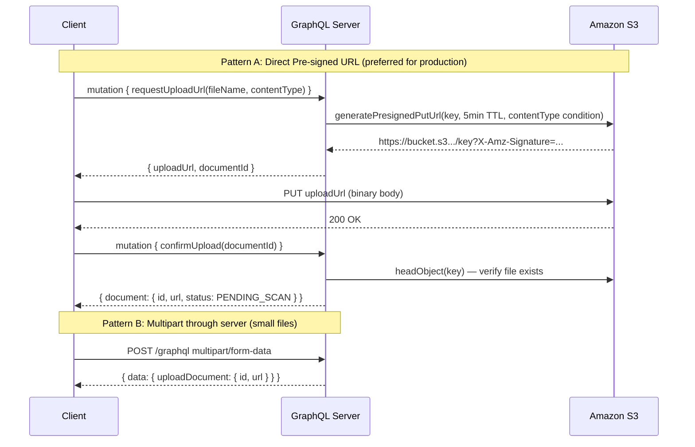

# File Uploads

## Category

GraphQL — Error & Edge Cases

## Context

Standard GraphQL operates over `application/json` — binary file uploads require a different transport. The **GraphQL multipart request specification** (by Jayden Seric) defines how to mix JSON (the GraphQL document + variables) with binary file parts in a single `multipart/form-data` HTTP request. Both Apollo Server and GraphQL Yoga support this spec.

For large files, a better pattern skips uploading through GraphQL entirely — the client uploads **directly to object storage** (S3, Azure Blob) via a **pre-signed URL** generated by a GraphQL mutation.

### Upload Strategy Comparison

| Strategy | Max File Size | Throughput | Complexity | When to Use |
|----------|-------------|-----------|------------|------------|
| **Multipart (through server)** | Limited by server memory + request timeout | Server is the bottleneck | Low | Small files < 5MB, single-service architectures |
| **Pre-signed URL (direct to S3)** | Up to 5TB (S3 multipart) | Client → S3 directly, no server bottleneck | Medium | Large files, production multi-tenant |
| **Chunked upload** | Unlimited | Resumable, parallel chunks | High | Video, large datasets, resume on failure |

### Multipart Request Format

```
POST /graphql
Content-Type: multipart/form-data; boundary=----FormBoundary

------FormBoundary
Content-Disposition: form-data; name="operations"

{ "query": "mutation UploadDoc($file: Upload!) { uploadDocument(file: $file) { id } }", "variables": { "file": null } }
------FormBoundary
Content-Disposition: form-data; name="map"

{ "0": ["variables.file"] }
------FormBoundary
Content-Disposition: form-data; name="0"; filename="contract.pdf"
Content-Type: application/pdf

<binary content>
------FormBoundary--
```

## Pros

- Multipart spec is handled transparently by GraphQL Yoga — resolver receives a standard `File` object
- Pre-signed URL pattern offloads bandwidth from the API server — S3 handles the transfer directly
- Pre-signed URL with conditions (`ContentLengthRange`, `ContentType`) enforces file constraints before upload
- Server-side virus scanning can be triggered by an S3 Lambda on object creation — decoupled from the upload path

## Cons

- Multipart uploads bypass Apollo Federation / Router — must be handled at a dedicated subgraph or gateway
- Pre-signed URL approach requires a second HTTP request from the client (GET URL, then PUT to S3) — more complex client code
- Storing files through the server creates memory pressure — `busboy`/`formidable` stream to disk to avoid OOM on concurrent uploads
- File type validation on Content-Type header is bypassable — always verify magic bytes server-side (or virus-scan on S3 event)

## Design Diagram



## Code Sample

### TypeScript — Pre-signed URL mutation (AWS SDK v3)

```typescript
import { S3Client, PutObjectCommand, HeadObjectCommand } from '@aws-sdk/client-s3';
import { getSignedUrl } from '@aws-sdk/s3-request-presigner';
import { randomUUID } from 'crypto';

const s3 = new S3Client({ region: process.env.AWS_REGION });
const BUCKET = process.env.DOCUMENTS_BUCKET!;

const ALLOWED_CONTENT_TYPES = new Set([
  'application/pdf',
  'image/jpeg',
  'image/png',
  'application/vnd.openxmlformats-officedocument.wordprocessingml.document',
]);

const MAX_FILE_SIZE_BYTES = 50 * 1024 * 1024; // 50MB

export const uploadResolvers = {
  Mutation: {
    requestUploadUrl: async (
      _parent: unknown,
      args: { fileName: string; contentType: string; loanId: string },
      ctx: AppContext
    ) => {
      if (!ctx.user) throw new GraphQLError('Unauthenticated', { extensions: { code: 'UNAUTHENTICATED' } });

      // Validate content type at the API boundary
      if (!ALLOWED_CONTENT_TYPES.has(args.contentType)) {
        return {
          uploadUrl: null,
          documentId: null,
          errors: [{ message: `Content type ${args.contentType} not permitted`, code: 'BAD_USER_INPUT', field: ['contentType'] }],
        };
      }

      const documentId = randomUUID();
      const key = `loans/${args.loanId}/documents/${documentId}/${args.fileName}`;

      const command = new PutObjectCommand({
        Bucket:      BUCKET,
        Key:         key,
        ContentType: args.contentType,
        Metadata: {
          uploadedBy: ctx.user.id,
          loanId:     args.loanId,
        },
      });

      const uploadUrl = await getSignedUrl(s3, command, {
        expiresIn: 300, // 5 minutes
      });

      // Create a pending document record — confirmed after client upload
      await ctx.db.document.create({
        data: {
          id:          documentId,
          loanId:      args.loanId,
          s3Key:       key,
          fileName:    args.fileName,
          contentType: args.contentType,
          status:      'PENDING_UPLOAD',
          createdBy:   ctx.user.id,
        },
      });

      return { uploadUrl, documentId, errors: [] };
    },

    confirmUpload: async (_parent: unknown, { documentId }: { documentId: string }, ctx: AppContext) => {
      if (!ctx.user) throw new GraphQLError('Unauthenticated', { extensions: { code: 'UNAUTHENTICATED' } });

      const doc = await ctx.db.document.findUnique({ where: { id: documentId } });
      if (!doc) return { document: null, errors: [{ message: 'Document not found', code: 'NOT_FOUND', field: ['documentId'] }] };

      // Verify the file was actually uploaded to S3
      try {
        await s3.send(new HeadObjectCommand({ Bucket: BUCKET, Key: doc.s3Key }));
      } catch {
        return { document: null, errors: [{ message: 'File not found in storage — upload may have failed', code: 'NOT_FOUND', field: ['documentId'] }] };
      }

      const updated = await ctx.db.document.update({
        where: { id: documentId },
        data:  { status: 'UPLOADED' },
      });

      return { document: updated, errors: [] };
    },
  },
};
```

### GraphQL SDL — File upload mutations

```graphql
scalar Upload

type Mutation {
  # Pattern A: Pre-signed URL (preferred)
  requestUploadUrl(
    loanId:      ID!
    fileName:    String!
    contentType: String!
  ): RequestUploadUrlPayload!

  confirmUpload(documentId: ID!): ConfirmUploadPayload!

  # Pattern B: Multipart — server-side (small files only)
  uploadDocument(
    loanId: ID!
    file:   Upload!
  ): UploadDocumentPayload!
}

type RequestUploadUrlPayload {
  uploadUrl:  String     # pre-signed S3 PUT URL
  documentId: ID
  errors:     [UserError!]!
}

type ConfirmUploadPayload {
  document: Document
  errors:   [UserError!]!
}

type Document {
  id:          ID!
  fileName:    String!
  contentType: String!
  status:      DocumentStatus!
  url:         String!   # pre-signed GET URL for download
  createdAt:   DateTime!
}

enum DocumentStatus {
  PENDING_UPLOAD
  UPLOADED
  SCANNING
  CLEAN
  QUARANTINED
}
```

### TypeScript — Client-side two-step upload

```typescript
import { useMutation } from '@apollo/client';
import { REQUEST_UPLOAD_URL, CONFIRM_UPLOAD } from './mutations';

async function uploadLoanDocument(loanId: string, file: File) {
  // Step 1: Get pre-signed URL
  const { data } = await requestUploadUrl({
    variables: { loanId, fileName: file.name, contentType: file.type },
  });

  const { uploadUrl, documentId, errors } = data!.requestUploadUrl;
  if (errors.length > 0 || !uploadUrl || !documentId) {
    throw new Error(errors[0]?.message ?? 'Failed to get upload URL');
  }

  // Step 2: PUT directly to S3
  const uploadResponse = await fetch(uploadUrl, {
    method:  'PUT',
    body:    file,
    headers: { 'Content-Type': file.type },
  });

  if (!uploadResponse.ok) {
    throw new Error(`S3 upload failed: ${uploadResponse.status}`);
  }

  // Step 3: Confirm upload via GraphQL
  const { data: confirmData } = await confirmUpload({ variables: { documentId } });
  return confirmData!.confirmUpload.document;
}
```

## References

- [GraphQL Multipart Request Spec](https://github.com/jaydenseric/graphql-multipart-request-spec)
- [GraphQL Yoga File Uploads](https://the-guild.dev/graphql/yoga-server/docs/features/file-uploads)
- [AWS Pre-signed URLs (SDK v3)](https://docs.aws.amazon.com/AmazonS3/latest/userguide/PresignedUrlUploadObject.html)
- [S3 Presigner — @aws-sdk/s3-request-presigner](https://www.npmjs.com/package/@aws-sdk/s3-request-presigner)
