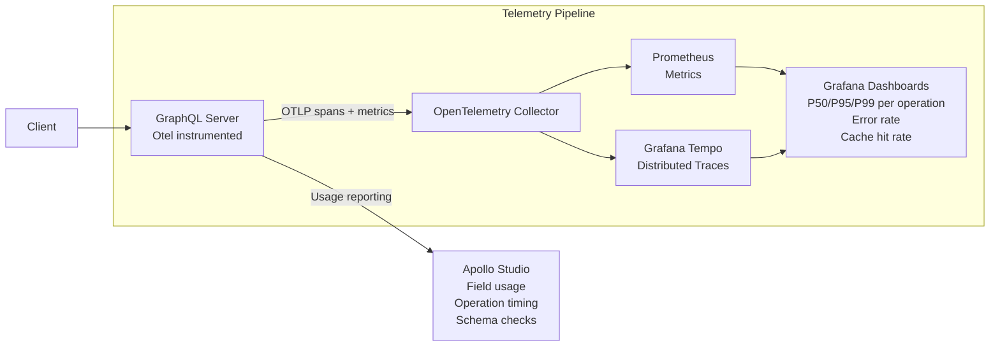

# Observability

## Category

GraphQL — Operations

## Context

GraphQL's single endpoint makes traditional HTTP-level metrics insufficient — a single `POST /graphql` can be a trivial field fetch or a complex multi-service join. Production GraphQL observability requires **field-level tracing** (which resolvers are slow?), **operation-level metrics** (which named queries are expensive?), and **error tracking** with GraphQL-aware context (which field returned an error?).

### Observability Dimensions

| Dimension | What to measure | Tooling |
|-----------|----------------|---------|
| **Operation tracing** | Duration per named operation | OpenTelemetry, Apollo Studio |
| **Field-level latency** | Time spent in each resolver | Apollo tracing extension, OpenTelemetry spans |
| **Error rate** | `errors[]` presence rate by operation + field | Apollo Studio, custom metrics |
| **Resolver depth** | How deep queries are reaching | Query plan logging |
| **Cache hit rate** | Response cache HIT vs MISS | Cache plugin metrics |
| **DataLoader efficiency** | Batch sizes, cache hits per request | DataLoader `cacheMap` size |
| **Schema usage** | Which fields/operations are used by clients | Apollo Schema Checks + Studio |

### OpenTelemetry Integration

GraphQL Yoga and Apollo Server both emit OpenTelemetry **spans** when configured with the `@opentelemetry/instrumentation-graphql` package. Each resolver execution becomes a child span of the root operation span, enabling full trace trees:

```
POST /graphql (HTTP span)
└─ parse (GraphQL parse span)
└─ validate (GraphQL validate span)
└─ execute (GraphQL execute span)
   ├─ Query.loans (resolver span)
   ├─ Loan.borrower (resolver span)  ← slow? look here
   └─ Loan.repayments (resolver span)
```

## Pros

- Field-level spans reveal exactly which resolver is contributing most latency — impossible to identify from HTTP-level metrics alone
- Apollo Studio aggregates operation usage across all client versions — identifies deprecated fields that are still queried
- Operation names in traces make dashboards actionable (`GetLoanDashboard` is more useful than `POST /graphql`)
- Error tracking with `graphQLErrors` context shows which field path produced the error — not just the HTTP status

## Cons

- GraphQL tracing adds a small overhead to every request — typically <1ms but measurable under high concurrency
- Apollo Studio usage reporting sends data to an external service — requires data governance review in regulated industries
- Field-level spans generate high-cardinality trace data — sampling is essential to avoid tracing storage cost explosion
- Private / self-hosted alternative (Hive, GraphQL Inspector Cloud) require more configuration effort than Apollo Studio

## Design Diagram



## Code Sample

### TypeScript — OpenTelemetry setup for GraphQL Yoga

```typescript
import { NodeSDK } from '@opentelemetry/sdk-node';
import { OTLPTraceExporter } from '@opentelemetry/exporter-trace-otlp-http';
import { OTLPMetricExporter } from '@opentelemetry/exporter-metrics-otlp-http';
import { GraphQLInstrumentation } from '@opentelemetry/instrumentation-graphql';
import { HttpInstrumentation } from '@opentelemetry/instrumentation-http';
import { PeriodicExportingMetricReader } from '@opentelemetry/sdk-metrics';
import { Resource } from '@opentelemetry/resources';
import { SEMRESATTRS_SERVICE_NAME } from '@opentelemetry/semantic-conventions';

const sdk = new NodeSDK({
  resource: new Resource({
    [SEMRESATTRS_SERVICE_NAME]: 'loans-graphql-api',
  }),
  traceExporter: new OTLPTraceExporter({
    url: process.env.OTEL_EXPORTER_OTLP_ENDPOINT + '/v1/traces',
  }),
  metricReader: new PeriodicExportingMetricReader({
    exporter: new OTLPMetricExporter({
      url: process.env.OTEL_EXPORTER_OTLP_ENDPOINT + '/v1/metrics',
    }),
    exportIntervalMillis: 15_000,
  }),
  instrumentations: [
    new HttpInstrumentation(),
    new GraphQLInstrumentation({
      // Create spans for every field resolver
      deepReadResolvers: true,
      // Include variables in span attributes (disable in prod for PII)
      allowValues: process.env.NODE_ENV !== 'production',
    }),
  ],
});

sdk.start();
process.on('SIGTERM', () => sdk.shutdown());
```

### TypeScript — Custom operation metrics with Prometheus (prom-client)

```typescript
import { register, Counter, Histogram } from 'prom-client';
import type { Plugin } from 'graphql-yoga';

const operationDuration = new Histogram({
  name: 'graphql_operation_duration_seconds',
  help: 'Duration of GraphQL operations',
  labelNames: ['operation_name', 'operation_type', 'status'],
  buckets: [0.005, 0.01, 0.025, 0.05, 0.1, 0.25, 0.5, 1, 2.5, 5],
});

const operationErrors = new Counter({
  name: 'graphql_operation_errors_total',
  help: 'Total number of GraphQL operation errors',
  labelNames: ['operation_name', 'error_code'],
});

export function useMetrics(): Plugin {
  return {
    onExecute({ args }) {
      const operationName = args.operationName ?? 'anonymous';
      const operationType = args.document.definitions[0]?.kind === 'OperationDefinition'
        ? (args.document.definitions[0] as any).operation
        : 'unknown';
      const start = performance.now();

      return {
        onExecuteDone({ result }) {
          const duration = (performance.now() - start) / 1000;
          const hasErrors = Array.isArray(result) ? result.some(r => r.errors?.length) : !!(result as any).errors?.length;

          operationDuration.labels(operationName, operationType, hasErrors ? 'error' : 'success').observe(duration);

          // Track errors by code
          const errors = Array.isArray(result) ? result.flatMap(r => r.errors ?? []) : (result as any).errors ?? [];
          for (const error of errors) {
            const code = error.extensions?.code ?? 'UNKNOWN';
            operationErrors.labels(operationName, code).inc();
          }
        },
      };
    },
  };
}

// Expose /metrics endpoint for Prometheus scraping
app.get('/metrics', async (_req, res) => {
  res.set('Content-Type', register.contentType);
  res.end(await register.metrics());
});
```

### TypeScript — Structured logging per operation (pino)

```typescript
import pino from 'pino';
import type { Plugin } from 'graphql-yoga';

const logger = pino({ level: process.env.LOG_LEVEL ?? 'info' });

export function useOperationLogger(): Plugin {
  return {
    onExecute({ args, extendContext }) {
      const operationName = args.operationName ?? 'anonymous';
      const start = Date.now();

      // Attach per-operation logger to context
      extendContext({ logger: logger.child({ operationName, requestId: (args.contextValue as any).requestId }) });

      return {
        onExecuteDone({ result }) {
          const duration = Date.now() - start;
          const errors = (result as any).errors;

          if (errors?.length) {
            logger.warn({ operationName, duration, errors: errors.map((e: any) => ({
              message: e.message,
              code:    e.extensions?.code,
              path:    e.path,
            })) }, 'GraphQL operation completed with errors');
          } else {
            logger.info({ operationName, duration }, 'GraphQL operation completed');
          }
        },
      };
    },
  };
}
```

### YAML — Grafana dashboard query examples (Prometheus)

```yaml
# P95 latency per operation name
- expr: |
    histogram_quantile(0.95,
      sum by (operation_name, le) (
        rate(graphql_operation_duration_seconds_bucket[5m])
      )
    )
  legendFormat: "{{operation_name}} P95"

# Error rate per operation
- expr: |
    sum by (operation_name, error_code) (
      rate(graphql_operation_errors_total[5m])
    )
  legendFormat: "{{operation_name}} — {{error_code}}"

# Top 10 slowest operations (last 1h average)
- expr: |
    topk(10,
      avg by (operation_name) (
        rate(graphql_operation_duration_seconds_sum[1h])
        /
        rate(graphql_operation_duration_seconds_count[1h])
      )
    )
```

## References

- [@opentelemetry/instrumentation-graphql](https://www.npmjs.com/package/@opentelemetry/instrumentation-graphql)
- [Apollo Studio — Operation Metrics](https://www.apollographql.com/docs/studio/metrics/usage-reporting/)
- [GraphQL Yoga Observability](https://the-guild.dev/graphql/yoga-server/docs/features/opentelemetry)
- [Hive Schema Registry](https://the-guild.dev/graphql/hive)
- [prom-client](https://github.com/siimon/prom-client)
