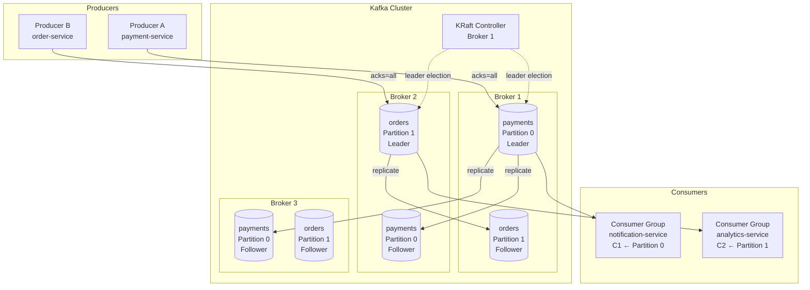

# Kafka Architecture & Core Concepts

## Category

Apache Kafka — Foundations

## Context

Apache Kafka is a distributed, append-only commit log designed for high-throughput, fault-tolerant, real-time event streaming. It decouples producers from consumers, persists events durably, and enables replay — qualities that make it the backbone of event-driven architectures at scale.

### Key Components

| Component | Role |
|-----------|------|
| **Broker** | Kafka server process that stores and serves partitions |
| **Controller** | Elected broker responsible for partition leadership and ISR management |
| **Producer** | Publishes records to topic partitions |
| **Consumer** | Reads records from topic partitions |
| **Consumer Group** | Set of consumers that cooperatively consume a topic |
| **ZooKeeper / KRaft** | Cluster metadata coordination (KRaft replaces ZooKeeper from Kafka 3.3+) |
| **Schema Registry** | External service for schema versioning (Avro, Protobuf, JSON Schema) |

### KRaft vs ZooKeeper Mode

| Aspect | ZooKeeper Mode | KRaft Mode (Kafka 3.3+) |
|--------|---------------|------------------------|
| Metadata store | External ZooKeeper ensemble | Internal Raft log on brokers |
| Operational complexity | High (two systems to operate) | Low (single system) |
| Partition limit | ~200 K practical ceiling | Millions of partitions |
| Controller failover | ~30 s | < 1 s |
| Production readiness | Legacy, deprecated Kafka 4.0 | GA, recommended |

### Replication & ISR

| Concept | Description |
|---------|-------------|
| **Replication Factor** | Number of copies of each partition across brokers |
| **ISR (In-Sync Replicas)** | Set of replicas caught up with the leader within `replica.lag.time.max.ms` |
| **acks=all** | Producer waits for all ISR to acknowledge — zero data loss |
| **min.insync.replicas** | Minimum ISR that must ack; write fails if ISR falls below this |
| **Unclean leader election** | Allows out-of-sync replica to become leader — risks data loss |

### Log Storage

Kafka stores data in **log segments** on disk. Each partition maps to a directory containing:
- `.log` — message data
- `.index` — sparse offset-to-position index
- `.timeindex` — sparse timestamp-to-offset index

Retention is enforced by `retention.ms` (time) or `retention.bytes` (size). Log compaction keeps the latest value per key indefinitely.

## Pros

- Linear horizontal scalability — add brokers to increase throughput
- Durability via replicated, disk-persistent log — survives broker failures
- Replay capability — consumers can re-process historical events from any offset
- Backpressure absorbed — producers and consumers decouple independently
- Ecosystem maturity — Kafka Streams, Connect, Schema Registry, ksqlDB

## Cons

- Operational complexity — tuning JVM, OS page cache, disk I/O, network requires expertise
- No built-in message TTL per-message (only topic-level retention)
- Ordering is guaranteed only within a single partition, not across partitions
- At-least-once delivery by default; exactly-once requires additional configuration
- ZooKeeper-mode clusters (legacy) require managing two distributed systems

## Design Diagram



## Code Sample

### TypeScript — Kafka admin client: create topic with KafkaJS

```typescript
import { Kafka, logLevel } from 'kafkajs';

const kafka = new Kafka({
  clientId: 'admin-client',
  brokers: process.env.KAFKA_BROKERS!.split(','),
  logLevel: logLevel.WARN,
  ssl: true,
  sasl: {
    mechanism: 'scram-sha-512',
    username: process.env.KAFKA_USERNAME!,
    password: process.env.KAFKA_PASSWORD!,
  },
});

const admin = kafka.admin();

async function ensureTopic(
  topic: string,
  numPartitions: number,
  replicationFactor: number,
): Promise<void> {
  await admin.connect();
  try {
    const existing = await admin.listTopics();
    if (existing.includes(topic)) {
      console.log(`Topic "${topic}" already exists`);
      return;
    }

    await admin.createTopics({
      waitForLeaders: true,
      topics: [
        {
          topic,
          numPartitions,
          replicationFactor,
          configEntries: [
            { name: 'retention.ms', value: String(7 * 24 * 60 * 60 * 1000) }, // 7 days
            { name: 'min.insync.replicas', value: '2' },
            { name: 'compression.type', value: 'lz4' },
          ],
        },
      ],
    });
    console.log(`Topic "${topic}" created with ${numPartitions} partitions`);
  } finally {
    await admin.disconnect();
  }
}

// Usage
await ensureTopic('payments.created', 12, 3);
```

### TypeScript — Describe cluster metadata

```typescript
async function describeCluster(): Promise<void> {
  await admin.connect();
  try {
    const cluster = await admin.describeCluster();
    console.log('Cluster ID:', cluster.clusterId);
    console.log('Controller:', cluster.controller);
    cluster.brokers.forEach(b =>
      console.log(`  Broker ${b.nodeId}: ${b.host}:${b.port} (rack: ${b.rack ?? 'none'})`),
    );

    const offsets = await admin.fetchTopicOffsets('payments.created');
    offsets.forEach(p =>
      console.log(`  Partition ${p.partition}: high=${p.high} low=${p.low}`),
    );
  } finally {
    await admin.disconnect();
  }
}
```

### Properties — broker configuration (server.properties)

```properties
# KRaft mode — no ZooKeeper required
process.roles=broker,controller
node.id=1
controller.quorum.voters=1@broker1:9093,2@broker2:9093,3@broker3:9093

listeners=PLAINTEXT://:9092,CONTROLLER://:9093
advertised.listeners=PLAINTEXT://broker1.example.com:9092

# Log storage
log.dirs=/var/kafka/data
num.partitions=3
default.replication.factor=3
min.insync.replicas=2

# Retention
log.retention.hours=168
log.retention.bytes=107374182400
log.segment.bytes=1073741824

# Performance
num.network.threads=8
num.io.threads=16
socket.send.buffer.bytes=102400
socket.receive.buffer.bytes=102400
socket.request.max.bytes=104857600

# Replication
replica.lag.time.max.ms=30000
unclean.leader.election.enable=false
auto.leader.rebalance.enable=true
```

## References

- [Kafka Documentation — Architecture](https://kafka.apache.org/documentation/#design)
- [KRaft: Apache Kafka Without ZooKeeper](https://developer.confluent.io/learn/kraft/)
- [KafkaJS](https://kafka.js.org/)
- [Kafka: The Definitive Guide (O'Reilly)](https://www.oreilly.com/library/view/kafka-the-definitive/9781492043072/)
