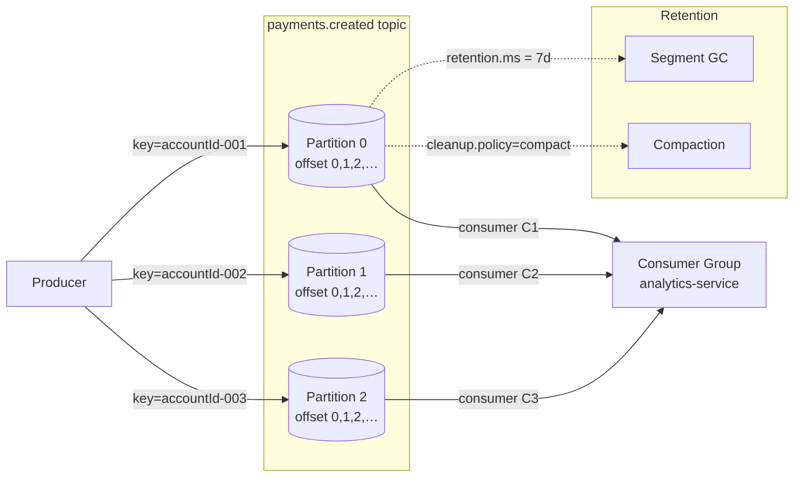

# Topics, Partitions & Offsets

## Category

Apache Kafka — Foundations

## Context

A **topic** is a named, ordered, immutable log of records. Topics are split into **partitions** — the unit of parallelism and scale in Kafka. Each record within a partition is assigned a monotonically increasing **offset**. Understanding the relationship between these three constructs is the foundation of every Kafka design decision.

### Anatomy of a Kafka Record

| Field | Description |
|-------|-------------|
| **Offset** | Partition-local integer, immutable once written |
| **Timestamp** | CreateTime (producer) or LogAppendTime (broker) |
| **Key** | Optional bytes; drives partition routing and compaction |
| **Value** | Message payload bytes |
| **Headers** | Key-value metadata map (tracing IDs, schema ID, etc.) |

### Partition Strategy

| Strategy | When to Use | Key Setting |
|----------|-------------|-------------|
| **Key-based (murmur2 hash)** | Ordering per entity (e.g., per account ID) | Set a non-null record key |
| **Round-robin** | Maximum throughput, no ordering needed | Null key |
| **Sticky partitioner** | Batch efficiency with null keys (default Kafka 2.4+) | Null key, sticky batch |
| **Custom partitioner** | Advanced routing logic | Implement `Partitioner` interface |

### Retention Policies

| Policy | Config | Effect |
|--------|--------|--------|
| **Time-based** | `retention.ms` (default 7 days) | Deletes segments older than threshold |
| **Size-based** | `retention.bytes` | Deletes oldest segments when size exceeded |
| **Compaction** | `cleanup.policy=compact` | Retains latest value per key forever |
| **Compact + Delete** | `cleanup.policy=compact,delete` | Compact, then honour time/size limits |

### How Many Partitions?

The partition count determines max consumer parallelism. Rules of thumb:

| Factor | Guidance |
|--------|---------|
| Consumer parallelism | Partitions ≥ max consumers in group |
| Throughput | `total_throughput / single_partition_throughput` |
| Upper bound caution | Each partition = open file handle + leader overhead |
| Changing later | Increasing partitions breaks key ordering; plan upfront |

## Pros

- Horizontal scale — more partitions → more consumers processing in parallel  
- Strong ordering within a partition — use keyed records when entity ordering matters  
- Durable, replayable log — consumers can seek to any offset at any time  
- Log compaction enables Kafka to act as a distributed key-value store  
- Flexible retention independent per topic  

## Cons

- No ordering across partitions — cross-entity joins require external state  
- Partition count cannot be reduced without recreating the topic  
- Increasing partitions after go-live breaks key → partition affinity  
- Too many partitions increase controller and client metadata overhead  
- Compacted topics require careful tombstone (`null` value) management  

## Design Diagram



## Code Sample

### TypeScript — Produce records with explicit key-based routing

```typescript
import { Kafka, Partitioners, CompressionTypes } from 'kafkajs';

const kafka = new Kafka({
  clientId: 'payment-service',
  brokers: process.env.KAFKA_BROKERS!.split(','),
});

const producer = kafka.producer({
  createPartitioner: Partitioners.DefaultPartitioner,
  idempotent: true,           // enable idempotent producer
  transactionTimeout: 30_000,
});

interface PaymentCreatedEvent {
  paymentId: string;
  accountId: string;
  amount: number;
  currency: string;
  timestamp: string;
}

export async function publishPaymentCreated(event: PaymentCreatedEvent): Promise<void> {
  await producer.connect();

  await producer.send({
    topic: 'payments.created',
    compression: CompressionTypes.LZ4,
    messages: [
      {
        // Key drives partition: all events for same accountId → same partition → ordered
        key: event.accountId,
        value: JSON.stringify(event),
        headers: {
          'content-type': 'application/json',
          'event-type': 'PaymentCreated',
          'correlation-id': crypto.randomUUID(),
        },
        timestamp: Date.now().toString(),
      },
    ],
  });
}
```

### TypeScript — Seek to a specific offset (replay)

```typescript
import { Kafka } from 'kafkajs';

const kafka = new Kafka({ clientId: 'replayer', brokers: ['localhost:9092'] });
const consumer = kafka.consumer({ groupId: 'replay-group' });

async function replayFromOffset(
  topic: string,
  partition: number,
  fromOffset: string,
): Promise<void> {
  await consumer.connect();
  await consumer.subscribe({ topic, fromBeginning: false });

  // Override offset before first poll
  consumer.on(consumer.events.GROUP_JOIN, async () => {
    await consumer.seek({ topic, partition, offset: fromOffset });
  });

  await consumer.run({
    eachMessage: async ({ message, partition: p, offset }) => {
      console.log(`[${p}@${offset}] ${message.value?.toString()}`);
    },
  });
}

await replayFromOffset('payments.created', 0, '1000');
```

### Shell — Inspect topic offsets and partition metadata with kafka-topics CLI

```bash
# Describe a topic
kafka-topics.sh --bootstrap-server localhost:9092 \
  --describe --topic payments.created

# List earliest and latest offsets per partition
kafka-run-class.sh kafka.tools.GetOffsetShell \
  --bootstrap-server localhost:9092 \
  --topic payments.created \
  --time -1   # -1 = latest, -2 = earliest

# Alter retention (without recreating the topic)
kafka-configs.sh --bootstrap-server localhost:9092 \
  --entity-type topics --entity-name payments.created \
  --alter --add-config retention.ms=604800000
```

### Properties — topic-level config for a compacted state topic

```properties
# Applied via kafka-configs.sh or AdminClient createTopics configEntries
cleanup.policy=compact
min.cleanable.dirty.ratio=0.1
segment.ms=3600000
delete.retention.ms=86400000
max.compaction.lag.ms=604800000
```

## References

- [Kafka Documentation — Topics & Partitions](https://kafka.apache.org/documentation/#intro_topics)
- [Kafka Documentation — Log Compaction](https://kafka.apache.org/documentation/#compaction)
- [How to Choose the Number of Partitions](https://www.confluent.io/blog/how-choose-number-topics-partitions-kafka-cluster/)
- [KafkaJS Producer API](https://kafka.js.org/docs/producing)
