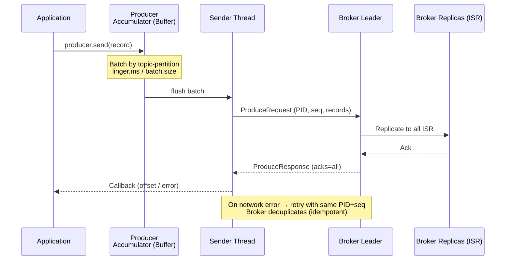

# Producers — Configuration & Reliability

## Category

Apache Kafka — Reliability & Correctness

## Context

The Kafka producer is a client library that serializes records, routes them to the correct partition, batches them for efficiency, and handles acknowledgement, retries, and compression. Misconfiguring the producer is the most common source of either data loss or unexpected duplication in Kafka deployments.

### Critical Producer Settings

| Setting | Default | Recommended Production | Effect |
|---------|---------|----------------------|--------|
| `acks` | `1` | `all` | Controls durability guarantee |
| `retries` | `2147483647` | keep default | Number of retry attempts on retriable errors |
| `delivery.timeout.ms` | `120000` | `120000` | Total time including retries before giving up |
| `enable.idempotence` | `true` (Kafka 3+) | `true` | Prevents duplicates on retry |
| `max.in.flight.requests.per.connection` | `5` | `5` (idempotent) / `1` (strict order) | Concurrent unacked batches |
| `batch.size` | `16384` | `65536`–`131072` | Max bytes per batch |
| `linger.ms` | `0` | `5`–`20` | Wait to fill batch before sending |
| `compression.type` | `none` | `lz4` or `zstd` | Payload compression |
| `buffer.memory` | `33554432` | `67108864` | Total producer buffer |

### Delivery Guarantee Matrix

| `acks` | `enable.idempotence` | `transactional.id` | Guarantee |
|--------|---------------------|-------------------|-----------|
| `0` | false | — | At-most-once (fire and forget) |
| `1` | false | — | At-least-once (leader only) |
| `all` | false | — | At-least-once (all ISR) |
| `all` | true | — | Exactly-once per partition |
| `all` | true | set | Exactly-once across partitions (transactions) |

### Idempotent Producer

With `enable.idempotence=true` the broker assigns each producer a **PID (Producer ID)** and tracks a **sequence number** per partition. On retry, the broker deduplicates messages with the same `(PID, partition, sequence)` tuple — preventing duplicates caused by network retransmission.

Requires: `acks=all`, `retries > 0`, `max.in.flight.requests.per.connection ≤ 5`.

## Pros

- Batching + compression dramatically improves throughput (often 3–10×)
- Idempotent producer safely retries without producing duplicates
- `acks=all` + `min.insync.replicas=2` provides zero data-loss guarantee
- Async send with callbacks keeps producer threads non-blocking
- Per-record headers enable zero-cost metadata (tracing IDs, schema IDs)

## Cons

- `acks=all` + `linger.ms > 0` adds latency proportional to slowest ISR replica
- Idempotent producer requires additional broker-side state per producer (PID tracking)
- Buffer full (`BufferExhaustedException`) requires backpressure handling in application
- Compression CPU overhead on producer; negligible at `lz4` level, noticeable at `zstd`
- `max.in.flight = 1` (strict ordering without idempotence) deeply hurts throughput

## Design Diagram



## Code Sample

### TypeScript — Production-grade producer with KafkaJS

```typescript
import {
  Kafka,
  Producer,
  CompressionTypes,
  Partitioners,
  ProducerRecord,
} from 'kafkajs';

export function buildProducer(brokers: string[]): Producer {
  const kafka = new Kafka({
    clientId: 'payment-service',
    brokers,
    ssl: true,
    sasl: { mechanism: 'scram-sha-512', username: process.env.KAFKA_USER!, password: process.env.KAFKA_PASS! },
  });

  return kafka.producer({
    createPartitioner: Partitioners.DefaultPartitioner,
    idempotent: true,          // enable.idempotence=true
    transactionTimeout: 30_000,
    allowAutoTopicCreation: false,
    retry: {
      initialRetryTime: 100,
      retries: 10,
      factor: 2,
      maxRetryTime: 30_000,
    },
  });
}

// Typed, retryable send helper
export async function sendEvent<T extends object>(
  producer: Producer,
  topic: string,
  key: string,
  event: T,
  eventType: string,
): Promise<{ partition: number; offset: string | null }[]> {
  const record: ProducerRecord = {
    topic,
    compression: CompressionTypes.LZ4,
    messages: [
      {
        key,
        value: JSON.stringify(event),
        headers: {
          'event-type': Buffer.from(eventType),
          'content-type': Buffer.from('application/json'),
          'producer-id': Buffer.from(process.env.SERVICE_NAME ?? 'unknown'),
          'correlation-id': Buffer.from(crypto.randomUUID()),
          timestamp: Buffer.from(new Date().toISOString()),
        },
      },
    ],
  };

  const results = await producer.send(record);
  return results.map(r => ({ partition: r.partition, offset: r.offset }));
}
```

### TypeScript — Transactional producer (exactly-once across topics)

```typescript
import { Kafka, Partitioners } from 'kafkajs';

const kafka = new Kafka({ clientId: 'order-service', brokers: ['localhost:9092'] });

const producer = kafka.producer({
  createPartitioner: Partitioners.DefaultPartitioner,
  idempotent: true,
  transactionalId: `order-service-${process.env.POD_NAME ?? 'local'}`,
  transactionTimeout: 30_000,
});

await producer.connect();

export async function publishWithTransaction(
  commandTopic: string,
  eventTopic: string,
  command: object,
  event: object,
  key: string,
): Promise<void> {
  const transaction = await producer.transaction();
  try {
    await transaction.send({
      topic: commandTopic,
      messages: [{ key, value: JSON.stringify(command) }],
    });
    await transaction.send({
      topic: eventTopic,
      messages: [{ key, value: JSON.stringify(event) }],
    });
    await transaction.commit();
  } catch (err) {
    await transaction.abort();
    throw err;
  }
}
```

### Properties — producer.properties reference

```properties
# Durability
acks=all
enable.idempotence=true
retries=2147483647
delivery.timeout.ms=120000
max.in.flight.requests.per.connection=5

# Throughput
batch.size=131072
linger.ms=10
buffer.memory=67108864
compression.type=lz4

# Serialisation
key.serializer=org.apache.kafka.common.serialization.StringSerializer
value.serializer=io.confluent.kafka.serializers.KafkaAvroSerializer
schema.registry.url=https://schema-registry.example.com

# Security
security.protocol=SASL_SSL
sasl.mechanism=SCRAM-SHA-512
sasl.jaas.config=org.apache.kafka.common.security.scram.ScramLoginModule required \
  username="${KAFKA_USERNAME}" password="${KAFKA_PASSWORD}";
```

## References

- [Kafka Documentation — Producer Configs](https://kafka.apache.org/documentation/#producerconfigs)
- [Idempotent Producer](https://kafka.apache.org/documentation/#semantics)
- [KafkaJS — Producing Messages](https://kafka.js.org/docs/producing)
- [Confluent — Kafka Producer Best Practices](https://www.confluent.io/blog/kafka-producer-internals-preparing-event-for-submission/)
