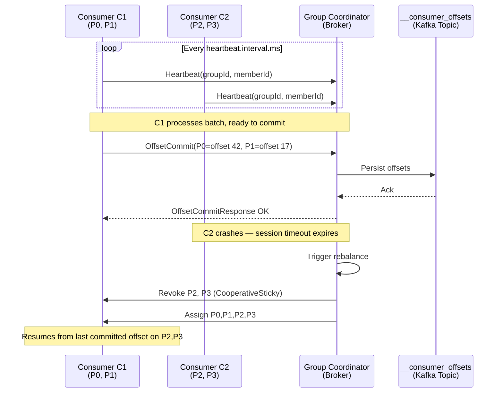

# Consumer Groups & Offset Management

## Category

Apache Kafka — Consumers

## Context

A **consumer group** is a set of consumers that cooperatively consume a topic. Each partition is assigned to exactly one consumer in the group at a time, enabling parallel processing while maintaining per-partition ordering. **Offsets** track how far each group has read through each partition; managing them correctly is critical to avoid message loss or unnecessary reprocessing.

### Consumer Group Assignment

| Concept | Description |
|---------|-------------|
| **Group Coordinator** | A broker that manages group membership and offset commits for a group |
| **Group Leader** | A consumer elected to perform partition assignment using the configured assignor |
| **Assignor** | Algorithm that maps partitions to consumers |
| **Heartbeat** | Periodic signal from consumer to coordinator to prove liveness |
| **Session Timeout** | Time after which a silent consumer is considered dead; triggers rebalance |

### Partition Assignors

| Assignor | Strategy | Best For |
|----------|----------|----------|
| `RangeAssignor` (default) | Contiguous range per consumer | Simple, single-topic groups |
| `RoundRobinAssignor` | Alternating round-robin | Even load across many topics |
| `StickyAssignor` | Minimize reassignment on rebalance | Stateful consumers (Kafka Streams) |
| `CooperativeStickyAssignor` | Incremental rebalance, no stop-the-world | **Recommended** for most production groups |

### Offset Commit Strategies

| Strategy | How | Risk |
|----------|-----|------|
| **Auto-commit** | Background thread every `auto.commit.interval.ms` | Can commit before processing; lose messages if consumer crashes |
| **Manual sync commit** | `commitSync()` after `poll()` | Blocks; safe but lower throughput |
| **Manual async commit** | `commitAsync()` + retry on callback | Non-blocking; risk of out-of-order commit on retry |
| **Batch commit** | Commit once per N messages or T ms | Good balance of safety and throughput |
| **Sync commit on rebalance** | `commitSync()` in `onPartitionsRevoked` | Required for exactly-once in consumer |

### Key Consumer Settings

| Setting | Default | Recommendation | Effect |
|---------|---------|----------------|--------|
| `group.id` | — | unique per logical consumer | Partition offset isolation |
| `enable.auto.commit` | `true` | `false` in production | Prevents premature offset commit |
| `auto.offset.reset` | `latest` | `earliest` for new deployments | Where to start if no committed offset |
| `max.poll.interval.ms` | `300000` | tune to max processing time | Exceeding causes rebalance |
| `max.poll.records` | `500` | `100`–`500` depending on SLA | Records per poll loop iteration |
| `session.timeout.ms` | `45000` | `30000`–`60000` | Heartbeat absence triggers rebalance |
| `heartbeat.interval.ms` | `3000` | `session.timeout.ms / 3` | Frequency of heartbeat; must be < session timeout |

## Pros

- Parallelism scales linearly with partitions — add consumers to consume faster  
- Per-group offset isolation — multiple independent consumers of the same topic  
- Cooperative sticky assignor eliminates stop-the-world rebalances  
- Manual offset commit enables exactly-once processing with external stores  
- Consumer lag (committed offset vs latest) is a first-class operational metric  

## Cons

- Rebalances pause all consumption in the group during classic (eager) assignor  
- `max.poll.interval.ms` breach causes involuntary removal — must scope processing time  
- Automatic commit hides bugs: message appears processed but was never handled  
- Consumer groups are broker-side state — high number of groups increases coordinator load  
- Offset reset to `earliest` on new group can trigger large replay bursts  

## Design Diagram



## Code Sample

### TypeScript — Consumer with manual commit and cooperative sticky rebalance

```typescript
import { Kafka, Consumer, EachMessagePayload } from 'kafkajs';

const kafka = new Kafka({
  clientId: 'notification-service',
  brokers: process.env.KAFKA_BROKERS!.split(','),
  ssl: true,
  sasl: {
    mechanism: 'scram-sha-512',
    username: process.env.KAFKA_USER!,
    password: process.env.KAFKA_PASS!,
  },
});

export function buildConsumer(): Consumer {
  return kafka.consumer({
    groupId: 'notification-service-v1',
    sessionTimeout: 30_000,
    heartbeatInterval: 3_000,
    maxBytesPerPartition: 1_048_576,   // 1 MB
    maxWaitTimeInMs: 500,
    retry: { initialRetryTime: 100, retries: 8 },
  });
}

export async function startConsumer(
  consumer: Consumer,
  handler: (payload: EachMessagePayload) => Promise<void>,
): Promise<void> {
  await consumer.connect();

  await consumer.subscribe({
    topics: ['payments.created', 'payments.completed'],
    fromBeginning: false,
  });

  // Commit offsets on partition revocation (cooperative rebalance)
  consumer.on(consumer.events.STOP, async () => {
    await consumer.commitOffsets(
      consumer
        .assignment()
        .map(tp => ({ topic: tp.topic, partition: tp.partition, offset: '-1' })),
    );
  });

  await consumer.run({
    autoCommit: false,
    partitionsConsumedConcurrently: 4,
    eachMessage: async (payload) => {
      const { topic, partition, message } = payload;
      try {
        await handler(payload);
        // Manual commit after successful processing
        await consumer.commitOffsets([
          {
            topic,
            partition,
            offset: (Number(message.offset) + 1).toString(),
            metadata: null,
          },
        ]);
      } catch (err) {
        // Log and rethrow — let DLQ middleware handle it upstream
        console.error(`Failed to process [${topic}#${partition}@${message.offset}]`, err);
        throw err;
      }
    },
  });
}
```

### TypeScript — Consumer lag monitor

```typescript
import { Kafka } from 'kafkajs';

interface PartitionLag {
  topic: string;
  partition: number;
  lag: bigint;
}

export async function getConsumerLag(
  groupId: string,
  topics: string[],
): Promise<PartitionLag[]> {
  const admin = kafka.admin();
  await admin.connect();
  try {
    const committed = await admin.fetchOffsets({ groupId, topics });
    const lags: PartitionLag[] = [];

    for (const topic of topics) {
      const latest = await admin.fetchTopicOffsets(topic);
      const committedForTopic = committed.find(t => t.topic === topic);

      for (const { partition, offset: high } of latest) {
        const committedOffset =
          committedForTopic?.partitions.find(p => p.partition === partition)?.offset ?? '0';
        const lag = BigInt(high) - BigInt(committedOffset);
        lags.push({ topic, partition, lag });
      }
    }

    return lags;
  } finally {
    await admin.disconnect();
  }
}
```

### Shell — Reset consumer group offsets

```bash
# Dry-run: show what offsets would be reset to
kafka-consumer-groups.sh --bootstrap-server localhost:9092 \
  --group notification-service-v1 \
  --topic payments.created \
  --reset-offsets --to-earliest --dry-run

# Execute reset (stop consumers first)
kafka-consumer-groups.sh --bootstrap-server localhost:9092 \
  --group notification-service-v1 \
  --topic payments.created \
  --reset-offsets --to-datetime 2026-01-01T00:00:00.000 --execute

# Describe group: see lag per partition
kafka-consumer-groups.sh --bootstrap-server localhost:9092 \
  --describe --group notification-service-v1
```

## References

- [Kafka Documentation — Consumer Groups](https://kafka.apache.org/documentation/#intro_consumers)
- [KafkaJS — Consuming Messages](https://kafka.js.org/docs/consuming)
- [Cooperative Rebalancing — Confluent Blog](https://www.confluent.io/blog/incremental-cooperative-rebalancing-in-kafka/)
- [Kafka Consumer Lag Monitoring](https://docs.confluent.io/platform/current/kafka/monitoring.html#consumer-lag)
