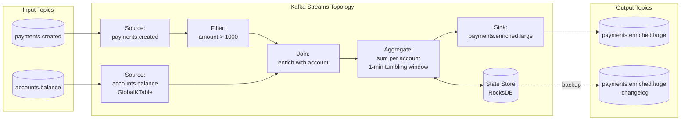

# Kafka Streams — Stream Processing

## Category

Apache Kafka — Stream Processing

## Context

**Kafka Streams** is an embedded Java/Scala library for building stateful, fault-tolerant stream-processing applications. Unlike Flink or Spark, it runs inside ordinary JVM services — no separate cluster required. It reads from and writes to Kafka topics, maintaining local RocksDB state stores backed by changelog topics.

### Kafka Streams vs Alternatives

| Aspect | Kafka Streams | Apache Flink | ksqlDB |
|--------|--------------|-------------|--------|
| Deployment | Embedded in app | Separate cluster | Separate cluster |
| Language | Java / Kotlin | Java / Scala / Python | SQL |
| State store | RocksDB (local) | RocksDB / heap | RocksDB |
| Exactly-once | Yes | Yes | Yes |
| Learning curve | Medium | High | Low |
| Best for | Microservice-embedded processing | Complex/large-scale jobs | BI analysts, rapid prototyping |

### Core Abstractions

| Abstraction | Description |
|-------------|-------------|
| **KStream** | Unbounded stream of records — append-only interpretations |
| **KTable** | Changelog stream interpreted as latest value per key (materialized view) |
| **GlobalKTable** | KTable replicated to all instances (good for small lookup tables) |
| **Topology** | DAG of processing nodes (sources, processors, sinks) |
| **State Store** | Local RocksDB store, backed by `*-changelog` Kafka topic |
| **Task** | Unit of parallelism — one task per partition assignment |

### Windowing Types

| Window Type | Use Case | Example |
|-------------|----------|---------|
| **Tumbling** | Fixed non-overlapping intervals | 1-min aggregation |
| **Hopping** | Fixed size, overlapping at advance interval | 5-min window every 1 min |
| **Sliding** | Window containing records within time difference | Events within 10 s of each other |
| **Session** | Activity-grouped inactivity gap | User session until 30 s idle |

## Pros

- No separate cluster — deploy as part of your microservice
- Exactly-once processing with Kafka transactions out of the box
- Fault-tolerant state via RocksDB + changelog topics — automatic recovery
- Interactive queries expose state store over HTTP (no extra query infrastructure)
- Kafka Streams DSL is high-level; Processor API allows full control

## Cons

- JVM only — TypeScript / Node producers must send to Kafka; JS cannot run Kafka Streams natively
- State store restoration on startup can be slow for large materialised views
- RocksDB memory and disk require capacity planning
- Out-of-order / late-arriving events need explicit grace periods
- Topology changes are not always backward-compatible during rolling deploys

## Design Diagram



## Code Sample

### Java — Kafka Streams topology with joining, filtering, and windowed aggregation

```java
import org.apache.kafka.common.serialization.Serdes;
import org.apache.kafka.streams.*;
import org.apache.kafka.streams.kstream.*;
import java.time.Duration;
import java.util.Properties;

public class PaymentEnrichmentTopology {

    public static Topology build() {
        StreamsBuilder builder = new StreamsBuilder();

        // Global lookup table for account data (small, replicated everywhere)
        GlobalKTable<String, String> accounts = builder.globalTable(
            "accounts.balance",
            Consumed.with(Serdes.String(), Serdes.String())
        );

        KStream<String, String> payments = builder.stream(
            "payments.created",
            Consumed.with(Serdes.String(), Serdes.String())
        );

        // 1. Filter high-value payments
        KStream<String, String> highValue = payments.filter(
            (accountId, paymentJson) -> extractAmount(paymentJson) > 1000.0
        );

        // 2. Enrich with account data via GlobalKTable join
        KStream<String, String> enriched = highValue.join(
            accounts,
            (accountId, paymentJson) -> accountId,  // key extractor
            (paymentJson, accountJson) -> mergeJson(paymentJson, accountJson)
        );

        // 3. Windowed aggregation: sum per account in 1-minute tumbling windows
        enriched
            .groupByKey(Grouped.with(Serdes.String(), Serdes.String()))
            .windowedBy(TimeWindows.ofSizeWithNoGrace(Duration.ofMinutes(1)))
            .aggregate(
                () -> "0",
                (accountId, paymentJson, currentSum) ->
                    String.valueOf(Double.parseDouble(currentSum) + extractAmount(paymentJson)),
                Materialized.<String, String, WindowStore<Bytes, byte[]>>as("payment-window-store")
                    .withValueSerde(Serdes.String())
            )
            .toStream()
            .map((windowedKey, sum) -> KeyValue.pair(windowedKey.key(), sum))
            .to("payments.enriched.large", Produced.with(Serdes.String(), Serdes.String()));

        return builder.build();
    }

    public static void main(String[] args) {
        Properties props = new Properties();
        props.put(StreamsConfig.APPLICATION_ID_CONFIG, "payment-enrichment-v1");
        props.put(StreamsConfig.BOOTSTRAP_SERVERS_CONFIG, System.getenv("KAFKA_BROKERS"));
        props.put(StreamsConfig.DEFAULT_KEY_SERDE_CLASS_CONFIG, Serdes.StringSerde.class);
        props.put(StreamsConfig.DEFAULT_VALUE_SERDE_CLASS_CONFIG, Serdes.StringSerde.class);
        props.put(StreamsConfig.PROCESSING_GUARANTEE_CONFIG, StreamsConfig.EXACTLY_ONCE_V2);
        props.put(StreamsConfig.REPLICATION_FACTOR_CONFIG, 3);
        props.put(StreamsConfig.NUM_STREAM_THREADS_CONFIG, 4);

        KafkaStreams streams = new KafkaStreams(build(), props);
        streams.setUncaughtExceptionHandler(ex -> StreamsUncaughtExceptionHandler.StreamThreadExceptionResponse.REPLACE_THREAD);
        streams.start();
        Runtime.getRuntime().addShutdownHook(new Thread(streams::close));
    }

    private static double extractAmount(String json) { /* parse json */ return 0; }
    private static String mergeJson(String a, String b) { /* merge */ return a; }
}
```

### Java — Interactive query: expose state store over HTTP

```java
import org.apache.kafka.streams.state.*;

@RestController
public class PaymentWindowController {

    private final KafkaStreams streams;

    @GetMapping("/windows/{accountId}")
    public List<Map<String, Object>> getWindows(@PathVariable String accountId) {
        ReadOnlyWindowStore<String, String> store = streams.store(
            StoreQueryParameters.fromNameAndType(
                "payment-window-store",
                QueryableStoreTypes.windowStore()
            )
        );

        Instant from = Instant.now().minus(Duration.ofHours(1));
        Instant to = Instant.now();
        WindowStoreIterator<String> iter = store.fetch(accountId, from, to);

        List<Map<String, Object>> result = new ArrayList<>();
        while (iter.hasNext()) {
            KeyValue<Long, String> kv = iter.next();
            result.add(Map.of("windowStart", kv.key, "sum", kv.value));
        }
        iter.close();
        return result;
    }
}
```

## References

- [Kafka Streams Documentation](https://kafka.apache.org/documentation/streams/)
- [Kafka Streams Developer Guide](https://docs.confluent.io/platform/current/streams/developer-guide/index.html)
- [Kafka Streams Exactly-Once](https://www.confluent.io/blog/enabling-exactly-once-kafka-streams/)
- [Interactive Queries](https://kafka.apache.org/35/documentation/streams/developer-guide/interactive-queries.html)
