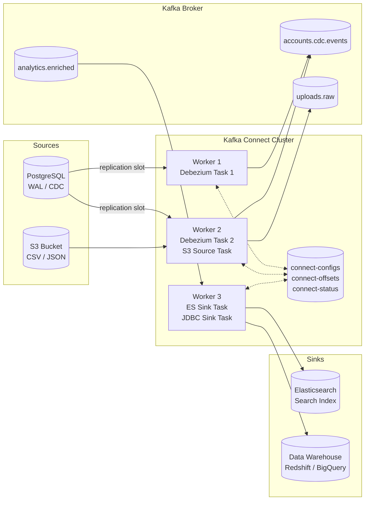

# Kafka Connect — Data Integration

## Category

Apache Kafka — Data Integration

## Context

**Kafka Connect** is a scalable, fault-tolerant framework for streaming data between Kafka and external systems using pre-built or custom **connectors**. Source connectors ingest data into Kafka; sink connectors push data out. Connectors are configured via JSON REST API and run as isolated worker processes.

### Source vs Sink

| Direction | Connector | Example Systems |
|-----------|-----------|----------------|
| External → Kafka | **Source Connector** | PostgreSQL CDC (Debezium), S3, Salesforce, MongoDB |
| Kafka → External | **Sink Connector** | Elasticsearch, S3, JDBC (SQL DB), Splunk, BigQuery |

### Deployment Modes

| Mode | Use Case | Scaling |
|------|----------|---------|
| **Standalone** | Dev / single-machine | Single worker, tasks not distributed |
| **Distributed** | Production | Multiple workers, tasks spread across cluster |

### Key Concepts

| Concept | Description |
|---------|-------------|
| **Connector** | High-level logical job config (1 per data flow) |
| **Task** | Unit of parallelism within a connector; `tasks.max` controls count |
| **Worker** | JVM process running one or more tasks |
| **SMT (Single Message Transform)** | Lightweight in-flight record transformation |
| **Converter** | Serialization format for keys/values (Avro, JSON, Protobuf, String) |
| **Offset Store** | Internal Kafka topic (`connect-offsets`) tracking source read position |

### Popular Connectors

| Connector | Type | Publisher |
|-----------|------|-----------|
| `debezium-connector-postgres` | Source — CDC | Debezium / Confluent |
| `debezium-connector-mysql` | Source — CDC | Debezium |
| `kafka-connect-jdbc` | Source + Sink | Confluent |
| `kafka-connect-s3` | Sink | Confluent |
| `kafka-connect-elasticsearch` | Sink | Confluent |
| `kafka-connect-mongodb` | Source + Sink | MongoDB |
| `kafka-connect-http` | Sink | Aiven / Community |

## Pros

- 200+ pre-built connectors — no custom producer/consumer code for common integrations
- CDC via Debezium captures every row-level database change with zero application changes
- Distributed mode provides automatic task rebalancing on worker failure
- SMTs handle filtering, masking, renaming, and routing without custom code
- Schema Registry integration ensures downstream consumers always get typed data

## Cons

- JVM-based — separate infrastructure component to operate and monitor
- Connector configuration sprawl — managing many connectors requires tooling (Terraform, kcctl)
- Debezium CDC requires database-level config (WAL level, replication slots on Postgres)
- Custom connectors require Java knowledge and connector API familiarity
- SMTs are limited — complex transformations belong in Kafka Streams, not Connect

## Design Diagram



## Code Sample

### JSON — Debezium PostgreSQL CDC source connector config

```json
{
  "name": "accounts-cdc-source",
  "config": {
    "connector.class": "io.debezium.connector.postgresql.PostgresConnector",
    "tasks.max": "1",

    "database.hostname": "postgres.internal",
    "database.port": "5432",
    "database.user": "${file:/opt/kafka/secrets/pg-credentials.properties:username}",
    "database.password": "${file:/opt/kafka/secrets/pg-credentials.properties:password}",
    "database.dbname": "accounts_db",
    "database.server.name": "accounts",

    "plugin.name": "pgoutput",
    "slot.name": "debezium_accounts",
    "publication.name": "dbz_publication",

    "table.include.list": "public.accounts,public.account_balances",
    "column.exclude.list": "public.accounts.internal_notes",

    "topic.prefix": "accounts",
    "topic.creation.enable": "true",
    "topic.creation.default.replication.factor": "3",
    "topic.creation.default.partitions": "6",

    "key.converter": "io.confluent.connect.avro.AvroConverter",
    "key.converter.schema.registry.url": "https://schema-registry.internal",
    "value.converter": "io.confluent.connect.avro.AvroConverter",
    "value.converter.schema.registry.url": "https://schema-registry.internal",

    "transforms": "unwrap,addAudit",
    "transforms.unwrap.type": "io.debezium.transforms.ExtractNewRecordState",
    "transforms.unwrap.drop.tombstones": "false",
    "transforms.unwrap.delete.handling.mode": "rewrite",
    "transforms.addAudit.type": "org.apache.kafka.connect.transforms.InsertField$Value",
    "transforms.addAudit.static.field": "pipeline",
    "transforms.addAudit.static.value": "accounts-cdc-v1",

    "heartbeat.interval.ms": "10000",
    "snapshot.mode": "initial"
  }
}
```

### JSON — Elasticsearch sink connector config

```json
{
  "name": "payments-es-sink",
  "config": {
    "connector.class": "io.confluent.connect.elasticsearch.ElasticsearchSinkConnector",
    "tasks.max": "3",
    "topics": "payments.created,payments.completed",

    "connection.url": "https://elasticsearch.internal:9200",
    "elastic.security.protocol": "SSL",

    "key.ignore": "false",
    "schema.ignore": "false",

    "key.converter": "io.confluent.connect.avro.AvroConverter",
    "key.converter.schema.registry.url": "https://schema-registry.internal",
    "value.converter": "io.confluent.connect.avro.AvroConverter",
    "value.converter.schema.registry.url": "https://schema-registry.internal",

    "type.name": "_doc",
    "behavior.on.null.values": "DELETE",
    "behavior.on.malformed.documents": "warn",

    "transforms": "routeByTopic",
    "transforms.routeByTopic.type": "org.apache.kafka.connect.transforms.ReplaceField$Value",

    "flush.timeout.ms": "10000",
    "max.retries": "10",
    "retry.backoff.ms": "500",
    "batch.size": "2000",
    "linger.ms": "100"
  }
}
```

### Shell — Manage connectors via REST API

```bash
# Deploy connector
curl -X POST http://connect:8083/connectors \
  -H 'Content-Type: application/json' \
  -d @accounts-cdc-source.json

# Check connector status
curl http://connect:8083/connectors/accounts-cdc-source/status | jq

# List all connectors
curl http://connect:8083/connectors | jq

# Restart a failed task
curl -X POST http://connect:8083/connectors/accounts-cdc-source/tasks/0/restart

# Pause / Resume connector
curl -X PUT http://connect:8083/connectors/accounts-cdc-source/pause
curl -X PUT http://connect:8083/connectors/accounts-cdc-source/resume

# Delete connector
curl -X DELETE http://connect:8083/connectors/accounts-cdc-source
```

### SQL — PostgreSQL: configure WAL level for Debezium CDC

```sql
-- Set in postgresql.conf (requires restart):
-- wal_level = logical

-- Create replication slot
SELECT pg_create_logical_replication_slot('debezium_accounts', 'pgoutput');

-- Create publication for target tables
CREATE PUBLICATION dbz_publication FOR TABLE accounts, account_balances;

-- Grant permissions to Debezium user
CREATE ROLE debezium_user WITH REPLICATION LOGIN PASSWORD 'strong-password';
GRANT SELECT ON accounts, account_balances TO debezium_user;
```

## References

- [Kafka Connect Documentation](https://kafka.apache.org/documentation/#connect)
- [Debezium PostgreSQL Connector](https://debezium.io/documentation/reference/stable/connectors/postgresql.html)
- [Confluent Hub — Connector Catalog](https://www.confluent.io/hub/)
- [SMT Reference](https://kafka.apache.org/documentation/#connect_transforms)
