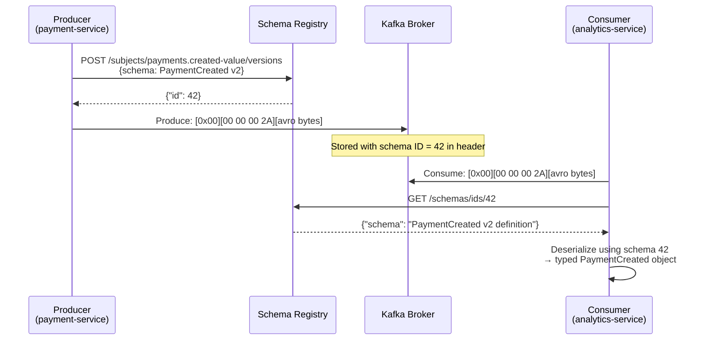

# Schema Registry & Avro / Protobuf

## Category

Apache Kafka — Data Integration

## Context

The **Confluent Schema Registry** is a standalone service that stores and enforces versioned schemas for Kafka message keys and values. Producers register a schema before publishing; consumers retrieve it by schema ID embedded in each message. This prevents consumers from silently breaking when a producer changes its payload shape.

### Schema Formats Compared

| Format | Binary | Schema Evolution | Language Support | IDL File |
|--------|--------|-----------------|-----------------|---------|
| **Avro** | Yes | Forward / backward / full | Wide (codegen) | `.avsc` |
| **Protobuf** | Yes | Forward compatible by default | Very wide (codegen) | `.proto` |
| **JSON Schema** | No (text) | Basic (draft-07) | Any | `.json` |

### Compatibility Modes

| Mode | New Schema Can Change | Consumer Impact |
|------|-----------------------|----------------|
| `BACKWARD` (default) | Add optional fields, remove fields | New consumer reads old messages |
| `FORWARD` | Remove optional fields, add fields | Old consumer reads new messages |
| `FULL` | Add optional fields only | Both directions safe |
| `BACKWARD_TRANSITIVE` | Backward-compatible with ALL versions | Strictest |
| `NONE` | Anything | No protection — avoid in production |

### Wire Format (Confluent)

Each message value byte starts with:

```
Byte 0:       Magic byte = 0x00
Bytes 1–4:    Schema ID (big-endian int32)
Bytes 5+:     Avro / Protobuf binary payload
```

Consumers decode by stripping the header and fetching the schema from the registry by ID — no schema embedded in message body.

## Pros

- Schema evolution contract enforced at publish time — breaking changes caught before production
- Binary serialization reduces Kafka storage and network costs (vs JSON)
- Strong typing with code generation — TypeScript / Java models generated from schemas
- Schema Registry REST API enables schema diffing, compatibility checks in CI pipelines
- Multi-subject namespacing — separate schema life cycles per topic (key + value subjects)

## Cons

- Schema Registry is an additional system to deploy and make highly available
- Producer is hard-blocked if Schema Registry is unreachable (configurable with `auto.register.schemas=false`)
- Avro does not support optional fields natively — use union with null (`["null", "string"]`)
- Schema ID approach means raw Kafka messages are not human-readable without tooling
- Protobuf `Any` / oneof fields complicate Schema Registry compatibility checking

## Design Diagram



## Code Sample

### Avro Schema — PaymentCreated event (`.avsc`)

```json
{
  "type": "record",
  "name": "PaymentCreated",
  "namespace": "com.example.payments.avro",
  "doc": "Emitted when a payment is successfully initiated",
  "fields": [
    { "name": "paymentId", "type": "string", "doc": "UUID of the payment" },
    { "name": "accountId", "type": "string" },
    { "name": "amount", "type": { "type": "bytes", "logicalType": "decimal", "precision": 18, "scale": 2 } },
    { "name": "currency", "type": { "type": "enum", "name": "Currency", "symbols": ["GBP", "EUR", "USD"] } },
    { "name": "reference", "type": ["null", "string"], "default": null },
    { "name": "createdAt", "type": { "type": "long", "logicalType": "timestamp-millis" } },
    { "name": "metadata", "type": { "type": "map", "values": "string" }, "default": {} }
  ]
}
```

### TypeScript — Produce Avro with `@kafkajs/confluent-schema-registry`

```typescript
import { Kafka } from 'kafkajs';
import { SchemaRegistry, SchemaType } from '@kafkajs/confluent-schema-registry';
import fs from 'node:fs';

const kafka = new Kafka({ clientId: 'payment-service', brokers: ['localhost:9092'] });
const registry = new SchemaRegistry({
  host: process.env.SCHEMA_REGISTRY_URL!,
  auth: {
    username: process.env.SR_API_KEY!,
    password: process.env.SR_API_SECRET!,
  },
});

const producer = kafka.producer({ idempotent: true });

// Register schema on startup (idempotent — returns existing ID if unchanged)
async function getOrRegisterSchema(subject: string, avscPath: string): Promise<number> {
  const schema = fs.readFileSync(avscPath, 'utf8');
  const { id } = await registry.register(
    { type: SchemaType.AVRO, schema },
    { subject },
  );
  return id;
}

export async function publishPaymentCreated(event: {
  paymentId: string;
  accountId: string;
  amount: Buffer;
  currency: 'GBP' | 'EUR' | 'USD';
  reference?: string;
  createdAt: Date;
}): Promise<void> {
  const schemaId = await getOrRegisterSchema(
    'payments.created-value',
    './schemas/PaymentCreated.avsc',
  );

  const encodedValue = await registry.encode(schemaId, {
    ...event,
    createdAt: event.createdAt.getTime(),
    reference: event.reference ?? null,
    metadata: {},
  });

  await producer.send({
    topic: 'payments.created',
    messages: [{ key: event.accountId, value: encodedValue }],
  });
}
```

### TypeScript — Consume Avro with automatic schema resolution

```typescript
import { Kafka } from 'kafkajs';
import { SchemaRegistry } from '@kafkajs/confluent-schema-registry';

const registry = new SchemaRegistry({ host: process.env.SCHEMA_REGISTRY_URL! });
const consumer = kafka.consumer({ groupId: 'analytics-service-v1' });

await consumer.subscribe({ topic: 'payments.created' });

await consumer.run({
  eachMessage: async ({ message }) => {
    if (!message.value) return;

    // Automatically fetches schema by ID from wire-format header
    const decoded = await registry.decode(message.value);
    console.log('Payment:', decoded);
    // { paymentId: '...', accountId: '...', amount: Decimal, currency: 'GBP', ... }
  },
});
```

### Shell — Schema Registry REST API

```bash
SR=https://schema-registry.example.com

# List all subjects
curl -u "$SR_KEY:$SR_SECRET" "$SR/subjects" | jq

# Register a new schema version
curl -X POST -u "$SR_KEY:$SR_SECRET" \
  -H 'Content-Type: application/vnd.schemaregistry.v1+json' \
  --data "{\"schema\": $(cat schemas/PaymentCreated.avsc | jq -Rs .)}" \
  "$SR/subjects/payments.created-value/versions"

# Check compatibility of a candidate schema
curl -X POST -u "$SR_KEY:$SR_SECRET" \
  -H 'Content-Type: application/vnd.schemaregistry.v1+json' \
  --data "{\"schema\": $(cat schemas/PaymentCreatedV3.avsc | jq -Rs .)}" \
  "$SR/compatibility/subjects/payments.created-value/versions/latest"

# Set compatibility mode for a subject
curl -X PUT -u "$SR_KEY:$SR_SECRET" \
  -H 'Content-Type: application/vnd.schemaregistry.v1+json' \
  --data '{"compatibility": "FULL"}' \
  "$SR/config/payments.created-value"
```

## References

- [Confluent Schema Registry Documentation](https://docs.confluent.io/platform/current/schema-registry/index.html)
- [Avro Specification](https://avro.apache.org/docs/current/spec.html)
- [@kafkajs/confluent-schema-registry](https://github.com/kafkajs/confluent-schema-registry)
- [Schema Evolution & Compatibility](https://docs.confluent.io/platform/current/schema-registry/avro.html)
