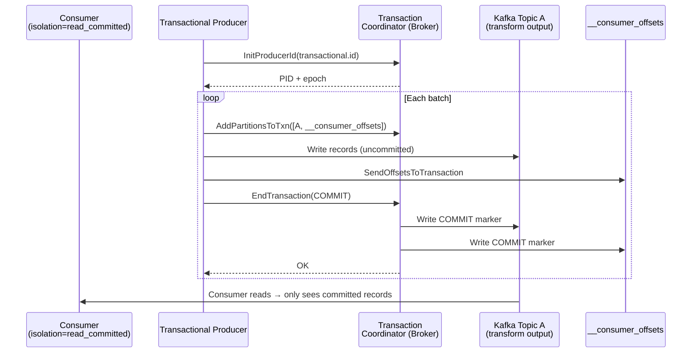

# Exactly-Once Semantics (EOS)

## Category

Apache Kafka — Reliability & Correctness

## Context

By default, Kafka provides **at-least-once** delivery: producers retry on failure, consumers re-process on rebalance. **Exactly-once semantics (EOS)** eliminates both duplicates and data loss end-to-end using two complementary mechanisms:

1. **Idempotent Producer** — deduplicates retries within a single producer session per partition.
2. **Kafka Transactions** — atomically write to multiple partitions and mark consumer offsets in a single commit; consumers using `isolation.level=read_committed` only see committed data.

### EOS Building Blocks

| Mechanism | Scope | Setting |
|-----------|-------|---------|
| Idempotent producer | Single producer session, single partition | `enable.idempotence=true` |
| Transactions | Multiple partitions + offset commit | `transactional.id=<unique>` |
| Consumer isolation | Consumer skips uncommitted data | `isolation.level=read_committed` |

### Delivery Guarantee Summary

| Producer | Consumer | Guarantee |
|----------|----------|-----------|
| `acks=1`, no idempotence | any | At-most-once |
| `acks=all`, no idempotence | any | At-least-once |
| `acks=all`, idempotent | any | Exactly-once per partition |
| Transaction + `transactional.id` | `read_committed` | Exactly-once end-to-end |

### Transaction Protocol Phases

| Phase | Description |
|-------|-------------|
| **beginTransaction** | Producer registers transaction with Transaction Coordinator |
| **send (multi-partition)** | Records buffered and marked with transaction ID |
| **sendOffsetsToTransaction** | Consumer offsets for this "consume-transform-produce" batch added to transaction |
| **commitTransaction** | Two-phase commit across all involved partitions |
| **abortTransaction** | Rolls back; abort markers written; consumers skip all records |

### Performance Impact of EOS

| Scenario | Throughput Impact |
|---------|-------------------|
| Idempotent only (`enable.idempotence=true`) | ~3–5% overhead |
| Transactions with small batches | ~20–30% overhead |
| Transactions with large batches (optimal) | ~5–10% overhead |

## Pros

- True end-to-end exactly-once across consume → transform → produce pipelines
- Transparent to consumers using `isolation.level=read_committed`
- Kafka Streams enables exactly-once with a single config line (`processing.guarantee=exactly_once_v2`)
- Idempotent producer alone is sufficient for many write-only use cases

## Cons

- Transactions require `transactional.id` to be unique per producer instance — requires careful naming for horizontal scaling
- Consumer with `read_committed` adds read overhead (must skip abort markers and uncommitted data)
- Transaction timeout (`transaction.timeout.ms`) must be < broker's `transaction.max.timeout.ms`
- Not a silver bullet for external side effects (DB writes, HTTP calls) — use Outbox pattern
- Zombie fence can cause abrupt producer shutdown in multi-instance deployments

## Design Diagram



## Code Sample

### TypeScript — Exactly-once consume-transform-produce with KafkaJS

```typescript
import { Kafka, Partitioners } from 'kafkajs';

const kafka = new Kafka({
  clientId: 'enrichment-service',
  brokers: process.env.KAFKA_BROKERS!.split(','),
});

// Each horizontal replica needs a unique transactional ID
const TRANSACTIONAL_ID = `enrichment-service-${process.env.POD_NAME ?? 'local'}`;

const producer = kafka.producer({
  createPartitioner: Partitioners.DefaultPartitioner,
  idempotent: true,
  transactionalId: TRANSACTIONAL_ID,
  transactionTimeout: 30_000,
  maxInFlightRequests: 1, // required for transactional producers
});

const consumer = kafka.consumer({
  groupId: 'enrichment-service-eos',
  readUncommitted: false, // default = true for KafkaJS; set false for read_committed
});

await producer.connect();
await consumer.connect();
await consumer.subscribe({ topic: 'payments.raw', fromBeginning: false });

await consumer.run({
  autoCommit: false,
  eachBatch: async ({ batch, resolveOffset, heartbeat, isRunning }) => {
    const transaction = await producer.transaction();

    try {
      for (const message of batch.messages) {
        if (!isRunning()) break;

        const raw = JSON.parse(message.value!.toString());
        const enriched = await enrichPayment(raw);

        await transaction.send({
          topic: 'payments.enriched',
          messages: [{ key: message.key, value: JSON.stringify(enriched) }],
        });

        resolveOffset(message.offset);
        await heartbeat();
      }

      // Atomically commit offsets inside the transaction
      await transaction.sendOffsets({
        consumerGroupId: 'enrichment-service-eos',
        topics: [
          {
            topic: batch.topic,
            partitions: [
              {
                partition: batch.partition,
                offset: (Number(batch.lastOffset()) + 1).toString(),
              },
            ],
          },
        ],
      });

      await transaction.commit();
    } catch (err) {
      await transaction.abort();
      throw err;
    }
  },
});

async function enrichPayment(raw: Record<string, unknown>) {
  // lookup enrichment data, add fields
  return { ...raw, enriched: true, processedAt: new Date().toISOString() };
}
```

### Java — Kafka Streams exactly-once (single config line)

```java
Properties props = new Properties();
props.put(StreamsConfig.APPLICATION_ID_CONFIG, "payment-enrichment");
props.put(StreamsConfig.BOOTSTRAP_SERVERS_CONFIG, System.getenv("KAFKA_BROKERS"));
// Enable exactly-once semantics (requires Kafka 2.5+ for v2)
props.put(StreamsConfig.PROCESSING_GUARANTEE_CONFIG, StreamsConfig.EXACTLY_ONCE_V2);
// Kafka Streams internally manages transactional.id per task
```

### Properties — consumer `read_committed` isolation

```properties
# Java consumer
isolation.level=read_committed
enable.auto.commit=false
```

## References

- [Kafka Documentation — Exactly Once Semantics](https://kafka.apache.org/documentation/#semantics)
- [Transactions in Apache Kafka — Confluent Blog](https://www.confluent.io/blog/transactions-apache-kafka/)
- [KafkaJS Transactions](https://kafka.js.org/docs/transactions)
- [Kafka Streams EOS v2](https://cwiki.apache.org/confluence/display/KAFKA/KIP-447%3A+Producer+scalability+for+exactly+once+semantics)
