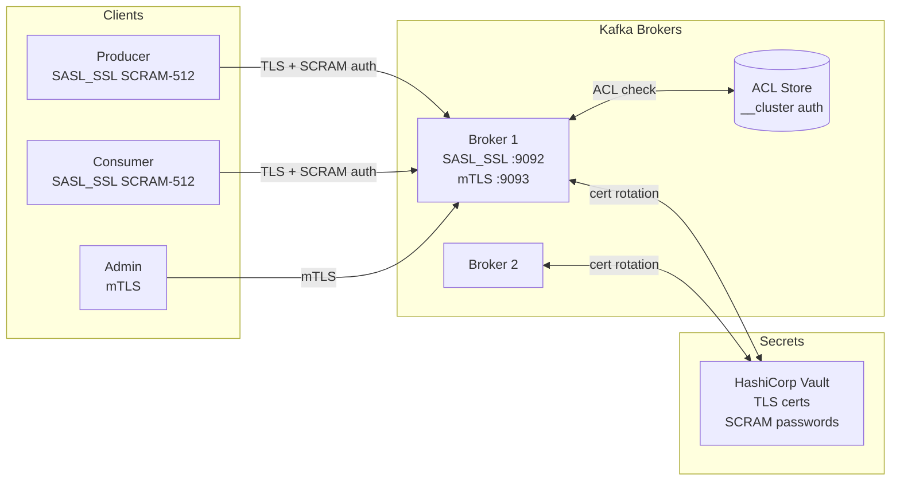

# Kafka Security

## Category

Apache Kafka — Operations

## Context

A default Kafka installation has no authentication, no encryption, and no authorisation. Securing a production cluster requires three independent layers: **encryption** (TLS), **authentication** (SASL or mTLS), and **authorisation** (ACLs or role-based via Confluent RBAC). All three must be configured at both broker and client level.

### Security Layers

| Layer | Mechanism | What It Protects |
|-------|-----------|-----------------|
| **Encryption** | TLS (listener `SSL` or `SASL_SSL`) | Data in transit between clients and brokers |
| **Authentication** | SASL/PLAIN, SASL/SCRAM-SHA-256/512, SASL/OAUTHBEARER, mTLS | Proves identity of producer/consumer/admin |
| **Authorisation** | Kafka ACLs, Confluent RBAC | Controls who can read/write/create topics |
| **Secrets Management** | HashiCorp Vault, K8s Secrets, AWS Secrets Manager | Secure storage and rotation of credentials |

### SASL Mechanism Comparison

| Mechanism | Authentication | In Transit Encryption | Production Use |
|-----------|---------------|----------------------|----------------|
| PLAIN | Username/password (cleartext) | TLS required | Avoid — credentials in config plaintext |
| SCRAM-SHA-256/512 | Challenge-response | TLS recommended | Recommended for user/service auth |
| GSSAPI (Kerberos) | Kerberos ticket | Optional | Enterprise/on-premise Kerberos environments |
| OAUTHBEARER | JWT tokens | TLS required | Cloud-native with IdP (Keycloak, Okta) |
| mTLS | Client certificate | TLS (mutual) | Service-to-service zero-trust |

### ACL Resource Types & Operations

| Resource Type | Operations |
|---------------|------------|
| `Topic` | `Read`, `Write`, `Create`, `Delete`, `Describe`, `DescribeConfigs`, `AlterConfigs` |
| `Group` | `Read`, `Describe`, `Delete` |
| `Cluster` | `Create`, `Alter`, `Describe`, `ClusterAction` |
| `TransactionalId` | `Write`, `Describe` |

## Pros

- TLS encrypts all data in transit — prevents network eavesdropping
- SCRAM-SHA-512 credentials stored as salted hashes on broker — no plaintext passwords at rest
- ACLs enforce principle of least privilege per service principal
- OAUTHBEARER enables short-lived tokens with centralised IdP — eliminates long-lived credentials
- mTLS removes the need for secrets entirely for service authentication

## Cons

- TLS adds ~5–10% CPU overhead on brokers and clients
- ACL management at scale requires tooling (Terraform, cli scripts) — manual ACLs become unmanageable
- Kerberos is operationally complex and rarely appropriate for cloud deployments
- SCRAM credentials require separate creation per user via `kafka-configs.sh`
- Rotating TLS certificates requires coordinated rolling restart unless SNI listeners are configured

## Design Diagram



## Code Sample

### Properties — Broker `server.properties` — SASL_SSL + SCRAM

```properties
# Listeners
listeners=SASL_SSL://:9092,CONTROLLER://:9093
advertised.listeners=SASL_SSL://broker1.example.com:9092
inter.broker.listener.name=SASL_SSL
sasl.enabled.mechanisms=SCRAM-SHA-512
sasl.mechanism.inter.broker.protocol=SCRAM-SHA-512

# TLS
ssl.keystore.location=/etc/kafka/ssl/broker.keystore.jks
ssl.keystore.password=${KEYSTORE_PASSWORD}
ssl.key.password=${KEY_PASSWORD}
ssl.truststore.location=/etc/kafka/ssl/broker.truststore.jks
ssl.truststore.password=${TRUSTSTORE_PASSWORD}
ssl.client.auth=none
ssl.endpoint.identification.algorithm=https

# JAAS (broker uses SCRAM for inter-broker)
listener.name.sasl_ssl.scram-sha-512.sasl.jaas.config=\
  org.apache.kafka.common.security.scram.ScramLoginModule required \
  username="kafka-broker" password="${BROKER_PASSWORD}";

# Authorisation
authorizer.class.name=kafka.security.authorizer.AclAuthorizer
super.users=User:kafka-broker;User:kafka-admin
```

### Shell — Create SCRAM credentials and ACLs

```bash
# Create SCRAM-SHA-512 credentials for payment-service
kafka-configs.sh --bootstrap-server localhost:9092 \
  --entity-type users --entity-name payment-service \
  --alter --add-config 'SCRAM-SHA-512=[iterations=8192,password=your-strong-password]'

# Grant payment-service WRITE on payments.* topics
kafka-acls.sh --bootstrap-server localhost:9092 \
  --add --allow-principal User:payment-service \
  --operation Write --topic 'payments.' --resource-pattern-type prefixed

# Grant analytics-service READ on payments.* and its consumer group
kafka-acls.sh --bootstrap-server localhost:9092 \
  --add --allow-principal User:analytics-service \
  --operation Read --topic 'payments.' --resource-pattern-type prefixed

kafka-acls.sh --bootstrap-server localhost:9092 \
  --add --allow-principal User:analytics-service \
  --operation Read --group analytics-service-v1

# List ACLs for a topic
kafka-acls.sh --bootstrap-server localhost:9092 \
  --list --topic payments.created
```

### TypeScript — Client SASL_SSL config with KafkaJS

```typescript
import { Kafka } from 'kafkajs';
import { readFileSync } from 'node:fs';

const kafka = new Kafka({
  clientId: 'payment-service',
  brokers: process.env.KAFKA_BROKERS!.split(','),
  ssl: {
    rejectUnauthorized: true,
    ca: [readFileSync('/etc/kafka/ssl/ca.crt', 'utf8')],
    // For mTLS (client certificate auth):
    // cert: readFileSync('/etc/ssl/client.crt', 'utf8'),
    // key: readFileSync('/etc/ssl/client.key', 'utf8'),
  },
  sasl: {
    mechanism: 'scram-sha-512',
    username: process.env.KAFKA_USERNAME!,
    password: process.env.KAFKA_PASSWORD!,
  },
});
```

### YAML — Kubernetes Secret + Strimzi KafkaUser with SCRAM

```yaml
apiVersion: kafka.strimzi.io/v1beta2
kind: KafkaUser
metadata:
  name: payment-service
  labels:
    strimzi.io/cluster: production
spec:
  authentication:
    type: scram-sha-512
  authorization:
    type: simple
    acls:
      - resource:
          type: topic
          name: payments.
          patternType: prefix
        operation: Write
        host: "*"
      - resource:
          type: topic
          name: payments.
          patternType: prefix
        operation: Describe
        host: "*"
```

## References

- [Kafka Documentation — Security](https://kafka.apache.org/documentation/#security)
- [Kafka ACL Documentation](https://kafka.apache.org/documentation/#security_authz)
- [Strimzi Security — KafkaUser](https://strimzi.io/docs/operators/latest/deploying.html#proc-configuring-kafka-user-str)
- [Confluent — OAuth Bearer Authentication](https://docs.confluent.io/platform/current/kafka/authentication_sasl/authentication_sasl_oauth.html)
