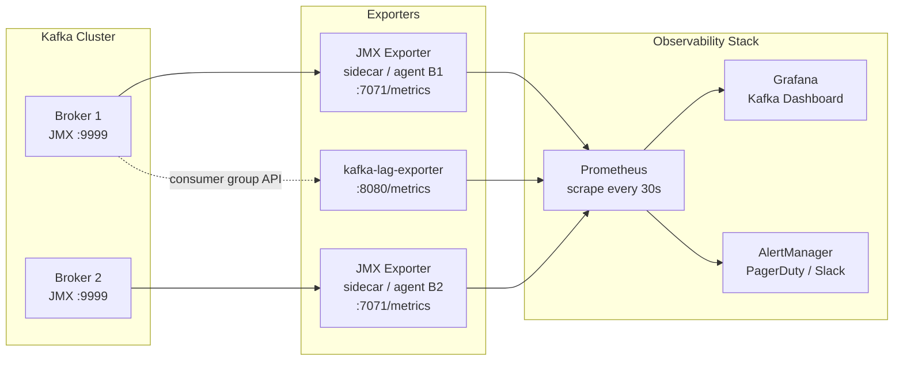

# Kafka Observability & Monitoring

## Category

Apache Kafka — Operations

## Context

Kafka exposes hundreds of metrics via **JMX**. In production these are scraped by the **Prometheus JMX Exporter** (a Java agent attached to broker and client JVMs) and visualised in **Grafana**. The most operationally critical metric category is **consumer lag** — the difference between the latest offset on a partition and the consumer group's committed offset.

### Metric Categories

| Category | Examples | Why It Matters |
|----------|---------|----------------|
| **Broker** | `BytesIn/OutPerSec`, `UnderReplicatedPartitions`, `ActiveControllerCount` | Cluster health |
| **Producer** | `record-error-rate`, `request-latency-avg`, `buffer-available-bytes` | Producer reliability |
| **Consumer lag** | `records-lag-max`, committed vs latest offset | Processing backlog |
| **Consumer** | `fetch-latency-avg`, `records-consumed-rate` | Consumer performance |
| **JVM** | GC pause duration, heap used | Broker stability |
| **OS** | Disk I/O, page cache hit ratio, network saturation | Infrastructure limits |

### Key Broker Alerts

| Alert | Condition | Severity |
|-------|-----------|----------|
| Under-replicated partitions | `kafka.server:UnderReplicatedPartitions > 0` | Critical |
| Active controller count ≠ 1 | `ActiveControllerCount != 1` | Critical |
| Leader election rate high | `LeaderElectionRateAndTimeMs > 0` sustained | Warning |
| Request queue time high | `RequestQueueTimeMs p99 > 200ms` | Warning |
| Log flush latency | `LogFlushRateAndTimeMs p99 > 1s` | Warning |

### Consumer Lag Monitoring Tools

| Tool | Type | Notes |
|------|------|-------|
| **Kafka built-in** | CLI | `kafka-consumer-groups.sh --describe` |
| **Burrow** (LinkedIn) | Standalone | Lag trend analysis, not just instantaneous |
| **kafka-lag-exporter** | Prometheus exporter | Publishes lag as Prometheus metrics |
| **Confluent Control Center** | Commercial UI | Full-featured; bundled with Confluent Platform |
| **Grafana + Prometheus** | OSS stack | Flexible dashboards; recommended OSS path |

## Pros

- Consumer lag is a leading indicator of downstream processing failures — catch issues before SLA breach
- JMX exporter + Prometheus + Grafana is a zero-cost, highly extensible OSS stack
- Distributed tracing headers (W3C TraceContext) propagate through Kafka topics for end-to-end traces
- Topic-level metrics are available without touching application code
- Alerting on `UnderReplicatedPartitions > 0` catches replication failures before data loss risk

## Cons

- JMX metric names are long, inconsistent across Kafka versions, and require YAML mapping files
- Consumer lag requires correlating across `__consumer_offsets` topic and partition high watermarks
- High-cardinality labels (per-topic, per-partition, per-group) can overwhelm Prometheus cardinality limits
- Kafka does not natively propagate OpenTelemetry trace context — requires instrumentation in producers/consumers
- Alert fatigue from noisy metrics — requires careful threshold calibration per cluster size

## Design Diagram



## Code Sample

### YAML — JMX Exporter config for Kafka broker metrics

```yaml
# jmx-exporter-config.yml
lowercaseOutputName: false
lowercaseOutputLabelNames: false

rules:
  # Broker bytes in/out
  - pattern: 'kafka.server<type=BrokerTopicMetrics, name=(BytesInPerSec|BytesOutPerSec), topic=(.+)><>OneMinuteRate'
    name: kafka_server_broker_topic_metrics_$1_one_minute_rate
    labels:
      topic: "$2"

  # Under-replicated partitions
  - pattern: 'kafka.server<type=ReplicaManager, name=UnderReplicatedPartitions><>Value'
    name: kafka_server_replica_manager_under_replicated_partitions

  # Active controller count
  - pattern: 'kafka.controller<type=KafkaController, name=ActiveControllerCount><>Value'
    name: kafka_controller_kafka_controller_active_controller_count

  # Request total time
  - pattern: 'kafka.network<type=RequestMetrics, name=TotalTimeMs, request=(.+)><>(\d+)thPercentile'
    name: kafka_network_request_metrics_total_time_ms
    labels:
      request: "$1"
      quantile: "0.$2"

  # Log flush
  - pattern: 'kafka.log<type=LogFlushStats, name=LogFlushRateAndTimeMs><>(\d+)thPercentile'
    name: kafka_log_flush_stats_log_flush_time_ms
    labels:
      quantile: "0.$1"
```

### YAML — Prometheus alert rules

```yaml
# kafka-alerts.yaml
groups:
  - name: kafka
    rules:
      - alert: KafkaUnderReplicatedPartitions
        expr: kafka_server_replica_manager_under_replicated_partitions > 0
        for: 1m
        labels:
          severity: critical
        annotations:
          summary: "Kafka under-replicated partitions on {{ $labels.instance }}"
          description: "{{ $value }} partitions are under-replicated"

      - alert: KafkaNoActiveController
        expr: sum(kafka_controller_kafka_controller_active_controller_count) != 1
        for: 30s
        labels:
          severity: critical
        annotations:
          summary: "Kafka cluster has no active controller"

      - alert: KafkaConsumerLagHigh
        expr: kafka_consumer_group_lag > 50000
        for: 5m
        labels:
          severity: warning
        annotations:
          summary: "Consumer group {{ $labels.group }} has high lag"
          description: "Lag is {{ $value }} on topic {{ $labels.topic }} partition {{ $labels.partition }}"
```

### TypeScript — Instrument producer/consumer with OpenTelemetry trace propagation

```typescript
import { Kafka, Message } from 'kafkajs';
import { context, propagation, trace } from '@opentelemetry/api';

const tracer = trace.getTracer('kafka-client');

export function injectTraceHeaders(message: Message): Message {
  const headers: Record<string, string> = {};
  propagation.inject(context.active(), headers);
  return {
    ...message,
    headers: { ...(message.headers ?? {}), ...headers },
  };
}

export function extractTraceContext(headers: Record<string, Buffer | string | undefined>) {
  const stringHeaders: Record<string, string> = {};
  for (const [k, v] of Object.entries(headers)) {
    if (v !== undefined) stringHeaders[k] = v.toString();
  }
  return propagation.extract(context.active(), stringHeaders);
}

// Usage in producer
await producer.send({
  topic: 'payments.created',
  messages: [
    injectTraceHeaders({ key: event.accountId, value: JSON.stringify(event) }),
  ],
});

// Usage in consumer
await consumer.run({
  eachMessage: async ({ message }) => {
    const ctx = extractTraceContext(message.headers ?? {});
    await context.with(ctx, async () => {
      const span = tracer.startSpan('process-payment');
      try {
        await handlePayment(message);
      } finally {
        span.end();
      }
    });
  },
});
```

### Shell — Quick lag check via CLI

```bash
# Check lag for all groups
kafka-consumer-groups.sh \
  --bootstrap-server localhost:9092 \
  --describe --all-groups | \
  awk 'NR>1 && $6 > 1000 {print $2, $3, $4, "LAG:", $6}'
```

## References

- [Kafka Monitoring — Confluent Docs](https://docs.confluent.io/platform/current/kafka/monitoring.html)
- [Prometheus JMX Exporter](https://github.com/prometheus/jmx_exporter)
- [kafka-lag-exporter](https://github.com/seglo/kafka-lag-exporter)
- [Grafana Kafka Dashboard](https://grafana.com/grafana/dashboards/7589-kafka-exporter-overview/)
- [OpenTelemetry Kafka Instrumentation](https://opentelemetry.io/docs/instrumentation/js/libraries/)
