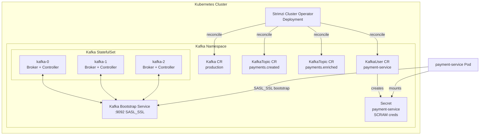

# Kafka on Kubernetes — Strimzi

## Category

Apache Kafka — Operations

## Context

**Strimzi** is a CNCF project that provides Kubernetes Operators for running Apache Kafka on Kubernetes. It manages the full lifecycle of Kafka clusters — **provisioning, configuration, upgrades, TLS certificate rotation, scaling, and topic/user management** — through Kubernetes Custom Resource Definitions (CRDs), enabling GitOps-first Kafka operations.

### Strimzi Components

| Component | CRD | Purpose |
|-----------|-----|---------|
| Strimzi Cluster Operator | — | Watches all Strimzi CRDs; reconciles desired state |
| `Kafka` | `kafka.kafka.strimzi.io` | Defines a Kafka cluster (brokers + ZooKeeper / KRaft) |
| `KafkaTopic` | `kafkatopic.kafka.strimzi.io` | Manages topic config declaratively |
| `KafkaUser` | `kafkauser.kafka.strimzi.io` | Manages SCRAM credentials and ACLs |
| `KafkaConnect` | `kafkaconnect.kafka.strimzi.io` | Manages Kafka Connect cluster |
| `KafkaMirrorMaker2` | `kafkamirrormaker2.kafka.strimzi.io` | Cross-cluster replication |
| `KafkaBridge` | `kafkabridge.kafka.strimzi.io` | HTTP bridge for non-JVM clients |

### Strimzi vs Self-Managed Kafka on K8s

| Aspect | Strimzi | DIY (StatefulSet + ConfigMap) |
|--------|---------|-------------------------------|
| Rolling upgrades | Automated with pod disruption budgets | Manual, error-prone |
| TLS cert management | Auto-generated + rotated | Manual cert-manager integration |
| Topic management | Declarative CRD | CLI / Terraform |
| User / ACL management | Declarative CRD | CLI scripts |
| Operator maturity | CNCF, production-proven | — |

## Pros

- Declarative GitOps management — all config in Git, applied by CI/CD
- Automated rolling upgrades with `PodDisruptionBudget` preserving availability
- Built-in TLS: generates cluster CA, broker, and client certificates automatically
- Topic Operator and User Operator keep Kafka state in sync with Kubernetes manifests
- Active CNCF community, supports latest Kafka versions rapidly

## Cons

- Strimzi Operator is a heavyweight dependency — adds one more operator to manage
- KRaft mode support is production-GA from Strimzi 0.36+; plan upgrade path from ZooKeeper clusters
- StatefulSet volume resizing requires cloud storage class support for in-place resize
- Very large clusters (100+ brokers) may hit Kubernetes API server limits
- Debugging issues requires familiarity with both Kafka internals and Kubernetes primitives

## Design Diagram



## Code Sample

### YAML — Strimzi Kafka cluster (KRaft mode, 3 brokers)

```yaml
apiVersion: kafka.strimzi.io/v1beta2
kind: Kafka
metadata:
  name: production
  namespace: kafka
spec:
  kafka:
    version: 3.7.0
    replicas: 3
    listeners:
      - name: plain
        port: 9092
        type: internal
        tls: false
      - name: tls
        port: 9093
        type: internal
        tls: true
        authentication:
          type: scram-sha-512
      - name: external
        port: 9094
        type: loadbalancer
        tls: true
        authentication:
          type: scram-sha-512
    config:
      offsets.topic.replication.factor: 3
      transaction.state.log.replication.factor: 3
      transaction.state.log.min.isr: 2
      default.replication.factor: 3
      min.insync.replicas: 2
      inter.broker.protocol.version: "3.7"
      compression.type: lz4
      log.retention.hours: 168
    storage:
      type: jbod
      volumes:
        - id: 0
          type: persistent-claim
          size: 500Gi
          class: premium-ssd
          deleteClaim: false
    resources:
      requests:
        memory: 8Gi
        cpu: "2"
      limits:
        memory: 8Gi
        cpu: "4"
    jvmOptions:
      -Xms: 4096m
      -Xmx: 4096m
    metricsConfig:
      type: jmxPrometheusExporter
      valueFrom:
        configMapKeyRef:
          name: kafka-broker-metrics
          key: kafka-broker-jmx-exporter-config.yml
  entityOperator:
    topicOperator: {}
    userOperator: {}
  kafkaExporter:
    topicRegex: ".*"
    groupRegex: ".*"
```

### YAML — KafkaTopic and KafkaUser CRDs

```yaml
apiVersion: kafka.strimzi.io/v1beta2
kind: KafkaTopic
metadata:
  name: payments.created
  labels:
    strimzi.io/cluster: production
spec:
  partitions: 12
  replicas: 3
  config:
    retention.ms: 604800000      # 7 days
    min.insync.replicas: "2"
    compression.type: lz4
    cleanup.policy: delete
---
apiVersion: kafka.strimzi.io/v1beta2
kind: KafkaUser
metadata:
  name: payment-service
  labels:
    strimzi.io/cluster: production
spec:
  authentication:
    type: scram-sha-512
  authorization:
    type: simple
    acls:
      - resource:
          type: topic
          name: payments.
          patternType: prefix
        operations: [Write, Describe]
        host: "*"
      - resource:
          type: topic
          name: payments.
          patternType: prefix
        operations: [Read, Describe]
        host: "*"
      - resource:
          type: group
          name: payment-service-
          patternType: prefix
        operations: [Read]
        host: "*"
```

### YAML — Deployment that mounts Strimzi-generated credentials

```yaml
apiVersion: apps/v1
kind: Deployment
metadata:
  name: payment-service
spec:
  replicas: 3
  template:
    spec:
      containers:
        - name: payment-service
          image: payment-service:latest
          env:
            - name: KAFKA_BROKERS
              value: production-kafka-bootstrap.kafka.svc.cluster.local:9093
            - name: KAFKA_USERNAME
              valueFrom:
                secretKeyRef:
                  name: payment-service    # created by KafkaUser operator
                  key: sasl.username
            - name: KAFKA_PASSWORD
              valueFrom:
                secretKeyRef:
                  name: payment-service
                  key: sasl.password
          volumeMounts:
            - name: kafka-ca
              mountPath: /etc/kafka/ssl
              readOnly: true
      volumes:
        - name: kafka-ca
          secret:
            secretName: production-cluster-ca-cert  # generated by Strimzi
```

## References

- [Strimzi Documentation](https://strimzi.io/docs/operators/latest/)
- [Strimzi GitHub](https://github.com/strimzi/strimzi-kafka-operator)
- [KRaft Support in Strimzi](https://strimzi.io/blog/2023/09/11/kafka-node-pools/)
- [Strimzi Helm Chart](https://github.com/strimzi/strimzi-kafka-operator/tree/main/helm-charts)
