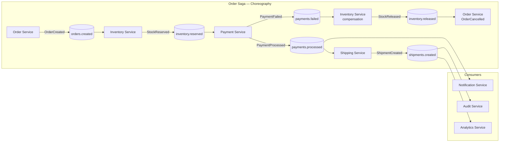

# Event-Driven Architecture with Kafka

## Category

Apache Kafka — Architecture Patterns

## Context

**Event-Driven Architecture (EDA)** structures systems around the production, detection, and consumption of events rather than direct service calls. Kafka acts as the **durable event backbone**: events are persisted, replayable, and routable to multiple consumers independently. EDA shifts coupling from temporal (both parties must be available) to topical (both parties agree on an event schema).

### Event Types

| Type | Example | Characteristics |
|------|---------|----------------|
| **Domain Event** | `PaymentProcessed`, `OrderShipped` | Describes what happened; immutable fact |
| **Command Event** | `ProcessRefund`, `SendNotification` | Request for action; usually point-to-point |
| **Query Event** | `AccountBalanceRequested` | Request/reply pattern over Kafka |
| **Integration Event** | `CustomerSyncRequested` | Cross-bounded-context notification |

### Choreography vs Orchestration

| Aspect | Choreography | Orchestration |
|--------|-------------|--------------|
| Coordination | Each service reacts to events independently | Central orchestrator directs services |
| Coupling | Low — services don't know each other | Medium — services know the orchestrator |
| Visibility | Hard — workflows implicit in event flows | High — explicit workflow state |
| Failure handling | Complex — each service handles its own | Centralised compensation logic |
| Best for | Simple, decoupled fan-out | Long-running workflows, sagas |

### Saga Pattern (Distributed Transaction via Choreography)

A **saga** is a sequence of local transactions, each publishing an event that triggers the next. On failure, compensating transactions undo prior steps.

| Step | Service | Success Event | Compensating Event |
|------|---------|--------------|-------------------|
| 1 | Order Service | `OrderCreated` | `OrderCancelled` |
| 2 | Inventory Service | `StockReserved` | `StockReleased` |
| 3 | Payment Service | `PaymentProcessed` | `PaymentRefunded` |
| 4 | Shipping Service | `ShipmentCreated` | `ShipmentCancelled` |

## Pros

- Temporal decoupling — producer and consumer do not need to be online simultaneously
- Replay enables reprocessing, new consumer bootstrapping, and audit trails
- Natural fan-out — one event reaches notification, analytics, and audit services simultaneously
- Clear audit trail — Kafka log is an immutable record of all business events
- Evolutionary: add new consumers without touching producers

## Cons

- Eventual consistency — consumers may be milliseconds to seconds behind producers
- Saga failure and compensation logic is complex — requires careful design
- Debugging distributed workflows requires distributed tracing across multiple services
- Schema governance is critical — producers and consumers must agree on event contracts
- Choreography can become "ghost workflows" — hard to visualise overall process state

## Design Diagram



## Code Sample

### TypeScript — Domain event publisher with outbox pattern safety

```typescript
import { Pool } from 'pg';
import { Producer } from 'kafkajs';

interface DomainEvent<T> {
  eventId: string;
  eventType: string;
  aggregateId: string;
  aggregateType: string;
  occurredAt: string;
  payload: T;
  version: number;
}

// Outbox pattern: write event to DB and Kafka in the same logical step.
// A background relay publishes from outbox table to Kafka transactionally.
export async function publishDomainEvent<T>(
  pool: Pool,
  producer: Producer,
  event: DomainEvent<T>,
): Promise<void> {
  const client = await pool.connect();
  try {
    await client.query('BEGIN');

    // 1. Persist business aggregate change
    await client.query(
      `UPDATE orders SET status = $1, updated_at = NOW() WHERE id = $2`,
      ['CONFIRMED', event.aggregateId],
    );

    // 2. Write to outbox table (same DB transaction)
    await client.query(
      `INSERT INTO outbox_events (id, aggregate_id, aggregate_type, event_type, payload, created_at)
       VALUES ($1, $2, $3, $4, $5, NOW())`,
      [event.eventId, event.aggregateId, event.aggregateType, event.eventType, JSON.stringify(event)],
    );

    await client.query('COMMIT');
  } catch (err) {
    await client.query('ROLLBACK');
    throw err;
  } finally {
    client.release();
  }
}

// Background relay: polls outbox table and publishes to Kafka
export async function relayOutboxEvents(pool: Pool, producer: Producer): Promise<void> {
  const { rows } = await pool.query<{
    id: string; aggregate_id: string; event_type: string; payload: string;
  }>(
    `DELETE FROM outbox_events
     WHERE id = ANY(
       SELECT id FROM outbox_events
       ORDER BY created_at
       LIMIT 100
       FOR UPDATE SKIP LOCKED
     )
     RETURNING *`,
  );

  if (rows.length === 0) return;

  await producer.send({
    topic: 'orders.events',
    messages: rows.map(row => ({
      key: row.aggregate_id,
      value: row.payload,
      headers: { 'event-type': row.event_type },
    })),
  });
}
```

### TypeScript — Choreography saga consumer — inventory service reacting to order events

```typescript
import { Kafka } from 'kafkajs';

interface OrderCreatedEvent {
  eventId: string;
  orderId: string;
  items: Array<{ sku: string; quantity: number }>;
}

const consumer = kafka.consumer({ groupId: 'inventory-service-saga' });

await consumer.subscribe({ topics: ['orders.events'], fromBeginning: false });

await consumer.run({
  autoCommit: false,
  eachMessage: async ({ topic, partition, message }) => {
    const eventType = message.headers?.['event-type']?.toString();

    if (eventType === 'OrderCreated') {
      const event: OrderCreatedEvent = JSON.parse(message.value!.toString());
      try {
        await reserveStock(event);
        await publishEvent(producer, 'inventory.events', {
          eventType: 'StockReserved',
          orderId: event.orderId,
          reservedAt: new Date().toISOString(),
        });
      } catch (err) {
        // Emit compensating event
        await publishEvent(producer, 'inventory.events', {
          eventType: 'StockReservationFailed',
          orderId: event.orderId,
          reason: (err as Error).message,
        });
      }

      await consumer.commitOffsets([
        { topic, partition, offset: (Number(message.offset) + 1).toString() },
      ]);
    }
  },
});
```

## References

- [Event-Driven Architecture — Martin Fowler](https://martinfowler.com/articles/201701-event-driven.html)
- [Saga Pattern — Microservices.io](https://microservices.io/patterns/data/saga.html)
- [Outbox Pattern — Microservices.io](https://microservices.io/patterns/data/transactional-outbox.html)
- [Event Storming](https://www.eventstorming.com/)
