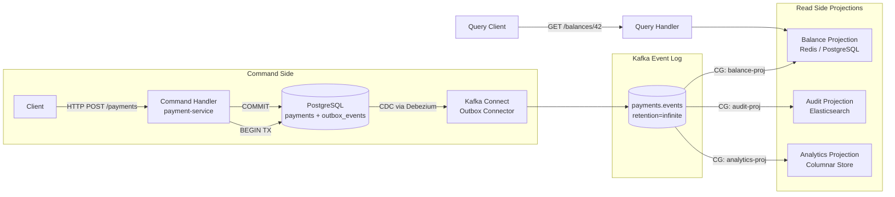

# CQRS & Event Sourcing

## Category

Apache Kafka — Architecture Patterns

## Context

**CQRS (Command Query Responsibility Segregation)** separates write (command) and read (query) models, allowing each to be optimised independently. **Event Sourcing** stores state as an ordered sequence of immutable events rather than current values — Kafka's append-only log is a natural event store. Together they form a pattern where commands produce events (write side), and projections consume events to build queryable read models (read side).

### CQRS vs Traditional CRUD

| Aspect | CRUD | CQRS + Event Sourcing |
|--------|------|----------------------|
| State storage | Current row in DB | Log of all events |
| Read model | Same table as write | Materialised views, projections |
| Audit trail | Change data capture required | Built-in — full history |
| Temporal queries | Hard (no history) | Easy — replay to any point |
| Complexity | Low | High — projections, versioning |

### Kafka as Event Store

| Requirement | Kafka Feature |
|------------|--------------|
| Immutable append-only log | Partitioned, ordered log |
| Long-term retention | `retention.ms=-1` (infinite) or large `retention.bytes` |
| Replay from beginning | Seek to offset 0 |
| Event compaction (latest per key) | `cleanup.policy=compact` for snapshots |
| Multiple independent projections | Consumer groups (one per projection) |

### Outbox Pattern

Because you cannot atomically update a database and publish to Kafka in a single operation, the **Outbox pattern** bridges the gap:

1. Write the domain state change + outbox event in a single DB transaction.
2. A Debezium CDC connector captures the outbox table change.
3. Debezium publishes the routed event to the target Kafka topic.
4. Projection consumers update their read models.

## Pros

- Full audit trail and time-travel queries at no extra cost — all history is in the log
- Read models can be rebuilt from scratch by replaying the event log
- Command side can use a simple fast-path DB; read side uses Elasticsearch, Redis, or a view DB
- Natural fit for Kafka — topic is the event log, consumer groups are projections
- Decoupled evolution — add new projections without touching command handlers

## Cons

- Eventual consistency between write and read models — queries may return stale data
- Projection rebuild latency can be large for high-volume event logs
- Event schema evolution requires versioning strategy (upcasters / event migration)
- CQRS adds significant complexity — not justified for simple CRUD apps
- Debugging requires correlating command, event, and projection state across services

## Design Diagram



## Code Sample

### TypeScript — Command handler with outbox event (PostgreSQL + Debezium)

```typescript
import { Pool } from 'pg';
import crypto from 'node:crypto';

interface ProcessPaymentCommand {
  paymentId: string;
  accountId: string;
  amount: number;
  currency: string;
  reference?: string;
}

interface PaymentProcessedEvent {
  eventId: string;
  eventType: 'PaymentProcessed';
  aggregateId: string;      // paymentId
  aggregateType: 'Payment';
  routingKey: string;       // target Kafka topic
  payload: {
    paymentId: string;
    accountId: string;
    amount: number;
    currency: string;
    processedAt: string;
  };
}

export async function processPayment(
  pool: Pool,
  cmd: ProcessPaymentCommand,
): Promise<void> {
  const event: PaymentProcessedEvent = {
    eventId: crypto.randomUUID(),
    eventType: 'PaymentProcessed',
    aggregateId: cmd.paymentId,
    aggregateType: 'Payment',
    routingKey: 'payments.events',
    payload: {
      paymentId: cmd.paymentId,
      accountId: cmd.accountId,
      amount: cmd.amount,
      currency: cmd.currency,
      processedAt: new Date().toISOString(),
    },
  };

  const client = await pool.connect();
  try {
    await client.query('BEGIN');

    // Write to aggregate table
    await client.query(
      `INSERT INTO payments (id, account_id, amount, currency, status, processed_at)
       VALUES ($1, $2, $3, $4, 'PROCESSED', NOW())
       ON CONFLICT (id) DO NOTHING`,
      [cmd.paymentId, cmd.accountId, cmd.amount, cmd.currency],
    );

    // Write to outbox — Debezium picks this up via CDC
    await client.query(
      `INSERT INTO outbox_events
         (id, aggregate_id, aggregate_type, event_type, routing_key, payload, created_at)
       VALUES ($1, $2, $3, $4, $5, $6, NOW())`,
      [
        event.eventId,
        event.aggregateId,
        event.aggregateType,
        event.eventType,
        event.routingKey,
        JSON.stringify(event.payload),
      ],
    );

    await client.query('COMMIT');
  } catch (err) {
    await client.query('ROLLBACK');
    throw err;
  } finally {
    client.release();
  }
}
```

### TypeScript — Balance projection consumer (read model builder)

```typescript
import { Kafka } from 'kafkajs';
import { Pool } from 'pg';

const consumer = kafka.consumer({ groupId: 'balance-projection-v1' });
await consumer.subscribe({ topic: 'payments.events', fromBeginning: true });

await consumer.run({
  autoCommit: false,
  eachMessage: async ({ message, topic, partition }) => {
    const eventType = message.headers?.['event-type']?.toString();
    if (!eventType) return;

    const payload = JSON.parse(message.value!.toString());

    if (eventType === 'PaymentProcessed') {
      await pool.query(
        `INSERT INTO account_balances (account_id, balance, last_updated)
         VALUES ($1, $2, NOW())
         ON CONFLICT (account_id)
         DO UPDATE SET
           balance = account_balances.balance - EXCLUDED.balance,
           last_updated = NOW()`,
        [payload.accountId, payload.amount],
      );
    }

    await consumer.commitOffsets([
      { topic, partition, offset: (Number(message.offset) + 1).toString() },
    ]);
  },
});
```

### JSON — Debezium outbox event router connector config

```json
{
  "name": "payments-outbox-relay",
  "config": {
    "connector.class": "io.debezium.connector.postgresql.PostgresConnector",
    "database.hostname": "postgres.internal",
    "database.dbname": "payments_db",
    "database.user": "${file:/secrets/db.properties:username}",
    "database.password": "${file:/secrets/db.properties:password}",
    "plugin.name": "pgoutput",
    "table.include.list": "public.outbox_events",
    "slot.name": "debezium_outbox",
    "snapshot.mode": "never",

    "transforms": "outbox",
    "transforms.outbox.type": "io.debezium.transforms.outbox.EventRouter",
    "transforms.outbox.table.field.event.id": "id",
    "transforms.outbox.table.field.event.key": "aggregate_id",
    "transforms.outbox.table.field.event.type": "event_type",
    "transforms.outbox.table.field.event.payload": "payload",
    "transforms.outbox.route.by.field": "routing_key",
    "transforms.outbox.route.topic.replacement": "${routedByValue}",
    "transforms.outbox.table.tombstone.on.empty.payload": "false",

    "key.converter": "org.apache.kafka.connect.storage.StringConverter",
    "value.converter": "org.apache.kafka.connect.json.JsonConverter",
    "value.converter.schemas.enable": "false"
  }
}
```

## References

- [CQRS Pattern — Martin Fowler](https://martinfowler.com/bliki/CQRS.html)
- [Event Sourcing — Martin Fowler](https://martinfowler.com/eaaDev/EventSourcing.html)
- [Outbox Pattern — Microservices.io](https://microservices.io/patterns/data/transactional-outbox.html)
- [Debezium Outbox Event Router](https://debezium.io/documentation/reference/stable/transformations/outbox-event-router.html)
