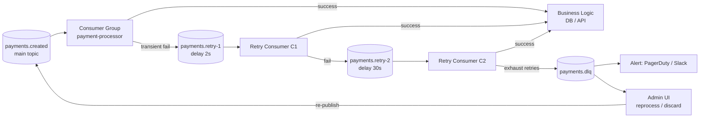

# Dead Letter Queue (DLQ) Patterns

## Category

Apache Kafka — Reliability & Correctness

## Context

A **Dead Letter Queue (DLQ)** is a topic that receives messages that a consumer cannot process after exhausting its retry budget. Without a DLQ, a poison pill (a malformed or unprocessable message) will block a consumer indefinitely — stalling all subsequent messages on its partition. DLQ patterns keep the main consumer healthy while preserving failed messages for investigation and reprocessing.

### Failure Categories

| Failure Type | Example | Recommended Action |
|-------------|---------|-------------------|
| **Deserialization error** | Malformed JSON / Avro | DLQ immediately — cannot decode |
| **Transient error** | DB timeout, downstream service 503 | Retry with backoff → DLQ after N retries |
| **Business logic rejection** | Invalid state transition | DLQ with error context |
| **Poison pill** | Passes deserialization but always throws | DLQ |
| **Schema incompatibility** | Unexpected field type | Fix schema, replay from DLQ |

### Retry Topology Patterns

#### 1. Simple DLQ — Retry in application, then DLQ

```
main-topic → consumer (retry N times) → DLQ topic
```

#### 2. Retry-topic chain (Spring Kafka style)

```
main-topic → consumer
    ↓ fail
retry-1 (delay 1s) → retry-2 (delay 10s) → retry-3 (delay 60s) → DLQ
```

#### 3. Delayed retry via TTL topic + scheduler

```
main-topic → consumer
    ↓ fail
retry-topic (keyed by next-attempt-time) → scheduler reads when time reached → re-publishes to main-topic
```

## Pros

- Poison pills no longer block partition consumers — messages after the failure are processed
- Full message fidelity preserved in DLQ — headers, key, value, original offset
- DLQ messages can be reprocessed after root-cause fix without manual intervention
- Retry chain with increasing delays handles transient failures automatically
- Alerting on DLQ consumer lag provides early warning of systemic issues

## Cons

- DLQ messages arrive out-of-order relative to the main topic — violates ordering assumptions
- Retry delays require sleeping threads or re-producing to retry topics — adds operational complexity
- Without automated reprocessing, DLQ becomes a permanent dead-end
- High DLQ volume may indicate a schema or upstream bug — must not silently absorb bad data
- Each retry topic chain requires its own consumer group and monitoring

## Design Diagram



## Code Sample

### TypeScript — Consumer with retry and DLQ routing

```typescript
import { Kafka, Consumer, EachMessagePayload, Producer } from 'kafkajs';

interface DLQHeaders {
  'dlq-original-topic': string;
  'dlq-original-partition': string;
  'dlq-original-offset': string;
  'dlq-error-message': string;
  'dlq-error-type': string;
  'dlq-retry-count': string;
  'dlq-failed-at': string;
}

const MAX_RETRIES = 3;

export function buildDLQHeaders(
  payload: EachMessagePayload,
  error: Error,
  retryCount: number,
): DLQHeaders {
  return {
    'dlq-original-topic': payload.topic,
    'dlq-original-partition': String(payload.partition),
    'dlq-original-offset': payload.message.offset,
    'dlq-error-message': error.message,
    'dlq-error-type': error.constructor.name,
    'dlq-retry-count': String(retryCount),
    'dlq-failed-at': new Date().toISOString(),
  };
}

export async function sendToDLQ(
  producer: Producer,
  dlqTopic: string,
  payload: EachMessagePayload,
  error: Error,
  retryCount: number,
): Promise<void> {
  await producer.send({
    topic: dlqTopic,
    messages: [
      {
        key: payload.message.key,
        value: payload.message.value,
        headers: {
          ...(payload.message.headers ?? {}),
          ...buildDLQHeaders(payload, error, retryCount),
        },
      },
    ],
  });
}

// Retry-aware consumer wrapper
export async function runWithRetryAndDLQ(
  consumer: Consumer,
  producer: Producer,
  dlqTopic: string,
  handler: (payload: EachMessagePayload) => Promise<void>,
): Promise<void> {
  await consumer.run({
    autoCommit: false,
    eachMessage: async (payload) => {
      const { topic, partition, message } = payload;
      const retryCountHeader = message.headers?.['retry-count'];
      const retryCount = retryCountHeader ? parseInt(retryCountHeader.toString(), 10) : 0;

      try {
        await handler(payload);
        await consumer.commitOffsets([
          { topic, partition, offset: (Number(message.offset) + 1).toString() },
        ]);
      } catch (err) {
        const error = err as Error;
        console.error(`Processing error (attempt ${retryCount + 1}):`, error.message);

        if (retryCount >= MAX_RETRIES) {
          console.warn(`Sending to DLQ after ${retryCount} retries`);
          await sendToDLQ(producer, dlqTopic, payload, error, retryCount);
          // Commit to move past the poison pill
          await consumer.commitOffsets([
            { topic, partition, offset: (Number(message.offset) + 1).toString() },
          ]);
        } else {
          // Re-produce with incremented retry count and delay header
          await producer.send({
            topic,
            messages: [
              {
                key: message.key,
                value: message.value,
                headers: {
                  ...(message.headers ?? {}),
                  'retry-count': Buffer.from(String(retryCount + 1)),
                  'retry-after': Buffer.from(
                    String(Date.now() + Math.pow(2, retryCount) * 1000),
                  ),
                },
              },
            ],
          });
          // Commit original to avoid double-processing
          await consumer.commitOffsets([
            { topic, partition, offset: (Number(message.offset) + 1).toString() },
          ]);
        }
      }
    },
  });
}
```

### TypeScript — DLQ reprocessor (admin tool)

```typescript
import { Kafka } from 'kafkajs';

// Reads from DLQ and re-publishes to original topic after manual investigation
async function reprocessDLQ(dlqTopic: string): Promise<void> {
  const consumer = kafka.consumer({ groupId: 'dlq-reprocessor', readUncommitted: false });
  const producer = kafka.producer({ idempotent: true });

  await consumer.connect();
  await producer.connect();
  await consumer.subscribe({ topic: dlqTopic, fromBeginning: true });

  await consumer.run({
    autoCommit: false,
    eachMessage: async ({ topic, partition, message }) => {
      const originalTopic = message.headers?.['dlq-original-topic']?.toString();
      if (!originalTopic) return;

      console.log(`Reprocessing: ${originalTopic} ← ${topic}@${message.offset}`);

      // Strip DLQ headers before re-publishing
      const cleanHeaders = Object.fromEntries(
        Object.entries(message.headers ?? {}).filter(
          ([k]) => !k.startsWith('dlq-'),
        ),
      );

      await producer.send({
        topic: originalTopic,
        messages: [{ key: message.key, value: message.value, headers: cleanHeaders }],
      });

      await consumer.commitOffsets([
        { topic, partition, offset: (Number(message.offset) + 1).toString() },
      ]);
    },
  });
}
```

### YAML — Alert rule for DLQ messages

```yaml
groups:
  - name: kafka-dlq
    rules:
      - alert: KafkaDLQMessagesProduced
        expr: increase(kafka_server_broker_topic_metrics_MessagesInPerSec_one_minute_rate{topic=~".*\\.dlq"}[5m]) > 0
        for: 1m
        labels:
          severity: warning
        annotations:
          summary: "Messages arriving in DLQ topic {{ $labels.topic }}"
          description: "{{ $value }} msg/s arriving in DLQ — investigate consumer errors"
```

## References

- [Dead Letter Queue Pattern — Enterprise Integration Patterns](https://www.enterpriseintegrationpatterns.com/patterns/messaging/DeadLetterChannel.html)
- [Spring Kafka — Dead Letter Publishing Recoverer](https://docs.spring.io/spring-kafka/docs/current/reference/html/#dead-letters)
- [KafkaJS Error Handling](https://kafka.js.org/docs/consuming#a-name-error-handling-a-error-handling)
- [Confluent — Error Handling in Kafka Streams](https://docs.confluent.io/platform/current/streams/developer-guide/error-handling.html)
