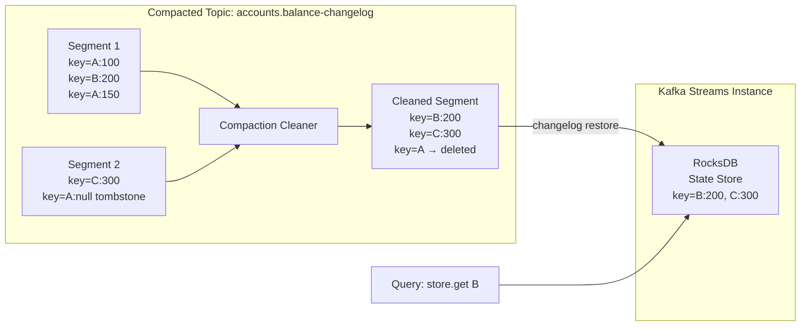

# Compacted Topics & State Stores

## Category

Apache Kafka — Stream Processing

## Context

**Log compaction** transforms a Kafka topic from a time-bound event log into a persistent **key-value store**. The broker runs a background cleaner that retains only the **latest record for each key** within a partition — older records with the same key are removed. A record with a `null` value (**tombstone**) instructs the broker to eventually delete all records for that key.

Compacted topics are the foundation of **KTable materialisation** in Kafka Streams and serve as the **changelog backup** for RocksDB state stores.

### Compaction vs Deletion Retention

| Aspect | `cleanup.policy=delete` | `cleanup.policy=compact` | `compact,delete` |
|--------|-------------------------|-------------------------|-----------------|
| Retention mechanism | Time or size threshold | Latest value per key | Both — compact then delete |
| History preserved | No (old segments deleted) | Only latest per key | Latest per key within time window |
| Storage growth | Bounded | Bounded by unique keys × value size | Bounded |
| Tombstone handling | N/A | Key deleted after `delete.retention.ms` | Same |
| Use case | Event streams | State / lookup tables | Compact materialized view with TTL |

### Compaction Configuration

| Setting | Default | Description |
|---------|---------|-------------|
| `cleanup.policy` | `delete` | `compact` enables log compaction |
| `min.cleanable.dirty.ratio` | `0.5` | Fraction of log that is "dirty" before cleaning runs |
| `segment.ms` | `604800000` (7d) | Max segment age before eligible for compaction |
| `segment.bytes` | `1073741824` (1GB) | Max segment size |
| `delete.retention.ms` | `86400000` (1d) | How long tombstones are retained before true deletion |
| `min.compaction.lag.ms` | `0` | Minimum time a record must remain before compaction |
| `max.compaction.lag.ms` | `Long.MAX_VALUE` | Maximum time a record may remain uncompacted |

### KTable & Changelog Topics

In Kafka Streams, a **KTable** is backed by:
- A **source topic** (optionally compacted)
- A **local RocksDB state store** (in-memory index)
- A **changelog topic** (compacted, `*-changelog`) that backs up the state store

On restart, Kafka Streams restores the RocksDB store by replaying the changelog. Compaction ensures this replay is bounded by the number of unique keys, not total events.

## Pros

- Unlimited retention of latest state without unbounded disk growth
- Enables Kafka as a distributed key-value store accessible to any consumer
- KTable restoration from changelog is proportional to key count, not total event history
- GlobalKTable replicates full compacted topic to every Streams instance — no remote lookups
- Tombstone support provides clean key deletion semantics

## Cons

- Compaction is **not instantaneous** — the broker cleaner runs periodically; stale values exist until cleanup
- Consumers reading a compacted topic may still see duplicate keys before compaction catches up
- Large values per key make the compacted topic disproportionately large
- `min.cleanable.dirty.ratio=0` cleaning too aggressively wastes broker CPU
- Compacted topics cannot be used with `auto.offset.reset=earliest` to get a fully clean snapshot without reading tombstones

## Design Diagram



## Code Sample

### TypeScript — Produce to a compacted topic (upsert / tombstone)

```typescript
import { Kafka, CompressionTypes } from 'kafkajs';

const producer = kafka.producer({ idempotent: true });
await producer.connect();

// Upsert: latest value wins after compaction
export async function upsertAccountBalance(
  accountId: string,
  balance: number,
): Promise<void> {
  await producer.send({
    topic: 'accounts.balance',
    compression: CompressionTypes.LZ4,
    messages: [
      {
        key: accountId,
        value: JSON.stringify({ accountId, balance, updatedAt: new Date().toISOString() }),
        headers: { 'event-type': 'AccountBalanceUpdated' },
      },
    ],
  });
}

// Tombstone: signal compaction to delete this key
export async function deleteAccount(accountId: string): Promise<void> {
  await producer.send({
    topic: 'accounts.balance',
    messages: [
      {
        key: accountId,
        value: null, // null value = tombstone
        headers: { 'event-type': 'AccountDeleted' },
      },
    ],
  });
}
```

### TypeScript — Bootstrap state cache from compacted topic

```typescript
import { Kafka } from 'kafkajs';

// Reads entire compacted topic from beginning to build in-memory cache
// Useful for services that need a warm snapshot on startup
export async function bootstrapFromCompactedTopic(
  topic: string,
): Promise<Map<string, unknown>> {
  const consumer = kafka.consumer({ groupId: `${topic}-bootstrap-${Date.now()}` });
  await consumer.connect();
  await consumer.subscribe({ topic, fromBeginning: true });

  const cache = new Map<string, unknown>();

  await new Promise<void>((resolve, reject) => {
    let idleTimer: NodeJS.Timeout;

    consumer.run({
      autoCommit: false,
      eachMessage: async ({ message }) => {
        clearTimeout(idleTimer);
        const key = message.key?.toString();
        if (!key) return;

        if (message.value === null) {
          cache.delete(key); // tombstone
        } else {
          cache.set(key, JSON.parse(message.value.toString()));
        }

        // Resolve when no new messages for 2 seconds = caught up
        idleTimer = setTimeout(async () => {
          await consumer.disconnect();
          resolve();
        }, 2000);
      },
    }).catch(reject);
  });

  console.log(`Bootstrapped ${cache.size} keys from ${topic}`);
  return cache;
}
```

### Java — Kafka Streams KTable from compacted topic with interactive query

```java
StreamsBuilder builder = new StreamsBuilder();

// Read compacted changelog as KTable
KTable<String, AccountBalance> balances = builder.table(
    "accounts.balance",
    Consumed.with(Serdes.String(), balanceSerde),
    Materialized.<String, AccountBalance, KeyValueStore<Bytes, byte[]>>as("account-balance-store")
        .withKeySerde(Serdes.String())
        .withValueSerde(balanceSerde)
);

// Join incoming payments with account balances
KStream<String, Payment> payments = builder.stream(
    "payments.created",
    Consumed.with(Serdes.String(), paymentSerde)
);

payments.join(balances,
    (payment, balance) -> new EnrichedPayment(payment, balance)
).to("payments.enriched");

// Interactive query (HTTP endpoint)
ReadOnlyKeyValueStore<String, AccountBalance> store =
    streams.store(StoreQueryParameters.fromNameAndType(
        "account-balance-store",
        QueryableStoreTypes.keyValueStore()
    ));
AccountBalance balance = store.get("account-123");
```

### Shell — Create a compacted topic and monitor compaction

```bash
# Create compacted topic
kafka-topics.sh --bootstrap-server localhost:9092 \
  --create \
  --topic accounts.balance \
  --partitions 12 \
  --replication-factor 3 \
  --config cleanup.policy=compact \
  --config min.cleanable.dirty.ratio=0.1 \
  --config segment.ms=3600000 \
  --config delete.retention.ms=86400000

# Describe topic to confirm config
kafka-topics.sh --bootstrap-server localhost:9092 \
  --describe --topic accounts.balance

# Monitor log cleaner stats via JMX / metrics
# kafka.log:type=LogCleaner,name=cleaner-recopy-percent
# kafka.log:type=LogCleaner,name=max-clean-time-secs
```

## References

- [Kafka Documentation — Log Compaction](https://kafka.apache.org/documentation/#compaction)
- [Kafka Streams — KTable](https://kafka.apache.org/35/documentation/streams/developer-guide/dsl-api.html#ktable)
- [Kafka Streams — State Stores](https://kafka.apache.org/35/documentation/streams/developer-guide/processor-api.html#state-stores)
- [Confluent — Log Compaction Deep Dive](https://docs.confluent.io/kafka/design/log_compaction.html)
