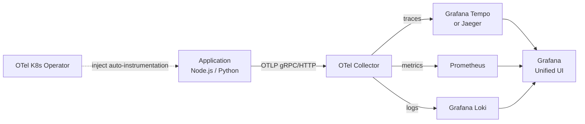

# OpenTelemetry Instrumentation

## Category

**Domain:** Observability · **Stack:** Node.js, Python, Kubernetes · **Scope:** Telemetry SDK & Auto-Instrumentation

---

## Context

OpenTelemetry (OTel) is the CNCF standard for emitting **traces, metrics, and logs** from application code — vendor-neutral and backend-agnostic. It replaces fragmented, proprietary SDKs (Datadog agent, Jaeger client, Zipkin client) with a single instrumentation layer that exports to any backend via OTLP.

### Signal Types

| Signal | What it captures | OTel API |
|--------|-----------------|---------|
| **Traces** | Request lifecycle across services — spans with timing, attributes, events | `trace.getTracer()` |
| **Metrics** | Numeric measurements: counters, gauges, histograms | `metrics.getMeter()` |
| **Logs** | Discrete log records — correlated to traces via `traceId` / `spanId` | `logs.getLogger()` |

### Instrumentation Modes

| Mode | Effort | Coverage |
|------|--------|---------|
| **Auto-instrumentation** (Node.js `--require @opentelemetry/auto-instrumentations-node`) | Zero code changes | HTTP, gRPC, DB, Redis, AWS SDK |
| **Manual instrumentation** | Add spans/attributes in code | Business logic, custom operations |
| **Zero-code (K8s operator)** | Inject sidecar/init-container | Language-agnostic, no code deploy |

---

## Pros

- Single SDK replaces all proprietary agents — switch backend by changing exporter config
- Auto-instrumentation captures HTTP, database, message queue spans with no code changes
- W3C Trace Context (traceparent header) propagates across service boundaries automatically
- OTel Collector decouples apps from backends — add fanout, sampling, enrichment without re-deploys
- CNCF graduated project — long-term stable, vendor commitment from all major observability vendors

## Cons

- Adds startup overhead (~50–100 ms) due to SDK initialisation and patching
- Auto-instrumentation monkey-patches libraries — can conflict with other patching tools
- Cardinality must be managed: every unique attribute combination creates a new metric time series
- Logs signal is still beta in some language SDKs (as of 2025)
- OTel Collector is required in production — adds another component to operate

---

## Design Diagram



---

## Code Sample

### TypeScript — OTel SDK Bootstrap (Node.js)

```typescript
// src/instrumentation.ts
// Load BEFORE any other imports: NODE_OPTIONS=--require ./dist/instrumentation.js

import { NodeSDK } from '@opentelemetry/sdk-node';
import { OTLPTraceExporter } from '@opentelemetry/exporter-trace-otlp-grpc';
import { OTLPMetricExporter } from '@opentelemetry/exporter-metrics-otlp-grpc';
import { PeriodicExportingMetricReader } from '@opentelemetry/sdk-metrics';
import { getNodeAutoInstrumentations } from '@opentelemetry/auto-instrumentations-node';
import { Resource } from '@opentelemetry/resources';
import { ATTR_SERVICE_NAME, ATTR_SERVICE_VERSION } from '@opentelemetry/semantic-conventions';

const sdk = new NodeSDK({
  resource: new Resource({
    [ATTR_SERVICE_NAME]: process.env.OTEL_SERVICE_NAME ?? 'unknown-service',
    [ATTR_SERVICE_VERSION]: process.env.APP_VERSION ?? '0.0.0',
    'deployment.environment': process.env.NODE_ENV ?? 'development',
  }),

  traceExporter: new OTLPTraceExporter({
    url: process.env.OTEL_EXPORTER_OTLP_ENDPOINT ?? 'http://otel-collector:4317',
  }),

  metricReader: new PeriodicExportingMetricReader({
    exporter: new OTLPMetricExporter({
      url: process.env.OTEL_EXPORTER_OTLP_ENDPOINT ?? 'http://otel-collector:4317',
    }),
    exportIntervalMillis: 30_000,
  }),

  instrumentations: [
    getNodeAutoInstrumentations({
      // Auto-instruments: HTTP, Express, gRPC, AWS SDK, Redis, pg, mysql2, mongoose
      '@opentelemetry/instrumentation-fs': { enabled: false }, // too noisy
      '@opentelemetry/instrumentation-http': {
        ignoreIncomingRequestHook: (req) =>
          req.url === '/health' || req.url === '/metrics', // skip probe traffic
      },
    }),
  ],
});

sdk.start();

process.on('SIGTERM', () => {
  sdk.shutdown().finally(() => process.exit(0));
});
```

### TypeScript — Manual Span Creation

```typescript
// src/orders/order-service.ts
import { trace, SpanStatusCode, context, propagation } from '@opentelemetry/api';

const tracer = trace.getTracer('order-service', '1.0.0');

export async function processOrder(orderId: string, userId: string): Promise<void> {
  // Create a child span under the active trace
  await tracer.startActiveSpan('order.process', async (span) => {
    span.setAttributes({
      'order.id': orderId,
      'user.id': userId,
      'order.source': 'api',
    });

    try {
      span.addEvent('order.validation.start');
      await validateOrder(orderId);
      span.addEvent('order.validation.complete');

      await chargePayment(orderId);
      span.setStatus({ code: SpanStatusCode.OK });
    } catch (err) {
      span.recordException(err as Error);
      span.setStatus({ code: SpanStatusCode.ERROR, message: (err as Error).message });
      throw err;
    } finally {
      span.end();
    }
  });
}

// Propagate trace context into outbound HTTP headers (e.g. fetch)
export function injectTraceHeaders(headers: Record<string, string>): void {
  propagation.inject(context.active(), headers);
}
```

### Python — OTel SDK Bootstrap

```python
# src/instrumentation.py
# Call configure_otel() at app startup before importing framework

import os
from opentelemetry import trace, metrics
from opentelemetry.sdk.trace import TracerProvider
from opentelemetry.sdk.trace.export import BatchSpanProcessor
from opentelemetry.sdk.metrics import MeterProvider
from opentelemetry.sdk.metrics.export import PeriodicExportingMetricReader
from opentelemetry.exporter.otlp.proto.grpc.trace_exporter import OTLPSpanExporter
from opentelemetry.exporter.otlp.proto.grpc.metric_exporter import OTLPMetricExporter
from opentelemetry.sdk.resources import Resource, SERVICE_NAME, SERVICE_VERSION
from opentelemetry.instrumentation.fastapi import FastAPIInstrumentor
from opentelemetry.instrumentation.sqlalchemy import SQLAlchemyInstrumentor
from opentelemetry.instrumentation.httpx import HTTPXClientInstrumentor


def configure_otel(app=None) -> None:
    endpoint = os.getenv("OTEL_EXPORTER_OTLP_ENDPOINT", "http://otel-collector:4317")

    resource = Resource.create({
        SERVICE_NAME:    os.getenv("OTEL_SERVICE_NAME", "unknown-service"),
        SERVICE_VERSION: os.getenv("APP_VERSION", "0.0.0"),
        "deployment.environment": os.getenv("ENV", "development"),
    })

    # Traces
    tracer_provider = TracerProvider(resource=resource)
    tracer_provider.add_span_processor(
        BatchSpanProcessor(OTLPSpanExporter(endpoint=endpoint))
    )
    trace.set_tracer_provider(tracer_provider)

    # Metrics
    reader = PeriodicExportingMetricReader(
        OTLPMetricExporter(endpoint=endpoint),
        export_interval_millis=30_000,
    )
    meter_provider = MeterProvider(resource=resource, metric_readers=[reader])
    metrics.set_meter_provider(meter_provider)

    # Auto-instrument popular libraries
    if app is not None:
        FastAPIInstrumentor.instrument_app(app)
    SQLAlchemyInstrumentor().instrument()
    HTTPXClientInstrumentor().instrument()
```

### YAML — OTel Kubernetes Operator: Auto-Instrumentation CR

```yaml
# k8s/otel/instrumentation.yaml
# Requires: cert-manager + opentelemetry-operator installed in cluster
apiVersion: opentelemetry.io/v1alpha1
kind: Instrumentation
metadata:
  name: otel-instrumentation
  namespace: apps
spec:
  exporter:
    endpoint: http://otel-collector.observability.svc.cluster.local:4317

  propagators:
    - tracecontext   # W3C traceparent
    - baggage

  sampler:
    type: parentbased_traceidratio
    argument: "0.1"   # sample 10% in production

  nodejs:
    image: ghcr.io/open-telemetry/opentelemetry-operator/autoinstrumentation-nodejs:latest
    env:
      - name: OTEL_NODE_DISABLED_INSTRUMENTATIONS
        value: "fs"

  python:
    image: ghcr.io/open-telemetry/opentelemetry-operator/autoinstrumentation-python:latest
    env:
      - name: OTEL_PYTHON_LOG_CORRELATION
        value: "true"

---
# Add this annotation to any Deployment to get zero-code instrumentation:
# instrumentation.opentelemetry.io/inject-nodejs: "apps/otel-instrumentation"
# instrumentation.opentelemetry.io/inject-python: "apps/otel-instrumentation"
```

### YAML — Deployment with OTel Annotation

```yaml
# k8s/apps/api-deployment.yaml
apiVersion: apps/v1
kind: Deployment
metadata:
  name: order-api
  namespace: apps
spec:
  template:
    metadata:
      annotations:
        instrumentation.opentelemetry.io/inject-nodejs: "apps/otel-instrumentation"
    spec:
      containers:
        - name: order-api
          image: myregistry/order-api:1.2.3
          env:
            - name: OTEL_SERVICE_NAME
              value: order-api
            - name: OTEL_RESOURCE_ATTRIBUTES
              value: "team=payments,environment=production"
```
