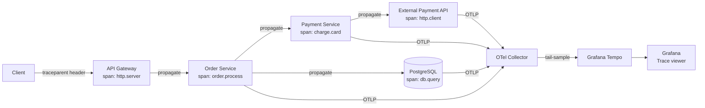

# Distributed Tracing

## Category

**Domain:** Observability · **Stack:** OTel, Grafana Tempo, Jaeger · **Scope:** Request Flow Across Services

---

## Context

Distributed tracing answers: **"Where did this request spend its time?"** A single user request touching 10 microservices generates a tree of **spans** — each span recording one unit of work (HTTP call, DB query, cache lookup) with timing, status, and attributes. Linking spans via a shared **trace ID** reconstructs the full call graph.

### Core Concepts

| Concept | Definition |
|---------|-----------|
| **Trace** | Complete end-to-end request journey — tree of spans |
| **Span** | Single unit of work: name, start time, duration, attributes, events, status |
| **Context propagation** | Passing trace/span IDs across network hops (via `traceparent` HTTP header) |
| **Sampling** | Deciding which traces to record — 100% is too expensive at scale |
| **Exemplar** | A trace ID embedded in a metric data point — links a latency spike to its trace |

### Sampling Strategies

| Strategy | When to Use | Trade-off |
|----------|------------|-----------|
| **Head-based (ratio)** | Default — sample N% of all requests | Drops rare errors |
| **Tail-based** (OTel Collector) | Sample 100% of errors, slow traces | Requires buffering all spans |
| **Parent-based** | Honour upstream sampling decision | Consistent sampling across services |
| **Always-on (dev/staging)** | Full visibility during development | Too expensive in production at scale |

---

## Pros

- Eliminates "black box" debugging across microservices — mean time to diagnose drops 60–80%
- Exemplars link Prometheus latency histograms directly to traces showing the slow request
- Tail-based sampling captures 100% of errors and slow outliers while keeping volume manageable
- W3C Trace Context is an HTTP standard — works across languages, frameworks, and vendors
- Grafana Tempo is open-source and object-storage-backed (S3) — very low cost at scale

## Cons

- Every service must be instrumented — partial coverage creates trace gaps
- Head-based sampling misses rare but important errors (tail-based sampling fixes this at higher complexity)
- High-cardinality span attributes (user IDs, order IDs) require storage planning
- Trace context must pass through message queues, async jobs, and batch processes — requires explicit injection
- Dependency on clock sync (NTP) across services for accurate span timing

---

## Design Diagram



---

## Code Sample

### TypeScript — Context Propagation Through Message Queue

```typescript
// src/messaging/kafka-producer.ts
// Inject trace context into Kafka message headers so consumers continue the trace

import { context, propagation, trace, SpanKind } from '@opentelemetry/api';
import { Kafka, Message } from 'kafkajs';

const tracer = trace.getTracer('order-service');

export async function publishOrderEvent(
  producer: ReturnType<Kafka['producer']>,
  topic: string,
  key: string,
  payload: object,
): Promise<void> {
  await tracer.startActiveSpan(
    `${topic} publish`,
    { kind: SpanKind.PRODUCER, attributes: { 'messaging.system': 'kafka', 'messaging.destination': topic } },
    async (span) => {
      try {
        // Inject W3C trace context into Kafka headers
        const headers: Record<string, string> = {};
        propagation.inject(context.active(), headers);

        const message: Message = {
          key,
          value: JSON.stringify(payload),
          headers: Object.fromEntries(
            Object.entries(headers).map(([k, v]) => [k, Buffer.from(v)]),
          ),
        };

        await producer.send({ topic, messages: [message] });
        span.setStatus({ code: 1 }); // SpanStatusCode.OK
      } catch (err) {
        span.recordException(err as Error);
        span.setStatus({ code: 2, message: (err as Error).message });
        throw err;
      } finally {
        span.end();
      }
    },
  );
}
```

```typescript
// src/messaging/kafka-consumer.ts
// Extract trace context from Kafka headers and continue the trace

import { context, propagation, trace, SpanKind } from '@opentelemetry/api';
import { EachMessagePayload } from 'kafkajs';

const tracer = trace.getTracer('order-service');

export async function handleOrderEvent({ topic, message }: EachMessagePayload): Promise<void> {
  // Extract W3C trace context from Kafka message headers
  const carrier: Record<string, string> = {};
  for (const [key, value] of Object.entries(message.headers ?? {})) {
    if (value !== undefined) carrier[key] = value.toString();
  }
  const parentCtx = propagation.extract(context.active(), carrier);

  await context.with(parentCtx, async () => {
    await tracer.startActiveSpan(
      `${topic} process`,
      { kind: SpanKind.CONSUMER, attributes: { 'messaging.system': 'kafka', 'messaging.destination': topic } },
      async (span) => {
        try {
          const payload = JSON.parse(message.value!.toString());
          await processEvent(payload);
          span.setStatus({ code: 1 });
        } catch (err) {
          span.recordException(err as Error);
          span.setStatus({ code: 2, message: (err as Error).message });
        } finally {
          span.end();
        }
      },
    );
  });
}

async function processEvent(_payload: unknown): Promise<void> {
  // business logic
}
```

### YAML — OTel Collector Tail-Based Sampling Config

```yaml
# otel-collector/config.yaml — tail-based sampling pipeline
receivers:
  otlp:
    protocols:
      grpc:
        endpoint: 0.0.0.0:4317
      http:
        endpoint: 0.0.0.0:4318

processors:
  tail_sampling:
    decision_wait: 10s      # buffer spans for 10s before sampling decision
    num_traces: 100000      # max traces held in memory simultaneously
    expected_new_traces_per_sec: 1000

    policies:
      # Always keep errors
      - name: errors
        type: status_code
        status_code: { status_codes: [ERROR] }

      # Always keep slow traces (> 2s)
      - name: slow-traces
        type: latency
        latency: { threshold_ms: 2000 }

      # Sample 5% of everything else
      - name: default-probabilistic
        type: probabilistic
        probabilistic: { sampling_percentage: 5 }

  batch:
    send_batch_size: 1024
    timeout: 5s

exporters:
  otlp/tempo:
    endpoint: http://tempo:4317
    tls:
      insecure: true

service:
  pipelines:
    traces:
      receivers: [otlp]
      processors: [tail_sampling, batch]
      exporters: [otlp/tempo]
```

### YAML — Grafana Tempo Deployment (Helm Values)

```yaml
# k8s/tempo/values.yaml
# helm install tempo grafana/tempo-distributed -f values.yaml

tempo:
  storage:
    trace:
      backend: s3
      s3:
        bucket: my-tempo-traces
        region: eu-west-1
        # Use IRSA — no static credentials

  retention: 336h    # 14 days

metricsGenerator:
  enabled: true    # generates RED metrics from traces → links to Prometheus
  config:
    storage:
      path: /var/tempo/generator/wal
    processors:
      - service-graphs    # builds service dependency graph from traces
      - span-metrics      # generates rate/error/duration metrics per span

global_overrides:
  metrics_generator_processors: [service-graphs, span-metrics]
```

### Python — Trace-Aware Request Handler (FastAPI)

```python
# src/api/orders.py
from fastapi import APIRouter, Request
from opentelemetry import trace, baggage, context

router = APIRouter()
tracer = trace.getTracer("order-api")


@router.post("/orders")
async def create_order(request: Request, body: dict) -> dict:
    span = trace.get_current_span()

    # Enrich the auto-instrumented span with business context
    span.set_attributes({
        "order.customer_id": body.get("customer_id", ""),
        "order.item_count": len(body.get("items", [])),
        "order.total_usd": body.get("total", 0),
    })

    # Add audit baggage — propagates to all downstream spans
    ctx = baggage.set_baggage("user.id", body.get("customer_id", "unknown"))
    with context.use_context(ctx):
        result = await _process(body)

    return result


async def _process(body: dict) -> dict:
    with tracer.start_as_current_span("order.persist") as span:
        # db write here — span will have db.* attributes via SQLAlchemy auto-instrumentation
        span.add_event("order.created", {"order.id": "ord-123"})
        return {"order_id": "ord-123", "status": "created"}
```
