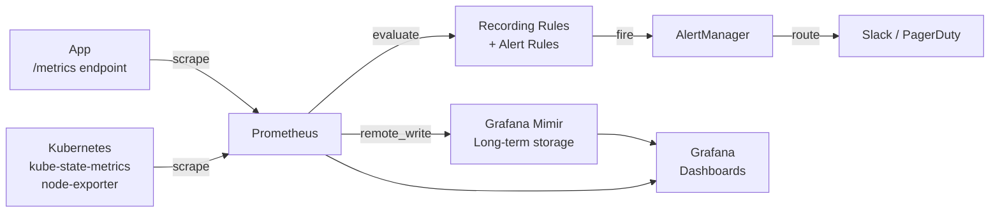

# Metrics & Prometheus

## Category

**Domain:** Observability · **Stack:** Prometheus, Grafana, Node.js, Python · **Scope:** Time-Series Metrics Collection

---

## Context

Prometheus is the de-facto standard for cloud-native metrics. It uses a **pull model** (scrapes `/metrics` endpoints) with a powerful query language (PromQL) and native service discovery for Kubernetes. Metrics are **cheap to store and query** compared to traces and logs — they are the primary tool for alerting and dashboards.

### Metric Types

| Type | Use Case | Example |
|------|---------|---------|
| **Counter** | Monotonically increasing total — rates via `rate()` | `http_requests_total` |
| **Gauge** | Current value — can go up and down | `active_connections`, `memory_bytes` |
| **Histogram** | Distribution of values — latency percentiles via `histogram_quantile()` | `http_request_duration_seconds` |
| **Summary** | Pre-computed quantiles (client-side) — avoid in multi-instance | `request_duration_p99` |

### RED Method (Services)

| Metric | PromQL |
|--------|--------|
| **Rate** — requests/sec | `rate(http_requests_total[5m])` |
| **Errors** — error rate % | `rate(http_requests_total{status=~"5.."}[5m]) / rate(http_requests_total[5m])` |
| **Duration** — p99 latency | `histogram_quantile(0.99, rate(http_request_duration_seconds_bucket[5m]))` |

### USE Method (Resources)

| Metric | PromQL |
|--------|--------|
| **Utilisation** — CPU % | `1 - avg(rate(node_cpu_seconds_total{mode="idle"}[5m]))` |
| **Saturation** — queue depth | `node_load1 / count(node_cpu_seconds_total{mode="idle"})` |
| **Errors** — HW errors | `rate(node_disk_io_time_seconds_total[5m])` |

---

## Pros

- Pull model with service discovery auto-discovers Kubernetes pods and services — no config per pod
- PromQL is expressive — complex aggregations, rates, quantiles, multi-dim filtering in one query
- Histograms enable accurate percentile calculations without pre-defining quantiles client-side
- Recording rules pre-compute expensive queries, reducing dashboard query latency
- Native K8s operator (kube-prometheus-stack) deploys a full production Prometheus in minutes

## Cons

- Prometheus stores data locally — not natively highly available (use Thanos or Mimir for HA + long-term storage)
- Pull model struggles with short-lived batch jobs (use pushgateway or OTel push)
- Cardinality explosion: labels with high cardinality (user ID, request ID) crash Prometheus memory
- Default 15-day retention — requires remote write to Thanos/Mimir/Cortex for long-term retention
- PromQL has a steep learning curve for teams new to metrics

---

## Design Diagram



---

## Code Sample

### TypeScript — Custom Prometheus Metrics (prom-client)

```typescript
// src/metrics/registry.ts
import { Registry, Counter, Histogram, Gauge, collectDefaultMetrics } from 'prom-client';

export const registry = new Registry();

// Collect Node.js default metrics (GC, event loop, memory, CPU)
collectDefaultMetrics({ register: registry, prefix: 'nodejs_' });

// HTTP request counter — dimensions: method, route, status_code
export const httpRequestsTotal = new Counter({
  name: 'http_requests_total',
  help: 'Total number of HTTP requests',
  labelNames: ['method', 'route', 'status_code'],
  registers: [registry],
});

// HTTP request duration histogram
export const httpRequestDuration = new Histogram({
  name: 'http_request_duration_seconds',
  help: 'HTTP request duration in seconds',
  labelNames: ['method', 'route', 'status_code'],
  buckets: [0.005, 0.01, 0.025, 0.05, 0.1, 0.25, 0.5, 1, 2.5, 5, 10],
  registers: [registry],
});

// Business metric: orders processed
export const ordersProcessedTotal = new Counter({
  name: 'orders_processed_total',
  help: 'Total orders processed',
  labelNames: ['status', 'payment_method'],
  registers: [registry],
});

// Gauge: current queue depth
export const jobQueueDepth = new Gauge({
  name: 'job_queue_depth',
  help: 'Current number of jobs waiting in queue',
  labelNames: ['queue_name'],
  registers: [registry],
});
```

```typescript
// src/metrics/middleware.ts — Express middleware
import { Request, Response, NextFunction } from 'express';
import { httpRequestsTotal, httpRequestDuration } from './registry';

export function metricsMiddleware(req: Request, res: Response, next: NextFunction): void {
  const end = httpRequestDuration.startTimer();

  res.on('finish', () => {
    const labels = {
      method: req.method,
      route: req.route?.path ?? req.path,  // normalised route, not raw URL
      status_code: String(res.statusCode),
    };
    httpRequestsTotal.inc(labels);
    end(labels);
  });

  next();
}
```

### Python — Custom Metrics (prometheus-client)

```python
# src/metrics/registry.py
from prometheus_client import Counter, Histogram, Gauge, CollectorRegistry, start_http_server
import os

REGISTRY = CollectorRegistry(auto_describe=True)

http_requests_total = Counter(
    "http_requests_total",
    "Total HTTP requests",
    ["method", "route", "status_code"],
    registry=REGISTRY,
)

http_request_duration_seconds = Histogram(
    "http_request_duration_seconds",
    "HTTP request duration",
    ["method", "route"],
    buckets=[0.005, 0.01, 0.025, 0.05, 0.1, 0.25, 0.5, 1, 2.5, 5],
    registry=REGISTRY,
)

orders_processed_total = Counter(
    "orders_processed_total",
    "Orders processed by status",
    ["status", "payment_method"],
    registry=REGISTRY,
)

active_db_connections = Gauge(
    "db_active_connections",
    "Active database connections",
    registry=REGISTRY,
)


def start_metrics_server(port: int = 9090) -> None:
    """Start Prometheus /metrics server on a dedicated port."""
    start_http_server(port, registry=REGISTRY)
    print(f"Prometheus metrics at :{port}/metrics")
```

### YAML — Prometheus Scrape Config + Recording Rules

```yaml
# prometheus/prometheus.yml
global:
  scrape_interval: 15s
  evaluation_interval: 15s

rule_files:
  - /etc/prometheus/rules/*.yaml

scrape_configs:
  # Auto-discover all pods with annotation prometheus.io/scrape: "true"
  - job_name: kubernetes-pods
    kubernetes_sd_configs:
      - role: pod
    relabel_configs:
      - source_labels: [__meta_kubernetes_pod_annotation_prometheus_io_scrape]
        action: keep
        regex: "true"
      - source_labels: [__meta_kubernetes_pod_annotation_prometheus_io_path]
        action: replace
        target_label: __metrics_path__
        regex: (.+)
      - source_labels: [__meta_kubernetes_pod_annotation_prometheus_io_port]
        action: replace
        target_label: __address__
        regex: (\d+)
        replacement: $1
      - source_labels: [__meta_kubernetes_namespace]
        target_label: namespace
      - source_labels: [__meta_kubernetes_pod_name]
        target_label: pod
      - source_labels: [__meta_kubernetes_pod_label_app]
        target_label: app
```

```yaml
# prometheus/rules/http-recording.yaml
groups:
  - name: http_recording_rules
    interval: 30s
    rules:
      # Pre-compute request rate per service (used in dashboards + alerts)
      - record: job:http_requests_total:rate5m
        expr: sum(rate(http_requests_total[5m])) by (job, route)

      # Pre-compute error rate per service
      - record: job:http_errors_total:rate5m
        expr: |
          sum(rate(http_requests_total{status_code=~"5.."}[5m])) by (job, route)
          /
          sum(rate(http_requests_total[5m])) by (job, route)

      # Pre-compute p99 latency per service
      - record: job:http_request_duration_p99:5m
        expr: |
          histogram_quantile(0.99,
            sum(rate(http_request_duration_seconds_bucket[5m])) by (job, route, le)
          )
```

### YAML — kube-prometheus-stack Helm Values (Production)

```yaml
# k8s/monitoring/kube-prometheus-values.yaml
# helm install kube-prometheus-stack prometheus-community/kube-prometheus-stack -f values.yaml

prometheus:
  prometheusSpec:
    retention: 7d
    storageSpec:
      volumeClaimTemplate:
        spec:
          storageClassName: gp3
          resources:
            requests:
              storage: 50Gi

    # Remote write to Mimir for long-term storage
    remoteWrite:
      - url: http://mimir.observability.svc.cluster.local/api/v1/push
        queueConfig:
          maxSamplesPerSend: 10000
          batchSendDeadline: 5s

    additionalScrapeConfigs: []   # add custom scrape jobs here

grafana:
  enabled: true
  adminPassword: ""    # set via sealed secret
  sidecar:
    dashboards:
      enabled: true    # auto-load dashboards from ConfigMaps

alertmanager:
  config:
    route:
      receiver: slack-critical
    receivers:
      - name: slack-critical
        slack_configs:
          - api_url:  ""   # set via secret
            channel: "#alerts-critical"
```
