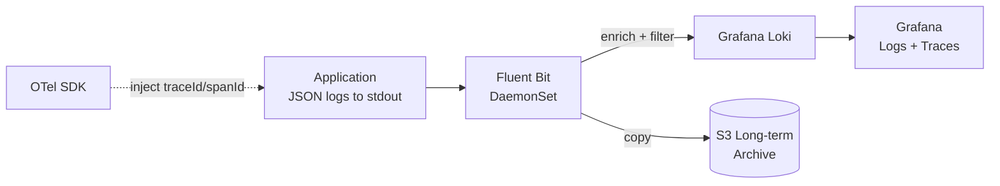

# Structured Logging

## Category

**Domain:** Observability · **Stack:** Node.js, Python, Fluent Bit, Loki · **Scope:** Machine-Readable Log Management

---

## Context

Structured logging emits logs as **JSON objects** instead of free-text strings, making them queryable, filterable, and correlatable with traces. Combined with a log aggregation pipeline (Fluent Bit → Loki or OpenSearch), structured logs become a searchable audit trail that can be queried with the same precision as a database.

### Log Levels (Semantic Contract)

| Level | When to Use |
|-------|------------|
| `ERROR` | Unrecoverable failure requiring immediate attention |
| `WARN` | Recoverable problem or degraded state — investigate soon |
| `INFO` | Significant application lifecycle event (startup, request completed) |
| `DEBUG` | Developer diagnostic detail — disabled in production |
| `TRACE` | Execution path detail — disabled in production |

### Correlation Fields (Required in Every Log Line)

| Field | Value | Purpose |
|-------|-------|---------|
| `traceId` | OTel trace ID | Link log → trace |
| `spanId` | OTel span ID | Link log → specific span |
| `requestId` | UUID per HTTP request | Correlate all logs in one request |
| `service` | Service name | Filter by service |
| `env` | `production` / `staging` | Filter by environment |

---

## Pros

- JSON logs are queryable by any field without log parsing rules — faster incident response
- Trace/span ID correlation allows jumping from a Grafana alert → trace → specific log lines
- Structured logs enable business metric extraction without adding application metrics
- Log sampling (e.g. drop 90% of DEBUG in production) reduces Loki/S3 cost significantly
- Fluent Bit is lightweight (~450 KB binary) — suitable for DaemonSet sidecar

## Cons

- JSON is verbose — logs are 2–5× larger than plain text (increased storage cost)
- Sensitive data (PII, tokens) must be scrubbed in the logging layer — easy to miss
- `console.log()` scattered throughout codebases must be migrated to a logger — takes time
- Loki without index (label-based) requires careful label design — high cardinality labels degrade performance
- Fluent Bit configuration can be complex for multi-line log merging (e.g. stack traces)

---

## Design Diagram



---

## Code Sample

### TypeScript — Structured Logger (Pino)

```typescript
// src/logger.ts
import pino from 'pino';
import { trace, context } from '@opentelemetry/api';

function getTraceContext(): { traceId?: string; spanId?: string } {
  const span = trace.getActiveSpan();
  if (!span) return {};
  const ctx = span.spanContext();
  return { traceId: ctx.traceId, spanId: ctx.spanId };
}

export const logger = pino({
  level: process.env.LOG_LEVEL ?? 'info',
  // Never log in production: 'debug' | 'trace' unless LOG_LEVEL overrides
  base: {
    service: process.env.OTEL_SERVICE_NAME ?? 'unknown',
    version: process.env.APP_VERSION ?? '0.0.0',
    env: process.env.NODE_ENV ?? 'development',
    pid: process.pid,
  },
  // Emit ISO timestamp (not epoch ms) for human readability
  timestamp: pino.stdTimeFunctions.isoTime,
  // Redact sensitive fields from all log lines
  redact: {
    paths: ['req.headers.authorization', 'req.headers.cookie', '*.password', '*.token', '*.secret'],
    censor: '[REDACTED]',
  },
  // In production: output plain JSON. In dev: use pino-pretty
  transport: process.env.NODE_ENV === 'development'
    ? { target: 'pino-pretty', options: { colorize: true } }
    : undefined,
}).child(() => getTraceContext()); // inject traceId/spanId on every log call
```

```typescript
// src/middleware/request-logger.ts — Express request/response logging
import { Request, Response, NextFunction } from 'express';
import { randomUUID } from 'crypto';
import { logger } from '../logger';

export function requestLogger(req: Request, res: Response, next: NextFunction): void {
  const requestId = (req.headers['x-request-id'] as string) ?? randomUUID();
  req.headers['x-request-id'] = requestId;

  const reqLogger = logger.child({ requestId, method: req.method, url: req.url });
  (req as any).log = reqLogger;

  const start = Date.now();
  res.on('finish', () => {
    const level = res.statusCode >= 500 ? 'error' : res.statusCode >= 400 ? 'warn' : 'info';
    reqLogger[level]({
      statusCode: res.statusCode,
      durationMs: Date.now() - start,
      contentLength: res.getHeader('content-length'),
    }, 'request completed');
  });

  next();
}
```

### Python — Structured Logger (structlog)

```python
# src/logging_config.py
import logging
import os
import structlog
from opentelemetry import trace


def add_otel_context(logger, method, event_dict):
    """Inject OTel trace/span IDs into every log record."""
    span = trace.get_current_span()
    if span and span.is_recording():
        ctx = span.get_span_context()
        event_dict["traceId"] = format(ctx.trace_id, "032x")
        event_dict["spanId"]  = format(ctx.span_id, "016x")
    return event_dict


def configure_logging() -> None:
    log_level = os.getenv("LOG_LEVEL", "INFO").upper()

    structlog.configure(
        processors=[
            structlog.contextvars.merge_contextvars,
            structlog.stdlib.add_log_level,
            structlog.stdlib.add_logger_name,
            add_otel_context,
            structlog.stdlib.PositionalArgumentsFormatter(),
            structlog.processors.TimeStamper(fmt="iso"),
            structlog.processors.StackInfoRenderer(),
            structlog.processors.JSONRenderer(),   # output JSON
        ],
        wrapper_class=structlog.stdlib.BoundLogger,
        context_class=dict,
        logger_factory=structlog.stdlib.LoggerFactory(),
        cache_logger_on_first_use=True,
    )

    logging.basicConfig(
        format="%(message)s",
        level=getattr(logging, log_level),
    )


log = structlog.get_logger()

# Usage:
# log.info("order.created", order_id="ord-123", customer_id="cust-456", amount=99.99)
# log.error("payment.failed", order_id="ord-123", error="card_declined", exc_info=True)
```

### YAML — Fluent Bit DaemonSet Config (K8s → Loki)

```yaml
# k8s/fluent-bit/configmap.yaml
apiVersion: v1
kind: ConfigMap
metadata:
  name: fluent-bit-config
  namespace: observability
data:
  fluent-bit.conf: |
    [SERVICE]
        Flush         5
        Log_Level     info
        Daemon        off
        Parsers_File  parsers.conf

    [INPUT]
        Name              tail
        Path              /var/log/containers/*.log
        multiline.parser  cri
        Tag               kube.*
        Refresh_Interval  10
        Mem_Buf_Limit     50MB
        Skip_Long_Lines   On

    [FILTER]
        Name                kubernetes
        Match               kube.*
        Kube_URL            https://kubernetes.default.svc:443
        Kube_CA_File        /var/run/secrets/kubernetes.io/serviceaccount/ca.crt
        Kube_Token_File     /var/run/secrets/kubernetes.io/serviceaccount/token
        Kube_Tag_Prefix     kube.var.log.containers.
        Merge_Log           On      # merge JSON log body into top-level fields
        Keep_Log            Off
        Annotations         Off     # don't index annotations — reduces cardinality
        Labels              On

    # Drop health-check noise before shipping
    [FILTER]
        Name    grep
        Match   kube.*
        Exclude log .*GET /health.*

    [OUTPUT]
        Name            loki
        Match           kube.*
        Host            loki.observability.svc.cluster.local
        Port            3100
        Labels          job=fluent-bit, namespace=$kubernetes['namespace_name'], app=$kubernetes['labels']['app']
        Label_Keys      level,traceId,service
        Remove_Keys     kubernetes,stream
        Auto_Kubernetes_Labels On
        Line_Format     json
```

### YAML — Loki Log Query Examples (LogQL)

```yaml
# Loki LogQL reference examples — paste into Grafana Explore

# All errors in the order-api service last 1h
# {app="order-api"} |= "level=error"

# Find all log lines for a specific trace ID
# {namespace="production"} | json | traceId="abc123def456..."

# Rate of error logs per service (metric query)
# sum(rate({namespace="production"} |= "\"level\":\"error\"" [5m])) by (app)

# Slow requests > 500ms from structured logs
# {app="order-api"} | json | durationMs > 500

# Logs containing exceptions, show only message + traceId
# {namespace="production"} | json | line_format "{{.traceId}} {{.message}}"
```
