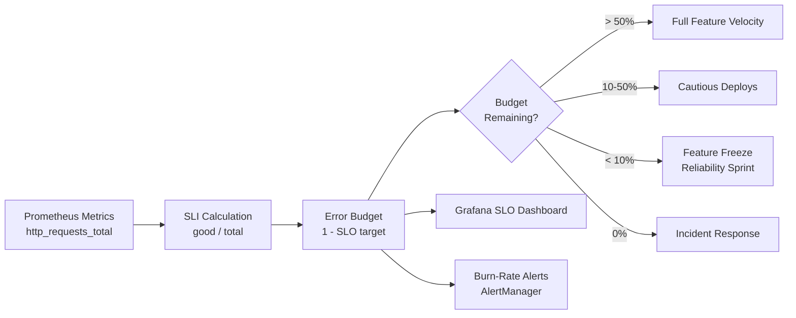

# SLIs, SLOs & Error Budgets

## Category

**Domain:** Observability · **Stack:** Prometheus, Grafana, Python · **Scope:** Service Reliability Targets

---

## Context

SLOs (Service Level Objectives) transform vague reliability expectations ("the service should be fast") into **precise, measurable targets** that align engineering with business objectives. They create a shared language between product, engineering, and operations — and enable objective, data-driven decisions about risk and reliability investment.

### SLI → SLO → SLA Hierarchy

| Term | Definition | Example |
|------|-----------|---------|
| **SLI** (Indicator) | A metric that measures service behaviour | Request success rate |
| **SLO** (Objective) | A target for the SLI over a time window | 99.9% success rate over 30 days |
| **SLA** (Agreement) | Legal/contractual commitment — subset of SLO | 99.5% uptime in contract |
| **Error Budget** | `1 - SLO target` — the allowed unreliability | 0.1% = 43.2 minutes/month |

### Common SLI Types

| SLI Type | Metric | SLO Example |
|---------|--------|------------|
| **Availability** | `good_requests / total_requests` | ≥ 99.9% |
| **Latency** | `requests_under_threshold / total` | 95% of requests < 200ms |
| **Throughput** | `successful_events_per_second` | ≥ 1000 events/s |
| **Freshness** | `age_of_newest_record_seconds` | < 60 seconds |
| **Correctness** | `valid_responses / total_responses` | ≥ 99.99% |

### Error Budget Policy

| Budget Remaining | Allowed Action |
|-----------------|---------------|
| > 50% | Full feature velocity |
| 25–50% | Monitor closely; no risky deploys |
| 10–25% | Freeze risky feature deploys; investigate |
| < 10% | Reliability sprint; halt all non-critical releases |
| 0% (burn complete) | Incident response; SLA breach risk |

---

## Pros

- Error budget objectively arbitrates reliability vs feature velocity debates
- SLOs force teams to define "good enough" — avoiding over-engineering for unnecessary reliability
- Burn-rate alerting (see pattern 06) gives early warning before SLO breach
- Multi-window SLOs distinguish brief spikes (ignore) from sustained degradation (page)
- SLO-based incident severity is objective — no more "is this an incident?" debates

## Cons

- SLIs require careful definition — wrong metric leads to "green SLO but broken product"
- 99.9% sounds achievable but equals only 43 minutes of downtime/month — teams often underestimate
- Error budget policies require organisational commitment to actually halt features
- SLOs must be reviewed as traffic patterns change — static thresholds drift out of relevance
- Implementing multi-window burn-rate alerts is mathematically complex (see pattern 06)

---

## Design Diagram



---

## Code Sample

### YAML — Prometheus SLO Recording Rules

```yaml
# prometheus/rules/slo-order-api.yaml
# SLO: 99.9% of requests succeed, 95% complete in < 300ms (30d window)
groups:
  - name: slo:order-api:availability
    rules:
      # SLI: ratio of successful requests (2xx, 3xx, 4xx counted as "good"; 5xx = bad)
      - record: slo:http_request_success:ratio_rate5m
        expr: |
          sum(rate(http_requests_total{job="order-api", status_code!~"5.."}[5m]))
          /
          sum(rate(http_requests_total{job="order-api"}[5m]))

      # 30-day availability SLI (used for error budget calculation)
      - record: slo:http_request_success:ratio_rate30d
        expr: |
          sum(rate(http_requests_total{job="order-api", status_code!~"5.."}[30d]))
          /
          sum(rate(http_requests_total{job="order-api"}[30d]))

  - name: slo:order-api:latency
    rules:
      # Latency SLI: fraction of requests completing in < 300ms
      - record: slo:http_request_latency_300ms:ratio_rate5m
        expr: |
          sum(rate(http_request_duration_seconds_bucket{job="order-api", le="0.3"}[5m]))
          /
          sum(rate(http_request_duration_seconds_count{job="order-api"}[5m]))

  - name: slo:order-api:error-budget
    rules:
      # Error budget remaining (1 = full, 0 = exhausted)
      - record: slo:error_budget_remaining:availability
        expr: |
          (slo:http_request_success:ratio_rate30d - 0.999) / (1 - 0.999)

      # Minutes of error budget remaining this month
      - record: slo:error_budget_remaining_minutes:availability
        expr: |
          slo:error_budget_remaining:availability * (30 * 24 * 60) * (1 - 0.999)
```

### Python — Error Budget Calculator

```python
# scripts/slo/error_budget_calculator.py
"""
Calculates error budget status from Prometheus metrics.
Outputs current burn rate, budget remaining, and time-to-exhaustion.
"""
import requests
from dataclasses import dataclass
from datetime import datetime, UTC

PROMETHEUS_URL = "http://prometheus.observability.svc.cluster.local:9090"
SLO_TARGET     = 0.999   # 99.9%
WINDOW_MINUTES = 30 * 24 * 60  # 30 days in minutes


@dataclass
class ErrorBudgetStatus:
    sli_30d: float
    error_budget_total_minutes: float
    error_budget_used_minutes: float
    error_budget_remaining_minutes: float
    budget_remaining_pct: float
    burn_rate_1h: float
    ttx_hours: float | None  # time to exhaustion


def query(expr: str) -> float:
    resp = requests.get(f"{PROMETHEUS_URL}/api/v1/query", params={"query": expr}, timeout=10)
    resp.raise_for_status()
    data = resp.json()["data"]["result"]
    return float(data[0]["value"][1]) if data else 0.0


def calculate_error_budget(job: str = "order-api") -> ErrorBudgetStatus:
    sli_30d   = query(f'slo:http_request_success:ratio_rate30d{{job="{job}"}}')
    sli_1h    = query(f'sum(rate(http_requests_total{{job="{job}",status_code!~"5.."}}[1h])) / sum(rate(http_requests_total{{job="{job}"}}[1h]))')

    error_rate_30d = 1 - sli_30d
    budget_total   = (1 - SLO_TARGET) * WINDOW_MINUTES
    budget_used    = error_rate_30d * WINDOW_MINUTES
    budget_remaining = budget_total - budget_used
    budget_pct     = budget_remaining / budget_total * 100 if budget_total > 0 else 0

    # Burn rate: how fast depleting budget relative to ideal rate
    # Ideal rate = 1.0 (using exactly 1 budget unit per window unit)
    error_rate_1h = 1 - sli_1h
    burn_rate_1h  = error_rate_1h / (1 - SLO_TARGET) if SLO_TARGET < 1 else 0

    # Time to exhaustion at current burn rate
    ttx = None
    if burn_rate_1h > 0 and budget_remaining > 0:
        ttx = budget_remaining / (burn_rate_1h * (1 - SLO_TARGET) * 60)  # hours

    return ErrorBudgetStatus(
        sli_30d=sli_30d,
        error_budget_total_minutes=budget_total,
        error_budget_used_minutes=budget_used,
        error_budget_remaining_minutes=budget_remaining,
        budget_remaining_pct=budget_pct,
        burn_rate_1h=burn_rate_1h,
        ttx_hours=ttx,
    )


def main() -> None:
    status = calculate_error_budget()

    print(f"SLO Target:             {SLO_TARGET * 100:.3f}%")
    print(f"SLI (30d):              {status.sli_30d * 100:.4f}%")
    print(f"Error budget (total):   {status.error_budget_total_minutes:.1f} min ({status.error_budget_total_minutes / 60:.2f} hr)")
    print(f"Error budget (used):    {status.error_budget_used_minutes:.1f} min")
    print(f"Error budget (left):    {status.error_budget_remaining_minutes:.1f} min  ({status.budget_remaining_pct:.1f}%)")
    print(f"Burn rate (1h):         {status.burn_rate_1h:.2f}×")
    if status.ttx_hours is not None:
        print(f"Time to exhaustion:     {status.ttx_hours:.1f} h")
    else:
        print("Time to exhaustion:     N/A (within budget)")


if __name__ == "__main__":
    main()
```

### Terraform — Grafana SLO Panel

```hcl
# finops/grafana-slo-dashboard.tf — simplified panel config via Grafana provider
# Full dashboard in pattern 07; this snippet shows the error budget panel

resource "grafana_dashboard" "slo" {
  provider = grafana.ops
  folder   = grafana_folder.slo.uid
  config_json = jsonencode({
    title = "SLO — Order API"
    panels = [
      {
        title   = "Error Budget Remaining %"
        type    = "gauge"
        gridPos = { x = 0, y = 0, w = 6, h = 8 }
        options = {
          reduceOptions = { calcs = ["lastNotNull"] }
          thresholds = {
            steps = [
              { color = "red",    value = 0 },
              { color = "orange", value = 10 },
              { color = "yellow", value = 25 },
              { color = "green",  value = 50 },
            ]
          }
        }
        targets = [
          {
            expr = "(slo:error_budget_remaining:availability) * 100"
            legendFormat = "Budget %"
          }
        ]
      }
    ]
  })
}
```
