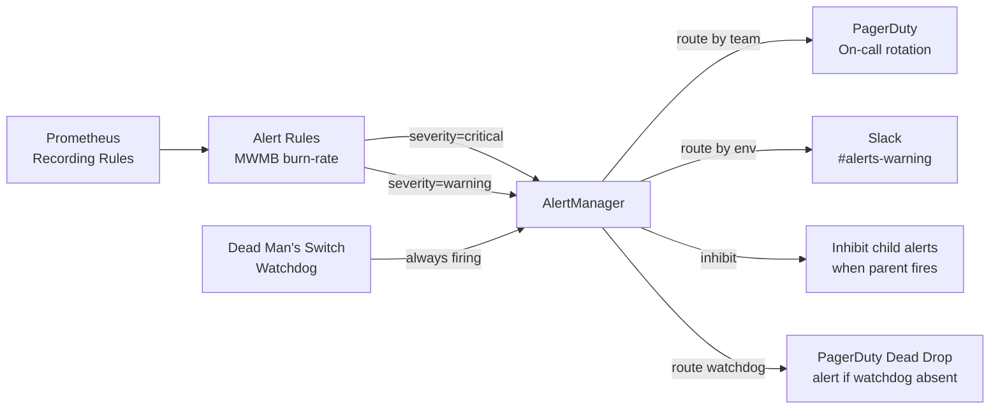

# SLO-Based Alerting & Burn Rate

## Category

**Domain:** Observability · **Stack:** Prometheus, AlertManager, PagerDuty · **Scope:** Actionable, Low-Noise Alerting

---

## Context

Traditional threshold alerts ("error rate > 1%") generate noise and miss slow-burning problems. **Multi-window, multi-burn-rate (MWMB) alerting** — the approach from Google's SRE Workbook — alerts based on how fast the error budget is being depleted, using two windows to distinguish **urgent** (fast burn, page now) from **warning** (slow burn, ticket soon).

### Burn Rate Explained

A burn rate of **1× means** the error budget depletes at exactly the rate assumed by the SLO window. A burn rate of **14×** means the entire monthly error budget will be gone in 2.2 hours if the current failure rate continues.

$$\text{burn\_rate} = \frac{\text{current\_error\_rate}}{1 - \text{SLO\_target}}$$

### MWMB Alert Thresholds (Google SRE Workbook)

| Severity | Short Window | Long Window | Burn Rate | Error Budget Consumed |
|----------|-------------|------------|-----------|----------------------|
| **Page** | 5 min | 1 hour | > 14× | 2% in 1h (exhausts in ~2h) |
| **Page** | 30 min | 6 hours | > 6× | 5% in 6h (exhausts in ~5h) |
| **Ticket** | 2 hours | 1 day | > 3× | 10% in 1d |
| **Ticket** | 6 hours | 3 days | > 1× | Slow budget drain |

---

## Pros

- Multi-burn-rate alerts catch both acute failures (PagerDuty immediately) and subtle degradation (ticket)
- Two-window approach prevents false positives from brief spikes that resolve within minutes
- Burn-rate threshold means alerts automatically scale with traffic — no manual tuning as load grows
- Dead man's switch (Watchdog alert) catches total observability failures
- AlertManager routing allows team-specific paging rules, business-hours escalation, and inhibition

## Cons

- More complex alert math than simple thresholds — requires team education
- Burn-rate alerts require a healthy Prometheus with recording rules pre-computed
- AlertManager routing config can become unwieldy as team count grows
- If the SLO target is set too high (e.g. 99.999%), burn-rate alerts fire constantly from normal variance
- Dead man's switch alerts require a separate alerting channel to avoid being silenced with everything else

---

## Design Diagram



---

## Code Sample

### YAML — Multi-Window Burn-Rate Alert Rules

```yaml
# prometheus/rules/slo-burn-rate-alerts.yaml
# Multi-window, multi-burn-rate alerts per Google SRE Workbook (Chapter 5)
# Requires: recording rules from 05-sli-slo-error-budgets.md

groups:
  - name: slo:order-api:availability:alerts
    rules:
      # PAGE — Fast burn: >14x burn rate detected in BOTH 5m and 1h windows
      - alert: OrderApiAvailabilityFastBurn
        expr: |
          (
            (1 - sum(rate(http_requests_total{job="order-api", status_code!~"5.."}[5m])) / sum(rate(http_requests_total{job="order-api"}[5m])))
            / (1 - 0.999) > 14
          )
          and
          (
            (1 - sum(rate(http_requests_total{job="order-api", status_code!~"5.."}[1h])) / sum(rate(http_requests_total{job="order-api"}[1h])))
            / (1 - 0.999) > 14
          )
        for: 2m
        labels:
          severity: critical
          team: payments
          slo: availability
        annotations:
          summary: "Order API availability SLO fast burn (>14x)"
          description: "Error rate burning error budget at >14x normal rate. Budget exhausts in ~2h at this rate."
          runbook: "https://wiki.internal/runbooks/order-api-slo-critical"
          dashboard: "https://grafana.internal/d/order-api-slo"

      # PAGE — Moderate burn: >6x burn rate in 30m and 6h windows
      - alert: OrderApiAvailabilityModerateBurn
        expr: |
          (
            (1 - sum(rate(http_requests_total{job="order-api", status_code!~"5.."}[30m])) / sum(rate(http_requests_total{job="order-api"}[30m])))
            / (1 - 0.999) > 6
          )
          and
          (
            (1 - sum(rate(http_requests_total{job="order-api", status_code!~"5.."}[6h])) / sum(rate(http_requests_total{job="order-api"}[6h])))
            / (1 - 0.999) > 6
          )
        for: 15m
        labels:
          severity: critical
          team: payments
        annotations:
          summary: "Order API availability SLO moderate burn (>6x)"
          description: "Error budget depleting at 6x rate. Budget exhausts in ~5h if unchanged."

      # TICKET — Slow burn: >3x burn rate in 2h and 1d windows
      - alert: OrderApiAvailabilitySlowBurn
        expr: |
          (
            (1 - sum(rate(http_requests_total{job="order-api", status_code!~"5.."}[2h])) / sum(rate(http_requests_total{job="order-api"}[2h])))
            / (1 - 0.999) > 3
          )
          and
          (
            (1 - sum(rate(http_requests_total{job="order-api", status_code!~"5.."}[1d])) / sum(rate(http_requests_total{job="order-api"}[1d])))
            / (1 - 0.999) > 3
          )
        for: 1h
        labels:
          severity: warning
          team: payments
        annotations:
          summary: "Order API slow error budget burn (>3x)"
          description: "Create a ticket to investigate — error budget eroding but not immediately critical."

      # Dead Man's Switch — always-firing alert proves alerting pipeline is alive
      - alert: Watchdog
        expr: vector(1)
        labels:
          severity: none
        annotations:
          summary: "Alerting pipeline is alive"
          description: "This alert is always firing. If you stop receiving it, alerting is broken."
```

### YAML — AlertManager Routing Configuration

```yaml
# alertmanager/alertmanager.yml
global:
  resolve_timeout: 5m
  slack_api_url: ""   # set via secret

templates:
  - /etc/alertmanager/templates/*.tmpl

route:
  receiver: default-slack
  group_by: [alertname, team, namespace]
  group_wait:      10s
  group_interval:  5m
  repeat_interval: 4h

  routes:
    # Critical alerts → PagerDuty immediately
    - match:
        severity: critical
      receiver: pagerduty-critical
      continue: true  # also send to team Slack

    # Team-specific routing
    - match:
        team: payments
      receiver: slack-payments

    - match:
        team: platform
      receiver: slack-platform

    # Watchdog → dedicated dead-man's-switch channel
    - match:
        alertname: Watchdog
      receiver: watchdog-pagerduty
      repeat_interval: 1m   # must arrive every minute or PagerDuty fires

    # Inhibit: if a cluster-level alert fires, suppress pod-level alerts
    inhibit_rules:
      - source_match:
          alertname: KubeNodeNotReady
        target_match_re:
          alertname: "Pod.*"
        equal: [namespace]

receivers:
  - name: default-slack
    slack_configs:
      - channel: "#alerts-all"
        send_resolved: true
        title: '{{ template "slack.title" . }}'
        text:  '{{ template "slack.body" . }}'

  - name: pagerduty-critical
    pagerduty_configs:
      - routing_key: ""   # set via env / secret manager
        severity: '{{ if eq .CommonLabels.severity "critical" }}critical{{ else }}warning{{ end }}'

  - name: slack-payments
    slack_configs:
      - channel: "#team-payments-alerts"
        send_resolved: true

  - name: watchdog-pagerduty
    pagerduty_configs:
      - routing_key: ""   # separate watchdog service in PagerDuty
```

### YAML — AlertManager Slack Message Template

```yaml
# alertmanager/templates/slack.tmpl
{{ define "slack.title" -}}
{{ if eq .Status "firing" }}🔥{{ else }}✅{{ end }} [{{ .CommonLabels.severity | toUpper }}] {{ .CommonAnnotations.summary }}
{{- end }}

{{ define "slack.body" -}}
*Alert:* {{ .CommonAnnotations.summary }}
*Severity:* `{{ .CommonLabels.severity }}`
*Team:* {{ .CommonLabels.team }}
*Description:* {{ .CommonAnnotations.description }}
{{ if .CommonAnnotations.runbook }}*Runbook:* <{{ .CommonAnnotations.runbook }}|Open>{{ end }}
{{ if .CommonAnnotations.dashboard }}*Dashboard:* <{{ .CommonAnnotations.dashboard }}|Open>{{ end }}
*Firing since:* {{ (.Alerts.Firing | first).StartsAt.Format "2006-01-02 15:04 UTC" }}
{{- end }}
```
