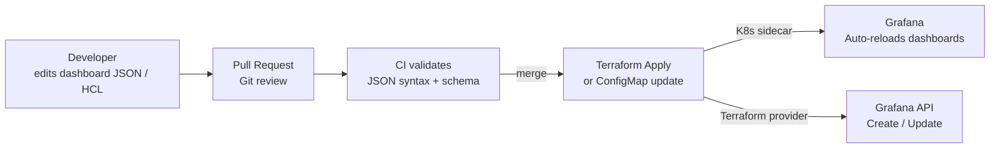

# Grafana Dashboards as Code

## Category

**Domain:** Observability · **Stack:** Grafana, Terraform, Grafonnet · **Scope:** Dashboard Version Control & Provisioning

---

## Context

Dashboards created in the Grafana UI are fragile: they live in the database, drift between environments, and are lost when the cluster is rebuilt. **Dashboards as code** treats dashboard JSON as a first-class artefact — stored in Git, reviewed in PRs, deployed via CI/CD, and replicated identically across staging and production.

### Approaches

| Approach | Tooling | Best For |
|----------|---------|---------|
| **Raw JSON + ConfigMap** | kubectl / Helm | Simple provisioning, full control |
| **Terraform Grafana provider** | `grafana/grafana` provider | IaC-first teams, co-located with infra |
| **Grafonnet** (Jsonnet library) | Tanka / jsonnet CLI | Complex dashboards, DRY panels |
| **Grafana Grizzly** | `grr` CLI | Developer-friendly push/pull workflow |
| **Grafana Operator (K8s)** | `GrafanaDashboard` CRD | GitOps-native, ArgoCD-compatible |

---

## Pros

- Dashboards survive cluster rebuilds and Grafana upgrades — always recoverable from Git
- PR review for dashboard changes catches mistakes before production visibility is affected
- ConfigMap-based provisioning with `sidecar.dashboards.enabled=true` auto-loads dashboards without restarts
- Terraform variables enable multi-environment dashboards (dev/staging/prod datasources)
- Grafonnet eliminates copy-paste across similar panels with reusable Jsonnet functions

## Cons

- Raw Grafana JSON is verbose and hard to review (3000-line JSON diffs for minor changes)
- Grafonnet has a learning curve — Jsonnet is unfamiliar to most engineers
- Terraform Grafana provider requires API key or service account — adds secret management overhead
- Automated provisioning doesn't support all Grafana features (some require UI-only config)
- Dashboards provisioned from files are read-only in the UI by default — blocks quick edits

---

## Design Diagram



---

## Code Sample

### HCL — Terraform Grafana Dashboard (RED Metrics)

```hcl
# observability/grafana-red-dashboard.tf

terraform {
  required_providers {
    grafana = {
      source  = "grafana/grafana"
      version = "~> 2.0"
    }
  }
}

provider "grafana" {
  url  = var.grafana_url
  auth = var.grafana_service_account_token   # Grafana service account token (not user password)
}

resource "grafana_folder" "services" {
  title = "Services"
}

resource "grafana_dashboard" "order_api_red" {
  folder      = grafana_folder.services.uid
  config_json = jsonencode(local.order_api_dashboard)
}

locals {
  datasource  = "Prometheus"
  job         = "order-api"

  order_api_dashboard = {
    title       = "Order API — RED Metrics"
    schemaVersion = 38
    refresh     = "30s"
    time        = { from = "now-1h", to = "now" }

    templating = {
      list = [
        {
          name    = "namespace"
          type    = "query"
          datasource = local.datasource
          query   = "label_values(http_requests_total{job=\"${local.job}\"}, namespace)"
          refresh = 2
          multi   = false
        }
      ]
    }

    panels = [
      # Request rate panel
      {
        id      = 1
        title   = "Request Rate (req/s)"
        type    = "timeseries"
        gridPos = { x = 0, y = 0, w = 8, h = 8 }
        targets = [
          {
            datasource = local.datasource
            expr       = "sum(rate(http_requests_total{job=\"${local.job}\", namespace=\"$namespace\"}[5m])) by (route)"
            legendFormat = "{{route}}"
          }
        ]
      },
      # Error rate panel
      {
        id      = 2
        title   = "Error Rate (%)"
        type    = "timeseries"
        gridPos = { x = 8, y = 0, w = 8, h = 8 }
        fieldConfig = {
          defaults = {
            unit    = "percentunit"
            thresholds = {
              steps = [
                { color = "green",  value = null },
                { color = "orange", value = 0.01 },
                { color = "red",    value = 0.05 },
              ]
            }
          }
        }
        targets = [
          {
            datasource = local.datasource
            expr       = "sum(rate(http_requests_total{job=\"${local.job}\", status_code=~\"5..\"}[5m])) / sum(rate(http_requests_total{job=\"${local.job}\"}[5m]))"
            legendFormat = "error rate"
          }
        ]
      },
      # p99 latency panel
      {
        id      = 3
        title   = "p99 Latency (s)"
        type    = "timeseries"
        gridPos = { x = 16, y = 0, w = 8, h = 8 }
        targets = [
          {
            datasource = local.datasource
            expr       = "histogram_quantile(0.99, sum(rate(http_request_duration_seconds_bucket{job=\"${local.job}\", namespace=\"$namespace\"}[5m])) by (le, route))"
            legendFormat = "p99 {{route}}"
          }
        ]
      }
    ]
  }
}
```

### YAML — Grafana Dashboard ConfigMap (K8s Sidecar Provisioning)

```yaml
# k8s/grafana/dashboards/order-api.yaml
# Grafana sidecar auto-discovers ConfigMaps with label grafana_dashboard: "1"

apiVersion: v1
kind: ConfigMap
metadata:
  name: order-api-dashboard
  namespace: observability
  labels:
    grafana_dashboard: "1"     # picked up by grafana sidecar
    grafana_folder: "Services"
data:
  order-api.json: |
    {
      "title": "Order API",
      "schemaVersion": 38,
      "refresh": "30s",
      "panels": [
        {
          "id": 1,
          "title": "Request Rate",
          "type": "timeseries",
          "gridPos": {"x": 0, "y": 0, "w": 12, "h": 8},
          "targets": [
            {
              "expr": "sum(rate(http_requests_total{job=\"order-api\"}[5m]))",
              "legendFormat": "req/s"
            }
          ]
        }
      ]
    }
```

### Jsonnet — Grafonnet Panel Library (Reusable)

```jsonnet
// lib/panels.libsonnet — reusable Grafonnet panel helpers
// Requires: jsonnet + github.com/grafana/grafonnet

local g = import 'github.com/grafana/grafonnet/gen/grafonnet-latest/main.libsonnet';

{
  // Rate panel for any job
  ratePanel(title, job, window='5m', gridPos={ x: 0, y: 0, w: 8, h: 8 }):
    g.panel.timeSeries.new(title)
    + g.panel.timeSeries.gridPos.withH(gridPos.h)
    + g.panel.timeSeries.gridPos.withW(gridPos.w)
    + g.panel.timeSeries.gridPos.withX(gridPos.x)
    + g.panel.timeSeries.gridPos.withY(gridPos.y)
    + g.panel.timeSeries.queryOptions.withTargets([
        g.query.prometheus.new(
          'Prometheus',
          'sum(rate(http_requests_total{job="%s"}[%s])) by (route)' % [job, window]
        )
        + g.query.prometheus.withLegendFormat('{{route}}'),
      ]),

  // Error rate panel
  errorRatePanel(title, job, gridPos={ x: 8, y: 0, w: 8, h: 8 }):
    g.panel.timeSeries.new(title)
    + g.panel.timeSeries.gridPos.withH(gridPos.h)
    + g.panel.timeSeries.gridPos.withW(gridPos.w)
    + g.panel.timeSeries.gridPos.withX(gridPos.x)
    + g.panel.timeSeries.gridPos.withY(gridPos.y)
    + g.panel.timeSeries.standardOptions.withUnit('percentunit')
    + g.panel.timeSeries.queryOptions.withTargets([
        g.query.prometheus.new(
          'Prometheus',
          |||
            sum(rate(http_requests_total{job="%s", status_code=~"5.."}[5m]))
            /
            sum(rate(http_requests_total{job="%s"}[5m]))
          ||| % [job, job]
        )
        + g.query.prometheus.withLegendFormat('error rate'),
      ]),
}
```

### YAML — GitHub Actions: Validate & Deploy Dashboards

```yaml
# .github/workflows/grafana-dashboards.yml
name: Grafana Dashboards CI/CD

on:
  push:
    paths:
      - 'observability/dashboards/**'
      - 'observability/grafana-*.tf'
  pull_request:
    paths:
      - 'observability/dashboards/**'

permissions:
  contents: read

jobs:
  validate:
    runs-on: ubuntu-latest
    steps:
      - uses: actions/checkout@v4

      - name: Validate dashboard JSON syntax
        run: |
          find observability/dashboards -name '*.json' | while read f; do
            echo "Validating $f"
            python3 -c "import json,sys; json.load(open('$f'))" || exit 1
          done

      - name: Check required dashboard fields
        run: |
          find observability/dashboards -name '*.json' | while read f; do
            title=$(python3 -c "import json; d=json.load(open('$f')); print(d.get('title','MISSING'))")
            if [[ "$title" == "MISSING" ]]; then
              echo "Missing title in $f"; exit 1
            fi
          done

  deploy:
    if: github.ref == 'refs/heads/main'
    needs: validate
    runs-on: ubuntu-latest
    steps:
      - uses: actions/checkout@v4

      - uses: hashicorp/setup-terraform@v3
        with:
          terraform_version: "1.7.x"

      - name: Terraform apply dashboards
        env:
          TF_VAR_grafana_url: ${{ secrets.GRAFANA_URL }}
          TF_VAR_grafana_service_account_token: ${{ secrets.GRAFANA_TOKEN }}
        run: |
          cd observability
          terraform init
          terraform apply -target=grafana_dashboard.order_api_red -auto-approve
```
