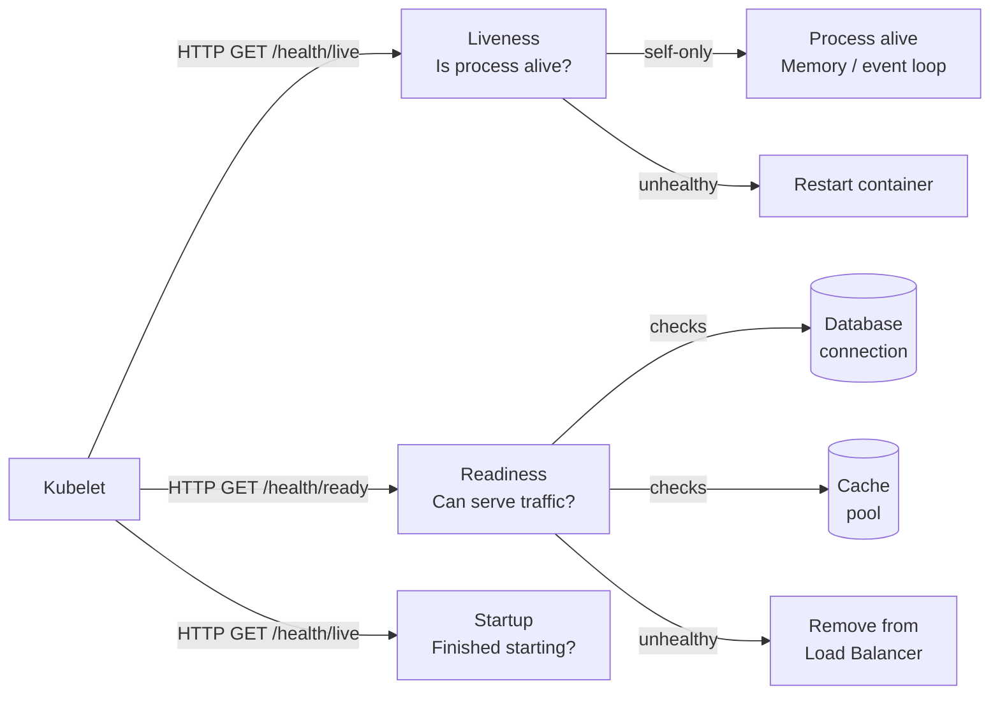

# Health Checks & Readiness Probes

## Category

**Domain:** Observability · **Stack:** Kubernetes, Node.js, Python · **Scope:** Service Availability Signalling

---

## Context

Health checks communicate a service's current state to orchestrators (Kubernetes, load balancers, service meshes). Kubernetes has three distinct probe types, each serving a different purpose. Misconfigured probes cause **production outages** — either by killing healthy pods or keeping broken pods in service.

### Kubernetes Probe Types

| Probe | Purpose | On Failure |
|-------|---------|-----------|
| **Liveness** | "Is this pod alive?" — detect stuck/deadlocked processes | Container restarted |
| **Readiness** | "Can this pod serve traffic?" — dependency checks | Removed from load balancer (no traffic) |
| **Startup** | "Has this pod finished starting?" — delays liveness until ready | Container restarted if not ready by deadline |

### Common Mistakes

| Mistake | Consequence |
|---------|------------|
| Liveness checks external dependencies (DB, downstream APIs) | DB outage → all pods restart → cascading failures |
| Readiness check never goes unhealthy | Broken pods receive traffic forever |
| No startup probe on slow-starting apps | Liveness kills pod before it finishes initialising |
| Health endpoint does expensive work | Probe timeout → false positive restarts |
| No `/health/live` vs `/health/ready` split | Can't distinguish "pod broken" from "dependency down" |

---

## Pros

- Readiness probe separates "pod is running" from "pod can serve requests" — critical for safe deployments
- Startup probe allows generous startup time without setting a high `initialDelaySeconds` on liveness
- Deep health checks on `/ready` catch misconfiguration (missing env vars, failed DB connection) before traffic arrives
- Health check endpoints can export structured JSON for debugging and monitoring
- Service mesh (Istio/Linkerd) respects readiness — no traffic until pod is truly ready

## Cons

- Liveness probes checking external dependencies can trigger cascading pod restarts during dependency outages
- Readiness probes that are too aggressive (short timeout, strict checks) cause premature traffic removal
- Health endpoint must be fast (< 1s) — slow checks cause false probe failures under load
- Liveness probe killing a looping init container hides the root cause of the initial failure
- Startup probe deadline must be longer than the worst-case cold start (JVM: 60s+; Node.js: 5–10s)

---

## Design Diagram



---

## Code Sample

### TypeScript — Health Endpoint (Express)

```typescript
// src/health/health-router.ts
import { Router, Request, Response } from 'express';
import { Pool } from 'pg';
import { createClient } from 'redis';

export function createHealthRouter(
  db: Pool,
  redis: ReturnType<typeof createClient>,
): Router {
  const router = Router();

  // Liveness — only checks internal process health (never external dependencies)
  // Fast: should complete in < 50ms
  router.get('/health/live', (_req: Request, res: Response) => {
    res.status(200).json({ status: 'alive', timestamp: new Date().toISOString() });
  });

  // Readiness — checks all dependencies needed to serve traffic
  router.get('/health/ready', async (_req: Request, res: Response) => {
    const checks: Record<string, { status: 'ok' | 'fail'; latencyMs?: number; error?: string }> = {};
    let isReady = true;

    // Database check
    const dbStart = Date.now();
    try {
      await db.query('SELECT 1');
      checks.database = { status: 'ok', latencyMs: Date.now() - dbStart };
    } catch (err) {
      checks.database = { status: 'fail', error: (err as Error).message };
      isReady = false;
    }

    // Redis check
    const redisStart = Date.now();
    try {
      await redis.ping();
      checks.redis = { status: 'ok', latencyMs: Date.now() - redisStart };
    } catch (err) {
      checks.redis = { status: 'fail', error: (err as Error).message };
      isReady = false;
    }

    const statusCode = isReady ? 200 : 503;
    res.status(statusCode).json({
      status: isReady ? 'ready' : 'not-ready',
      checks,
      timestamp: new Date().toISOString(),
    });
  });

  // Startup — same as readiness during init; Kubernetes uses this probe only until app is ready
  router.get('/health/startup', async (req: Request, res: Response) => {
    // Delegate to readiness logic during startup phase
    return router.handle(
      { ...req, url: '/health/ready' } as Request,
      res,
      () => {},
    );
  });

  return router;
}
```

### Python — Health Endpoint (FastAPI)

```python
# src/health/router.py
from fastapi import APIRouter, Response
from sqlalchemy.ext.asyncio import AsyncEngine
from redis.asyncio import Redis
import time

router = APIRouter()


async def check_database(engine: AsyncEngine) -> dict:
    start = time.monotonic()
    try:
        async with engine.connect() as conn:
            await conn.execute("SELECT 1")
        return {"status": "ok", "latency_ms": round((time.monotonic() - start) * 1000)}
    except Exception as exc:
        return {"status": "fail", "error": str(exc)}


async def check_redis(redis: Redis) -> dict:
    start = time.monotonic()
    try:
        await redis.ping()
        return {"status": "ok", "latency_ms": round((time.monotonic() - start) * 1000)}
    except Exception as exc:
        return {"status": "fail", "error": str(exc)}


def register_health_routes(app, engine: AsyncEngine, redis: Redis) -> None:
    @app.get("/health/live", tags=["health"])
    async def liveness():
        # Self-only: never check external dependencies here
        return {"status": "alive"}

    @app.get("/health/ready", tags=["health"])
    async def readiness(response: Response):
        db_result    = await check_database(engine)
        redis_result = await check_redis(redis)

        all_ok = db_result["status"] == "ok" and redis_result["status"] == "ok"
        response.status_code = 200 if all_ok else 503

        return {
            "status": "ready" if all_ok else "not-ready",
            "checks": {
                "database": db_result,
                "redis":    redis_result,
            },
        }
```

### YAML — Kubernetes Probe Configuration

```yaml
# k8s/apps/order-api-deployment.yaml — probe best-practice configuration
apiVersion: apps/v1
kind: Deployment
metadata:
  name: order-api
spec:
  template:
    spec:
      containers:
        - name: order-api
          image: myregistry/order-api:1.2.3
          ports:
            - containerPort: 3000

          # Startup probe: generous window for app to finish init
          # Kubernetes tries (failureThreshold × periodSeconds) = 30 × 5s = 150s before giving up
          startupProbe:
            httpGet:
              path: /health/ready
              port: 3000
            initialDelaySeconds: 5
            periodSeconds: 5
            failureThreshold: 30
            timeoutSeconds: 3

          # Liveness: checks only the process is alive — fast, no external deps
          livenessProbe:
            httpGet:
              path: /health/live
              port: 3000
            initialDelaySeconds: 0    # startup probe guards this window
            periodSeconds: 10
            failureThreshold: 3      # restart after 30s of failure
            timeoutSeconds: 2

          # Readiness: checks all dependencies — removes from LB when degraded
          readinessProbe:
            httpGet:
              path: /health/ready
              port: 3000
            initialDelaySeconds: 0
            periodSeconds: 10
            failureThreshold: 2      # remove from LB after 20s
            successThreshold: 1      # re-add after 1 success
            timeoutSeconds: 5        # allow time for dependency checks

          # Always set resource limits to prevent OOM killing healthy pods
          resources:
            requests:
              cpu: "100m"
              memory: "256Mi"
            limits:
              cpu: "500m"
              memory: "512Mi"
```

### YAML — Blackbox Exporter Probe (External HTTP Health Check)

```yaml
# prometheus/blackbox-probes.yaml
# Use the Prometheus Blackbox Exporter to check health from outside the cluster
apiVersion: monitoring.coreos.com/v1
kind: Probe
metadata:
  name: order-api-external
  namespace: observability
spec:
  interval: 30s
  module: http_2xx     # expect HTTP 200-299 response
  prober:
    url: blackbox-exporter.observability.svc.cluster.local:9115
  targets:
    staticConfig:
      static:
        - https://api.example.com/health/ready
      labels:
        env: production
        service: order-api
```
