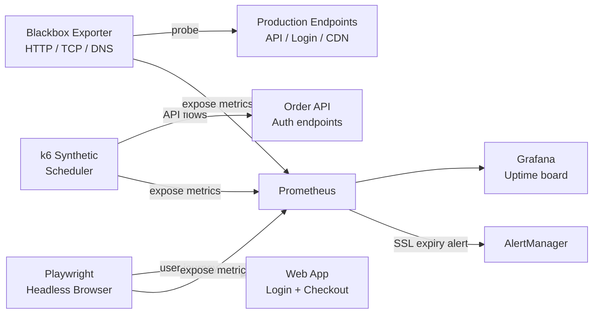

# Synthetic Monitoring

## Category

**Domain:** Observability · **Stack:** Prometheus Blackbox Exporter, Playwright, k6 · **Scope:** Proactive Availability & User Journey Testing

---

## Context

Synthetic monitoring **simulates user actions on a schedule** to detect failures before real users are affected. Unlike passive monitoring (waiting for errors to appear in metrics), synthetics actively probe endpoints, execute login flows, and complete transactions — providing **outside-in visibility** that internal metrics cannot.

### Synthetic Types

| Type | Tool | What it checks |
|------|------|---------------|
| **HTTP ping** | Blackbox Exporter | Endpoint reachability, status code, SSL expiry |
| **Multi-step API flow** | k6, Playwright | Auth → API call → assertion flow |
| **Browser journey** | Playwright (headless) | Full user login, checkout, form submission |
| **DNS check** | Blackbox Exporter | DNS resolution time, answer correctness |
| **TCP port check** | Blackbox Exporter | Service port open, TLS handshake |

### Synthetic vs Real User Monitoring

| Aspect | Synthetic | RUM (Pattern 10) |
|--------|----------|-----------------|
| Traffic | Simulated, scheduled | Real users |
| Coverage | Always-on, any time | Only when users are active |
| Detects | Availability gaps, regressions | Real user experience |
| Environment | Controlled | Variable (device, network) |

---

## Pros

- Detects outages before customers do — fires alerts at 2 AM when no users are online
- SSL certificate expiry alerting (30d, 14d, 7d) prevents unexpected HTTPS failures
- API contract testing in synthetics catches breaking changes in staging
- Blackbox Exporter is free and integrates natively with Prometheus + Grafana
- k6 synthetic scripts double as load test scripts — same code, different `vus` count

## Cons

- Synthetic traffic appears in access logs and metrics — must be filtered or labelled
- Browser-based synthetics (Playwright headless) are expensive to run at high frequency (use sparingly)
- False positives from transient network issues create alert noise — add `for: 2m` to alert rules
- Synthetic checks don't capture variability seen by real users (device, geography, CDN edge)
- Scripts require maintenance when UI or API changes — adds ongoing engineering work

---

## Design Diagram



---

## Code Sample

### YAML — Blackbox Exporter Configuration

```yaml
# blackbox-exporter/config.yml
modules:
  http_2xx:
    prober: http
    timeout: 10s
    http:
      valid_http_versions: ["HTTP/1.1", "HTTP/2.0"]
      valid_status_codes: [200, 201, 204]
      method: GET
      follow_redirects: true
      preferred_ip_protocol: ip4
      tls_config:
        insecure_skip_verify: false

  http_post_json:
    prober: http
    timeout: 10s
    http:
      method: POST
      headers:
        Content-Type: application/json
      body: '{}'
      valid_status_codes: [200, 201]

  tcp_connect:
    prober: tcp
    timeout: 5s

  dns_lookup:
    prober: dns
    timeout: 5s
    dns:
      query_name: api.example.com
      query_type: A
```

### YAML — Prometheus Scrape for Blackbox (Multiple Targets)

```yaml
# prometheus/scrape-configs/blackbox.yaml
- job_name: blackbox-http
  metrics_path: /probe
  params:
    module: [http_2xx]
  static_configs:
    - targets:
        - https://api.example.com/health/ready
        - https://api.example.com/v1/products
        - https://auth.example.com/.well-known/openid-configuration
      labels:
        env: production
  relabel_configs:
    - source_labels: [__address__]
      target_label: __param_target
    - source_labels: [__param_target]
      target_label: instance
    - target_label: __address__
      replacement: blackbox-exporter.observability.svc.cluster.local:9115
```

### YAML — Prometheus SSL Expiry Alert

```yaml
# prometheus/rules/ssl-alerts.yaml
groups:
  - name: ssl-expiry
    rules:
      - alert: SSLCertExpiresIn14Days
        expr: probe_ssl_earliest_cert_expiry - time() < 14 * 24 * 3600
        for: 1h
        labels:
          severity: warning
        annotations:
          summary: "SSL cert expiring: {{ $labels.instance }}"
          description: "Certificate for {{ $labels.instance }} expires in {{ $value | humanizeDuration }}."

      - alert: SSLCertExpiresIn7Days
        expr: probe_ssl_earliest_cert_expiry - time() < 7 * 24 * 3600
        for: 10m
        labels:
          severity: critical
        annotations:
          summary: "SSL cert CRITICAL: {{ $labels.instance }}"

      - alert: EndpointDown
        expr: probe_success == 0
        for: 2m
        labels:
          severity: critical
        annotations:
          summary: "Endpoint down: {{ $labels.instance }}"
          description: "Probe {{ $labels.module }} against {{ $labels.instance }} has been failing for 2 minutes."
```

### TypeScript — k6 Synthetic API Flow

```typescript
// synthetics/order-flow.ts
// Run: k6 run --vus 1 --iterations 1 synthetics/order-flow.ts
// Schedule: GitHub Actions every 5min, or k6 Cloud

import http from 'k6/http';
import { check, sleep } from 'k6';
import { Rate } from 'k6/metrics';

const syntheticErrors = new Rate('synthetic_errors');

export const options = {
  // Synthetic: single VU, fixed iterations (not load test)
  vus: 1,
  iterations: 1,
  thresholds: {
    http_req_failed:   ['rate<0.01'],   // alert if failure rate > 1%
    http_req_duration: ['p95<500'],     // p95 latency must be under 500ms
    synthetic_errors:  ['rate<0.01'],
  },
};

const BASE_URL = __ENV.BASE_URL ?? 'https://api.example.com';

export default function () {
  // Step 1: Authenticate
  const authRes = http.post(
    `${BASE_URL}/auth/token`,
    JSON.stringify({ grant_type: 'client_credentials' }),
    { headers: { 'Content-Type': 'application/json' } },
  );

  const authOk = check(authRes, {
    'auth status 200':       (r) => r.status === 200,
    'auth returns token':    (r) => !!r.json('access_token'),
    'auth latency < 500ms':  (r) => r.timings.duration < 500,
  });
  syntheticErrors.add(!authOk);

  if (!authOk) return;

  const token = authRes.json('access_token') as string;

  // Step 2: Create an order
  const orderRes = http.post(
    `${BASE_URL}/v1/orders`,
    JSON.stringify({ items: [{ sku: 'SYNTHETIC-001', quantity: 1 }], customerId: 'synthetic-test' }),
    { headers: { Authorization: `Bearer ${token}`, 'Content-Type': 'application/json' } },
  );

  const orderOk = check(orderRes, {
    'order status 201':      (r) => r.status === 201,
    'order has id':          (r) => !!r.json('orderId'),
    'order latency < 1s':    (r) => r.timings.duration < 1000,
  });
  syntheticErrors.add(!orderOk);

  sleep(1); // brief pause between synthetic iterations
}
```

### YAML — GitHub Actions Synthetic Schedule

```yaml
# .github/workflows/synthetics.yml
name: Synthetic Monitoring

on:
  schedule:
    - cron: "*/5 * * * *"   # every 5 minutes
  workflow_dispatch:

permissions:
  contents: none

jobs:
  k6-synthetic:
    runs-on: ubuntu-latest
    steps:
      - uses: actions/checkout@v4

      - uses: grafana/setup-k6-action@v1
        with:
          k6-version: "0.51.0"

      - name: Run synthetic order flow
        env:
          BASE_URL: ${{ secrets.PROD_API_URL }}
        run: k6 run synthetics/order-flow.ts

      - name: Alert on failure
        if: failure()
        env:
          SLACK_WEBHOOK_URL: ${{ secrets.SLACK_OPS_WEBHOOK }}
        run: |
          curl -s -X POST "$SLACK_WEBHOOK_URL" \
            -H "Content-Type: application/json" \
            -d '{"text": ":rotating_light: *Synthetic Monitor FAILED* — order-flow check failed. Check <${{ github.server_url }}/${{ github.repository }}/actions/runs/${{ github.run_id }}|run log>."}'
```
