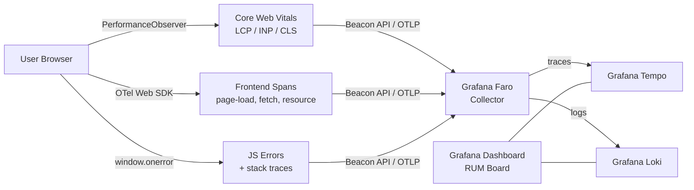

# Real User Monitoring (RUM)

## Category

**Domain:** Observability · **Stack:** OTel Web, Grafana Faro, TypeScript · **Scope:** Frontend Performance & User Experience

---

## Context

Real User Monitoring (RUM) captures **actual user experience** — page loads, interactions, errors, API calls — from real browsers on real devices and networks. Unlike synthetics (controlled tests) or backend metrics (server-side), RUM reveals the full distribution of user-perceived performance across geographies, device classes, and network conditions.

### Core Web Vitals (Google / W3C)

| Metric | What It Measures | Good | Needs Work | Poor |
|--------|-----------------|------|-----------|------|
| **LCP** — Largest Contentful Paint | Load performance: time until largest element visible | < 2.5s | 2.5–4s | > 4s |
| **INP** — Interaction to Next Paint | Responsiveness: delay from click to next frame | < 200ms | 200–500ms | > 500ms |
| **CLS** — Cumulative Layout Shift | Visual stability: unexpected layout shifts | < 0.1 | 0.1–0.25 | > 0.25 |
| **FID** — First Input Delay | First interaction delay (legacy — replaced by INP) | < 100ms | 100–300ms | > 300ms |
| **TTFB** — Time to First Byte | Server response time | < 800ms | 800ms–1.8s | > 1.8s |

### RUM Data Pipeline

| Layer | Tool | Output |
|-------|------|-------|
| **Collection** | `web-vitals` JS lib + OTel Web SDK | Spans, metrics, errors from browser |
| **Transport** | Beacon API / OTLP/HTTP | Batched, non-blocking send |
| **Aggregation** | OTel Collector / Grafana Faro | Enrichment, deduplication |
| **Storage** | Grafana Tempo (traces) + Loki (errors) | Queryable telemetry |
| **Dashboards** | Grafana | Per-page, per-device CWV boards |

---

## Pros

- Reveals real user experience — lab tests and synthetics miss slow 3G mobile users
- OTel Web traces correlate frontend spans with backend spans across the full request lifecycle
- Core Web Vitals feed directly into SEO ranking (Google Search Console uses CWV)
- Error sampling ensures critical JS exceptions are captured without drowning in noise
- Grafana Faro is open-source and self-hostable — no vendor lock-in

## Cons

- RUM data volume is large — every page load generates spans (requires sampling or aggregation)
- Privacy concerns: IP addresses, user agent, URLs may contain PII — scrub before storing
- Ad blockers, privacy extensions, and browser policies (ITP) reduce RUM data completeness
- LCP/CLS/INP measurement requires `PerformanceObserver` API — not supported in all legacy browsers
- Correlating frontend traces with backend traces requires `traceparent` header propagation through API responses

---

## Design Diagram



---

## Code Sample

### TypeScript — Core Web Vitals with OTel Web (Vite/React App)

```typescript
// src/observability/rum.ts
// Install: @opentelemetry/sdk-trace-web @opentelemetry/api web-vitals @opentelemetry/auto-instrumentations-web

import { WebTracerProvider } from '@opentelemetry/sdk-trace-web';
import { OTLPTraceExporter } from '@opentelemetry/exporter-trace-otlp-http';
import { BatchSpanProcessor } from '@opentelemetry/sdk-trace-base';
import { ZoneContextManager } from '@opentelemetry/context-zone';
import { registerInstrumentations } from '@opentelemetry/instrumentation';
import { DocumentLoadInstrumentation } from '@opentelemetry/instrumentation-document-load';
import { UserInteractionInstrumentation } from '@opentelemetry/instrumentation-user-interaction';
import { FetchInstrumentation } from '@opentelemetry/instrumentation-fetch';
import { Resource } from '@opentelemetry/resources';
import { ATTR_SERVICE_NAME } from '@opentelemetry/semantic-conventions';
import { onLCP, onINP, onCLS, onFID, onTTFB } from 'web-vitals';
import { trace, SpanStatusCode } from '@opentelemetry/api';

const FARO_ENDPOINT = import.meta.env.VITE_FARO_URL ?? '/collect';

// ---- OpenTelemetry provider ----
const provider = new WebTracerProvider({
  resource: new Resource({
    [ATTR_SERVICE_NAME]: 'checkout-frontend',
    'app.version': import.meta.env.VITE_APP_VERSION ?? '0.0.0',
    'deployment.environment': import.meta.env.MODE,
  }),
  spanProcessors: [
    new BatchSpanProcessor(
      new OTLPTraceExporter({ url: `${FARO_ENDPOINT}/v1/traces` }),
      { maxQueueSize: 512, scheduledDelayMillis: 2000 },
    ),
  ],
});

provider.register({ contextManager: new ZoneContextManager() });

registerInstrumentations({
  instrumentations: [
    new DocumentLoadInstrumentation(),    // page load timing as spans
    new UserInteractionInstrumentation({ // click events as spans
      eventNames: ['click', 'submit'],
    }),
    new FetchInstrumentation({           // outbound fetch as spans + traceparent injection
      propagateTraceHeaderCorsUrls: [/api\.example\.com/],
      clearTimingResources: true,
    }),
  ],
});

// ---- Core Web Vitals reporting ----
const tracer = trace.getTracer('rum-web-vitals');

function reportVital(name: string, value: number, rating: string): void {
  const span = tracer.startSpan(`cwv.${name.toLowerCase()}`, {
    attributes: {
      'cwv.name':   name,
      'cwv.value':  value,
      'cwv.rating': rating,   // 'good' | 'needs-improvement' | 'poor'
      'page.url':   window.location.pathname,
    },
  });
  if (rating === 'poor') {
    span.setStatus({ code: SpanStatusCode.ERROR, message: `${name} is poor: ${value}` });
  }
  span.end();
}

onLCP(({ value, rating })  => reportVital('LCP',  value, rating));
onINP(({ value, rating })  => reportVital('INP',  value, rating));
onCLS(({ value, rating })  => reportVital('CLS',  value, rating));
onTTFB(({ value, rating }) => reportVital('TTFB', value, rating));
```

### TypeScript — JavaScript Error Capture

```typescript
// src/observability/error-capture.ts
import { trace, SpanStatusCode } from '@opentelemetry/api';

const tracer = trace.getTracer('rum-errors');

export function setupErrorCapture(): void {
  // Unhandled JS errors
  window.addEventListener('error', (event) => {
    const span = tracer.startSpan('js.error.unhandled', {
      attributes: {
        'error.type':    event.error?.name ?? 'Error',
        'error.message': event.error?.message ?? event.message,
        'error.stack':   sanitizeStack(event.error?.stack ?? ''),
        'error.filename': event.filename,
        'error.lineno':  event.lineno,
        'page.url':      window.location.pathname,
      },
    });
    span.setStatus({ code: SpanStatusCode.ERROR });
    span.end();
  });

  // Unhandled promise rejections
  window.addEventListener('unhandledrejection', (event) => {
    const span = tracer.startSpan('js.error.promise', {
      attributes: {
        'error.message': String(event.reason?.message ?? event.reason),
        'error.stack':   sanitizeStack(event.reason?.stack ?? ''),
        'page.url':      window.location.pathname,
      },
    });
    span.setStatus({ code: SpanStatusCode.ERROR });
    span.end();
  });
}

// Remove absolute file paths that may contain deployment details
function sanitizeStack(stack: string): string {
  return stack.replace(/webpack:\/\/[^)]+/g, '<webpack>').substring(0, 2048);
}
```

### YAML — Grafana Faro Helm Values

```yaml
# k8s/faro/values.yaml
# helm install faro grafana/grafana-agent -f values.yaml

agent:
  configMap:
    content: |
      faro.receiver "frontend" {
        server {
          listen_address = "0.0.0.0"
          listen_port    = 12347
          cors_allowed_origins = ["https://app.example.com"]
          api_key        = env("FARO_API_KEY")
        }
        output {
          logs   = [loki.write.default.receiver]
          traces = [otelcol.exporter.otlp.default.input]
        }
      }

      loki.write "default" {
        endpoint {
          url = "http://loki.observability.svc.cluster.local/loki/api/v1/push"
        }
      }

      otelcol.exporter.otlp "default" {
        client {
          endpoint = "http://tempo.observability.svc.cluster.local:4317"
          tls { insecure = true }
        }
      }

service:
  type: ClusterIP
  port: 12347
```

### YAML — Grafana RUM Dashboard Annotations

```yaml
# Grafana LogQL queries for RUM dashboard panels

# Poor LCP (> 2500ms) by page path — last 7 days
# {service_name="checkout-frontend"} | json | cwv_name="LCP" | cwv_rating="poor"

# p75 LCP by page (Tempo TraceQL)
# { span.cwv.name="LCP" } | rate()

# JS error rate by type (Loki)
# sum(rate({service_name="checkout-frontend"} |= "js.error" | json [5m])) by (error_type)

# Poor INP events on checkout page
# {service_name="checkout-frontend"} | json | cwv_name="INP" | cwv_rating="poor" | page_url="/checkout"
```
