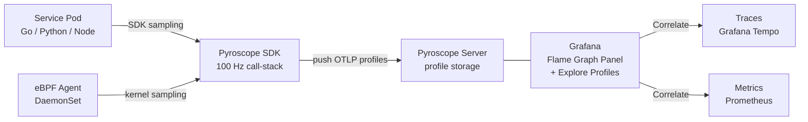

# Continuous Profiling

## Category

**Domain:** Observability · **Stack:** Pyroscope, Go pprof, TypeScript · **Scope:** CPU, Memory & Performance Profiling

---

## Context

Continuous profiling captures the call-stack performance of running services **in production, always-on**, rather than requiring developers to reproduce issues locally. It answers "which function is consuming CPU?" and "where is memory allocated?" without restarts or code changes.

### Profiling vs Other Telemetry

| Signal | What It Measures | Granularity | When to Use |
|--------|-----------------|-------------|-------------|
| **Metrics** | Aggregate resource usage (CPU %, memory MB) | Instance-level | Detect *there is a problem* |
| **Traces** | Request latency breakdown | Span-level | Find *where in a request* latency occurs |
| **Logs** | Events and errors | Event-level | Find *what* happened |
| **Profiles** | CPU cycles / memory allocations by code line | Function-level | Find *which code* is expensive |

### Profile Types

| Profile Type | Measures | Language Support |
|-------------|----------|-----------------|
| **CPU** | Time spent executing code | Go, Python, Node.js, Java |
| **Heap / Alloc** | Memory allocated / live objects | Go, Python, Node.js |
| **Goroutine / Thread** | Blocked/waiting threads | Go, Java |
| **Block / Mutex** | Lock contention | Go |
| **Wall-clock** | Elapsed time (incl. I/O waits) | Go, Python |

### Pyroscope Architecture

| Component | Role |
|-----------|------|
| **Pyroscope SDK** | Embedded in app; samples call stacks at configurable Hz |
| **Pyroscope Server** | Ingests, stores, and queries profiles |
| **Grafana Plugin** | Flame graph UI with Prometheus metric correlation |
| **Agent (eBPF)** | Zero-code CPU profiling for any process via eBPF |

---

## Pros

- Always-on profiling finds performance regressions before they become outages
- Zero instrumentation overhead: eBPF-based agent profiles any process without code changes
- Flame graphs correlate directly with Grafana dashboards via Pyroscope datasource
- Pull model (Go `net/http/pprof`) is zero-cost when not actively profiling
- Profiles scoped by labels (namespace, pod, version) enable before/after comparison on deploy

## Cons

- CPU profiling adds 1–3% CPU overhead (sampling frequency dependent)
- Profile data is large — requires storage policy and retention tuning
- Flame graphs require training to read correctly; oncall engineers may misinterpret
- Memory profiling in Node.js requires `--expose-gc` and V8 snapshot hooks — not always safe in production
- eBPF agent requires privileged containers or DaemonSet with `SYS_ADMIN` capability

---

## Design Diagram



---

## Code Sample

### Go — pprof HTTP Endpoint + Pyroscope SDK

```go
// main.go — always-on profiling via Pyroscope + on-demand via pprof HTTP
package main

import (
	"log"
	"net/http"
	_ "net/http/pprof" // registers /debug/pprof/* routes
	"os"
	"time"

	"github.com/grafana/pyroscope-go"
)

func main() {
	pyro, err := pyroscope.Start(pyroscope.Config{
		ApplicationName: "payment-service",
		ServerAddress:   os.Getenv("PYROSCOPE_URL"), // e.g. http://pyroscope:4040
		Logger:          pyroscope.StandardLogger,
		Tags: map[string]string{
			"environment": os.Getenv("ENV"),
			"version":     os.Getenv("APP_VERSION"),
		},
		ProfileTypes: []pyroscope.ProfileType{
			pyroscope.ProfileCPU,
			pyroscope.ProfileAllocObjects,
			pyroscope.ProfileAllocSpace,
			pyroscope.ProfileInuseObjects,
			pyroscope.ProfileInuseSpace,
		},
	})
	if err != nil {
		log.Fatalf("pyroscope start: %v", err)
	}
	defer pyro.Stop()

	// Expose pprof for on-demand profiling (block behind auth in production)
	go func() {
		log.Println(http.ListenAndServe(":6060", nil)) // /debug/pprof/*
	}()

	// Annotate profiles for a specific code block
	pyro.ScopedTag("operation", "order-processing", func() {
		processOrders()
	})

	http.ListenAndServe(":8080", appRouter())
}

func processOrders() {
	// Simulated work — profiled under tag operation=order-processing
	time.Sleep(10 * time.Millisecond)
}
```

### Python — Pyroscope SDK (FastAPI)

```python
# observability/profiling.py
# pip install pyroscope-io

import os
import pyroscope
from fastapi import FastAPI, Request

app = FastAPI()


def configure_profiling() -> None:
    pyroscope.configure(
        application_name="inventory-service",
        server_address=os.environ["PYROSCOPE_URL"],
        auth_token=os.environ.get("PYROSCOPE_TOKEN", ""),
        tags={
            "environment": os.environ.get("ENV", "production"),
            "region": os.environ.get("AWS_REGION", "eu-west-1"),
        },
        sample_rate=100,        # Hz — lower for less overhead
        detect_subprocesses=False,
    )


@app.on_event("startup")
async def startup() -> None:
    configure_profiling()


@app.get("/inventory/{product_id}")
async def get_inventory(product_id: str, request: Request) -> dict:
    # Tag profiles for this specific endpoint type
    with pyroscope.tag_wrapper({"endpoint": "/inventory", "method": "GET"}):
        result = await fetch_inventory(product_id)
    return result


async def fetch_inventory(product_id: str) -> dict:
    # Expensive database call — will appear in flame graph
    ...
    return {"product_id": product_id, "stock": 42}
```

### TypeScript — Node.js Heap Profiling with Clinic.js / pprof

```typescript
// src/observability/heap-profiler.ts
// Install: @datadog/pprof pyroscope-nodejs
import Pyroscope from 'pyroscope';

export function startProfiling(): void {
  Pyroscope.init({
    serverAddress: process.env.PYROSCOPE_URL ?? 'http://pyroscope:4040',
    appName: 'api-gateway',
    tags: {
      env: process.env.NODE_ENV ?? 'production',
      version: process.env.npm_package_version ?? '0.0.0',
    },
  });

  Pyroscope.start();

  // Tag specific operations for CPU attribution
  process.on('beforeExit', () => Pyroscope.stop());
}

// Use tag_wrapper for high-value flows
export async function profiledOperation<T>(
  tag: string,
  fn: () => Promise<T>,
): Promise<T> {
  return Pyroscope.wrapWithLabels({ operation: tag }, fn);
}

// Usage in request handler:
// import { profiledOperation } from './heap-profiler';
// const result = await profiledOperation('payment-processing', () => processPayment(order));
```

### YAML — Pyroscope Helm Values + eBPF DaemonSet

```yaml
# k8s/pyroscope/values.yaml
# helm install pyroscope grafana/pyroscope -f values.yaml

pyroscope:
  replicaCount: 1
  storage:
    backend: s3
    s3:
      bucket: company-pyroscope-profiles
      region: eu-west-1

  # Retention
  compactor:
    retention_enabled: true
    retention_duration: 168h  # 7 days

---
# k8s/pyroscope/ebpf-agent.yaml — zero-code profiling for all pods
apiVersion: apps/v1
kind: DaemonSet
metadata:
  name: pyroscope-ebpf-agent
  namespace: observability
spec:
  selector:
    matchLabels:
      app: pyroscope-ebpf-agent
  template:
    spec:
      hostPID: true
      tolerations:
        - operator: Exists          # run on all nodes
      containers:
        - name: agent
          image: grafana/pyroscope:latest
          args:
            - ebpf
            - --server-url=$(PYROSCOPE_URL)
            - --application-name=ebpf-all
          env:
            - name: PYROSCOPE_URL
              valueFrom:
                secretKeyRef:
                  name: pyroscope-secret
                  key: url
          securityContext:
            privileged: true        # required for eBPF
          resources:
            limits:
              cpu: 500m
              memory: 256Mi
```
