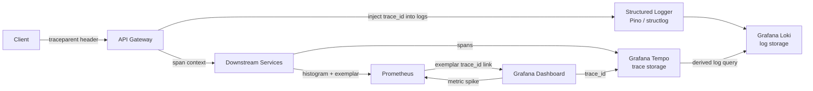

# Log–Trace Correlation & Exemplars

## Category

**Domain:** Observability · **Stack:** OpenTelemetry, Prometheus, Grafana, TypeScript · **Scope:** Cross-Signal Correlation

---

## Context

Individual telemetry signals — metrics, logs, traces — have limited value in isolation. Log–trace correlation and exemplars **link signals together** so operators can jump from a spike in an error-rate graph directly to the offending distributed trace and then to the exact log lines that explain the failure.

### Signal Correlation Map

| From | To | Mechanism | Benefit |
|------|----|-----------|---------|
| **Metric spike** | Trace | Prometheus Exemplars (trace_id in histogram) | Click metric → open trace |
| **Log line** | Trace | `trace_id` / `span_id` fields injected at log time | Search logs → find trace |
| **Trace span** | Logs | Structured query in Loki by `traceID` label | Find logs for a specific request |
| **Trace span** | Metrics | Trace-to-metrics derivation (span-metrics connector) | Find RED metrics for service |
| **Error alert** | Logs + Trace | Alert annotation links to Grafana Explore | Alert → root-cause in one click |

### OpenTelemetry Context Propagation

| Protocol | Header | Propagates |
|----------|--------|-----------|
| **W3C TraceContext** | `traceparent`, `tracestate` | trace_id, span_id, flags |
| **W3C Baggage** | `baggage` | Custom key-value metadata (user_id, tenant_id) |
| **B3 single** | `b3` | Zipkin-compatible trace context |
| **B3 multi** | `X-B3-TraceId`, `X-B3-SpanId` | Jaeger/Zipkin legacy |

---

## Pros

- Single click from P99 latency spike → distributed trace → log lines — dramatically reduces MTTR
- Exemplars require no schema changes — they embed trace IDs inside existing Prometheus histograms
- Baggage propagation makes tenant/user context automatically available in all downstream services
- Grafana Explore "split view" shows logs and traces side-by-side for any trace ID
- OTel Context API is propagation-protocol agnostic — one codebase handles W3C, B3, and custom headers

## Cons

- Exemplars must be opted into per histogram metric — not automatic unless using OTel SDK
- High-cardinality baggage (e.g., per-request URLs) bloats all downstream log records
- B3/W3C context mismatch between old services breaks end-to-end trace continuity
- Loki label cardinality spikes if `traceID` is set as a label (use structured metadata instead)
- Fetching exemplars requires Prometheus `--enable-feature=exemplar-storage` flag

---

## Design Diagram



---

## Code Sample

### TypeScript — OTel Context Injection into Pino Logs

```typescript
// src/observability/logger.ts
// Injects active trace_id + span_id into every log record automatically
import pino, { Logger } from 'pino';
import { trace, context, isSpanContextValid } from '@opentelemetry/api';

function getTraceContext(): Record<string, string> {
  const span = trace.getActiveSpan();
  if (!span) return {};
  const ctx = span.spanContext();
  if (!isSpanContextValid(ctx)) return {};
  return {
    trace_id: ctx.traceId,
    span_id:  ctx.spanId,
    trace_flags: ctx.traceFlags.toString(16),
  };
}

// Pino mixin — called on every log() invocation
export const logger: Logger = pino({
  level: process.env.LOG_LEVEL ?? 'info',
  mixin() {
    return getTraceContext();  // attach active span context to every log record
  },
  formatters: {
    level: (label) => ({ level: label }),
  },
});

// Result: every log line has:
// { "level":"info", "msg":"order created", "trace_id":"abc...", "span_id":"def..." }
```

### TypeScript — Propagating Baggage (Tenant Context)

```typescript
// src/middleware/baggage.ts
import { propagation, context, baggage } from '@opentelemetry/api';
import type { Request, Response, NextFunction } from 'express';

export function baggageMiddleware(req: Request, res: Response, next: NextFunction): void {
  // Extract incoming W3C Baggage (from API Gateway or upstream service)
  const incomingCtx = propagation.extract(context.active(), req.headers);

  // Enrich with tenant context from auth token (already validated upstream)
  const tenantId = (req as any).auth?.tenantId ?? 'unknown';
  const enriched = baggage.setBaggage(
    incomingCtx,
    baggage.createBaggage({
      'tenant.id': { value: tenantId },
      'user.id':   { value: (req as any).auth?.sub ?? 'anonymous' },
    }),
  );

  // Run remaining handlers inside enriched context
  context.with(enriched, next);
}
```

### Python — structlog with OTel Context + Baggage

```python
# observability/logger.py
import structlog
import logging
from opentelemetry import trace, baggage, context
from opentelemetry.trace import format_trace_id, format_span_id


def add_otel_context(logger, method, event_dict):
    """structlog processor: inject trace_id, span_id, and baggage values."""
    span = trace.get_current_span()
    ctx = span.get_span_context()
    if ctx and ctx.is_valid:
        event_dict["trace_id"] = format_trace_id(ctx.trace_id)
        event_dict["span_id"]  = format_span_id(ctx.span_id)

    # Inject baggage entries (tenant_id, user_id propagated from upstream)
    tenant_id = baggage.get_baggage("tenant.id", context.get_current())
    if tenant_id:
        event_dict["tenant_id"] = tenant_id
    return event_dict


structlog.configure(
    processors=[
        structlog.stdlib.add_log_level,
        structlog.stdlib.add_logger_name,
        add_otel_context,                         # injects trace context
        structlog.processors.TimeStamper(fmt="iso"),
        structlog.processors.JSONRenderer(),
    ],
    logger_factory=structlog.stdlib.LoggerFactory(),
)

log = structlog.get_logger()
# log.info("payment-processed", amount=100, currency="USD")
# → {"level":"info","trace_id":"abc...","span_id":"def...","tenant_id":"acme",...}
```

### YAML — Prometheus Exemplars Config

```yaml
# prometheus/prometheus.yml
# Enable exemplar storage (requires Prometheus >= 2.26)
# Start Prometheus with: --enable-feature=exemplar-storage

global:
  scrape_interval: 15s

# Example recording rule that uses exemplars from histograms
# Exemplars attach trace_id to a histogram observation — tools like Grafana
# display an "exemplar" marker on the graph. Clicking it opens Tempo.
storage:
  exemplars:
    max_exemplars: 100000

---
# application code (prom-client Node.js) to emit exemplars:
# histogram.observe(
#   { method: 'POST', route: '/orders', status_code: '200' },
#   duration,
#   { traceId: activeSpan.spanContext().traceId }  // exemplar
# );
```

### HCL — Grafana Tempo + Loki Derived Fields (Datasource Link)

```hcl
# terraform/grafana-datasources.tf
# Loki derived field: auto-detect trace_id in log lines → clickable link to Tempo

resource "grafana_data_source" "loki" {
  type = "loki"
  name = "Loki"
  url  = "http://loki.observability.svc.cluster.local:3100"

  json_data_encoded = jsonencode({
    derivedFields = [
      {
        matcherRegex = "trace_id=(\\w+)"   # captures trace_id from log message
        name         = "TraceID"
        url          = "$${__value.raw}"   # value is the trace_id
        datasourceUid = grafana_data_source.tempo.uid  # open in Tempo
      }
    ]
  })
}

resource "grafana_data_source" "tempo" {
  type = "tempo"
  name = "Tempo"
  url  = "http://tempo.observability.svc.cluster.local:3100"

  json_data_encoded = jsonencode({
    tracesToLogsV2 = {
      datasourceUid = grafana_data_source.loki.uid
      filterByTraceID = true
      filterBySpanID  = true
      tags            = [{ key = "service.name", value = "service_name" }]
    }
    serviceMap = {
      datasourceUid = grafana_data_source.prometheus.uid
    }
  })
}
```
