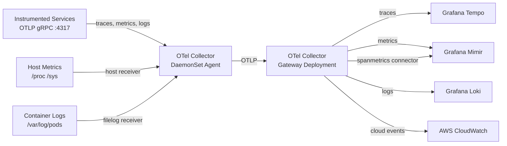

# OpenTelemetry Collector Pipeline

## Category

**Domain:** Observability · **Stack:** OTel Collector, YAML, Kubernetes · **Scope:** Telemetry Routing, Processing & Fan-out

---

## Context

The **OpenTelemetry Collector** is a vendor-agnostic proxy that receives telemetry (traces, metrics, logs, profiles) from instrumented services, applies processing transformations (batching, filtering, attribute enrichment, sampling), and exports to one or multiple backends simultaneously.

### Collector Deployment Modes

| Mode | Topology | Use Case |
|------|----------|----------|
| **Sidecar** | One collector per pod | Isolation, per-app config, simple path |
| **DaemonSet (Agent)** | One collector per node | Host-level metrics, log tailing, low resource headcount |
| **Deployment (Gateway)** | Shared cluster collector | Cross-app aggregation, secret management, fan-out |
| **Combination** | Sidecar → Gateway → Backend | Scale + isolation: sidecars forward to central gateway |

### Pipeline Stages

| Stage | Examples | Purpose |
|-------|----------|---------|
| **Receivers** | OTLP, Prometheus, Filelog, Jaeger, Zipkin | Ingest telemetry from any source |
| **Processors** | batch, memory_limiter, filter, transform, k8sattributes, resourcedetection | Modify, enrich, sample, or drop data |
| **Exporters** | OTLP (Tempo/Jaeger), Prometheus, Loki, CloudWatch, Datadog | Send data to one or many backends |
| **Extensions** | health_check, pprof, zpages | Collector own observability |
| **Connectors** | spanmetrics, servicegraph, forward | Bridge pipeline outputs back as inputs |

---

## Pros

- Single configuration point for all telemetry routing — add a backend without code changes
- `memory_limiter` processor prevents OOM crashes under telemetry bursts
- `k8sattributes` processor automatically enriches all telemetry with pod, namespace, and deployment labels
- Fan-out to multiple exporters enables side-by-side backend evaluations (Grafana vs Datadog)
- Connectors like `spanmetrics` derive RED metrics from traces without any app-side code changes

## Cons

- Collector is a critical path component — a misconfiguration can drop all telemetry; requires HA deployment
- `transform` processor DSL (OTTL) has a learning curve; mistakes silently drop fields
- Tail-based sampling (TBS) requires all spans for a trace to land on the same Collector instance — sticky routing is complex with horizontal scaling
- Log parsing in Filelog receiver is regex/json-parse DSL which requires careful tuning
- Sidecar mode multiplies resource consumption: N pods × (1 CPU + 256 Mi) for collector containers

---

## Design Diagram



---

## Code Sample

### YAML — Full OTel Collector Config (Gateway)

```yaml
# k8s/otel-collector/config.yaml
# Deployed as a ConfigMap, mounted into collector pods

receivers:
  otlp:
    protocols:
      grpc:
        endpoint: 0.0.0.0:4317
      http:
        endpoint: 0.0.0.0:4318

  # Scrape Prometheus metrics from services that cannot push
  prometheus:
    config:
      scrape_configs:
        - job_name: "legacy-metrics"
          scrape_interval: 30s
          static_configs:
            - targets: ["legacy-service.default.svc.cluster.local:9090"]

  # Kubernetes node host metrics from DaemonSet agents
  hostmetrics:
    collection_interval: 30s
    scrapers:
      cpu:
      disk:
      filesystem:
      load:
      memory:
      network:

processors:
  # MUST be first — prevents OOM crashes on telemetry bursts
  memory_limiter:
    check_interval: 1s
    limit_percentage: 75
    spike_limit_percentage: 25

  # Batch for efficiency — wait up to 1s or 1000 items before export
  batch:
    timeout: 1s
    send_batch_size: 1000
    send_batch_max_size: 2000

  # Auto-enrich all spans with Kubernetes metadata
  k8sattributes:
    auth_type: serviceAccount
    passthrough: false
    extract:
      metadata:
        - k8s.pod.name
        - k8s.pod.uid
        - k8s.deployment.name
        - k8s.namespace.name
        - k8s.node.name
        - k8s.container.name
    pod_association:
      - sources:
          - from: resource_attribute
            name: k8s.pod.ip

  # Drop health-check noise from traces
  filter/health:
    error_mode: ignore
    traces:
      span:
        - 'attributes["http.route"] == "/health"'
        - 'attributes["http.route"] == "/ready"'

  # Add deployment environment from collector's own environment
  resourcedetection:
    detectors: [env, eks]
    timeout: 2s

  # OTTL: rename legacy attributes and set resource attributes
  transform/normalize:
    error_mode: ignore
    metric_statements:
      - context: metric
        statements:
          - set(description, "Deprecated metric") where name == "old_metric_name"
    trace_statements:
      - context: span
        statements:
          - set(attributes["service.version"], resource.attributes["service.version"])

exporters:
  # Grafana Tempo — distributed traces
  otlp/tempo:
    endpoint: tempo.observability.svc.cluster.local:4317
    tls:
      insecure: true

  # Grafana Mimir — metrics (Prometheus-compatible remote write)
  prometheusremotewrite/mimir:
    endpoint: http://mimir.observability.svc.cluster.local/api/v1/push
    resource_to_telemetry_conversion:
      enabled: true   # convert resource attributes to Prometheus labels

  # Grafana Loki — logs
  loki:
    endpoint: http://loki.observability.svc.cluster.local:3100/loki/api/v1/push
    default_labels_enabled:
      exporter: true
      job: true
      instance: true
      level: true

connectors:
  # Derive RED metrics from traces — zero app-side changes
  spanmetrics:
    histogram:
      explicit:
        buckets: [5ms, 10ms, 25ms, 50ms, 100ms, 250ms, 500ms, 1s, 2s, 5s]
    dimensions:
      - name: http.method
      - name: http.status_code
      - name: http.route
      - name: service.name
    exemplars:
      enabled: true

extensions:
  health_check:
    endpoint: 0.0.0.0:13133
  pprof:
    endpoint: 0.0.0.0:1777    # collector self-profiling
  zpages:
    endpoint: 0.0.0.0:55679  # in-memory trace pages for debugging

service:
  extensions: [health_check, pprof, zpages]
  pipelines:
    traces:
      receivers:  [otlp]
      processors: [memory_limiter, k8sattributes, filter/health, resourcedetection, batch]
      exporters:  [otlp/tempo, spanmetrics]

    metrics:
      receivers:  [otlp, prometheus, hostmetrics, spanmetrics]
      processors: [memory_limiter, resourcedetection, transform/normalize, batch]
      exporters:  [prometheusremotewrite/mimir]

    logs:
      receivers:  [otlp]
      processors: [memory_limiter, k8sattributes, resourcedetection, batch]
      exporters:  [loki]

  telemetry:
    logs:
      level: info
    metrics:
      level: basic
      address: 0.0.0.0:8888   # collector's own Prometheus metrics
```

### YAML — Collector Kubernetes Deployment (Gateway)

```yaml
# k8s/otel-collector/deployment.yaml
apiVersion: apps/v1
kind: Deployment
metadata:
  name: otel-collector-gateway
  namespace: observability
spec:
  replicas: 2
  selector:
    matchLabels:
      app: otel-collector-gateway
  template:
    spec:
      serviceAccountName: otel-collector
      containers:
        - name: collector
          image: otel/opentelemetry-collector-contrib:0.104.0
          args: ["--config=/conf/config.yaml"]
          ports:
            - containerPort: 4317   # OTLP gRPC
            - containerPort: 4318   # OTLP HTTP
            - containerPort: 13133  # health_check
            - containerPort: 8888   # self-metrics
          resources:
            requests:
              cpu: 200m
              memory: 256Mi
            limits:
              cpu: 1000m
              memory: 512Mi
          livenessProbe:
            httpGet:
              path: /
              port: 13133
            initialDelaySeconds: 10
          readinessProbe:
            httpGet:
              path: /
              port: 13133
            initialDelaySeconds: 5
          volumeMounts:
            - name: config
              mountPath: /conf
          env:
            - name: KUBE_NODE_NAME
              valueFrom:
                fieldRef:
                  fieldPath: spec.nodeName
      volumes:
        - name: config
          configMap:
            name: otel-collector-config
---
apiVersion: v1
kind: ServiceAccount
metadata:
  name: otel-collector
  namespace: observability
---
apiVersion: rbac.authorization.k8s.io/v1
kind: ClusterRole
metadata:
  name: otel-collector
rules:
  - apiGroups: [""]
    resources: ["pods", "namespaces", "nodes"]
    verbs: ["get", "list", "watch"]
  - apiGroups: ["apps"]
    resources: ["replicasets"]
    verbs: ["get", "list", "watch"]
---
apiVersion: rbac.authorization.k8s.io/v1
kind: ClusterRoleBinding
metadata:
  name: otel-collector
roleRef:
  apiGroup: rbac.authorization.k8s.io
  kind: ClusterRole
  name: otel-collector
subjects:
  - kind: ServiceAccount
    name: otel-collector
    namespace: observability
```

### YAML — Tail-Based Sampling Processor

```yaml
# Add to processors section when deploying gateway for probabilistic + rule-based sampling

processors:
  tail_sampling:
    decision_wait: 10s       # wait 10s for all spans before sampling decision
    num_traces: 100000       # in-memory trace count (size memory accordingly)
    expected_new_traces_per_sec: 1000
    policies:
      - name: error-traces
        type: status_code
        status_code: { status_codes: [ERROR] }

      - name: slow-traces
        type: latency
        latency: { threshold_ms: 2000 }

      - name: high-value-endpoints
        type: string_attribute
        string_attribute:
          key: http.route
          values: ["/payments", "/checkout"]

      - name: probabilistic-5pct
        type: probabilistic
        probabilistic: { sampling_percentage: 5 }

      - name: composite-policy
        type: composite
        composite:
          max_total_spans_per_second: 5000
          policy_order: [error-traces, slow-traces, high-value-endpoints, probabilistic-5pct]
          rate_allocation:
            - policy: error-traces
              percent: 40
            - policy: slow-traces
              percent: 30
            - policy: high-value-endpoints
              percent: 20
            - policy: probabilistic-5pct
              percent: 10
```
