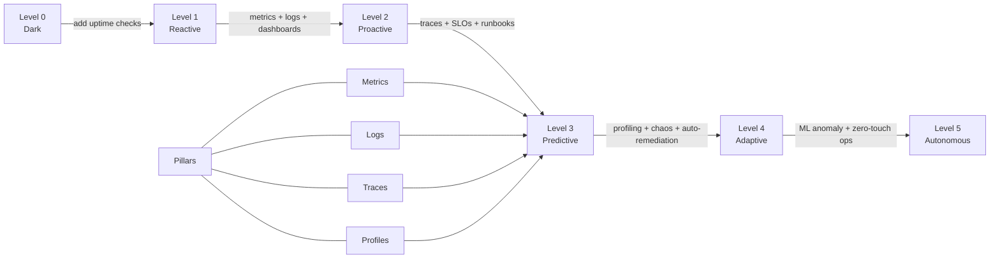

# Observability Maturity Model

## Category

**Domain:** Observability · **Stack:** Prometheus, Grafana, TypeScript · **Scope:** Methodology, Culture & Capability Assessment

---

## Context

Observability is not a product you install — it is an **organizational capability** built incrementally. The maturity model provides a structured path from "we print logs to stdout" to "we have proactive automated remediation." Teams use it to self-assess, identify gaps, and justify investment.

### Four Golden Signals (Google SRE)

| Signal | What It Measures | Example Metric |
|--------|-----------------|---------------|
| **Latency** | Time to serve a request (success vs error) | `http_request_duration_seconds{p99}` |
| **Traffic** | Demand placed on the system | `http_requests_total` (rate/s) |
| **Errors** | Rate of failed requests | `http_requests_total{status=~"5.."}` |
| **Saturation** | How "full" the service is (CPU, queue depth) | `process_cpu_usage`, `queue_depth_total` |

### USE Method (Brendan Gregg — Infrastructure)

| Acronym | Metric Type | For Every Resource |
|---------|------------|-------------------|
| **U**tilization | % time the resource is busy | CPU: `rate(process_cpu_seconds_total[5m])` |
| **S**aturation | Amount of queued work | Run queue: `node_load1` |
| **E**rrors | Error count | `node_disk_io_time_weighted_seconds_total` |

### RED Method (Tom Wilkie — Services)

| Acronym | Metric Type | Example |
|---------|------------|---------|
| **R**ate | Requests per second | `rate(http_requests_total[5m])` |
| **E**rrors | Errors per second | `rate(http_requests_total{status=~"5.."}[5m])` |
| **D**uration | Latency distribution | `histogram_quantile(0.99, rate(http_request_duration_seconds_bucket[5m]))` |

### Observability Maturity Levels

| Level | Name | Characteristics |
|-------|------|----------------|
| **0** | Dark | No monitoring; failures discovered by users |
| **1** | Reactive | Basic uptime checks; alerts fire after outage starts |
| **2** | Proactive | Metrics + logs + basic dashboards; SLOs defined but informal |
| **3** | Predictive | Full tracing + structured logs; SLO-based alerting; runbooks |
| **4** | Adaptive | Automated remediation; continuous profiling; chaos experiments |
| **5** | Autonomous | ML-driven anomaly detection; zero-touch incident resolution |

---

## Pros

- Golden Signals provide a universal language — any service type maps to latency/traffic/errors/saturation
- Maturity model creates a shared roadmap: engineers understand *why* the next investment is needed
- USE + RED methods prevent "metric sprawl" — focus on the signals that actually matter for each layer
- Toil reduction at higher maturity levels multiplies engineering capacity (less on-call toil → more feature work)
- Self-assessment against maturity levels enables data-driven observability budgeting

## Cons

- Maturity models can become compliance theater — teams game assessments rather than improving real capability
- Level 5 (Autonomous) is aspirational — most organizations should target Level 3–4 as a practical goal
- Golden Signals require consistent metric naming across all services — retrofitting legacy services is costly
- Culture change (blameless postmortems, sharing runbooks) is harder than tooling installs and takes longer
- Saturation is the hardest Golden Signal to define well — "full" means different things for CPU vs message queue vs DB connections

---

## Design Diagram



---

## Code Sample

### TypeScript — Golden Signals Middleware (Express)

```typescript
// src/observability/golden-signals.ts
// Implements all four Golden Signals for an Express service in < 50 lines
import { Counter, Histogram, Gauge, register } from 'prom-client';
import type { Request, Response, NextFunction } from 'express';
import * as os from 'os';

// ---- Traffic & Errors ----
const requestTotal = new Counter({
  name: 'http_requests_total',
  help: 'Total HTTP requests (traffic + error signals)',
  labelNames: ['method', 'route', 'status_code'],
});

// ---- Latency ----
const requestDuration = new Histogram({
  name: 'http_request_duration_seconds',
  help: 'HTTP request duration (latency signal)',
  labelNames: ['method', 'route', 'status_code'],
  buckets: [0.005, 0.01, 0.025, 0.05, 0.1, 0.25, 0.5, 1, 2.5, 5],
});

// ---- Saturation ----
const inFlightRequests = new Gauge({
  name: 'http_requests_in_flight',
  help: 'Number of in-flight requests (saturation signal)',
  labelNames: ['method'],
});

export function goldenSignalsMiddleware(req: Request, res: Response, next: NextFunction): void {
  const start = process.hrtime.bigint();
  inFlightRequests.labels(req.method).inc();

  res.on('finish', () => {
    const durationSeconds = Number(process.hrtime.bigint() - start) / 1e9;
    const route = (req.route?.path ?? req.path).replace(/[0-9a-f-]{8,}/gi, ':id');
    const labels = { method: req.method, route, status_code: String(res.statusCode) };

    requestTotal.labels(labels).inc();
    requestDuration.labels(labels).observe(durationSeconds);
    inFlightRequests.labels(req.method).dec();
  });

  next();
}

// Prometheus /metrics endpoint handler
export async function metricsHandler(_req: Request, res: Response): Promise<void> {
  res.set('Content-Type', register.contentType);
  res.end(await register.metrics());
}
```

### Python — Maturity Self-Assessment Score Calculator

```python
# scripts/maturity_assessment.py
# Run during team reviews to produce a structured maturity score
from dataclasses import dataclass, field
from typing import List


@dataclass
class Capability:
    name: str
    description: str
    level: int           # 1–5 maturity level required
    implemented: bool = False
    notes: str = ""


CAPABILITIES: List[Capability] = [
    # Level 1 — Reactive
    Capability("uptime-checks",       "Basic HTTP uptime checks with alerting",            1),
    Capability("error-rate-alert",    "Alert fires when error rate > threshold",            1),

    # Level 2 — Proactive
    Capability("prometheus-metrics",  "RED metrics exposed from all services",              2),
    Capability("structured-logging",  "JSON logs with trace_id and severity",               2),
    Capability("grafana-dashboards",  "Service dashboards with RED panels",                 2),

    # Level 3 — Predictive
    Capability("distributed-tracing", "End-to-end distributed traces with sampling",       3),
    Capability("slo-definitions",     "SLOs defined with error budget policies",            3),
    Capability("slo-burn-alerts",     "Multi-window burn-rate alerting",                   3),
    Capability("log-trace-corr",      "Log lines include trace_id; Loki↔Tempo linked",     3),
    Capability("health-probes",       "Liveness + readiness + startup probes on all pods", 3),
    Capability("runbooks",            "Runbook linked from every alert",                   3),

    # Level 4 — Adaptive
    Capability("continuous-profiling","Always-on CPU/memory profiling in production",      4),
    Capability("synthetic-monitoring","Synthetic checks on all critical flows",             4),
    Capability("chaos-engineering",   "Chaos experiments validate failure assumptions",     4),
    Capability("auto-remediation",    "Automation restarts/scales services on SLO breach", 4),

    # Level 5 — Autonomous
    Capability("anomaly-detection",   "ML-based anomaly detection on golden signals",      5),
    Capability("zero-touch-incidents","Automated diagnosis and resolution workflow",         5),
]


def score(capabilities: List[Capability]) -> dict:
    implemented = [c for c in capabilities if c.implemented]
    by_level = {}
    for lvl in range(1, 6):
        total = [c for c in capabilities if c.level == lvl]
        done  = [c for c in implemented if c.level == lvl]
        by_level[lvl] = {"total": len(total), "done": len(done),
                         "pct": round(100 * len(done) / len(total)) if total else 0}

    # Effective maturity = highest level where ALL capabilities are implemented
    effective = 0
    for lvl in range(1, 6):
        if by_level[lvl]["pct"] == 100:
            effective = lvl

    return {"by_level": by_level, "effective_maturity": effective,
            "total_implemented": len(implemented), "total_capabilities": len(capabilities)}


if __name__ == "__main__":
    import json
    # Example: mark Level 1-2 capabilities as done
    for cap in CAPABILITIES:
        if cap.level <= 2:
            cap.implemented = True
    print(json.dumps(score(CAPABILITIES), indent=2))
```

### YAML — Observability Platform Runbook Template

```yaml
# docs/runbooks/template.yaml
# Every alert MUST link to a runbook. This is the standard template.

runbook:
  alert_name: "ServiceHighErrorRate"  # matches PrometheusRule alert name exactly
  severity: critical
  team: platform-engineering
  pagerduty_service: "api-backend"
  last_reviewed: "2024-01-15"

  symptoms:
    - "Error rate > 5% sustained for > 5 minutes"
    - "Users report 500 errors on checkout"

  impact:
    - "Revenue impact: 0.1% transaction failure = $X/min lost"
    - "SLO error budget burn rate: 14×"

  diagnosis:
    - step: "Check Grafana RED dashboard for the service"
      url: "https://grafana.example.com/d/api-red"
    - step: "Open trace for a failing request in Grafana Tempo"
      query: '{ status=error } | rate()'
    - step: "Check recent deployments (last 2 hours)"
      command: "kubectl rollout history deployment/api-backend -n production"
    - step: "Inspect pod logs for exception stack traces"
      command: "kubectl logs -n production -l app=api-backend --tail=100 | jq 'select(.level==\"error\")'"
    - step: "Check database slow queries"
      url: "https://grafana.example.com/d/db-observability"

  remediation:
    - action: "Rollback if caused by deployment"
      command: "kubectl rollout undo deployment/api-backend -n production"
    - action: "Scale replicas if under load"
      command: "kubectl scale deployment/api-backend --replicas=10 -n production"
    - action: "Enable circuit breaker via feature flag"
      url: "https://flagsmith.example.com/flags/circuit-breaker-checkout"

  escalation:
    - level: 1
      who: "On-call engineer (PagerDuty)"
      after: "0 minutes"
    - level: 2
      who: "API team lead"
      after: "15 minutes if unresolved"
    - level: 3
      who: "VP Engineering"
      after: "30 minutes, customer-impacting"

  postmortem:
    required_if: "Error rate > 1% for > 15 minutes or SLO error budget > 20% consumed"
    template: "https://wiki.example.com/postmortem-template"
    blameless: true
```

### TypeScript — On-Call Toil Tracker

```typescript
// src/sre/toil-tracker.ts
// Track operational toil to justify automation investment
export interface ToilEntry {
  date: string;
  alert: string;
  duration_minutes: number;
  manual_steps: number;
  automatable: boolean;
  root_cause: string;
}

export function weeklyToilReport(entries: ToilEntry[]): void {
  const total = entries.reduce((sum, e) => sum + e.duration_minutes, 0);
  const automatable = entries.filter((e) => e.automatable);
  const saveable = automatable.reduce((sum, e) => sum + e.duration_minutes, 0);

  console.log(`=== Weekly Toil Report ===`);
  console.log(`Total toil: ${total} min (${(total / 60).toFixed(1)} hrs)`);
  console.log(`Automatable: ${saveable} min (${Math.round((saveable / total) * 100)}%)`);
  console.log(`Top alerts by toil:`);

  const byAlert: Record<string, number> = {};
  for (const e of entries) {
    byAlert[e.alert] = (byAlert[e.alert] ?? 0) + e.duration_minutes;
  }

  Object.entries(byAlert)
    .sort(([, a], [, b]) => b - a)
    .slice(0, 5)
    .forEach(([alert, mins]) => console.log(`  ${alert}: ${mins} min`));
}
```
