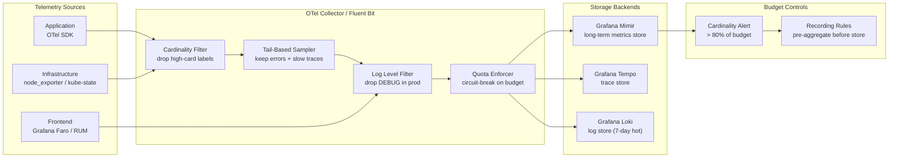

# Observability Cost Management

## Category

Observability, FinOps, Cardinality, Sampling, Telemetry Budget

## Context

**Observability cost management** addresses one of the most common causes of runaway cloud spend: telemetry that grows unbounded as systems scale. Metrics with high-cardinality labels, traces sampled at 100%, and verbose log lines per request can make observability infrastructure cost more than the applications it monitors.

The three levers are:
1. **Metrics**: control cardinality (number of unique time-series)
2. **Traces**: control sample rate (head-based and tail-based sampling)
3. **Logs**: control verbosity and volume (log-level sampling, structured field filtering)

### Cost Drivers by Signal Type

| Signal | Primary Cost Driver | Typical Scale Issue | Mitigation |
|--------|-------------------|---------------------|-----------|
| **Metrics** | Label cardinality (unique time-series count) | `user_id`, `request_id`, `pod_name` as labels | Cardinality governance; recording rules to pre-aggregate |
| **Traces** | 100% sampling on high-volume paths | Health checks, payment confirmations at 1k RPS | Tail-based sampling; head-based rate limits |
| **Logs** | Log volume × retention days | DEBUG logs in production; request/response body logging | Per-level sampling; log dropping rules in Fluent Bit |
| **Profiles** | Continuous CPU + memory profiling overhead | CPU overhead (typically 1–3%) + storage | Adaptive profiling; keep 7 days only |

### Cardinality: The Metrics Cost Model

Prometheus cost scales roughly as:

$$\text{Cost} \propto \text{unique time-series} \times \text{scrape interval} \times \text{retention days}$$

A metric with labels `{service, endpoint, method, status_code}` = 10 services × 50 endpoints × 3 methods × 5 status codes = **7,500 time-series** from a single metric. Adding `user_id` would multiply by millions.

**Cardinality budget**: Set a per-team cardinality budget (e.g. 50,000 active time-series) and enforce it at ingestion.

---

## Pros

- **Prevents observability costs from exceeding application costs**: Left unchecked, metrics stores and trace backends scale super-linearly with traffic.
- **Forces signal discipline**: Cardinality budgets push teams toward meaningful aggregations rather than storing raw per-user data.
- **Tail-based sampling preserves interesting traces**: Unlike head-based (random drop), tail-based keeps 100% of errors and slow traces while dropping routine traffic.

## Cons

- **Sampling means missing rare events**: A 1% head-based sample on low-traffic paths may miss important failures.
- **Cardinality limits require cultural buy-in**: Teams resist label restrictions when they believe they need per-user metrics.
- **Tail-based sampling has buffering cost**: The collector must buffer spans for each trace until the root span arrives to make a sampling decision.

---

## Design Diagram



---

## Code Sample

### 1. Prometheus — Detect High-Cardinality Labels

```promql
# Find metrics with more than 10,000 active time-series — likely cardinality offenders
topk(20, count by (__name__) ({__name__=~".+"}))

# Find the label that contributes most cardinality for a specific metric
# Replace 'http_request_duration_seconds' with the metric to investigate
topk(10, count by (label_name) (
  group by (label_name, label_value) (
    {__name__="http_request_duration_seconds"}
  )
))

# Alert when a team's cardinality budget exceeds 50,000 time-series
# (requires Mimir/VictoriaMetrics cardinality APIs, or estimate from active series count)
- alert: CardinalityBudgetExceeded
  expr: |
    sum by (job) (
      prometheus_tsdb_head_series{job=~"my-service.*"}
    ) > 50000
  for: 10m
  labels:
    severity: warning
  annotations:
    summary: "{{ $labels.job }} has {{ $value | humanize }} active time-series (budget: 50k)"
    runbook: "https://wiki.example.com/runbooks/cardinality-reduction"
```

### 2. Prometheus — Drop High-Cardinality Labels via Relabeling

```yaml
# prometheus.yml — scrape config with relabeling to drop offending labels
scrape_configs:
  - job_name: payments-service
    static_configs:
      - targets: ['payments:9090']
    metric_relabel_configs:
      # ❌ Drop metrics with user_id label — too many unique values
      - source_labels: [__name__, user_id]
        regex: '.+;.+'
        action: drop

      # ❌ Drop raw per-request metrics — keep only histogram/summary
      - source_labels: [__name__]
        regex: 'http_request_body_bytes_raw'
        action: drop

      # ✅ Normalise pod name to just the deployment name (strip ReplicaSet suffix)
      # pod="payments-service-7d8b9c-xkqrp" → deployment="payments-service"
      - source_labels: [pod]
        target_label: deployment
        regex: '^([a-z0-9-]+)-[a-z0-9]{5,10}-[a-z0-9]{5}$'
        replacement: '$1'

      # ❌ Drop the high-cardinality pod label after extracting deployment
      - target_label: pod
        replacement: ''
        action: replace
        regex: '.*'
        source_labels: [pod]
        # Only drop pod label on app metrics — keep it on infra metrics
        # (filter by __name__ first in a real config)
```

### 3. Recording Rules — Pre-Aggregate Before Storage

```yaml
# recording-rules.yml — compute high-value aggregations at scrape time
# Storing aggregated time-series instead of raw high-cardinality ones
# Example: replace per-endpoint high-cardinality metrics with service-level aggregations

groups:
  - name: payments_service_aggregations
    interval: 1m
    rules:
      # Pre-aggregate request rate by service (not per-endpoint/pod) for long-term dashboards
      - record: job:http_requests_total:rate5m
        expr: |
          sum by (job, status_code) (
            rate(http_requests_total[5m])
          )

      # Pre-aggregate P99 latency by service (not per-endpoint)
      - record: job:http_request_duration_seconds:p99:5m
        expr: |
          histogram_quantile(0.99,
            sum by (job, le) (
              rate(http_request_duration_seconds_bucket[5m])
            )
          )

      # Pre-aggregate error rate — use as SLO burn rate input
      - record: job:http_errors_total:rate5m
        expr: |
          sum by (job) (
            rate(http_requests_total{status_code=~"5.."}[5m])
          )
```

### 4. OTel Collector — Tail-Based Trace Sampling

```yaml
# otel-collector-config.yaml — tail-based sampling policy
# Buffers spans per trace, then makes a sampling decision on the complete trace

receivers:
  otlp:
    protocols:
      grpc:
        endpoint: 0.0.0.0:4317

processors:
  # Tail-based sampler — must see the whole trace before deciding
  tail_sampling:
    decision_wait:          10s    # wait up to 10s for all spans to arrive
    num_traces:             50000  # in-memory trace buffer size
    expected_new_traces_per_sec: 100
    policies:
      # Always keep error traces (HTTP 5xx, exception spans)
      - name:  keep-errors
        type:  status_code
        status_code:
          status_codes: [ERROR]

      # Always keep slow traces (P99 > 1s)
      - name:  keep-slow
        type:  latency
        latency:
          threshold_ms: 1000

      # Always keep traces tagged as high-value business events
      - name:  keep-payment-traces
        type:  string_attribute
        string_attribute:
          key:    business.domain
          values: [payment, fraud-check, kyc]

      # Keep 1% of routine/healthy traces for baseline
      - name:  sample-healthy
        type:  probabilistic
        probabilistic:
          sampling_percentage: 1

      # Drop health check traces entirely
      - name:  drop-health-checks
        type:  string_attribute
        string_attribute:
          key:    http.target
          values: [/health, /ready, /live, /metrics]
          invert_match: false
        # Wrap in composite with probability 0 to drop
```

### 5. Fluent Bit — Log Volume Control

```ini
# fluent-bit.conf — drop DEBUG logs in production; sample INFO logs on high-volume paths

[SERVICE]
    Flush         1
    Daemon        Off
    Log_Level     info

[INPUT]
    Name             tail
    Path             /var/log/containers/*.log
    Parser           docker
    Tag              kube.*
    Mem_Buf_Limit    5MB
    Skip_Long_Lines  On

# Drop DEBUG and TRACE level logs — never store in production
[FILTER]
    Name    grep
    Match   kube.*
    Exclude level ^(debug|trace|DEBUG|TRACE)$

# Sample INFO logs from high-volume health/metrics paths at 5%
# (keep 1 in 20; ensures we still see the pattern without storing all)
[FILTER]
    Name          lua
    Match         kube.*
    script        /fluent-bit/scripts/sample_info.lua
    call          sample_info_logs

# sample_info.lua:
# function sample_info_logs(tag, timestamp, record)
#   local level = record["level"] or ""
#   local path  = record["http_path"] or ""
#   if level == "info" and (path == "/health" or path == "/metrics") then
#     if math.random() > 0.05 then return -1, 0, 0 end  -- drop 95%
#   end
#   return 0, 0, 0
# end

# Drop log lines that contain raw PII fields (belt-and-suspenders after app-level filtering)
[FILTER]
    Name    grep
    Match   kube.*
    Exclude log (?i)(card_number|cvv|password|secret)

[OUTPUT]
    Name          loki
    Match         kube.*
    Host          loki.monitoring.svc.cluster.local
    Port          3100
    Labels        job=fluentbit,env=production
    Label_Keys    $kubernetes['namespace_name'],$kubernetes['pod_name']
    Batch_Wait    1s
    Batch_Size    1048576
```

### 6. Grafana Mimir — Cardinality Dashboard Query

```promql
# Identify top cardinality contributors per team namespace
# Run in Grafana Explore against your Mimir/Prometheus datasource

# Top 10 metrics by series count
topk(10,
  sort_desc(
    count by (__name__) (
      {namespace=~"payments|fraud|kyc"}
    )
  )
)

# Total active series per namespace (against Prometheus's own internal metric)
sum by (namespace) (
  kube_pod_labels{namespace=~"payments|fraud|kyc"}
)

# Detect cardinality growth rate — alert if a metric grows > 20% per hour
(
  count by (__name__) ({__name__=~".+", namespace="payments"})
  /
  count by (__name__) ({__name__=~".+", namespace="payments"} offset 1h)
) > 1.2
```

### 7. Telemetry Budget Policy — TypeScript Enforcement at SDK Level

```typescript
// Enforce telemetry budget at the OTel SDK span processor level
// Prevents a single runaway service from filling the trace backend

import { ReadableSpan, SpanExporter, ExportResult } from '@opentelemetry/sdk-trace-base';
import { ExportResultCode } from '@opentelemetry/core';
import { Counter } from 'prom-client';

const spansDropped = new Counter({
  name:       'otel_spans_budget_dropped_total',
  help:       'Spans dropped due to per-service telemetry budget',
  labelNames: ['service_name', 'reason'],
});

interface BudgetConfig {
  maxSpansPerMinute: number;   // e.g. 10,000 spans/min per service
  maxSpanAttributes: number;   // e.g. 64 attributes per span
  maxEventCount:     number;   // e.g. 128 events per span
}

class BudgetEnforcingExporter implements SpanExporter {
  private delegate:     SpanExporter;
  private config:       BudgetConfig;
  private windowStart:  number = Date.now();
  private windowCount:  number = 0;

  constructor(delegate: SpanExporter, config: BudgetConfig) {
    this.delegate = delegate;
    this.config   = config;
  }

  export(spans: ReadableSpan[], resultCallback: (result: ExportResult) => void): void {
    const now = Date.now();

    // Reset window every minute
    if (now - this.windowStart > 60_000) {
      this.windowStart = now;
      this.windowCount = 0;
    }

    const allowed: ReadableSpan[] = [];

    for (const span of spans) {
      // Enforce spans-per-minute budget
      if (this.windowCount >= this.config.maxSpansPerMinute) {
        spansDropped.inc({ service_name: span.resource.attributes['service.name'] as string ?? 'unknown', reason: 'rate_budget' });
        continue;
      }

      // Truncate excess attributes to reduce payload size
      const attrs = span.attributes;
      const attrKeys = Object.keys(attrs);
      if (attrKeys.length > this.config.maxSpanAttributes) {
        spansDropped.inc({ service_name: span.resource.attributes['service.name'] as string ?? 'unknown', reason: 'attribute_truncation' });
        // Note: ReadableSpan is immutable — in practice, enforce at SpanProcessor.onEnd level
      }

      allowed.push(span);
      this.windowCount++;
    }

    if (allowed.length > 0) {
      this.delegate.export(allowed, resultCallback);
    } else {
      resultCallback({ code: ExportResultCode.SUCCESS });
    }
  }

  shutdown(): Promise<void> {
    return this.delegate.shutdown();
  }
}
```

---

## Cost Reduction Checklist

### Metrics
- [ ] No `user_id`, `request_id`, `session_id`, or `uuid` as metric labels
- [ ] Per-team cardinality budget defined (e.g. 50k active series) and enforced with alerts
- [ ] Recording rules pre-aggregate high-cardinality metrics before long-term storage
- [ ] Mimir/Thanos remote write configured with relabeling to drop unnecessary labels
- [ ] Metric retention tiered: 15 days hot (Prometheus), 1 year cold (Mimir/Thanos)

### Traces
- [ ] Tail-based sampling in OTel Collector (not head-based random drop)
- [ ] 100% of error + slow traces kept; 1–5% of healthy traces sampled
- [ ] Health check and metrics scrape endpoints excluded from tracing
- [ ] Trace retention ≤ 7 days (hot); representative sample archived longer if needed

### Logs
- [ ] `DEBUG` / `TRACE` logs disabled in production via log-level config
- [ ] High-volume health check / readiness paths sampled at ≤ 5% in Fluent Bit
- [ ] Log retention: 7 days hot (Loki), 30 days cold (S3 Parquet via Loki TSDB), 1 year archive
- [ ] PII fields excluded from log lines (belt-and-suspenders filter in Fluent Bit)

### Profiles
- [ ] Continuous profiling limited to 10–15% CPU overhead (Pyroscope adaptive sampling)
- [ ] Profile retention: 7 days hot; no long-term profile storage by default

---

## References

- [Prometheus — Cardinality Best Practices](https://prometheus.io/docs/practices/instrumentation/#cardinality)
- [Grafana Mimir — Cardinality Management](https://grafana.com/docs/mimir/latest/manage/use-grafana-mimir/manage-high-cardinality-metrics/)
- [OTel Collector — Tail Sampling Processor](https://github.com/open-telemetry/opentelemetry-collector-contrib/tree/main/processor/tailsamplingprocessor)
- [Grafana Loki — Cost Optimisation](https://grafana.com/docs/loki/latest/operations/storage/)
- [Charity Majors — Observability ≠ Monitoring](https://charity.wtf/2020/03/03/observability-is-a-many-splendored-thing/)
- [Cindy Sridharan — Distributed Systems Observability (O'Reilly)](https://www.oreilly.com/library/view/distributed-systems-observability/9781492033431/)
