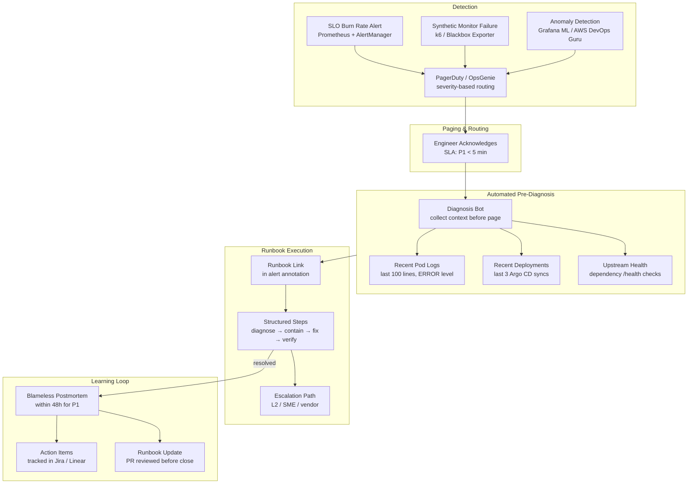

# On-Call Excellence & Runbook Automation

## Category

Observability, On-Call, Runbooks, MTTD, MTTR, AIOps, Incident Management

## Context

**On-call excellence** is the operational discipline of making alert response fast, accurate, and low-toil. It bridges the gap between receiving an alert and resolving the underlying problem — through high-quality runbooks, automated pre-diagnosis, and feedback loops that improve both the system and the process.

The key metrics:

| Metric | Definition | Target |
|--------|-----------|--------|
| **MTTD** (Mean Time to Detect) | Alert fires → engineer is paged | < 5 min |
| **MTTI** (Mean Time to Investigate) | Paged → root cause identified | < 15 min for P1 |
| **MTTR** (Mean Time to Recover) | Root cause identified → service restored | < 30 min for P1 |
| **Toil** | Repetitive manual work that scales with traffic | Reduce to < 20% of on-call time |
| **Alert fatigue rate** | % of pages that require no action or are noise | Target < 20% |

### On-Call Maturity Levels

| Level | Characteristics | Tools |
|-------|----------------|-------|
| **L1 — Reactive** | Alerts fire; engineer Googles; fixes manually | Basic PagerDuty / OpsGenie |
| **L2 — Documented** | Runbooks exist; linked from alerts | Confluence / Wiki runbooks |
| **L3 — Automated Diagnosis** | Alerts include auto-collected diagnostics | Runbook scripts in Git |
| **L4 — Self-Healing** | Common issues remediated automatically; engineer confirms | SOAR / Lambda auto-remediation |
| **L5 — Proactive** | SLO burn rate trends predict incidents; action taken before breach | Predictive alerting + ML |

---

## Pros

- **Runbooks-as-code reduces cognitive load**: Engineers follow a script rather than improvising under pressure at 3am.
- **Automated pre-diagnosis compresses MTTI**: By the time the engineer opens the page, pod logs, recent deployments, and upstream health are already gathered.
- **MTTD/MTTR tracking drives continuous improvement**: You can't improve what you don't measure — feedback from incidents feeds runbook refinement.

## Cons

- **Runbook staleness**: Runbooks that aren't updated alongside code become misleading — worse than no runbook.
- **Auto-remediation risk**: Automated rollbacks or restarts can mask root causes or cause cascading restarts if not carefully scoped.
- **Tooling investment**: Automated diagnosis pipelines require significant upfront work; return is highest for frequent/recurring incidents.

---

## Design Diagram



---

## Code Sample

### 1. Runbook — YAML Schema for Machine-Readable Runbooks

```yaml
# runbooks/payments-service/high-error-rate.yaml
# Machine-readable runbook — linked from AlertManager alert annotation

metadata:
  id:        RB-PAY-001
  service:   payments-service
  alert:     PaymentsHighErrorRate
  severity:  P1
  owner:     payments-team
  updated:   2025-10-01
  sla:
    acknowledge: 5m
    resolve:     30m

context:
  description: |
    Payment API error rate exceeds 5% over 5 minutes.
    Primary causes: database connectivity, downstream PSP timeout, or recent bad deployment.

diagnosis_steps:
  - id:   D1
    name: Check recent deployments
    type: query
    command: |
      kubectl rollout history deployment/payments-service -n payments
    expected: "No deployment in last 30 minutes → rule out deployment cause"

  - id:   D2
    name: Check pod restarts
    type: query
    command: |
      kubectl get pods -n payments -l app=payments-service \
        --sort-by='.status.containerStatuses[0].restartCount'
    expected: "Restart count < 3 per pod in last hour → rule out OOM"

  - id:   D3
    name: Check database connection pool
    type: metric
    query: "pgbouncer_pools_cl_waiting{database='payments'} > 0"
    dashboard: "https://grafana.example.com/d/db-health"
    expected: "Waiting connections == 0 → database pool healthy"

  - id:   D4
    name: Check PSP upstream health
    type: http
    url:  "https://status.stripe.com/api/v2/components.json"
    expected: "All components operational"

containment_steps:
  - id:   C1
    name: Enable circuit breaker to PSP (if D4 confirms upstream issue)
    type: command
    command: |
      kubectl patch configmap payments-config -n payments \
        --patch '{"data":{"PSP_CIRCUIT_BREAKER_ENABLED":"true"}}'
    rollback: |
      kubectl patch configmap payments-config -n payments \
        --patch '{"data":{"PSP_CIRCUIT_BREAKER_ENABLED":"false"}}'
    requires_approval: true   # do not run without on-call manager sign-off

  - id:   C2
    name: Rollback to previous deployment (if D1 confirms recent deploy)
    type: command
    command: |
      kubectl rollout undo deployment/payments-service -n payments
    requires_approval: true

escalation:
  - condition: "Not resolved in 30 minutes"
    page:      payments-team-l2
  - condition: "PSP upstream confirmed down"
    contact:   vendor-escalation-contacts.md

verification:
  - name: Error rate < 1% for 5 minutes
    query: |
      sum(rate(http_requests_total{service="payments",status_code=~"5.."}[5m])) /
      sum(rate(http_requests_total{service="payments"}[5m])) < 0.01
  - name: Payments successfully processing
    synthetic: "https://synthetics.example.com/tests/payment-e2e"
```

### 2. Automated Pre-Diagnosis — Slack Bot

```typescript
// on-call-bot/src/diagnose.ts
// When PagerDuty triggers a P1 incident, automatically gather context
// and post a diagnosis summary to the incident Slack channel

import { WebClient } from '@slack/web-api';
import { execSync } from 'child_process';
import nodeFetch from 'node-fetch';

interface AlertPayload {
  alertName:  string;
  service:    string;
  namespace:  string;
  severity:   string;
  dashboardUrl: string;
  runbookUrl:   string;
}

async function runPreDiagnosis(alert: AlertPayload, channel: string): Promise<void> {
  const slack = new WebClient(process.env.SLACK_BOT_TOKEN);

  const sections: string[] = [
    `🚨 *${alert.alertName}* fired for \`${alert.service}\``,
    `📊 <${alert.dashboardUrl}|Dashboard> | 📖 <${alert.runbookUrl}|Runbook>`,
    '\n*Auto-collected context:*',
  ];

  // 1. Pod status
  try {
    const pods = execSync(
      `kubectl get pods -n ${alert.namespace} -l app=${alert.service} ` +
      `--no-headers -o custom-columns=NAME:.metadata.name,STATUS:.status.phase,RESTARTS:.status.containerStatuses[0].restartCount`,
      { timeout: 10_000 }
    ).toString().trim();
    sections.push(`*Pod status:*\n\`\`\`${pods}\`\`\``);
  } catch {
    sections.push('⚠️ Could not fetch pod status');
  }

  // 2. Recent deployments (Argo CD)
  try {
    const deploys = execSync(
      `kubectl get events -n ${alert.namespace} ` +
      `--field-selector reason=DeploymentComplete --sort-by=.lastTimestamp ` +
      `-o jsonpath='{range .items[-3:]}{.lastTimestamp}: {.message}\\n{end}'`,
      { timeout: 10_000 }
    ).toString().trim();
    sections.push(`*Recent deployments (last 3):*\n\`\`\`${deploys || 'none'}\`\`\``);
  } catch {
    sections.push('⚠️ Could not fetch deployment history');
  }

  // 3. Last 10 ERROR log lines
  try {
    const logs = execSync(
      `kubectl logs -n ${alert.namespace} -l app=${alert.service} ` +
      `--tail=200 --since=10m --container=${alert.service} 2>/dev/null | ` +
      `grep -i '"level":"error"' | tail -10`,
      { timeout: 15_000 }
    ).toString().trim();
    const truncated = logs.length > 1000 ? logs.slice(0, 1000) + '\n...(truncated)' : logs;
    sections.push(`*Recent ERROR logs (last 10):*\n\`\`\`${truncated || 'none'}\`\`\``);
  } catch {
    sections.push('⚠️ Could not fetch recent error logs');
  }

  // 4. Upstream dependency health
  const upstreams = await checkUpstreamHealth(alert.service);
  sections.push(`*Upstream dependencies:*\n${upstreams}`);

  await slack.chat.postMessage({
    channel,
    text: sections.join('\n'),
    mrkdwn: true,
    unfurl_links: false,
  });
}

async function checkUpstreamHealth(service: string): Promise<string> {
  const dependencyMap: Record<string, string[]> = {
    'payments-service': [
      'http://psp-gateway.payments.svc/health',
      'http://fraud-service.fraud.svc/health',
      'http://postgres-proxy.payments.svc/health',
    ],
    'account-service': [
      'http://core-banking.corebanking.svc/health',
      'http://postgres-proxy.accounts.svc/health',
    ],
  };

  const upstreams = dependencyMap[service] ?? [];
  const results: string[] = [];

  for (const url of upstreams) {
    try {
      const res = await nodeFetch(url, { timeout: 3000 } as any);
      const icon = res.ok ? '✅' : '❌';
      results.push(`${icon} \`${url}\` → ${res.status}`);
    } catch (err: any) {
      results.push(`❌ \`${url}\` → timeout/unreachable`);
    }
  }

  return results.join('\n') || 'No upstream dependencies mapped';
}
```

### 3. MTTD / MTTR Tracking with Prometheus

```yaml
# alertmanager-webhook-receiver — record incident timings
# AlertManager fires webhook on alert start and resolution
# Prometheus metrics track MTTD and MTTR for SLO reporting

# alertmanager.yml webhook receiver
receivers:
  - name: incident-tracker
    webhook_configs:
      - url: http://incident-tracker.monitoring.svc/webhook
        send_resolved: true
        http_config:
          bearer_token_file: /var/run/secrets/incident-tracker-token
```

```typescript
// incident-tracker/src/webhook.ts
// Record alert fire time and resolution time to compute MTTD/MTTR

import { Gauge, Histogram } from 'prom-client';

const incidentMTTR = new Histogram({
  name:    'oncall_incident_mttr_seconds',
  help:    'Time from alert firing to resolution (MTTR)',
  labelNames: ['alertname', 'service', 'severity'],
  buckets: [60, 300, 900, 1800, 3600, 7200],  // 1m, 5m, 15m, 30m, 1h, 2h
});

const activeIncidents = new Gauge({
  name:    'oncall_active_incidents_total',
  help:    'Number of currently active (firing) incidents',
  labelNames: ['severity'],
});

const incidentFireTimes = new Map<string, number>();  // fingerprint → fire timestamp

// POST /webhook — called by AlertManager
export async function handleAlertmanagerWebhook(payload: AlertmanagerPayload): Promise<void> {
  for (const alert of payload.alerts) {
    const fingerprint = alert.fingerprint;
    const alertname   = alert.labels.alertname;
    const service     = alert.labels.service ?? alert.labels.job ?? 'unknown';
    const severity    = alert.labels.severity ?? 'unknown';

    if (alert.status === 'firing') {
      incidentFireTimes.set(fingerprint, Date.now());
      activeIncidents.inc({ severity });

      // Record in incident log for postmortem tracking
      await db.incidents.insert({
        fingerprint,
        alertname,
        service,
        severity,
        firedAt: new Date(alert.startsAt),
      });
    } else if (alert.status === 'resolved') {
      const firedAt = incidentFireTimes.get(fingerprint);
      if (firedAt) {
        const durationSeconds = (Date.now() - firedAt) / 1000;
        incidentMTTR.observe({ alertname, service, severity }, durationSeconds);
        incidentFireTimes.delete(fingerprint);
        activeIncidents.dec({ severity });

        await db.incidents.update({ fingerprint }, {
          resolvedAt:      new Date(alert.endsAt),
          durationSeconds: Math.round(durationSeconds),
        });
      }
    }
  }
}
```

### 4. Runbook Staleness Guard — CI Check

```yaml
# .github/workflows/runbook-freshness.yml
# Fail PR if a runbook hasn't been updated in > 90 days when its service changed

name: Runbook Freshness Check

on:
  pull_request:
    paths:
      - 'services/**'
      - 'runbooks/**'

jobs:
  check-runbook-freshness:
    runs-on: ubuntu-latest
    steps:
      - uses: actions/checkout@v4
        with:
          fetch-depth: 0

      - name: Check runbook staleness
        run: |
          STALE_THRESHOLD_DAYS=90
          FAILED=0

          # For each changed service, check if its runbook was updated recently
          for service in $(git diff --name-only origin/main...HEAD | grep '^services/' | cut -d/ -f2 | sort -u); do
            runbook="runbooks/${service}"
            if [ ! -d "$runbook" ]; then
              echo "⚠️  No runbook directory found for service: $service"
              FAILED=1
              continue
            fi

            last_update=$(git log -1 --format="%cr" -- "$runbook" 2>/dev/null)
            last_update_days=$(git log -1 --format="%ct" -- "$runbook" 2>/dev/null)
            now=$(date +%s)

            if [ -z "$last_update_days" ]; then
              echo "❌ $service: runbook has never been committed"
              FAILED=1
              continue
            fi

            age_days=$(( (now - last_update_days) / 86400 ))
            if [ "$age_days" -gt "$STALE_THRESHOLD_DAYS" ]; then
              echo "❌ $service: runbook is $age_days days old (last updated: $last_update)"
              echo "   Please review and update: runbooks/$service/"
              FAILED=1
            else
              echo "✅ $service: runbook updated $last_update"
            fi
          done

          exit $FAILED

      - name: Validate runbook schema
        run: |
          # Validate all changed runbooks have required fields
          for runbook in $(git diff --name-only origin/main...HEAD | grep '^runbooks/.*\.yaml$'); do
            echo "Validating $runbook..."
            python3 -c "
          import yaml, sys
          with open('$runbook') as f:
            rb = yaml.safe_load(f)
          required = ['metadata', 'context', 'diagnosis_steps', 'containment_steps', 'verification']
          missing = [k for k in required if k not in rb]
          if missing:
            print(f'❌ Missing required sections: {missing}')
            sys.exit(1)
          print('✅ Schema valid')
            "
          done
```

### 5. Toil Measurement — Weekly On-Call Report

```typescript
// Generate weekly on-call toil report from PagerDuty API
// Sends to Slack and stores in Prometheus for trending

import PagerDuty from 'node-pagerduty';
import { Counter, Gauge } from 'prom-client';

const toilGauge = new Gauge({
  name:    'oncall_toil_incidents_per_week',
  help:    'Number of toil incidents (auto-closed within 2min without action) per week',
  labelNames: ['service'],
});

const totalIncidentsGauge = new Gauge({
  name:    'oncall_total_incidents_per_week',
  help:    'Total on-call incidents per week',
  labelNames: ['service'],
});

async function generateWeeklyOnCallReport(): Promise<void> {
  const pd     = new PagerDuty(process.env.PAGERDUTY_TOKEN!);
  const since  = new Date(Date.now() - 7 * 24 * 60 * 60 * 1000).toISOString();
  const until  = new Date().toISOString();

  const incidents = await pd.incidents.listIncidents({ since, until, limit: 100 });
  const byService = new Map<string, { total: number; toil: number; mttr: number[] }>();

  for (const incident of incidents.incidents) {
    const service = incident.service.summary ?? 'unknown';
    if (!byService.has(service)) {
      byService.set(service, { total: 0, toil: 0, mttr: [] });
    }
    const stats = byService.get(service)!;
    stats.total++;

    const duration = incident.resolved_at
      ? (new Date(incident.resolved_at).getTime() - new Date(incident.created_at).getTime()) / 1000
      : null;

    if (duration !== null) {
      stats.mttr.push(duration);
      // Classify as toil if resolved in < 2 minutes with no notes (auto-resolve / noisy alert)
      if (duration < 120 && (!incident.body?.details || incident.body.details.length < 20)) {
        stats.toil++;
      }
    }
  }

  const lines: string[] = ['*📟 Weekly On-Call Report*', `Period: ${since.split('T')[0]} → ${until.split('T')[0]}`, ''];

  for (const [service, stats] of byService.entries()) {
    const toil_pct     = stats.total > 0 ? Math.round((stats.toil / stats.total) * 100) : 0;
    const avg_mttr_min = stats.mttr.length > 0
      ? Math.round(stats.mttr.reduce((a, b) => a + b, 0) / stats.mttr.length / 60)
      : 0;

    const toil_indicator = toil_pct > 30 ? '🔴' : toil_pct > 15 ? '🟡' : '✅';

    lines.push(`*${service}*: ${stats.total} incidents | Toil: ${toil_pct}% ${toil_indicator} | Avg MTTR: ${avg_mttr_min}m`);

    toilGauge.set({ service }, stats.toil);
    totalIncidentsGauge.set({ service }, stats.total);
  }

  await slack.chat.postMessage({
    channel: '#on-call-metrics',
    text:    lines.join('\n'),
    mrkdwn:  true,
  });
}
```

---

## On-Call Checklist

### Runbook Quality
- [ ] Every production alert has a linked runbook (`runbook_url` annotation in Prometheus)
- [ ] Runbooks include: context, diagnosis steps, containment steps, escalation path, verification
- [ ] Runbooks are tested (someone has followed each runbook in the last 6 months)
- [ ] Runbook staleness CI check — fails if runbook untouched > 90 days when service changes
- [ ] Runbooks stored in Git — reviewed and approved like code

### Alert Design
- [ ] Every alert page-worthy; no alerts that always auto-resolve without human action
- [ ] Alert annotations include `summary`, `description`, `runbook_url`, `dashboard_url`
- [ ] Multi-window multi-burn-rate SLO alerting in use (not threshold-only)
- [ ] Alert test suite — validates alert fires and resolves on known inputs

### On-Call Process
- [ ] Escalation policy defined with < 5 min P1 acknowledge SLA
- [ ] Automated pre-diagnosis runs before (or immediately upon) page acknowledgement
- [ ] MTTD and MTTR tracked per service per week in Prometheus/Grafana
- [ ] Toil rate tracked; > 30% toil triggers a runbook/automation sprint
- [ ] Blameless postmortem within 48h for every P1 incident
- [ ] Postmortem action items tracked in issue tracker; runbook updated before incident closed

---

## References

- [Google SRE Book — Chapter 12: Effective Alerting](https://sre.google/sre-book/monitoring-distributed-systems/)
- [Google SRE Book — Chapter 14: Managing Incidents](https://sre.google/sre-book/managing-incidents/)
- [PagerDuty — On-Call Best Practices](https://www.pagerduty.com/resources/learn/on-call-best-practices/)
- [Runbook Automation — OpsRamp](https://www.opsramp.com/guides/runbook-automation/)
- [DORA — Accelerate: Four Key Metrics (MTTD, MTTR)](https://dora.dev/research/)
- [Blameless Postmortems — Etsy](https://www.etsy.com/codeascraft/blameless-postmortems/)
- [The Practical Guide to Incident Management — incident.io](https://incident.io/guide)
