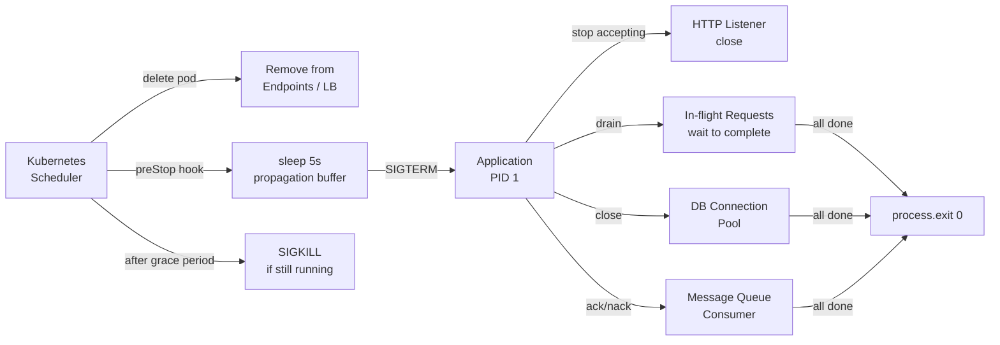

# Graceful Shutdown & Signal Handling

## Category

**Domain:** Production Hardening · **Stack:** Node.js, Python, Kubernetes · **Scope:** Process Lifecycle & Zero-Downtime Termination

---

## Context

When Kubernetes terminates a pod (rolling update, node drain, scale-in), it sends `SIGTERM` to the container. Without proper handling, in-flight HTTP requests are dropped, database transactions are abandoned, and message queue consumers leave messages unacknowledged. Graceful shutdown ensures the process **finishes what it started** before exiting.

### Kubernetes Pod Termination Sequence

| Step | What Happens | Duration |
|------|-------------|----------|
| 1. Pod removed from Endpoints | Service load balancer stops routing new traffic | ~2s propagation delay |
| 2. `preStop` hook executes | Arbitrary command/HTTP call before SIGTERM | Configured (`sleep 5` typical) |
| 3. `SIGTERM` sent to PID 1 | Application receives termination signal | Immediate |
| 4. `terminationGracePeriodSeconds` countdown | Window for in-flight requests to complete | Default 30s |
| 5. `SIGKILL` sent | Kernel forcibly kills process | End of grace period |

### Common Pitfalls

| Pitfall | Symptom | Fix |
|---------|---------|-----|
| No SIGTERM handler | Process exits immediately, requests dropped | Register handler; wait for in-flight |
| PID 1 is shell script | SIGTERM swallowed by shell, never reaches app | Use `exec` or `tini` init |
| `terminationGracePeriodSeconds` too short | SIGKILL fires before requests complete | Increase to match p99 + buffer |
| No `preStop` sleep | Load balancer still sends traffic after SIGTERM | Add `preStop: sleep 5` |
| DB connections not closed | Connection pool exhausted on restart | Close pool in shutdown hook |

---

## Pros

- Zero dropped requests during rolling deployments and node drains
- Clean database connection pool closure prevents "too many connections" on rapid restart
- Message queue consumers can `nack`/requeue in-flight messages before exit
- Structured shutdown logging aids postmortem: know exactly what was incomplete at shutdown time
- Works with any orchestrator (K8s, ECS, systemd) — signal handling is universal

## Cons

- Long-running requests (file uploads, batch jobs) may exceed `terminationGracePeriodSeconds` — need separate timeout strategy
- Stateful websocket sessions cannot be gracefully migrated — clients must reconnect
- Without `preStop` sleep, there is a race between Endpoints removal and SIGTERM arrival that can still drop a small number of requests
- Graceful shutdown adds complexity to test: unit tests must mock signal events
- Very high `terminationGracePeriodSeconds` (> 5 min) delays rollouts and node cordon operations

---

## Design Diagram



---

## Code Sample

### TypeScript — Express Graceful Shutdown

```typescript
// src/server.ts
import express from 'express';
import http from 'http';
import { logger } from './observability/logger';
import { prisma } from './db/prisma-client';

const app = express();
const server = http.createServer(app);

// Track in-flight request count
let inFlightRequests = 0;
let isShuttingDown = false;

app.use((_req, _res, next) => {
  inFlightRequests++;
  _res.on('finish', () => { inFlightRequests--; });
  next();
});

// Reject new requests once shutdown begins (returns 503 so LB retries elsewhere)
app.use((_req, res, next) => {
  if (isShuttingDown) {
    res.set('Connection', 'close');
    res.status(503).json({ error: 'service_shutting_down' });
    return;
  }
  next();
});

async function shutdown(signal: string): Promise<void> {
  logger.info({ signal }, 'shutdown signal received');
  isShuttingDown = true;

  // Stop accepting new connections
  server.close(() => logger.info('HTTP server closed'));

  // Wait for in-flight requests (max 25s)
  const deadline = Date.now() + 25_000;
  while (inFlightRequests > 0 && Date.now() < deadline) {
    logger.info({ inFlightRequests }, 'waiting for in-flight requests');
    await new Promise((r) => setTimeout(r, 500));
  }

  if (inFlightRequests > 0) {
    logger.warn({ inFlightRequests }, 'shutdown deadline exceeded — forcing exit');
  }

  // Close DB connection pool
  await prisma.$disconnect();
  logger.info('database connections closed');

  process.exit(0);
}

process.on('SIGTERM', () => shutdown('SIGTERM'));
process.on('SIGINT',  () => shutdown('SIGINT'));  // local Ctrl-C

// Unhandled rejection guard
process.on('unhandledRejection', (reason) => {
  logger.error({ reason }, 'unhandledRejection — shutting down');
  shutdown('unhandledRejection');
});

server.listen(3000, () => logger.info('listening on :3000'));
```

### Python — FastAPI Graceful Shutdown (asyncio lifespan)

```python
# main.py
import asyncio
import signal
import logging
from contextlib import asynccontextmanager
from fastapi import FastAPI
from sqlalchemy.ext.asyncio import AsyncEngine

log = logging.getLogger(__name__)


@asynccontextmanager
async def lifespan(app: FastAPI):
    """Startup and shutdown lifecycle for FastAPI."""
    log.info("startup: initialising resources")
    # Initialise DB pool, caches, etc.
    yield
    # --- shutdown ---
    log.info("shutdown: draining connections")
    engine: AsyncEngine = app.state.db_engine
    await engine.dispose()
    log.info("shutdown: complete")


app = FastAPI(lifespan=lifespan)


# If running outside uvicorn (e.g. gunicorn), register signal handlers explicitly
def _handle_sigterm(signum, frame):
    log.info("SIGTERM received — initiating graceful shutdown")
    raise SystemExit(0)


signal.signal(signal.SIGTERM, _handle_sigterm)
```

### YAML — Kubernetes Pod Spec for Graceful Shutdown

```yaml
# k8s/deployment.yaml — critical fields for graceful shutdown
apiVersion: apps/v1
kind: Deployment
metadata:
  name: payment-service
spec:
  strategy:
    type: RollingUpdate
    rollingUpdate:
      maxUnavailable: 0    # never take a pod down before a new one is ready
      maxSurge: 1
  template:
    spec:
      # Increase from the default 30s if p99 latency + processing can exceed it
      terminationGracePeriodSeconds: 60
      containers:
        - name: payment-service
          image: payment-service:latest
          lifecycle:
            preStop:
              exec:
                # Sleep gives the load balancer time to remove this pod from
                # the Endpoints list before SIGTERM arrives (~2-5s propagation)
                command: ["/bin/sh", "-c", "sleep 5"]
          # PID 1 must be the app, not a shell — use exec form CMD in Dockerfile
          # OR use tini as init process:
          # command: ["/tini", "--", "node", "dist/server.js"]
```

### YAML — Dockerfile — Ensure SIGTERM Reaches the App

```yaml
# Dockerfile best-practices for signal handling

# ✗ WRONG — shell form: SIGTERM goes to /bin/sh, not node
# CMD node dist/server.js

# ✓ CORRECT — exec form: SIGTERM goes directly to node process
# CMD ["node", "dist/server.js"]

# ✓ ALSO CORRECT — tini init for proper PID 1 signal forwarding
# ENTRYPOINT ["/sbin/tini", "--"]
# CMD ["node", "dist/server.js"]
```

```dockerfile
FROM node:22-alpine
RUN apk add --no-cache tini
WORKDIR /app
COPY dist/ ./dist/
COPY node_modules/ ./node_modules/
# tini forwards all signals (including SIGTERM) to the child process
ENTRYPOINT ["/sbin/tini", "--"]
CMD ["node", "dist/server.js"]
```
