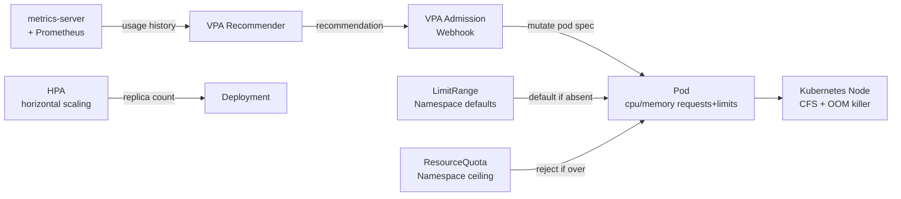

# Resource Limits, Requests & Vertical Pod Autoscaler

## Category

**Domain:** Production Hardening · **Stack:** Kubernetes, VPA, HPA · **Scope:** Resource Governance & Workload Stability

---

## Context

Every Kubernetes pod must declare **resource requests** (what the scheduler uses to place the pod) and **resource limits** (the hard ceiling the kernel enforces). Misconfigured resources are the single most common cause of production OOMKills, CPU throttling, noisy-neighbour starvation, and cluster over-provisioning. The **Vertical Pod Autoscaler (VPA)** automates right-sizing by observing actual usage and recommending (or automatically applying) tuned values.

### Requests vs Limits

| Setting | Effect | If Missing |
|---------|--------|-----------|
| `resources.requests.cpu` | Scheduler guarantee — pod is only placed on a node with this CPU free | Pod placed anywhere; may starve |
| `resources.requests.memory` | Scheduler guarantee — node must have this memory free | Pod may be placed on a full node |
| `resources.limits.cpu` | Kernel CFS throttle — process is rate-limited at this CPU ceiling | Pod can consume entire node's CPU |
| `resources.limits.memory` | OOM kill threshold — process is killed when it exceeds this | Pod can OOM the node; evicts others |

### QoS Classes

| Class | Condition | Eviction Priority |
|-------|-----------|------------------|
| **Guaranteed** | `requests == limits` for all containers | Last to be evicted |
| **Burstable** | `requests < limits` (partial) | Evicted under pressure |
| **BestEffort** | No requests or limits set | First to be evicted |

### Resource Sizing Formula

| Resource | Rule of Thumb |
|----------|--------------|
| CPU request | p50 observed usage + 20% headroom |
| CPU limit | 2–4× CPU request (allow bursting), or unset for latency-sensitive |
| Memory request | p99 observed usage + 20% headroom |
| Memory limit | p99 observed usage + 30% (must be ≥ request) |

---

## Pros

- `Guaranteed` QoS pods are never throttled or evicted under pressure — critical for latency-sensitive services
- VPA `Recommender` queries Prometheus/metrics-server and produces data-driven sizing without manual tuning
- LimitRange at namespace level sets defaults — new services get sensible limits without developer action
- ResourceQuota per namespace prevents a runaway deployment from consuming the entire cluster
- VPA `Off` mode (recommendations only) is safe to run alongside HPA with no conflict

## Cons

- Setting CPU limits can cause unnecessary throttling even when node has spare capacity — consider leaving CPU limit unset for latency-sensitive workloads
- VPA `Auto` mode restarts pods to apply new resource values — disruptive without a PDB
- VPA and HPA cannot both target the same metric (CPU) — use VPA for memory and HPA for CPU/custom metrics
- Memory OOMKill is immediate with no grace period — application has no chance to flush state
- Over-requesting resources wastes cluster capacity; under-requesting causes instability — requires periodic review

---

## Design Diagram



---

## Code Sample

### YAML — Pod Resource Requests & Limits (Guaranteed QoS)

```yaml
# k8s/deployment.yaml — resource configuration
apiVersion: apps/v1
kind: Deployment
metadata:
  name: payment-service
  namespace: production
spec:
  template:
    spec:
      containers:
        - name: payment-service
          image: payment-service:2.1.0
          resources:
            requests:
              cpu: "250m"       # scheduler places pod on node with ≥ 250m free
              memory: "256Mi"   # scheduler places pod on node with ≥ 256Mi free
            limits:
              # cpu limit omitted intentionally for latency-sensitive service
              # — avoids CFS throttling when node has spare capacity
              memory: "512Mi"   # OOMKill threshold — set 2× request for safety

        - name: otel-collector-sidecar
          image: otel/opentelemetry-collector-contrib:0.104.0
          resources:
            requests:
              cpu: "50m"
              memory: "64Mi"
            limits:
              cpu: "200m"
              memory: "128Mi"
```

### YAML — LimitRange (Namespace Default Guardrails)

```yaml
# k8s/namespace/limitrange.yaml
# Applied to each namespace — ensures every container has resource constraints
apiVersion: v1
kind: LimitRange
metadata:
  name: default-limits
  namespace: production
spec:
  limits:
    - type: Container
      default:            # applied when limits are absent
        cpu: "500m"
        memory: "256Mi"
      defaultRequest:     # applied when requests are absent
        cpu: "100m"
        memory: "128Mi"
      max:                # hard ceiling — no single container can exceed
        cpu: "4"
        memory: "4Gi"
      min:                # must have at least this to prevent zero-request starvation
        cpu: "10m"
        memory: "16Mi"
    - type: PersistentVolumeClaim
      max:
        storage: "50Gi"
```

### YAML — ResourceQuota (Namespace Budget)

```yaml
# k8s/namespace/resourcequota.yaml
# Prevents one team's runaway deployment from consuming the whole cluster
apiVersion: v1
kind: ResourceQuota
metadata:
  name: production-quota
  namespace: production
spec:
  hard:
    # Compute
    requests.cpu: "20"
    requests.memory: "40Gi"
    limits.cpu: "40"
    limits.memory: "80Gi"
    # Workloads
    pods: "100"
    count/deployments.apps: "30"
    count/statefulsets.apps: "10"
    # Storage
    requests.storage: "500Gi"
    persistentvolumeclaims: "20"
```

### YAML — Vertical Pod Autoscaler

```yaml
# k8s/vpa/payment-service-vpa.yaml
# Mode: "Off" = recommendations only (safe alongside HPA)
# Mode: "Auto" = applies recommendations via pod restart (use with PDB)
apiVersion: autoscaling.k8s.io/v1
kind: VerticalPodAutoscaler
metadata:
  name: payment-service-vpa
  namespace: production
spec:
  targetRef:
    apiVersion: apps/v1
    kind: Deployment
    name: payment-service
  updatePolicy:
    updateMode: "Off"     # "Off" | "Initial" | "Recreate" | "Auto"
  resourcePolicy:
    containerPolicies:
      - containerName: payment-service
        minAllowed:
          cpu: "50m"
          memory: "64Mi"
        maxAllowed:
          cpu: "2"
          memory: "2Gi"
        controlledResources: ["cpu", "memory"]
        controlledValues: RequestsAndLimits
```

### TypeScript — Runtime Memory Budget Check

```typescript
// src/observability/memory-guard.ts
// Emit a warning metric when heap approaches the container memory limit.
// Allows proactive alerting before the OOMKill happens.
import { Gauge } from 'prom-client';
import { logger } from './logger';

const heapUsageRatio = new Gauge({
  name: 'nodejs_heap_usage_ratio',
  help: 'Ratio of heap used to heap total (0–1)',
});

const WARN_THRESHOLD = 0.85; // warn at 85% heap utilisation

export function startMemoryGuard(intervalMs = 10_000): void {
  setInterval(() => {
    const { heapUsed, heapTotal, rss } = process.memoryUsage();
    const ratio = heapUsed / heapTotal;
    heapUsageRatio.set(ratio);

    if (ratio > WARN_THRESHOLD) {
      logger.warn(
        { heapUsedMb: Math.round(heapUsed / 1e6), heapTotalMb: Math.round(heapTotal / 1e6), rssMb: Math.round(rss / 1e6), ratio: ratio.toFixed(2) },
        'heap usage above warning threshold — approaching OOMKill boundary',
      );
    }
  }, intervalMs);
}
```
