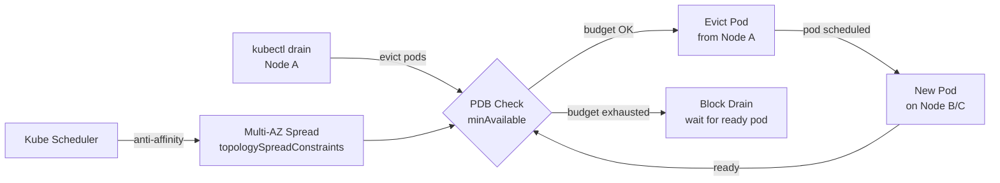

# Pod Disruption Budgets

## Category

**Domain:** Production Hardening · **Stack:** Kubernetes · **Scope:** High Availability During Voluntary Disruptions

---

## Context

A **Pod Disruption Budget (PDB)** is a Kubernetes policy that limits the number of pods of a replicated application that can be simultaneously unavailable during **voluntary disruptions** — rolling updates, node drains, cluster upgrades, and manual pod deletions. Without a PDB, a `kubectl drain` on two nodes simultaneously can take down all replicas of a 2-replica deployment, causing a complete service outage.

### Voluntary vs Involuntary Disruptions

| Type | Examples | PDB Applies? |
|------|---------|-------------|
| **Voluntary** | `kubectl drain`, rolling update, node auto-upgrade, scale-in | ✅ Yes — PDB blocks if budget is exhausted |
| **Involuntary** | Node hardware failure, OOMKill, kernel panic | ❌ No — PDB cannot prevent unplanned failures |

### PDB Parameters

| Parameter | Meaning | Use When |
|-----------|---------|---------|
| `minAvailable: N` | At least N pods must remain available | Services that need a fixed minimum (e.g. quorum) |
| `minAvailable: "X%"` | At least X% of replicas must remain available | Percentage makes it replica-count-agnostic |
| `maxUnavailable: N` | At most N pods can be disrupted at once | Clear disruption rate control |
| `maxUnavailable: "X%"` | At most X% of replicas can be disrupted at once | Most common for stateless services |

### Interaction with Rolling Updates

| Scenario | Without PDB | With PDB |
|----------|------------|----------|
| `kubectl drain` two nodes | Both nodes drained, all pods evicted | Second drain blocked until pods reschedule |
| Rolling update `maxUnavailable: 0` | Only HPA/deploy config protects | PDB ensures cluster-level contract |
| Cluster auto-upgrade | Nodes drained in batches — may evict too many | PDB forces safe batch sizes |

---

## Pros

- Prevents simultaneous eviction of all replicas during node drains — eliminates a whole class of outages
- Works seamlessly with cluster-autoscaler, `kubectl drain`, and managed upgrade operations (EKS, GKE, AKS)
- Percentage-based `minAvailable` scales with replica count changes automatically
- Alerting on `kube_poddisruptionbudget_status_expected_pods` metric surfaces misconfigured PDBs
- PDB violations block the drain — operators get immediate feedback rather than silent data loss

## Cons

- PDB can block node drains indefinitely if pods cannot be rescheduled (e.g. no other node has capacity) — requires cluster capacity headroom
- `minAvailable: 100%` blocks all voluntary disruptions — not useful in practice
- PDB does not protect against involuntary (unplanned) disruptions — still need replicas spread across AZs
- Single-replica deployments cannot have a meaningful PDB (`minAvailable: 1` blocks all drains)
- PDB misconfiguration (e.g. selector mismatch) silently does nothing — must verify with `kubectl get pdb`

---

## Design Diagram



---

## Code Sample

### YAML — PDB for Stateless Service (percentage-based)

```yaml
# k8s/pdb/payment-service-pdb.yaml
apiVersion: policy/v1
kind: PodDisruptionBudget
metadata:
  name: payment-service-pdb
  namespace: production
spec:
  # At most 25% of pods can be disrupted at any time.
  # For a 4-replica deployment: at most 1 pod unavailable.
  # For an 8-replica deployment: at most 2 pods unavailable.
  maxUnavailable: "25%"
  selector:
    matchLabels:
      app: payment-service
```

### YAML — PDB for Stateful Quorum Service (fixed minimum)

```yaml
# k8s/pdb/kafka-pdb.yaml
# Kafka requires quorum — at least 2 of 3 brokers must be available
apiVersion: policy/v1
kind: PodDisruptionBudget
metadata:
  name: kafka-pdb
  namespace: data
spec:
  minAvailable: 2      # quorum floor — never go below 2
  selector:
    matchLabels:
      app.kubernetes.io/name: kafka
```

### YAML — Topology Spread Constraints (complement to PDB)

```yaml
# k8s/deployment.yaml — spread pods across AZs so a zone failure
# doesn't take down more pods than PDB allows
apiVersion: apps/v1
kind: Deployment
metadata:
  name: payment-service
spec:
  replicas: 6
  template:
    spec:
      topologySpreadConstraints:
        - maxSkew: 1                            # max difference between AZ pod counts
          topologyKey: topology.kubernetes.io/zone
          whenUnsatisfiable: DoNotSchedule     # hard constraint
          labelSelector:
            matchLabels:
              app: payment-service
        - maxSkew: 1
          topologyKey: kubernetes.io/hostname   # also spread across nodes
          whenUnsatisfiable: ScheduleAnyway    # soft constraint
          labelSelector:
            matchLabels:
              app: payment-service
      affinity:
        podAntiAffinity:
          requiredDuringSchedulingIgnoredDuringExecution:
            - labelSelector:
                matchLabels:
                  app: payment-service
              topologyKey: kubernetes.io/hostname  # never two pods on same node
```

### YAML — Prometheus Alert: PDB at Disruption Limit

```yaml
# k8s/prometheus/pdb-alert-rules.yaml
apiVersion: monitoring.coreos.com/v1
kind: PrometheusRule
metadata:
  name: pdb-alerts
  namespace: observability
spec:
  groups:
    - name: pod-disruption-budget
      rules:
        # Alert when PDB is at its disruption limit (zero budget remaining)
        - alert: PodDisruptionBudgetAtLimit
          expr: |
            kube_poddisruptionbudget_status_current_healthy
            <= kube_poddisruptionbudget_status_desired_healthy
          for: 5m
          labels:
            severity: warning
            team: platform
          annotations:
            summary: "PDB {{ $labels.poddisruptionbudget }} has no remaining budget"
            description: >
              Namespace {{ $labels.namespace }}: PDB {{ $labels.poddisruptionbudget }}
              has {{ $value }} healthy pods — equal to minAvailable.
              Node drains will be blocked.
            runbook: "https://wiki.example.com/runbooks/pdb-at-limit"

        # Alert when zero pods are available (PDB budget already violated)
        - alert: PodDisruptionBudgetViolated
          expr: kube_poddisruptionbudget_status_current_healthy == 0
          for: 1m
          labels:
            severity: critical
          annotations:
            summary: "PDB {{ $labels.poddisruptionbudget }} has ZERO healthy pods"
```

### HCL — Terraform: Enforce PDB via Kyverno Policy

```hcl
# terraform/kyverno-require-pdb.tf
# Policy: all Deployments with replicas >= 2 must have a matching PDB
resource "kubernetes_manifest" "require_pdb_policy" {
  manifest = {
    apiVersion = "kyverno.io/v1"
    kind       = "ClusterPolicy"
    metadata = {
      name = "require-pod-disruption-budget"
      annotations = {
        "policies.kyverno.io/title"       = "Require PodDisruptionBudget"
        "policies.kyverno.io/severity"    = "medium"
        "policies.kyverno.io/description" = "All Deployments with 2+ replicas must have a PDB"
      }
    }
    spec = {
      validationFailureAction = "Audit"  # change to "Enforce" once teams are aware
      background              = true
      rules = [{
        name = "check-pdb-exists"
        match = {
          any = [{
            resources = {
              kinds      = ["Deployment"]
              namespaces = ["production", "staging"]
            }
          }]
        }
        preconditions = {
          all = [{
            key      = "{{ request.object.spec.replicas }}"
            operator = "GreaterThanOrEquals"
            value    = "2"
          }]
        }
        validate = {
          message = "Deployments with 2+ replicas must have a PodDisruptionBudget"
          deny = {
            conditions = {
              all = [{
                key      = "{{ request.object.metadata.name }}"
                operator = "AnyNotIn"
                value    = "{{ pdbs }}"
              }]
            }
          }
        }
      }]
    }
  }
}
```
