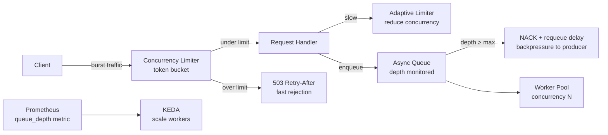

# Load Shedding & Backpressure

## Category

**Domain:** Production Hardening · **Stack:** TypeScript, Python, YAML · **Scope:** Controlled Degradation Under Overload

---

## Context

**Load shedding** is the deliberate rejection of excess requests when a service cannot safely process them — returning a fast `503` instead of queuing work that will succeed too late to be useful. **Backpressure** is the upstream propagation of capacity signals so that producers slow down before the system collapses.

Without load shedding, overloaded services accept work, slow down, queue up more work, exhaust memory, and then crash — affecting all in-flight requests simultaneously. With load shedding, excess requests fail predictably and quickly, protecting the requests that can be served.

### Load Shedding Strategies

| Strategy | Mechanism | Best For |
|----------|-----------|---------|
| **Concurrency limit** | Reject when in-flight requests > N | CPU-bound services |
| **Queue depth limit** | Reject when async queue depth > N | Worker pools |
| **Token bucket** | Allow N requests/s; reject bursts above refill rate | Rate-limited endpoints |
| **Adaptive concurrency** | Adjust limit based on latency (AIMD algorithm) | Variable workloads |
| **Priority queuing** | Shed low-priority traffic first | Mixed criticality APIs |
| **Admission control** | Upstream circuit-opens when downstream returns 503 | Cascading prevention |

### Backpressure Signals

| Signal | Transport | Consumer Action |
|--------|-----------|----------------|
| `503 + Retry-After` | HTTP | Slow down and retry after delay |
| `429 Too Many Requests` | HTTP | Rate-limit backoff |
| Queue depth metric | Prometheus | KEDA scale-out trigger |
| `NACK` with requeue delay | AMQP / SQS | Message producer pauses |
| gRPC status `RESOURCE_EXHAUSTED` | gRPC | Client-side exponential backoff |

---

## Pros

- Fast `503` rejection is orders of magnitude cheaper than slow processing under load
- Concurrency limits protect internal resources (DB connections, thread pools) from exhaustion
- Priority queuing ensures high-value traffic (payment confirmation) survives while low-value (reporting) sheds
- Adaptive concurrency (e.g. Netflix Concurrency Limiter) automatically discovers the right limit without manual tuning
- `Retry-After` header guides clients to retry correctly — reduces thundering herd on recovery

## Cons

- Hard concurrency limits require capacity planning — too low and you shed legitimate traffic in normal conditions
- Priority schemes require explicit tagging of every request type — operationally complex
- Adaptive concurrency algorithms oscillate under rapid load changes — need tuning warmup period
- Clients that ignore `503` + `Retry-After` retry immediately, amplifying load (require retry middleware on all clients)
- SQS visibility timeout and backpressure interact poorly: backing off consumer leaves messages invisible and unprocessed

---

## Design Diagram



---

## Code Sample

### TypeScript — Concurrency Limiter Middleware (Express)

```typescript
// src/middleware/concurrency-limiter.ts
// Rejects requests when too many are in-flight simultaneously.
// Protects DB connections and downstream dependencies from cascading overload.
import type { Request, Response, NextFunction } from 'express';
import { Gauge, Counter } from 'prom-client';
import { logger } from '../observability/logger';

const inFlight = new Gauge({
  name: 'http_requests_in_flight',
  help: 'Number of requests currently being processed',
  labelNames: ['priority'],
});

const shedTotal = new Counter({
  name: 'http_requests_shed_total',
  help: 'Total requests rejected due to concurrency limit',
  labelNames: ['reason'],
});

export function concurrencyLimiter(maxConcurrency: number) {
  let current = 0;

  return (req: Request, res: Response, next: NextFunction): void => {
    // Priority: internal health probes are never shed
    if (req.path === '/health' || req.path === '/ready') {
      return next();
    }

    if (current >= maxConcurrency) {
      shedTotal.labels('concurrency_limit').inc();
      logger.warn({ current, maxConcurrency, path: req.path }, 'request shed — concurrency limit');
      res
        .status(503)
        .set('Retry-After', '2')
        .json({ error: 'service_overloaded', retryAfterSeconds: 2 });
      return;
    }

    current++;
    inFlight.labels('normal').inc();

    res.on('finish', () => { current--; inFlight.labels('normal').dec(); });
    res.on('close',  () => { current--; inFlight.labels('normal').dec(); });
    next();
  };
}

// app.use(concurrencyLimiter(200)); // allow at most 200 concurrent requests
```

### TypeScript — Token Bucket Rate Limiter

```typescript
// src/middleware/token-bucket.ts
// In-process token bucket — use Redis-backed version for multi-instance deployments
import type { Request, Response, NextFunction } from 'express';

interface BucketState {
  tokens: number;
  lastRefill: number;
}

const buckets = new Map<string, BucketState>();

export function tokenBucket(opts: { ratePerSecond: number; burst: number }) {
  const { ratePerSecond, burst } = opts;

  return (req: Request, res: Response, next: NextFunction): void => {
    const key = req.ip ?? 'global';
    const now = Date.now();
    const state = buckets.get(key) ?? { tokens: burst, lastRefill: now };

    // Refill tokens proportional to elapsed time
    const elapsed = (now - state.lastRefill) / 1000;
    state.tokens = Math.min(burst, state.tokens + elapsed * ratePerSecond);
    state.lastRefill = now;

    if (state.tokens < 1) {
      buckets.set(key, state);
      const retryAfter = Math.ceil((1 - state.tokens) / ratePerSecond);
      res
        .status(429)
        .set('Retry-After', String(retryAfter))
        .set('X-RateLimit-Limit', String(burst))
        .json({ error: 'rate_limit_exceeded', retryAfterSeconds: retryAfter });
      return;
    }

    state.tokens -= 1;
    buckets.set(key, state);
    res.set('X-RateLimit-Remaining', String(Math.floor(state.tokens)));
    next();
  };
}
```

### Python — FastAPI Background Queue with Depth Backpressure

```python
# src/queue_worker.py
import asyncio
import logging
from fastapi import FastAPI, HTTPException

log = logging.getLogger(__name__)

MAX_QUEUE_DEPTH = 500
_queue: asyncio.Queue = asyncio.Queue(maxsize=MAX_QUEUE_DEPTH)
app = FastAPI()


@app.post("/jobs")
async def enqueue_job(payload: dict) -> dict:
    """Reject with 503 when queue is full — fast backpressure to caller."""
    if _queue.full():
        raise HTTPException(
            status_code=503,
            detail={"error": "queue_full", "queueDepth": MAX_QUEUE_DEPTH},
            headers={"Retry-After": "5"},
        )
    await _queue.put(payload)
    return {"status": "queued", "depth": _queue.qsize()}


async def worker(worker_id: int) -> None:
    """Process jobs from the queue. Bounded concurrency via worker count."""
    while True:
        job = await _queue.get()
        try:
            await process_job(job)
        except Exception as exc:
            log.error("job failed", exc_info=exc, extra={"job": job})
        finally:
            _queue.task_done()


async def process_job(job: dict) -> None:
    # Simulate work
    await asyncio.sleep(0.1)


@app.on_event("startup")
async def start_workers() -> None:
    for i in range(10):  # 10 concurrent workers — limits DB connection usage
        asyncio.create_task(worker(i))
```

### YAML — KEDA ScaledObject: Scale Workers on Queue Depth

```yaml
# k8s/keda/job-worker-scaledobject.yaml
# KEDA scales the worker deployment based on SQS queue depth.
# When depth rises, more workers are added — natural backpressure relief.
apiVersion: keda.sh/v1alpha1
kind: ScaledObject
metadata:
  name: job-worker-scaler
  namespace: production
spec:
  scaleTargetRef:
    name: job-worker
  minReplicaCount: 2
  maxReplicaCount: 50
  cooldownPeriod: 60
  triggers:
    - type: aws-sqs-queue
      metadata:
        queueURL: https://sqs.eu-west-1.amazonaws.com/123456789/job-queue
        queueLength: "10"       # target: 10 messages per worker instance
        awsRegion: eu-west-1
        identityOwner: operator
    - type: prometheus
      metadata:
        serverAddress: http://prometheus.observability.svc.cluster.local:9090
        query: |
          http_requests_in_flight{job="job-worker"}
        threshold: "50"         # also scale on in-flight request pressure
```
