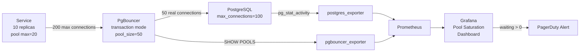

# Connection Pool Tuning

## Category

**Domain:** Production Hardening · **Stack:** TypeScript, Python, YAML · **Scope:** Database & HTTP Connection Pool Sizing & Monitoring

---

## Context

Connection pools are finite, shared resources. When pool exhaustion occurs — whether from a traffic burst, a slow query holding a connection, or misconfigured pool sizes — every new database call blocks until a connection becomes available. This cascades: blocked DB calls hold HTTP server threads, which exhaust the thread pool, which causes the load balancer to trigger health-check failures.

### Connection Pool Math

| Variable                           | Formula                                | Typical Value          |
| ---------------------------------- | -------------------------------------- | ---------------------- |
| `max_connections` (PostgreSQL)     | Determined by `shared_buffers` and RAM | 100–500                |
| PgBouncer `pool_size`              | max_connections × 0.8 ÷ service_count  | Per-service allocation |
| App pool `max`                     | p99 DB concurrency + 20% headroom      | 10–30 per instance     |
| App pool `min`                     | 2–5 (warm up connections)              | 2–5                    |
| App pool `connectionTimeoutMillis` | Fail fast, don't queue forever         | 3000ms                 |

**Golden rule:** `(app_pool_max × app_replicas) ≤ PgBouncer pool_size ≤ max_connections × 0.8`

### PgBouncer Pool Modes

| Mode            | Connection Reuse                           | Transaction Support   | Best For             |
| --------------- | ------------------------------------------ | --------------------- | -------------------- |
| **Session**     | 1 connection per client session            | Full                  | Long-lived clients   |
| **Transaction** | Connection returned after each transaction | Full                  | Stateless services ✓ |
| **Statement**   | Connection returned after each statement   | No multi-statement TX | Read-only analytics  |

---

## Pros

- Right-sized pools prevent "too many connections" errors without over-provisioning PostgreSQL `max_connections`
- PgBouncer transaction mode multiplexes thousands of app connections into a small DB pool — essential for serverless/functions
- Connection timeout (fail fast) prevents thread pile-up: callers get an immediate error instead of hanging for minutes
- Pool metrics (active, idle, waiting) surface saturation before it causes errors
- Pool warmup at startup eliminates connection latency spike on first post-deploy traffic

## Cons

- Transaction-mode PgBouncer cannot support `SET`, `LISTEN/NOTIFY`, prepared statements that span transactions
- Too-small `connectionTimeoutMillis` causes unnecessary failures during transient load spikes (brief queuing is OK)
- Application-level pool + PgBouncer + PostgreSQL creates three independent limits — all three must be coordinated
- Draining a connection pool during shutdown (all connections must be idle) adds latency to graceful shutdown sequence
- HikariCP/node-postgres reset connection state on return — session-level settings (`SET search_path`) are lost

---

## Design Diagram



---

## Code Sample

### TypeScript — node-postgres Pool Configuration

```typescript
// src/db/pg-pool.ts
import { Pool, PoolConfig } from "pg";
import { logger } from "../observability/logger";
import { Gauge, Histogram } from "prom-client";

const poolWaitTime = new Histogram({
  name: "db_pool_wait_seconds",
  help: "Time waiting to acquire a DB connection from the pool",
  buckets: [0.001, 0.005, 0.01, 0.05, 0.1, 0.5, 1, 5],
});

const poolConnections = new Gauge({
  name: "db_pool_connections",
  help: "Database pool connection counts",
  labelNames: ["state"], // 'total' | 'idle' | 'waiting'
});

const config: PoolConfig = {
  host: process.env.DB_HOST,
  port: Number(process.env.DB_PORT ?? 5432),
  database: process.env.DB_NAME,
  user: process.env.DB_USER,
  password: process.env.DB_PASSWORD,
  ssl: { rejectUnauthorized: true },

  // Pool sizing — tune based on observed p99 concurrency
  max: Number(process.env.DB_POOL_MAX ?? 20),
  min: 2, // keep warm connections
  idleTimeoutMillis: 30_000, // release idle connections after 30s
  connectionTimeoutMillis: 3_000, // fail fast if pool exhausted
  statement_timeout: 10_000, // kill slow queries at DB level
  query_timeout: 10_000, // node-postgres client-side timeout
};

export const pool = new Pool(config);

// Pool event instrumentation
pool.on("connect", () => {
  poolConnections.labels("total").inc();
  logger.debug(
    { totalCount: pool.totalCount, idleCount: pool.idleCount },
    "db connection created",
  );
});
pool.on("remove", () => poolConnections.labels("total").dec());

// Instrumented query wrapper — measures pool wait time
export async function query<T>(sql: string, params?: unknown[]): Promise<T[]> {
  const start = process.hrtime.bigint();
  const client = await pool.connect();
  const waitSeconds = Number(process.hrtime.bigint() - start) / 1e9;
  poolWaitTime.observe(waitSeconds);

  poolConnections.labels("idle").set(pool.idleCount);
  poolConnections.labels("waiting").set(pool.waitingCount);

  try {
    const result = await client.query(sql, params);
    return result.rows as T[];
  } finally {
    client.release();
  }
}

// Warm up pool at startup (avoids cold-start latency on first requests)
export async function warmPool(): Promise<void> {
  const clients = await Promise.all(
    Array.from({ length: config.min ?? 2 }, () => pool.connect()),
  );
  clients.forEach((c) => c.release());
  logger.info({ min: config.min }, "database pool warmed");
}
```

### Python — SQLAlchemy Async Pool Configuration

```python
# src/db/engine.py
import os
from sqlalchemy.ext.asyncio import create_async_engine, AsyncEngine
from sqlalchemy.pool import AsyncAdaptedQueuePool


def create_engine() -> AsyncEngine:
    database_url = os.environ["DATABASE_URL"]  # postgresql+asyncpg://...

    return create_async_engine(
        database_url,
        # Pool sizing
        pool_size=int(os.environ.get("DB_POOL_MAX", "10")),
        max_overflow=5,           # allow up to 5 extra connections during burst
        pool_pre_ping=True,       # validate connection alive before use
        pool_recycle=3600,        # recycle connections older than 1h (avoids stale)
        pool_timeout=3.0,         # raise TimeoutError if pool exhausted after 3s
        # Query timeout enforcement
        connect_args={
            "command_timeout": 10,              # asyncpg: timeout per statement
            "server_settings": {
                "idle_in_transaction_session_timeout": "30000",
                "statement_timeout": "10000",
            },
        },
        # Echo SQL only in local dev
        echo=os.environ.get("ENV") == "development",
    )
```

### YAML — PgBouncer Configuration

```yaml
# k8s/pgbouncer/pgbouncer.ini (mounted as ConfigMap)
[databases]
# Route to actual PostgreSQL (can be RDS writer endpoint)
payments = host=rds-writer.cluster.eu-west-1.rds.amazonaws.com port=5432 dbname=payments

[pgbouncer]
listen_port = 5432
listen_addr = 0.0.0.0
auth_type = scram-sha-256
auth_file = /etc/pgbouncer/userlist.txt

pool_mode = transaction          # transaction mode for stateless services
max_client_conn = 5000           # max frontend (app) connections accepted
default_pool_size = 50           # max backend (PostgreSQL) connections per database
reserve_pool_size = 10           # emergency connections for priority traffic
reserve_pool_timeout = 3         # seconds before fallback to reserve pool

# Timeouts
server_connect_timeout = 5       # seconds to establish PostgreSQL connection
server_idle_timeout = 600        # release idle server connections after 10m
client_idle_timeout = 300        # disconnect idle clients after 5m
query_timeout = 30               # kill queries running longer than 30s

# Monitoring
stats_period = 60                # expose SHOW STATS every 60s
log_connections = 0              # disable verbose connection logging (high volume)
log_disconnections = 0
```

### YAML — Prometheus Alerts: Pool Saturation

```yaml
# k8s/prometheus/pool-alerts.yaml
apiVersion: monitoring.coreos.com/v1
kind: PrometheusRule
metadata:
  name: connection-pool-alerts
  namespace: observability
spec:
  groups:
    - name: connection-pools
      rules:
        # App pool: connections waiting for > 1s
        - alert: DBPoolWaitHigh
          expr: histogram_quantile(0.95, rate(db_pool_wait_seconds_bucket[5m])) > 1
          for: 5m
          labels:
            severity: warning
          annotations:
            summary: "DB pool p95 wait > 1s on {{ $labels.instance }}"
            description: "Increase DB_POOL_MAX or scale service replicas"

        # PgBouncer: clients actively waiting for a connection
        - alert: PgBouncerClientsWaiting
          expr: pgbouncer_stats_client_wait_time_seconds > 0
          for: 2m
          labels:
            severity: critical
          annotations:
            summary: "PgBouncer pool exhausted — clients waiting"
            description: "Pool {{ $labels.database }} has {{ $value }}s avg wait — increase pool_size or scale DB"
```
