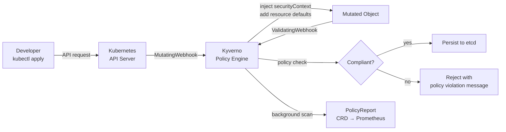

# Admission Controllers & Policy Guardrails

## Category

**Domain:** Production Hardening · **Stack:** Kyverno, OPA Gatekeeper, YAML · **Scope:** Cluster-Level Policy Enforcement & Default Hardening

---

## Context

Kubernetes **admission controllers** intercept API server requests before objects are persisted, enabling two critical operations: **validation** (reject non-compliant objects) and **mutation** (automatically inject defaults). Policy engines like **Kyverno** and **OPA Gatekeeper** extend this with declarative, version-controlled policies that enforce hardening standards at deploy time — before bad configurations reach production.

### Webhook Types

| Type | Purpose | Effect |
|------|---------|--------|
| **MutatingAdmissionWebhook** | Modify incoming objects | Inject `securityContext`, add labels, set resource defaults |
| **ValidatingAdmissionWebhook** | Accept or reject objects | Block images without digest, reject root containers |

### Common Policy Domains

| Domain | Example Policy |
|--------|---------------|
| **Image safety** | Require `sha256` digest; block `latest` tag in production |
| **Security context** | Require `runAsNonRoot: true`; disallow `privileged: true` |
| **Resource governance** | Require `requests`/`limits` on all containers |
| **Networking** | Require `NetworkPolicy`; disallow `hostNetwork: true` |
| **Labels** | Require `app`, `team`, `version` labels on all workloads |
| **Registry allow-list** | Only allow images from approved registries |
| **PDB** | Require PDB for Deployments with replicas ≥ 2 |

### Policy Engines Comparison

| Feature | Kyverno | OPA Gatekeeper |
|---------|---------|---------------|
| Language | YAML-native | Rego |
| Learning curve | Low | High |
| Mutation support | ✅ Full | ✅ Partial |
| Test framework | ✅ `kyverno test` | ✅ `opa test` |
| Generate resources | ✅ Yes | ❌ No |
| Audit mode | ✅ Yes | ✅ Yes |

---

## Pros

- Policies are version-controlled YAML — enforced consistently across all clusters and namespaces
- Mutation webhooks eliminate manual boilerplate: `securityContext` and resource defaults are injected automatically
- `Audit` mode surfaces violations without blocking — allows gradual rollout before enabling `Enforce`
- Kyverno `generate` rules auto-create NetworkPolicies and ConfigMaps in new namespaces
- Policy reports (Kyverno `PolicyReport` CRD) expose current violations as Prometheus metrics

## Cons

- Admission webhooks add latency to every API server write (typically 5–20ms) — must be `failOpen` to avoid cluster outages if webhook is unreachable
- Overly strict policies block legitimate emergency operations — need a break-glass process with audit trail
- Rego (OPA) has steep learning curve; complex policies are hard to read and test
- Kyverno mutation can surprise developers: their YAML is silently modified before apply, causing drift between local and cluster state
- Policy drift across clusters is common if policy repos and GitOps workflows are not synchronized

---

## Design Diagram



---

## Code Sample

### YAML — Kyverno: Block `latest` Tag in Production

```yaml
# k8s/policies/block-latest-tag.yaml
apiVersion: kyverno.io/v1
kind: ClusterPolicy
metadata:
  name: block-latest-tag
  annotations:
    policies.kyverno.io/title: "Block latest image tag"
    policies.kyverno.io/severity: "high"
    policies.kyverno.io/description: >
      Using :latest bypasses image pinning and breaks reproducible deployments.
      All production workloads must reference images by SHA256 digest or semver tag.
spec:
  validationFailureAction: Enforce      # Audit | Enforce
  background: true
  rules:
    - name: block-latest-or-missing-tag
      match:
        any:
          - resources:
              kinds: [Pod]
              namespaces: [production]
      validate:
        message: >
          Image '{{ request.object.spec.containers[0].image }}' uses :latest tag or
          has no tag. Use a versioned tag (e.g. :1.2.3) or SHA256 digest.
        foreach:
          - list: "request.object.spec.containers"
            deny:
              conditions:
                any:
                  - key: "{{ element.image }}"
                    operator: EndsWith
                    value: ":latest"
                  - key: "{{ element.image }}"
                    operator: NotContains
                    value: ":"
```

### YAML — Kyverno: Mutate — Inject Security Context

```yaml
# k8s/policies/inject-security-context.yaml
# Automatically adds a hardened securityContext to containers that don't set one
apiVersion: kyverno.io/v1
kind: ClusterPolicy
metadata:
  name: inject-security-context
  annotations:
    policies.kyverno.io/title: "Inject default security context"
    policies.kyverno.io/severity: "medium"
spec:
  rules:
    - name: add-security-context
      match:
        any:
          - resources:
              kinds: [Pod]
      mutate:
        foreach:
          - list: "request.object.spec.containers"
            patchStrategicMerge:
              spec:
                containers:
                  - (name): "{{ element.name }}"
                    securityContext:
                      runAsNonRoot: true
                      runAsUser: 1000
                      allowPrivilegeEscalation: false
                      readOnlyRootFilesystem: true
                      capabilities:
                        drop: ["ALL"]
                      seccompProfile:
                        type: RuntimeDefault
```

### YAML — Kyverno: Validate — Require Resource Limits

```yaml
# k8s/policies/require-resource-limits.yaml
apiVersion: kyverno.io/v1
kind: ClusterPolicy
metadata:
  name: require-resource-limits
  annotations:
    policies.kyverno.io/title: "Require CPU and memory limits"
    policies.kyverno.io/severity: "high"
spec:
  validationFailureAction: Audit      # start in Audit; move to Enforce after 30 days
  background: true
  rules:
    - name: check-resource-limits
      match:
        any:
          - resources:
              kinds: [Pod]
              namespaces: [production, staging]
      validate:
        message: "Container '{{ element.name }}' must set resources.limits.memory"
        foreach:
          - list: "request.object.spec.containers"
            deny:
              conditions:
                any:
                  - key: "{{ element.resources.limits.memory || '' }}"
                    operator: Equals
                    value: ""
```

### YAML — Kyverno: Generate — Auto-create NetworkPolicy for New Namespaces

```yaml
# k8s/policies/generate-networkpolicy.yaml
# When a new namespace is created with label app-type=service,
# automatically create a default-deny NetworkPolicy
apiVersion: kyverno.io/v1
kind: ClusterPolicy
metadata:
  name: generate-default-deny-networkpolicy
spec:
  rules:
    - name: generate-network-policy
      match:
        any:
          - resources:
              kinds: [Namespace]
              selector:
                matchLabels:
                  app-type: service
      generate:
        apiVersion: networking.k8s.io/v1
        kind: NetworkPolicy
        name: default-deny-all
        namespace: "{{ request.object.metadata.name }}"
        synchronize: true    # update if policy changes
        data:
          spec:
            podSelector: {}  # apply to all pods in namespace
            policyTypes:
              - Ingress
              - Egress
            egress:
              - ports:
                  - port: 53    # always allow DNS resolution
                    protocol: UDP
```

### YAML — OPA Gatekeeper: Constraint Template (registry allow-list)

```yaml
# k8s/gatekeeper/allowed-registries-template.yaml
apiVersion: templates.gatekeeper.sh/v1
kind: ConstraintTemplate
metadata:
  name: allowedregistries
spec:
  crd:
    spec:
      names:
        kind: AllowedRegistries
      validation:
        openAPIV3Schema:
          type: object
          properties:
            registries:
              type: array
              items: { type: string }
  targets:
    - target: admission.k8s.gatekeeper.sh
      rego: |
        package allowedregistries
        violation[{"msg": msg}] {
          container := input.review.object.spec.containers[_]
          not any_allowed(container.image)
          msg := sprintf("Container '%v' uses image '%v' from an unapproved registry", [container.name, container.image])
        }
        any_allowed(image) {
          registry := input.parameters.registries[_]
          startswith(image, registry)
        }
---
apiVersion: constraints.gatekeeper.sh/v1beta1
kind: AllowedRegistries
metadata:
  name: prod-allowed-registries
spec:
  enforcementAction: deny
  match:
    kinds:
      - apiGroups: [""]
        kinds: ["Pod"]
    namespaces: ["production"]
  parameters:
    registries:
      - "123456789.dkr.ecr.eu-west-1.amazonaws.com/"
      - "ghcr.io/myorg/"
```
