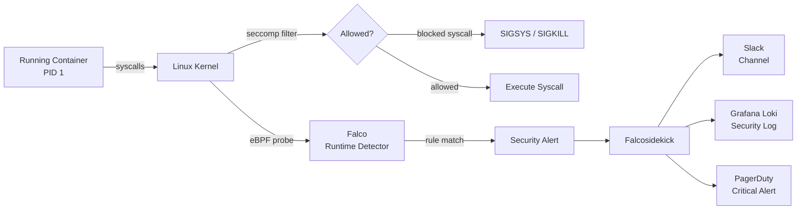

# Runtime Security with Falco & Seccomp

## Category

**Domain:** Production Hardening · **Stack:** Falco, Kubernetes, seccomp · **Scope:** Syscall-Level Threat Detection & Container Hardening

---

## Context

Container security controls at the image build and admission stages are **preventive**, but once a container is running, a compromised dependency or zero-day exploit can perform malicious syscalls that bypass those controls. **Runtime security** detects anomalous behaviour at the kernel syscall level — shell spawns inside a container, unexpected outbound connections, file writes to sensitive paths — and generates alerts or kills the offending process.

### Defence Layers

| Layer                 | Tool                              | What It Prevents                                              |
| --------------------- | --------------------------------- | ------------------------------------------------------------- |
| **Image**             | Trivy, Snyk                       | Known CVEs in base image                                      |
| **Admission**         | Kyverno, OPA                      | Misconfigured pod specs                                       |
| **seccomp profile**   | Kernel seccomp                    | Block unused dangerous syscalls (`ptrace`, `mount`, `setuid`) |
| **AppArmor**          | AppArmor LSM                      | Restrict filesystem and network access                        |
| **Runtime detection** | Falco                             | Alert on unexpected behaviour post-deployment                 |
| **Response**          | Falcosidekick → PagerDuty / block | Automated threat response                                     |

### Key Falco Rule Categories

| Category                  | Example Trigger                                      | Severity |
| ------------------------- | ---------------------------------------------------- | -------- |
| **Shell in container**    | `execve` of `sh`, `bash`, `python` in prod container | Critical |
| **Unexpected outbound**   | Container connects to non-whitelisted IP:port        | High     |
| **Sensitive file access** | Read of `/etc/shadow`, `/proc/*/mem`                 | Critical |
| **Privilege escalation**  | `setuid` / `setgid` syscall, `ptrace`                | Critical |
| **Crypto miner**          | High CPU + outbound to mining pool port              | Critical |
| **kubectl exec**          | Pod exec from outside cluster                        | High     |

---

## Pros

- Falco detects compromise at the syscall layer — works even against zero-day exploits that bypass image scanning
- seccomp `RuntimeDefault` profile blocks 300+ dangerous syscalls with zero application code changes
- Falcosidekick routes alerts to Slack, PagerDuty, Loki, Elasticsearch — one source of security events
- Custom Falco rules can encode application-specific threat models (e.g. payment service should never exec a shell)
- eBPF probe (Falco's modern driver) has minimal performance overhead (< 1% CPU) vs legacy kernel module

## Cons

- Falco requires either a kernel module or eBPF probe — needs privileged DaemonSet or kernel version support
- Default Falco ruleset has high false-positive rate — requires tuning for each application's legitimate syscall profile
- seccomp `Localhost` profile must be pre-distributed to all nodes before pods can reference it
- AppArmor profiles are kernel-version and distro-specific — harder to maintain across heterogeneous node pools
- Falco runtime enforcement (SIGKILL on violation) can cause legitimate service outages if rules are misconfigured

---

## Design Diagram



---

## Code Sample

### YAML — Falco Helm Values + Custom Rules

```yaml
# k8s/falco/values.yaml
# helm install falco falcosecurity/falco -f values.yaml

driver:
  kind: ebpf # modern eBPF probe — no kernel module required

falcosidekick:
  enabled: true
  config:
    slack:
      webhookurl: "" # set via secret
      channel: "#security-alerts"
      minimumpriority: "warning"
    loki:
      serverurl: "http://loki.observability.svc.cluster.local:3100"
      minimumpriority: "notice"
    pagerduty:
      routingkey: "" # set via secret
      minimumpriority: "critical"

customRules:
  payment-service-rules.yaml: |
    # payment-service should NEVER exec a shell
    - rule: Shell Spawned in Payment Service
      desc: A shell was started in the payment service container
      condition: >
        spawned_process and
        container.name = "payment-service" and
        proc.name in (shell_binaries)
      output: >
        Shell spawned in payment service (user=%user.name cmd=%proc.cmdline
        container=%container.id image=%container.image.repository)
      priority: CRITICAL
      tags: [payment, shell, T1059]

    # Block unexpected outbound connections from payment service
    - rule: Unexpected Outbound from Payment Service
      desc: payment-service made a network connection to an unexpected destination
      condition: >
        outbound and
        container.name = "payment-service" and
        not fd.sip in (payment_allowed_ips)
      output: >
        Unexpected outbound connection from payment-service
        (connection=%fd.name user=%user.name container=%container.id)
      priority: HIGH

    # Define allowed IPs macro
    - macro: payment_allowed_ips
      condition: >
        fd.sip in ("10.0.0.0/8", "172.16.0.0/12")  # internal CIDR only
```

### YAML — seccomp RuntimeDefault Profile (Pod Spec)

```yaml
# k8s/deployment.yaml — seccomp hardening
# RuntimeDefault blocks dangerous syscalls (ptrace, mount, kexec_load, etc.)
# with zero performance impact on typical web services
apiVersion: apps/v1
kind: Deployment
metadata:
  name: payment-service
spec:
  template:
    spec:
      securityContext:
        seccompProfile:
          type: RuntimeDefault # use the container runtime's default (recommended)
        runAsNonRoot: true
        runAsUser: 1000
        fsGroup: 1000
      containers:
        - name: payment-service
          securityContext:
            allowPrivilegeEscalation: false
            readOnlyRootFilesystem: true
            capabilities:
              drop: ["ALL"] # drop ALL Linux capabilities (incl. NET_BIND_SERVICE)
              add: [] # add none back unless strictly needed
          volumeMounts:
            - name: tmp
              mountPath: /tmp # writable tmp since rootfs is read-only
      volumes:
        - name: tmp
          emptyDir: {}
```

### YAML — Custom seccomp Localhost Profile

```yaml
# /var/lib/kubelet/seccomp/payment-service.json (distributed via DaemonSet)
# Allows only the syscalls payment-service actually needs
{
  "defaultAction": "SCMP_ACT_ERRNO",
  "syscalls":
    [
      {
        "names":
          [
            "accept4",
            "bind",
            "clone",
            "close",
            "connect",
            "epoll_create1",
            "epoll_ctl",
            "epoll_pwait",
            "eventfd2",
            "exit",
            "exit_group",
            "fcntl",
            "fstat",
            "futex",
            "getpid",
            "getrandom",
            "getsockname",
            "getsockopt",
            "listen",
            "mmap",
            "mprotect",
            "munmap",
            "nanosleep",
            "openat",
            "pread64",
            "read",
            "recvfrom",
            "recvmsg",
            "rt_sigaction",
            "rt_sigprocmask",
            "rt_sigreturn",
            "sendmsg",
            "sendto",
            "setsockopt",
            "sigaltstack",
            "socket",
            "stat",
            "write",
            "writev",
          ],
        "action": "SCMP_ACT_ALLOW",
      },
    ],
}
```

Reference in pod spec:

```yaml
securityContext:
  seccompProfile:
    type: Localhost
    localhostProfile: payment-service.json
```

### YAML — Kyverno Policy: Require seccomp RuntimeDefault

```yaml
# k8s/policies/require-seccomp.yaml
apiVersion: kyverno.io/v1
kind: ClusterPolicy
metadata:
  name: require-seccomp-profile
  annotations:
    policies.kyverno.io/title: "Require seccomp RuntimeDefault"
    policies.kyverno.io/severity: "high"
spec:
  validationFailureAction: Audit
  background: true
  rules:
    - name: check-seccomp
      match:
        any:
          - resources:
              kinds: [Pod]
              namespaces: [production]
      validate:
        message: >
          Pod must set seccompProfile.type to 'RuntimeDefault' or 'Localhost'.
          Unconfined seccomp allows all syscalls and weakens container isolation.
        pattern:
          spec:
            securityContext:
              seccompProfile:
                type: "RuntimeDefault | Localhost"
```
