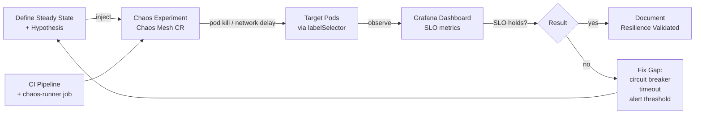

# Chaos Engineering

## Category

**Domain:** Production Hardening · **Stack:** Chaos Mesh, LitmusChaos, TypeScript · **Scope:** Controlled Failure Injection & Resilience Validation

---

## Context

**Chaos engineering** is the practice of intentionally injecting failures into a production-like environment to verify that resilience mechanisms (circuit breakers, retries, autoscaling, alerts) work as designed. Without it, resilience assumptions remain untested hypotheses — the first real test is an actual outage.

The core practice follows a scientific method: define a **steady state**, hypothesise it holds under failure, inject the failure, **observe** whether the hypothesis holds, and **fix** gaps in resilience.

### Experiment Types

| Experiment | What It Tests | Tool |
|-----------|--------------|------|
| **Pod kill** | Restart tolerance, readiness probe config | Chaos Mesh, Litmus |
| **Network delay** | Timeout policies, retry behaviour | Chaos Mesh `NetworkChaos` |
| **Network partition** | Circuit breaker, fallback activation | Chaos Mesh |
| **Memory pressure** | OOMKill handling, VPA response | Chaos Mesh `StressChaos` |
| **CPU saturation** | HPA trigger, load shedding | Chaos Mesh `StressChaos` |
| **Disk fill** | Log rotation, pod eviction | Litmus |
| **DNS failure** | Service discovery fallback | Chaos Mesh |
| **Clock skew** | JWT expiry, cert validation | Chaos Mesh `TimeChaos` |

### Blast Radius Control

| Control | Mechanism |
|---------|----------|
| **Selector scope** | Target specific pod labels only |
| **Namespace isolation** | Run experiments only in `staging` or isolated `chaos` namespace |
| **Scheduled experiments** | Run during business hours with on-call engineer present |
| **Abort criteria** | Automatic rollback if SLO drops below threshold |
| **Feature flags** | Enable/disable chaos injection via runtime flag |

---

## Pros

- Validates resilience mechanisms before real incidents — discovers gaps in circuit breakers, timeouts, and alerts
- Chaos experiments are runbooks in reverse: they document *how* the system responds to failure, not just *what to do when* it fails
- Continuous chaos (GameDays) builds team confidence and muscle memory for incident response
- Automated chaos integrated in CI pipelines catches regressions before they reach production
- Network delay experiments reveal timeout misconfiguration (e.g. inner timeout > outer timeout)

## Cons

- Running chaos in production requires mature observability and on-call readiness — never run blind
- Poorly scoped experiments with wide selectors can cause real customer impact
- Engineers must dedicate time to design, run, observe, and fix — chaos without follow-through is waste
- Some failure modes (hardware failure, kernel panic, cloud AZ outage) cannot be realistically simulated at cluster level
- CNIs/service meshes interact with Chaos Mesh network faults in complex ways — validate in staging first

---

## Design Diagram



---

## Code Sample

### YAML — Chaos Mesh: Pod Kill Experiment

```yaml
# k8s/chaos/pod-kill.yaml
# Randomly kills one payment-service pod every 5 minutes in staging
# Validates: readiness probes, PDB, zero-downtime restart
apiVersion: chaos-mesh.org/v1alpha1
kind: PodChaos
metadata:
  name: payment-pod-kill
  namespace: chaos-testing
spec:
  action: pod-kill
  mode: one              # kill one pod at a time (respects PDB)
  selector:
    namespaces:
      - staging
    labelSelectors:
      app: payment-service
  scheduler:
    cron: "@every 5m"   # run every 5 minutes
  duration: "30s"
```

### YAML — Chaos Mesh: Network Delay Experiment

```yaml
# k8s/chaos/network-latency.yaml
# Adds 200ms ± 50ms latency to all traffic from order-service to payment-service
# Validates: timeout policy, retry behaviour, SLO degradation alerting
apiVersion: chaos-mesh.org/v1alpha1
kind: NetworkChaos
metadata:
  name: payment-latency
  namespace: chaos-testing
spec:
  action: delay
  mode: all
  selector:
    namespaces:
      - staging
    labelSelectors:
      app: order-service
  delay:
    latency: "200ms"
    correlation: "25"
    jitter: "50ms"
  direction: egress
  externalTargets:
    - payment-service.staging.svc.cluster.local
  duration: "10m"
```

### YAML — LitmusChaos: CPU Stress Experiment

```yaml
# k8s/chaos/cpu-stress.yaml
# Stresses CPU on 50% of payment-service pods for 5 minutes
# Validates: HPA triggers, request latency impact, load shedding activation
apiVersion: litmuschaos.io/v1alpha1
kind: ChaosEngine
metadata:
  name: payment-cpu-stress
  namespace: chaos-testing
spec:
  appinfo:
    appns: staging
    applabel: "app=payment-service"
    appkind: deployment
  chaosServiceAccount: litmus-admin
  experiments:
    - name: pod-cpu-hog
      spec:
        components:
          env:
            - name: CPU_CORES
              value: "2"              # consume 2 CPU cores per pod
            - name: TOTAL_CHAOS_DURATION
              value: "300"            # 5 minutes
            - name: PODS_AFFECTED_PERC
              value: "50"             # target 50% of replicas
        probe:
          - name: payment-slo-probe
            type: promProbe
            mode: Continuous
            runProperties:
              probeTimeout: 5000
              interval: 15
              retry: 3
            promProbe/inputs:
              endpoint: "http://prometheus.observability.svc.cluster.local:9090"
              query: |
                sum(rate(http_requests_total{app="payment-service",status_code=~"5.."}[1m]))
                / sum(rate(http_requests_total{app="payment-service"}[1m]))
              comparator:
                type: float
                criteria: "<="
                value: "0.01"      # abort if error rate exceeds 1%
```

### TypeScript — Chaos Validation Helper (CI Integration)

```typescript
// scripts/chaos-validate.ts
// Run after a chaos experiment to validate the steady state was maintained
import { logger } from '../src/observability/logger';

interface SteadyState {
  metric: string;
  prometheusQuery: string;
  threshold: number;
  comparator: '<=' | '>=' | '==';
}

const STEADY_STATE: SteadyState[] = [
  {
    metric: 'error_rate',
    prometheusQuery: `sum(rate(http_requests_total{status_code=~"5.."}[5m])) / sum(rate(http_requests_total[5m]))`,
    threshold: 0.01,  // < 1% error rate
    comparator: '<=',
  },
  {
    metric: 'p99_latency_seconds',
    prometheusQuery: `histogram_quantile(0.99, rate(http_request_duration_seconds_bucket[5m]))`,
    threshold: 1.0,   // < 1s p99
    comparator: '<=',
  },
];

async function queryPrometheus(query: string): Promise<number> {
  const url = `${process.env.PROMETHEUS_URL}/api/v1/query?query=${encodeURIComponent(query)}`;
  const resp = await fetch(url);
  const json = await resp.json() as { data: { result: Array<{ value: [number, string] }> } };
  return parseFloat(json.data.result[0]?.value[1] ?? '0');
}

async function validateSteadyState(): Promise<void> {
  let passed = true;
  for (const check of STEADY_STATE) {
    const value = await queryPrometheus(check.prometheusQuery);
    const ok =
      check.comparator === '<=' ? value <= check.threshold :
      check.comparator === '>=' ? value >= check.threshold :
      value === check.threshold;

    if (!ok) {
      logger.error({ metric: check.metric, value, threshold: check.threshold }, 'steady state violated');
      passed = false;
    } else {
      logger.info({ metric: check.metric, value }, 'steady state OK');
    }
  }
  process.exit(passed ? 0 : 1);
}

validateSteadyState().catch((err) => { logger.error(err); process.exit(1); });
```
