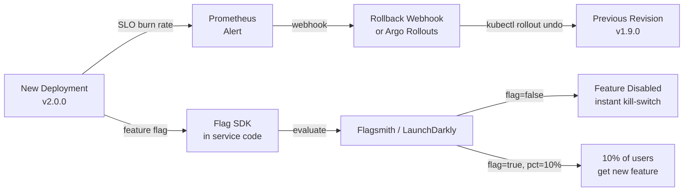

# Rollback Strategy & Feature Flags

## Category

**Domain:** Production Hardening · **Stack:** ArgoCD, TypeScript, YAML · **Scope:** Safe Deployment Rollback & Runtime Feature Control

---

## Context

Every deployment is a risk. **Rollback** is the emergency eject button; **feature flags** are the precision instrument. A mature production hardening strategy uses both: feature flags for controlled activation with instant kill-switches, and automated rollback (triggered by SLO burns) as the last safety net when a release causes regressions.

### Decision Matrix: Rollback vs Feature Flag

| Situation | Preferred Tool | Reason |
|-----------|---------------|--------|
| Logic bug in the code itself | Git revert + rollback deployment | Flag cannot mitigate a crash in shared code |
| New feature causing user-facing issues | Feature flag → disable | No deployment required — instant |
| Database schema change | Forward-only fix | Rollback risks data loss |
| Performance regression in refactored code | Rollback deployment | Flag may not isolate refactored path |
| A/B test causing conversion drop | Feature flag → disable variant | Data-safe, instant |
| Security vulnerability in dependency | Rollback + hotfix deployment | Flag cannot patch a library |

### Feature Flag Strategies

| Strategy | Use Case | Tool |
|----------|---------|------|
| **Boolean kill switch** | On/off for all users | LaunchDarkly, Flipt, Unleash |
| **Percentage rollout** | Canary at application level | LaunchDarkly, Flagsmith |
| **User targeting** | Beta users, internal employees | LaunchDarkly, GrowthBook |
| **Header-based** | QA testing in production | Custom middleware |
| **SLO-triggered** | Auto-disable on error rate spike | Custom + Prometheus alert webhook |

---

## Pros

- ArgoCD `rollback` to a previous `appRevision` is a single command — no manual YAML required
- SLO-triggered automated rollback can revert a bad deploy in under 2 minutes without human intervention
- Feature flags decouple deployment from release — dangerous code is deployed but inactive until deliberately enabled
- Percentage rollouts let teams control blast radius at the application layer without changing Kubernetes resources
- Flag evaluation at runtime means no pod restart is needed to enable or disable a feature

## Cons

- Feature flags accumulate technical debt if not cleaned up after features reach 100% rollout
- Automated rollback without human review can mask root causes — a rollback loop on a persistent bug wastes resources
- ArgoCD rollback to a previous image does not revert database migrations — must be handled separately
- Rollback of a multi-service change requires coordinated ordering across repos (downstream before upstream)
- Self-hosted flag servers (Flipt/Unleash) must be HA — flag server outage causes "flag evaluation fails open/closed" depending on SDK default

---

## Design Diagram



---

## Code Sample

### TypeScript — Feature Flag Client (Flagsmith / OpenFeature)

```typescript
// src/flags/feature-flags.ts
// OpenFeature is the CNCF standard for feature flag SDKs
import { OpenFeature } from '@openfeature/server-sdk';
import { FlagsmithProvider } from '@openfeature/flagsmith-provider';
import { logger } from '../observability/logger';

// Initialise once at startup
export async function initFeatureFlags(): Promise<void> {
  await OpenFeature.setProviderAndWait(
    new FlagsmithProvider({
      environmentKey: process.env.FLAGSMITH_ENV_KEY!,
      // Poll every 60s for flag changes without requiring code restart
      enableAnalytics: true,
      cacheOptions: { ttl: 60_000 },
    }),
  );
  logger.info('feature flags initialised');
}

// Typed flag helper — always specify a safe default
export async function isEnabled(
  flagKey: string,
  defaultValue = false,
  context?: Record<string, string>,
): Promise<boolean> {
  const client = OpenFeature.getClient();
  const ctx = context ? { targetingKey: context.userId ?? 'anonymous', ...context } : {};
  return client.getBooleanValue(flagKey, defaultValue, ctx);
}

// Usage in a handler:
// const newCheckout = await isEnabled('new-checkout-flow', false, { userId: req.user.id });
// if (newCheckout) { return newCheckoutHandler(req, res); }
// return legacyCheckoutHandler(req, res);
```

### TypeScript — SLO-Triggered Auto-Disable Flag

```typescript
// src/flags/slo-guard.ts
// Monitors error rate. If SLO breach detected, auto-disables the specified flag.
// Used as a last-resort safety net when automated rollback is not possible.
import { OpenFeature } from '@openfeature/server-sdk';
import { logger } from '../observability/logger';

interface SloGuardOptions {
  flagKey: string;
  prometheusQuery: string;
  errorThreshold: number;    // ratio 0–1
  checkIntervalMs: number;
}

export function startSloGuard(opts: SloGuardOptions): void {
  const { flagKey, prometheusQuery, errorThreshold, checkIntervalMs } = opts;

  setInterval(async () => {
    try {
      const url = `${process.env.PROMETHEUS_URL}/api/v1/query?query=${encodeURIComponent(prometheusQuery)}`;
      const resp = await fetch(url);
      const json = await resp.json() as { data: { result: Array<{ value: [number, string] }> } };
      const currentRate = parseFloat(json.data.result[0]?.value[1] ?? '0');

      if (currentRate > errorThreshold) {
        logger.error({ flagKey, currentRate, errorThreshold },
          'SLO guard triggered — disabling feature flag');
        // Call Flagsmith management API to disable the flag
        await disableFlag(flagKey);
      }
    } catch (err) {
      logger.warn({ err }, 'SLO guard check failed — leaving flag state unchanged');
    }
  }, checkIntervalMs);
}

async function disableFlag(flagKey: string): Promise<void> {
  await fetch(
    `${process.env.FLAGSMITH_API_URL}/api/v1/features/`,
    {
      method: 'PUT',
      headers: {
        Authorization: `Token ${process.env.FLAGSMITH_SERVER_API_KEY}`,
        'Content-Type': 'application/json',
      },
      body: JSON.stringify({ feature: { name: flagKey }, enabled: false }),
    },
  );
}
```

### YAML — ArgoCD: Automated Rollback on SLO Breach

```yaml
# k8s/argocd/payment-service-rollout.yaml
# Argo Rollouts: progressive delivery with automatic rollback on Prometheus analysis failure
apiVersion: argoproj.io/v1alpha1
kind: Rollout
metadata:
  name: payment-service
  namespace: production
spec:
  replicas: 10
  selector:
    matchLabels:
      app: payment-service
  strategy:
    canary:
      canaryService: payment-service-canary
      stableService: payment-service-stable
      steps:
        - setWeight: 10         # 10% to canary
        - pause: { duration: 5m }
        - analysis:             # run SLO analysis before continuing
            templates:
              - templateName: payment-slo-check
        - setWeight: 50         # 50% to canary
        - pause: { duration: 5m }
        - analysis:
            templates:
              - templateName: payment-slo-check
        - setWeight: 100        # full rollout
      autoPromotionEnabled: false  # require explicit promotion after passing analysis
---
apiVersion: argoproj.io/v1alpha1
kind: AnalysisTemplate
metadata:
  name: payment-slo-check
  namespace: production
spec:
  metrics:
    - name: error-rate
      interval: 1m
      failureLimit: 2           # allow up to 2 failures before rollback
      successCondition: result[0] <= 0.01
      provider:
        prometheus:
          address: http://prometheus.observability.svc.cluster.local:9090
          query: |
            sum(rate(http_requests_total{app="payment-service-canary",status_code=~"5.."}[5m]))
            / sum(rate(http_requests_total{app="payment-service-canary"}[5m]))
    - name: p99-latency
      interval: 1m
      failureLimit: 2
      successCondition: result[0] <= 1.0
      provider:
        prometheus:
          address: http://prometheus.observability.svc.cluster.local:9090
          query: |
            histogram_quantile(0.99,
              rate(http_request_duration_seconds_bucket{app="payment-service-canary"}[5m]))
```

### YAML — GitHub Actions: Manual Rollback Workflow

```yaml
# .github/workflows/rollback.yml
name: Emergency Rollback

on:
  workflow_dispatch:
    inputs:
      service:
        description: "Service to rollback"
        required: true
        type: choice
        options: [payment-service, order-service, inventory-service]
      revision:
        description: "ArgoCD revision to rollback to (leave empty for previous)"
        required: false

jobs:
  rollback:
    runs-on: ubuntu-latest
    environment: production      # requires manual approval in GitHub Environments
    steps:
      - name: Configure kubectl
        uses: azure/setup-kubectl@v3

      - name: Rollback deployment
        run: |
          if [ -z "${{ inputs.revision }}" ]; then
            kubectl rollout undo deployment/${{ inputs.service }} -n production
          else
            kubectl rollout undo deployment/${{ inputs.service }} -n production \
              --to-revision=${{ inputs.revision }}
          fi

      - name: Wait for rollout
        run: kubectl rollout status deployment/${{ inputs.service }} -n production --timeout=5m

      - name: Notify Slack
        uses: slackapi/slack-github-action@v1
        with:
          payload: |
            {"text": "🔄 *ROLLBACK* completed for `${{ inputs.service }}` in production by ${{ github.actor }}"}
        env:
          SLACK_WEBHOOK_URL: ${{ secrets.SLACK_WEBHOOK }}
```
