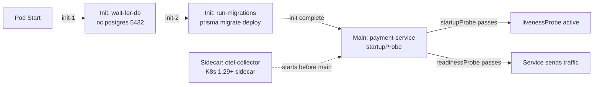

# Startup Ordering & Init Containers

## Category

**Domain:** Production Hardening · **Stack:** Kubernetes, TypeScript · **Scope:** Dependency Readiness & Boot Sequencing

---

## Context

Applications that start before their dependencies are ready — before a database is accepting connections, a config secret is mounted, or a migration has completed — fail with cryptic errors and enter `CrashLoopBackOff`. Kubernetes provides **init containers** and **readiness gates** to enforce strict ordering, ensuring a pod only becomes ready when all preconditions are satisfied.

### Boot Dependency Scenarios

| Scenario | Symptom | Solution |
|----------|---------|---------|
| Service starts before DB is ready | `ECONNREFUSED` on first query | Init container waits for DB |
| Service starts before migration completes | Schema mismatch errors | Migration init container runs first |
| Secret not yet mounted from Vault | `ENOENT` on config read | Init container waits for Vault inject |
| Service marked ready before warm-up | Cold cache causes p99 spike | Readiness probe requires warm cache |
| Sidecar starts before main container | Main container uses sidecar before it is ready | Sidecar ordering (K8s 1.29+) |

### Kubernetes Ordering Tools

| Tool | Purpose | Scope |
|------|---------|-------|
| **Init containers** | Sequential pre-flight checks before main container starts | Within a pod |
| **Readiness probe** | Controls when pod receives traffic | Service-level |
| **Startup probe** | Prevents liveness probe from killing slow-starting containers | Container-level |
| **Pod readiness gates** | Custom conditions extending readiness | Cross-pod |
| **Sidecar containers** | Sidecar that starts/stops with main container lifecycle | K8s 1.29+ |
| **Job dependency** | Run a migration Job; Deployment waits on Job completion | Cross-workload |

---

## Pros

- Init containers guarantee preconditions are met before a single request reaches the application
- Migration init containers ensure zero downtime schema changes are applied before new app code starts
- `kubectl wait` in CI pipelines can block subsequent steps until init containers complete
- Startup probe gives slow-starting JVM/Python apps time to initialise without being killed by liveness probe
- Sidecar container ordering (K8s 1.29+) ensures OTel collector sidecar is running before the main app emits telemetry

## Cons

- Init container failures cause the entire pod to enter `CrashLoopBackOff` — a failing wait-for-DB init container stalls all replicas
- `wait-for-it.sh` pattern adds a network dependency: init container must be able to resolve DB hostname
- Readiness gates require a controller to set the condition — adds operational complexity
- Long-running migrations in init containers block the entire deployment rollout until complete
- Sidecar ordering annotations are only available from Kubernetes 1.29 — older clusters use workarounds

---

## Design Diagram



---

## Code Sample

### YAML — Init Containers: Wait for DB + Run Migration

```yaml
# k8s/deployment.yaml — init containers for safe startup ordering
apiVersion: apps/v1
kind: Deployment
metadata:
  name: payment-service
  namespace: production
spec:
  template:
    spec:
      initContainers:
        # Init 1: Wait until PostgreSQL is accepting TCP connections
        - name: wait-for-db
          image: busybox:1.36
          command:
            - sh
            - -c
            - |
              echo "Waiting for PostgreSQL at $DB_HOST:$DB_PORT..."
              until nc -z "$DB_HOST" "$DB_PORT"; do
                echo "DB not ready — retrying in 2s"
                sleep 2
              done
              echo "DB is ready"
          env:
            - name: DB_HOST
              valueFrom:
                secretKeyRef: { name: db-secret, key: host }
            - name: DB_PORT
              value: "5432"
          resources:
            limits: { cpu: "50m", memory: "32Mi" }

        # Init 2: Run database migrations (after DB is confirmed ready)
        - name: run-migrations
          image: payment-service:2.1.0   # same image as main container
          command: ["node", "dist/migrate.js"]
          env:
            - name: DATABASE_URL
              valueFrom:
                secretKeyRef: { name: db-secret, key: url }
          resources:
            requests: { cpu: "100m", memory: "128Mi" }
            limits:   { cpu: "500m", memory: "256Mi" }

      containers:
        - name: payment-service
          image: payment-service:2.1.0
          # startupProbe: give the app up to 60s to start (30 × 2s)
          # before liveness probe takes over — critical for JVM/Python cold start
          startupProbe:
            httpGet:
              path: /health/startup
              port: 3000
            failureThreshold: 30
            periodSeconds: 2
          livenessProbe:
            httpGet: { path: /health/live, port: 3000 }
            initialDelaySeconds: 0    # startupProbe handles initial wait
            periodSeconds: 10
            failureThreshold: 3
          readinessProbe:
            httpGet: { path: /health/ready, port: 3000 }
            initialDelaySeconds: 0
            periodSeconds: 5
            failureThreshold: 3
```

### YAML — Sidecar Ordering (Kubernetes 1.29+)

```yaml
# k8s/deployment.yaml — OTel collector sidecar starts before main app
# Using the native sidecar containers feature (stable in K8s 1.29)
spec:
  template:
    spec:
      initContainers:
        # Declared as a sidecar (restartPolicy: Always) so it persists after init phase
        - name: otel-collector
          image: otel/opentelemetry-collector-contrib:0.104.0
          restartPolicy: Always      # this is the sidecar flag
          args: ["--config=/conf/config.yaml"]
          readinessProbe:
            httpGet: { path: /, port: 13133 }
            initialDelaySeconds: 2
          resources:
            limits: { cpu: "200m", memory: "128Mi" }
          volumeMounts:
            - name: otel-config
              mountPath: /conf
      containers:
        - name: payment-service
          image: payment-service:2.1.0
          # By the time this starts, otel-collector sidecar is already running
          env:
            - name: OTEL_EXPORTER_OTLP_ENDPOINT
              value: "http://localhost:4317"
```

### TypeScript — Startup Health Endpoint (distinct from liveness/readiness)

```typescript
// src/health/startup.ts
// Startup probe: only passes once the app has completed its own warm-up.
// Allows heavy initialisation (cache warming, schema validation) without
// triggering premature liveness failures.
import type { Request, Response } from 'express';
import { logger } from '../observability/logger';

let startupComplete = false;

export async function warmUp(): Promise<void> {
  logger.info('startup warm-up beginning');
  // Pre-warm connection pool
  await warmPool();
  // Validate schema version matches expectations
  await validateSchemaVersion();
  // Prime in-memory caches
  await primeLocalCache();
  startupComplete = true;
  logger.info('startup warm-up complete');
}

export function startupHandler(_req: Request, res: Response): void {
  if (startupComplete) {
    res.status(200).json({ status: 'started' });
  } else {
    res.status(503).json({ status: 'starting' });
  }
}

async function warmPool(): Promise<void> { /* see connection-pool-tuning.md */ }
async function validateSchemaVersion(): Promise<void> { /* run SELECT version() */ }
async function primeLocalCache(): Promise<void> { /* load frequently accessed config */ }
```

### YAML — Kubernetes Job: Migration with Helm Hook

```yaml
# k8s/migrations/migration-job.yaml
# Helm pre-upgrade hook: runs migration before new Deployment pods start.
# Ensures migration always precedes the new code version.
apiVersion: batch/v1
kind: Job
metadata:
  name: payment-migration-{{ .Release.Revision }}
  annotations:
    "helm.sh/hook": pre-upgrade,pre-install
    "helm.sh/hook-weight": "-5"
    "helm.sh/hook-delete-policy": hook-succeeded
spec:
  backoffLimit: 3
  template:
    spec:
      restartPolicy: OnFailure
      containers:
        - name: migrate
          image: "{{ .Values.image.repository }}:{{ .Values.image.tag }}"
          command: ["node", "dist/migrate.js"]
          env:
            - name: DATABASE_URL
              valueFrom:
                secretKeyRef: { name: db-secret, key: url }
          resources:
            requests: { cpu: "100m", memory: "128Mi" }
            limits:   { cpu: "500m", memory: "256Mi" }
```
