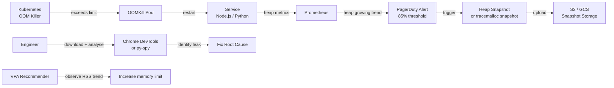

# Memory Leak Detection & OOM Prevention

## Category

**Domain:** Production Hardening · **Stack:** Node.js, Python, Kubernetes · **Scope:** Heap Profiling, Leak Detection & OOMKill Prevention

---

## Context

Memory leaks in long-running services are insidious: they cause gradual heap growth that looks harmless for hours then triggers a sudden OOMKill under load — crashing all in-flight requests simultaneously. Prevention requires three layers: **detection** (observe heap growth trend), **diagnosis** (capture heap snapshots or profiles at high-memory threshold), and **mitigation** (OOMKill policy + VPA + scheduled restarts as last resort).

### Memory Leak Patterns

| Pattern | Cause | Language |
|---------|-------|---------|
| **Event listener accumulation** | `emitter.on()` inside loops without `removeListener` | Node.js |
| **Closure capture** | Lambda captures outer variable, keeping large objects alive | JS/TS, Python |
| **Growing cache without eviction** | In-memory Map/dict grows unbounded | All |
| **Timer not cleared** | `setInterval` callbacks hold references | Node.js |
| **Request context leak** | AsyncLocalStorage / contextvars leak per-request data | Node.js, Python |
| **ORM result accumulation** | Streaming query result stored in full in memory | All |
| **C extension fragmentation** | Python C extensions fragment the heap | Python |

### Kubernetes OOM Handling

| OOM Policy (`oomScoreAdj`) | Effect | When to Use |
|---------------------------|--------|------------|
| **Default (0)** | Kubernetes chooses which pod to kill | Stateless services |
| **Low (-1000)** | Process is last to be killed | Critical system pods |
| **High (1000)** | Process is first to be killed (sacrifice) | Best-effort workers |

---

## Pros

- Heap snapshot at 85% utilisation captures the exact retention tree — pinpoints the leak source in minutes instead of days
- `--max-old-space-size` Node.js flag ensures OOMKill happens at a known threshold rather than consuming the node's memory
- Prometheus `nodejs_heap_space_size_used_bytes` trends allow alerting on *growth rate* before a crash occurs
- Python `tracemalloc` produces allocation snapshots that identify the exact file and line number causing growth
- Kubernetes `OOMScoreAdj` can be tuned so critical pods are protected and best-effort workers are sacrificed first

## Cons

- Heap snapshots are expensive to capture — triggering them too frequently causes GC pauses visible to users
- `--max-old-space-size` must be set below the container memory limit with headroom for off-heap memory (buffers, native modules)
- `tracemalloc` in Python has measurable overhead (10–30% CPU on allocation-heavy code) — cannot run always-on at high frequency
- Scheduled pod restarts mask leaks rather than fixing them — only use as temporary mitigation while fixing root cause
- Memory growth due to legitimate cache warming looks identical to a leak in short observation windows

---

## Design Diagram



---

## Code Sample

### TypeScript — Heap Monitor with Automatic Snapshot Trigger

```typescript
// src/observability/heap-monitor.ts
// Watches heap usage. When it exceeds the trigger threshold, captures a
// V8 heap snapshot and uploads it to S3 for offline analysis.
import v8 from 'v8';
import fs from 'fs';
import path from 'path';
import { logger } from './logger';

const SNAPSHOT_TRIGGER_RATIO = 0.85;  // 85% of --max-old-space-size
const SNAPSHOT_COOLDOWN_MS   = 300_000; // at most one snapshot per 5 min
let lastSnapshotAt = 0;

export function startHeapMonitor(intervalMs = 15_000): void {
  setInterval(() => {
    const stats = v8.getHeapStatistics();
    const ratio = stats.used_heap_size / stats.heap_size_limit;

    if (ratio > SNAPSHOT_TRIGGER_RATIO && Date.now() - lastSnapshotAt > SNAPSHOT_COOLDOWN_MS) {
      lastSnapshotAt = Date.now();
      captureHeapSnapshot().catch((err) =>
        logger.error({ err }, 'failed to capture heap snapshot'),
      );
    }
  }, intervalMs);
}

async function captureHeapSnapshot(): Promise<void> {
  const filename = path.join('/tmp', `heap-${Date.now()}.heapsnapshot`);
  logger.warn({ filename }, 'heap threshold exceeded — capturing snapshot');

  const stream = v8.writeHeapSnapshot(filename);
  logger.info({ filename, bytes: fs.statSync(stream).size }, 'snapshot written');

  // Upload to S3 (requires AWS SDK configured via IAM role)
  const { S3Client, PutObjectCommand } = await import('@aws-sdk/client-s3');
  const s3 = new S3Client({ region: process.env.AWS_REGION });
  await s3.send(new PutObjectCommand({
    Bucket: process.env.HEAP_DUMP_BUCKET!,
    Key: `heap-snapshots/${process.env.POD_NAME}/${path.basename(filename)}`,
    Body: fs.createReadStream(filename),
  }));

  fs.unlinkSync(filename);  // clean up local copy
  logger.info('heap snapshot uploaded to S3');
}
```

### TypeScript — Common Leak Patterns & Fixes

```typescript
// ✗ LEAK: event listener added inside request handler
app.get('/data', (req, res) => {
  emitter.on('data', (d) => res.json(d));  // new listener added per request — never removed
});

// ✓ FIX: one-time listener with proper cleanup
app.get('/data', (req, res) => {
  const handler = (d: unknown) => { res.json(d); emitter.off('data', handler); };
  emitter.once('data', handler);          // automatically removed after first emit
  req.on('close', () => emitter.off('data', handler)); // clean up if client disconnects
});

// ✗ LEAK: unbounded in-memory cache
const cache = new Map<string, object>();
function getData(key: string): object {
  if (!cache.has(key)) cache.set(key, fetchExpensive(key)); // grows forever
  return cache.get(key)!;
}

// ✓ FIX: LRU cache with size limit
import { LRUCache } from 'lru-cache';
const cache = new LRUCache<string, object>({ max: 1000, ttl: 5 * 60 * 1000 });
```

### Python — tracemalloc Snapshot Endpoint

```python
# src/debug/memory.py
# Exposes a /debug/memory endpoint (protected by auth) that returns the
# top memory-consuming allocations — safe to call in staging/production for diagnosis
import tracemalloc
import linecache
from fastapi import APIRouter, Depends

router = APIRouter(prefix="/debug", include_in_schema=False)

tracemalloc.start(25)  # capture 25-frame tracebacks


@router.get("/memory")
async def memory_snapshot(limit: int = 20) -> dict:
    """Return top N memory allocations. Requires internal auth."""
    snapshot = tracemalloc.take_snapshot()
    top_stats = snapshot.statistics("lineno")[:limit]
    return {
        "top_allocations": [
            {
                "file":  stat.traceback.format()[0] if stat.traceback else "unknown",
                "size_kb": round(stat.size / 1024, 1),
                "count":   stat.count,
            }
            for stat in top_stats
        ]
    }
```

### YAML — Kubernetes: Max Old Space + OOM Restart Policy

```yaml
# k8s/deployment.yaml — Node.js memory configuration
spec:
  template:
    spec:
      containers:
        - name: payment-service
          image: payment-service:2.1.0
          env:
            # --max-old-space-size must be < memory limit to leave headroom for
            # off-heap buffers (~50–100Mi), native modules, and OS overhead
            - name: NODE_OPTIONS
              value: "--max-old-space-size=384"   # 384Mi heap, 512Mi limit
          resources:
            requests:
              memory: "256Mi"
            limits:
              memory: "512Mi"      # OOMKill if RSS exceeds 512Mi

---
# Prometheus alert: sustained heap growth trend
# (alert before OOMKill, not after)
- alert: NodeJSHeapGrowthTrend
  expr: |
    predict_linear(
      nodejs_heap_space_size_used_bytes{space_name="old"}[30m], 3600
    ) > nodejs_heap_space_size_limit_bytes{space_name="old"}
  for: 10m
  labels:
    severity: warning
  annotations:
    summary: "{{ $labels.instance }} heap predicted to exhaust in < 1h"
    description: "Old-generation heap is growing linearly. Check for event listener or cache leaks."
```
