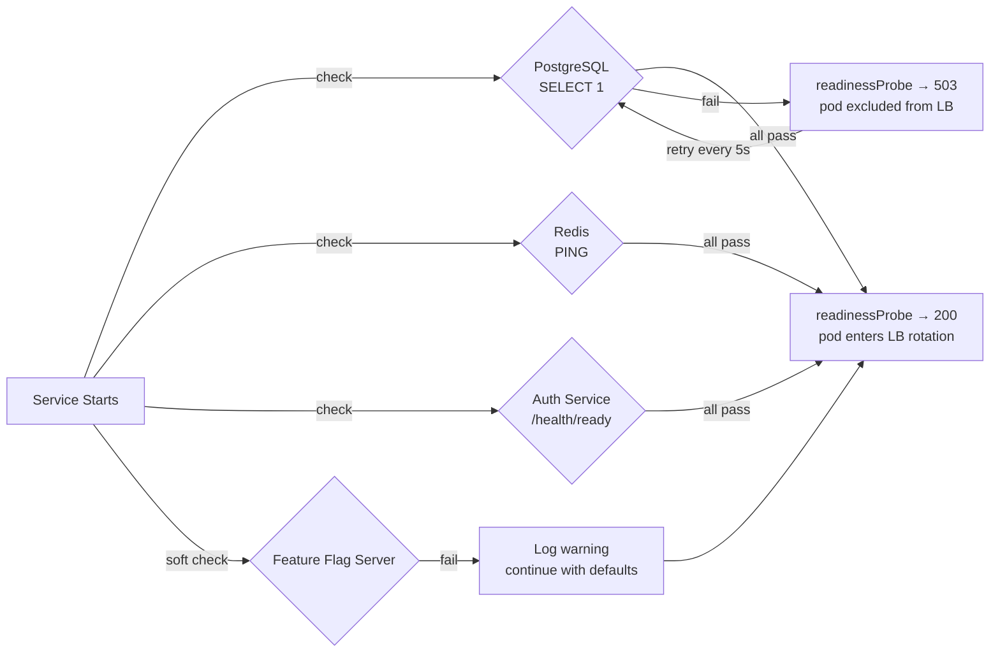

# Dependency Health Gating

## Category

**Domain:** Production Hardening · **Stack:** TypeScript, Python, Kubernetes · **Scope:** Startup Dependency Validation & Circuit-Open-on-Boot Prevention

---

## Context

A service that starts successfully but immediately opens a circuit breaker because its downstream dependencies are unhealthy causes cascading failures: it accepts inbound requests, fails them all, and generates error-budget burn before engineers even notice the dependency issue. **Dependency health gating** prevents this by checking critical dependencies during startup and refusing to declare readiness until those checks pass.

### Dependency Classification

| Class | Examples | If Unhealthy at Start |
|-------|---------|----------------------|
| **Hard dependency** | Primary database, auth service | Refuse readiness — pod stays out of LB rotation |
| **Soft dependency** | Analytics sink, feature flag server | Log warning, continue — degrade gracefully |
| **Lazy dependency** | Third-party partner API | Skip startup check — handle at call time |

### Health Check Approaches

| Approach | Mechanism | Best For |
|----------|-----------|---------|
| **TCP connect** | `nc host port` — confirms process is listening | DB, Redis, Kafka |
| **HTTP GET readiness** | Call `/health/ready` of dependency | Microservices |
| **Deep check** | SELECT 1 / PING / publish-consume round-trip | Database, message queues |
| **Circuit ready check** | Circuit is `CLOSED` and recent error rate < threshold | Downstream services |

---

## Pros

- Refusing readiness when dependencies are unhealthy keeps the pod out of the load balancer — users never see these errors
- Hard dependency checks surface infrastructure problems immediately at deploy time rather than via user complaints
- Separating hard/soft dependencies enables graceful degradation: the service boots and serves partial functionality
- Kubernetes readiness probe re-evaluates continuously — if a dependency recovers, the pod automatically re-enters rotation
- Dependency check results are structured logs — searchable in Loki for postmortem analysis

## Cons

- Over-broad hard dependency list causes deployment deadlocks: service A won't start until B is ready, B won't start until A is ready
- Deep checks (SELECT 1) consume a DB connection during every readiness probe evaluation — size pool accordingly
- Transient network hiccups during startup can cause unnecessary CrashLoopBackOff if retry logic is insufficient
- Dependency health check timeouts must be shorter than the readiness probe `timeoutSeconds` — easy to misconfigure
- Checking every soft dependency at startup prolongs boot time, worsening cold-start latency

---

## Design Diagram



---

## Code Sample

### TypeScript — Dependency Health Registry

```typescript
// src/health/dependency-registry.ts
// A registry of hard and soft dependencies checked at readiness probe time.
// Hard failures prevent readiness; soft failures log a warning and continue.
import { logger } from '../observability/logger';

export type DependencyClass = 'hard' | 'soft';

export interface Dependency {
  name: string;
  class: DependencyClass;
  check(): Promise<void>;  // resolves = healthy, rejects = unhealthy
}

const registry: Dependency[] = [];

export function registerDependency(dep: Dependency): void {
  registry.push(dep);
}

export async function checkAllDependencies(): Promise<{ healthy: boolean; details: Record<string, string> }> {
  const details: Record<string, string> = {};
  let healthy = true;

  await Promise.allSettled(
    registry.map(async (dep) => {
      try {
        await dep.check();
        details[dep.name] = 'ok';
      } catch (err: unknown) {
        const message = err instanceof Error ? err.message : String(err);
        details[dep.name] = `unhealthy: ${message}`;
        if (dep.class === 'hard') {
          healthy = false;
          logger.error({ dependency: dep.name, error: message }, 'hard dependency unhealthy');
        } else {
          logger.warn({ dependency: dep.name, error: message }, 'soft dependency unhealthy — continuing');
        }
      }
    }),
  );

  return { healthy, details };
}
```

### TypeScript — Registering Concrete Dependencies

```typescript
// src/health/dependencies.ts
import { Pool } from 'pg';
import { createClient } from 'redis';
import { registerDependency } from './dependency-registry';

export function registerAllDependencies(pool: Pool, redis: ReturnType<typeof createClient>): void {
  // HARD: Primary database — service cannot function without it
  registerDependency({
    name: 'postgresql',
    class: 'hard',
    async check() {
      const result = await pool.query('SELECT 1 AS alive');
      if (result.rows[0]?.alive !== 1) throw new Error('unexpected result from SELECT 1');
    },
  });

  // HARD: Redis session cache
  registerDependency({
    name: 'redis',
    class: 'hard',
    async check() {
      const pong = await redis.ping();
      if (pong !== 'PONG') throw new Error(`unexpected PING response: ${pong}`);
    },
  });

  // SOFT: Feature flag server — degrade gracefully with defaults
  registerDependency({
    name: 'flagsmith',
    class: 'soft',
    async check() {
      const resp = await fetch(`${process.env.FLAGSMITH_URL}/health`, { signal: AbortSignal.timeout(2000) });
      if (!resp.ok) throw new Error(`HTTP ${resp.status}`);
    },
  });

  // SOFT: Downstream notification service
  registerDependency({
    name: 'notification-service',
    class: 'soft',
    async check() {
      const resp = await fetch('http://notification-service/health/ready', { signal: AbortSignal.timeout(2000) });
      if (!resp.ok) throw new Error(`HTTP ${resp.status}`);
    },
  });
}
```

### TypeScript — Readiness & Liveness Endpoints

```typescript
// src/health/router.ts
import { Router } from 'express';
import { checkAllDependencies } from './dependency-registry';

const router = Router();

// Liveness: only checks that the process itself is alive — no dependency checks.
// Failing liveness causes a pod restart — only appropriate for true deadlocks.
router.get('/health/live', (_req, res) => {
  res.status(200).json({ status: 'alive' });
});

// Readiness: checks all registered hard dependencies.
// Failing readiness removes pod from LB rotation without restart.
router.get('/health/ready', async (_req, res) => {
  const { healthy, details } = await checkAllDependencies();
  res.status(healthy ? 200 : 503).json({ status: healthy ? 'ready' : 'not_ready', details });
});

export default router;
```

### Python — FastAPI Dependency Health Gate

```python
# src/health/dependencies.py
import asyncio
import logging
import os
from typing import Any
import asyncpg
import redis.asyncio as redis_async
import httpx

log = logging.getLogger(__name__)


async def check_postgresql(pool: asyncpg.Pool) -> None:
    result = await pool.fetchval("SELECT 1")
    assert result == 1, f"unexpected result: {result}"


async def check_redis(client: redis_async.Redis) -> None:
    pong = await client.ping()
    assert pong, "Redis PING failed"


async def check_soft_dependency(name: str, url: str) -> None:
    try:
        async with httpx.AsyncClient(timeout=2.0) as client:
            resp = await client.get(url)
            resp.raise_for_status()
    except Exception as exc:
        log.warning("soft dependency %s unhealthy: %s", name, exc)


async def readiness_check(db_pool: asyncpg.Pool, redis_client: redis_async.Redis) -> dict[str, Any]:
    """Run all dependency checks. Hard failures make the service not-ready."""
    results: dict[str, str] = {}
    is_ready = True

    # Hard checks
    for name, coro in [
        ("postgresql", check_postgresql(db_pool)),
        ("redis",      check_redis(redis_client)),
    ]:
        try:
            await asyncio.wait_for(coro, timeout=3.0)
            results[name] = "ok"
        except Exception as exc:
            results[name] = f"unhealthy: {exc}"
            is_ready = False
            log.error("hard dependency %s failed: %s", name, exc)

    # Soft checks (fire-and-forget — don't affect readiness boolean)
    asyncio.create_task(
        check_soft_dependency("flagsmith", os.environ.get("FLAGSMITH_URL", "") + "/health")
    )

    return {"ready": is_ready, "dependencies": results}
```
