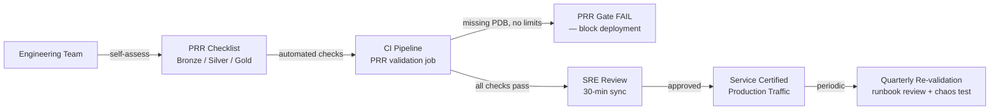

# Production Readiness Review (PRR)

## Category

**Domain:** Production Hardening · **Stack:** Checklists, TypeScript, YAML · **Scope:** Launch Gate Criteria & Service Certification

---

## Context

A **Production Readiness Review (PRR)** is a structured gate that every new service (or major version) must pass before receiving production traffic. Pioneered by Google SRE, it ensures teams have thought through reliability, observability, security, and operational concerns before their first customer touches the service — not after the first outage.

### PRR Domains

| Domain            | Key Questions                                                                            |
| ----------------- | ---------------------------------------------------------------------------------------- |
| **Architecture**  | Is the service stateless? Are dependencies documented? Is there a runbook?               |
| **Reliability**   | Is SLO defined? Are error budgets tracked? Is circuit breaker configured?                |
| **Observability** | Are RED metrics + logs + traces instrumented? Are alerts set? Is runbook linked?         |
| **Security**      | Are secrets managed via Vault/SecretsManager? Is network policy applied? Is seccomp set? |
| **Operations**    | Is graceful shutdown implemented? Are resource limits set? Is PDB configured?            |
| **Capacity**      | Is HPA configured? Has load testing been done? Are connection pools sized?               |
| **Data**          | Are backups configured? Is disaster recovery tested? Are migrations reversible?          |
| **On-call**       | Is the team on-call? Are escalation paths documented? Is the service in PagerDuty?       |

### PRR Gate Levels

| Level      | Criteria                                     | Allowed Traffic             |
| ---------- | -------------------------------------------- | --------------------------- |
| **Bronze** | Core observability + basic SLO               | Internal / beta users       |
| **Silver** | Full PRR checklist + load test passed        | Production (non-critical)   |
| **Gold**   | Chaos tested + SLO-based alerting + runbooks | Revenue-critical production |

---

## Pros

- PRR catches reliability gaps at design time — 10× cheaper than fixing after an outage
- Standardised checklist creates a shared vocabulary between product teams and platform/SRE teams
- PRR artefacts (runbooks, SLO definitions, architecture diagrams) double as onboarding documentation
- Automated PRR checks (CI assertions on missing metrics, absent PDB, no resource limits) catch regressions
- Bronze/Silver/Gold tiers allow teams to ship incrementally rather than waiting for everything to be perfect

## Cons

- PRR process adds lead time to new service launches — must be integrated early in the development cycle, not at go-live
- Checkbox culture: teams mark items complete without implementing them — requires periodic re-validation
- PRR cannot catch unknown unknowns — it checks known best practices but cannot anticipate novel failure modes
- Maintaining the checklist requires a platform/SRE team to update it as standards evolve
- Over-engineered PRR processes slow down small, low-risk services disproportionately

---

## Design Diagram



---

## Code Sample

### TypeScript — Automated PRR Validation Script (CI)

```typescript
// scripts/prr-validate.ts
// Runs in CI against a target namespace to assert PRR compliance.
// Fails the pipeline if critical items are missing.
import { execSync } from "child_process";

interface CheckResult {
  name: string;
  passed: boolean;
  message: string;
  severity: "critical" | "warning";
}

const NAMESPACE = process.env.TARGET_NAMESPACE ?? "staging";

function kubectl(cmd: string): string {
  return execSync(`kubectl ${cmd} -n ${NAMESPACE} -o json`).toString();
}

async function run(): Promise<void> {
  const results: CheckResult[] = [];

  // Check 1: All Deployments have resource limits
  const deployments = JSON.parse(kubectl("get deployments"));
  for (const dep of deployments.items) {
    const containers = dep.spec.template.spec.containers ?? [];
    for (const c of containers) {
      const hasLimits = c.resources?.limits?.memory;
      results.push({
        name: `resource-limits/${dep.metadata.name}/${c.name}`,
        passed: Boolean(hasLimits),
        message: hasLimits ? "memory limit set" : "MISSING memory limit",
        severity: "critical",
      });
    }
  }

  // Check 2: All Deployments with replicas >= 2 have a PDB
  const pdbs = JSON.parse(kubectl("get poddisruptionbudgets"));
  const pdbSelectors = pdbs.items.map((p: any) =>
    JSON.stringify(p.spec.selector?.matchLabels ?? {}),
  );
  for (const dep of deployments.items) {
    const replicas = dep.spec.replicas ?? 1;
    if (replicas >= 2) {
      const labels = dep.spec.selector?.matchLabels ?? {};
      const hasPdb = pdbSelectors.some((s: string) =>
        Object.entries(labels).every(([k, v]) => JSON.parse(s)[k] === v),
      );
      results.push({
        name: `pdb/${dep.metadata.name}`,
        passed: hasPdb,
        message: hasPdb ? "PDB found" : "MISSING PodDisruptionBudget",
        severity: "critical",
      });
    }
  }

  // Check 3: PrometheusRules exist in namespace
  try {
    const rules = JSON.parse(kubectl("get prometheusrules"));
    results.push({
      name: "alert-rules",
      passed: rules.items.length > 0,
      message: `${rules.items.length} PrometheusRule(s) found`,
      severity: "critical",
    });
  } catch {
    results.push({
      name: "alert-rules",
      passed: false,
      message: "No PrometheusRules found",
      severity: "critical",
    });
  }

  // Print results
  let failures = 0;
  for (const r of results) {
    const icon = r.passed ? "✅" : r.severity === "critical" ? "❌" : "⚠️";
    console.log(`${icon} ${r.name}: ${r.message}`);
    if (!r.passed && r.severity === "critical") failures++;
  }

  if (failures > 0) {
    console.error(
      `\n${failures} critical PRR check(s) failed. Fix before deploying to production.`,
    );
    process.exit(1);
  }
  console.log("\nAll critical PRR checks passed.");
}

run().catch((err) => {
  console.error(err);
  process.exit(1);
});
```

### YAML — PRR Checklist (as GitHub Issue Template)

```yaml
# .github/ISSUE_TEMPLATE/prr-checklist.yml
name: Production Readiness Review
description: Gate checklist before promoting a service to production
title: "[PRR] <service-name> v<version>"
labels: ["prr", "platform"]
body:
  - type: markdown
    attributes:
      value: "## Bronze Gate (required for any production traffic)"

  - type: checkboxes
    id: observability
    attributes:
      label: Observability
      options:
        - label: "RED metrics exposed (rate, errors, duration)"
        - label: "Structured JSON logs with trace_id injected"
        - label: "Distributed tracing spans emitted (OTel)"
        - label: "At least one alert rule defined and linked to runbook"
        - label: "SLO defined (availability + latency targets)"

  - type: checkboxes
    id: operations
    attributes:
      label: Operations
      options:
        - label: "Graceful shutdown handler registered (SIGTERM)"
        - label: "CPU and memory requests/limits set on all containers"
        - label: "Liveness + readiness + startup probes configured"
        - label: "PodDisruptionBudget created (if replicas >= 2)"
        - label: "Dependency health gating implemented (hard deps checked at startup)"

  - type: checkboxes
    id: security
    attributes:
      label: Security
      options:
        - label: "Secrets stored in Vault / AWS SecretsManager (not env vars with plaintext values)"
        - label: "seccompProfile: RuntimeDefault set"
        - label: "runAsNonRoot: true, readOnlyRootFilesystem: true"
        - label: "NetworkPolicy allows only required ingress/egress"

  - type: markdown
    attributes:
      value: "## Silver Gate (required for revenue-adjacent services)"

  - type: checkboxes
    id: capacity
    attributes:
      label: Capacity & Resilience
      options:
        - label: "HPA configured (CPU and/or custom metric)"
        - label: "Load test completed (target: 2× expected peak RPS)"
        - label: "Connection pool sized based on observed p99 concurrency"
        - label: "Timeout policy documented (client→gateway→service→DB)"
        - label: "Circuit breaker configured for all hard downstream calls"

  - type: markdown
    attributes:
      value: "## Gold Gate (required for revenue-critical services)"

  - type: checkboxes
    id: gold
    attributes:
      label: Gold Criteria
      options:
        - label: "Chaos experiment run and steady state maintained"
        - label: "SLO-based burn-rate alerting (MWMB rules)"
        - label: "Rollback plan documented and tested in staging"
        - label: "Disaster recovery RTO/RPO defined and tested"
        - label: "Team is on PagerDuty rotation with escalation path"
        - label: "Quarterly re-validation date scheduled"
```

### YAML — GitHub Actions: PRR Validation in CI

```yaml
# .github/workflows/prr-check.yml
name: Production Readiness Check

on:
  pull_request:
    branches: [main]
    paths:
      - "k8s/**"
      - "helm/**"

jobs:
  prr-validate:
    name: PRR Automated Checks
    runs-on: ubuntu-latest
    steps:
      - uses: actions/checkout@v4

      - name: Setup kubectl
        uses: azure/setup-kubectl@v3

      - name: Configure kubeconfig (staging)
        run: |
          echo "${{ secrets.KUBECONFIG_STAGING }}" | base64 -d > ~/.kube/config

      - name: Install dependencies
        run: npm ci --prefix scripts

      - name: Run PRR validation
        run: npx ts-node scripts/prr-validate.ts
        env:
          TARGET_NAMESPACE: staging

      - name: Check for missing runbooks in alert rules
        run: |
          # Fail if any PrometheusRule alert is missing a runbook annotation
          kubectl get prometheusrules -n staging -o json | \
          jq -e '[.items[].spec.groups[].rules[]
            | select(.alert != null)
            | select(.annotations.runbook == null or .annotations.runbook == "")]
            | length == 0' || \
          (echo "FAIL: Alerts found with no runbook annotation" && exit 1)
```
