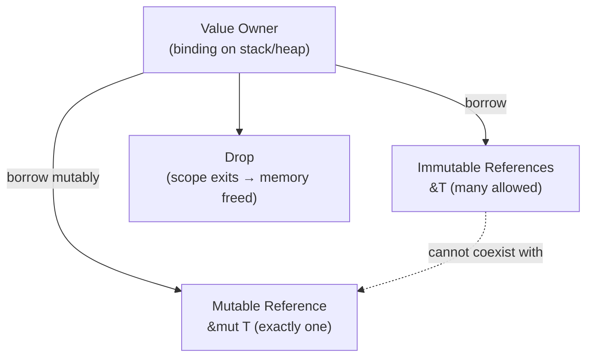

# Ownership & Borrowing

## Category
Rust, Ownership, Borrowing, Lifetimes, Memory Safety

## Context

Rust's ownership system enforces memory safety at compile time with zero runtime overhead. Every value has exactly one owner; when the owner goes out of scope, the value is dropped. **Borrowing** allows temporary references without transferring ownership.

| Rule | Description |
|------|-------------|
| Single owner | Every value has exactly one owner at a time |
| Move semantics | Assignment and function calls move ownership by default |
| Immutable borrow | `&T` — many shared references at once; owner cannot mutate |
| Mutable borrow | `&mut T` — exactly one mutable reference; no other references allowed |
| Lifetimes | Compiler tracks how long references live; annotate when inference fails |

### Copy vs Clone

| Trait | Behaviour | Examples |
|-------|-----------|---------|
| `Copy` | Implicit bitwise copy; assignment does not invalidate original | `i32`, `bool`, `char`, `f64`, `&T` |
| `Clone` | Explicit deep copy via `.clone()` | `String`, `Vec<T>`, `HashMap` |

Types that own heap memory cannot be `Copy` — they implement `Clone` instead.

---

## Pros

- Memory leaks, use-after-free, double-free, and data races are impossible without `unsafe`.
- Zero-cost: ownership checks are compile-time only — no GC pauses, no reference-count overhead.
- Move semantics enable efficient transfer of large data structures without copying.
- Lifetimes enforce that references never outlive the data they point to — no dangling pointers.
- The borrow checker guides API design towards clear ownership boundaries.

---

## Cons

- Learning curve: the borrow checker rejects valid-looking code until ownership patterns are internalised.
- Circular references between owned values require `Rc<RefCell<T>>` or `Weak<T>` — more verbose.
- Long-lived borrows can block mutation for the duration of the borrow — requires restructuring code.
- Lifetime annotations on complex data structures can become verbose.
- Refactoring ownership patterns in large codebases is more disruptive than in GC languages.

---

## Design Diagram



---

## Code Sample

### Move semantics

```rust
fn main() {
    let s1 = String::from("hello");
    let s2 = s1;             // s1 is MOVED into s2
    // println!("{s1}");     // compile error: value used after move

    let n1: i32 = 42;
    let n2 = n1;             // i32 is Copy — both n1 and n2 are valid
    println!("{n1} {n2}");
}

fn take_ownership(s: String) {
    println!("{s}");
}   // s is dropped here

fn take_borrow(s: &String) {
    println!("{s}");
}   // s is NOT dropped — caller still owns it
```

### Borrowing rules

```rust
fn main() {
    let mut v = vec![1, 2, 3];

    // Many immutable borrows are fine simultaneously
    let r1 = &v;
    let r2 = &v;
    println!("{r1:?} {r2:?}");
    // r1, r2 go out of scope here (non-lexical lifetimes)

    // Mutable borrow — no other borrows active at the same time
    let r3 = &mut v;
    r3.push(4);
    println!("{r3:?}");
}
```

### Lifetimes — explicit annotation

```rust
// Without annotation the compiler cannot determine which reference lives longer
fn longest<'a>(x: &'a str, y: &'a str) -> &'a str {
    if x.len() > y.len() { x } else { y }
}

// Struct that holds a reference must be annotated
struct StrSplit<'a> {
    remainder: &'a str,
    delimiter: &'a str,
}

impl<'a> StrSplit<'a> {
    fn new(s: &'a str, delim: &'a str) -> Self {
        StrSplit { remainder: s, delimiter: delim }
    }
}
```

### Copy and Clone

```rust
#[derive(Debug, Clone)]   // Clone: explicit deep copy
struct Config {
    host: String,
    port: u16,
}

#[derive(Debug, Clone, Copy)]  // Copy: implicit bitwise copy
struct Point {
    x: f64,
    y: f64,
}

fn main() {
    let p1 = Point { x: 1.0, y: 2.0 };
    let p2 = p1;           // COPY — p1 still valid
    println!("{p1:?} {p2:?}");

    let cfg1 = Config { host: "localhost".into(), port: 8080 };
    let cfg2 = cfg1.clone();  // Explicit CLONE — cfg1 still valid
    let cfg3 = cfg1;          // MOVE — cfg1 no longer valid
}
```

### RAII — Drop trait for cleanup

```rust
struct TempFile {
    path: std::path::PathBuf,
}

impl Drop for TempFile {
    fn drop(&mut self) {
        // Automatically called when TempFile goes out of scope
        let _ = std::fs::remove_file(&self.path);
    }
}

fn main() {
    let f = TempFile { path: "/tmp/work.tmp".into() };
    // ... use f ...
}   // f.drop() called here automatically — file removed
```

---

## Related

- [08 — Memory Management](./08-memory-management.md) — `Box`, `Rc`, `Arc`, interior mutability
- [04 — Traits & Generics](./04-traits-generics.md) — `Copy`, `Clone`, `Drop` are all traits
- [12 — FFI & Unsafe](./12-ffi-unsafe.md) — `unsafe` allows bypassing borrow checker for raw pointer work
