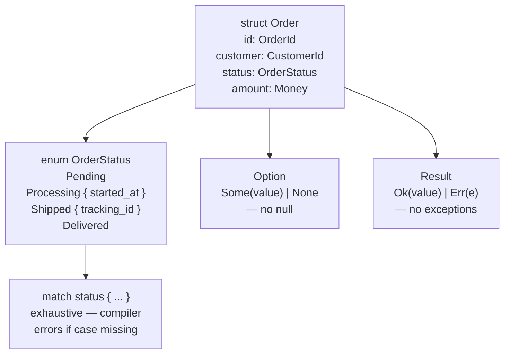

# Type System — Structs, Enums & Pattern Matching

## Category
Rust, Type System, Enums, Pattern Matching, Option, Result

## Context

Rust's type system is algebraic: **structs** (product types) and **enums** (sum types) compose into expressive domain models. `Option<T>` replaces null; `Result<T, E>` enforces error handling. **Pattern matching** with `match` exhaustively covers every variant.

| Feature | Description |
|---------|-------------|
| `struct` | Named product type; tuple struct; unit struct |
| `enum` | Sum type — each variant can carry different data |
| `Option<T>` | `Some(T)` or `None` — no null pointers |
| `Result<T, E>` | `Ok(T)` or `Err(E)` — explicit error path |
| `match` | Exhaustive pattern matching with destructuring |
| `if let` / `while let` | Ergonomic single-variant matching |
| `#[derive]` | Auto-implement `Debug`, `Clone`, `PartialEq`, `serde::{Serialize, Deserialize}` |

### New-type pattern

Wrap a primitive in a struct to gain type safety without runtime cost:

```rust
struct OrderId(String);
struct CustomerId(String);
// Now OrderId and CustomerId are distinct types — cannot be swapped accidentally
```

---

## Pros

- Exhaustive `match` — the compiler forces you to handle every enum variant; no forgotten cases.
- `Option<T>` makes null-safety a compile-time guarantee — no `NullPointerException` family of bugs.
- Enums with data (`enum Message { Move { x: i32, y: i32 }, Quit }`) eliminate entire classes of tag-union bugs from C.
- New-type pattern adds domain semantics to primitives at zero runtime cost.
- `#[derive(serde::Serialize, serde::Deserialize)]` generates JSON/TOML/YAML serialisation without reflection.

---

## Cons

- Large enums with many variants require verbose `match` arms — consider `#[non_exhaustive]` for public APIs.
- Deeply nested `Option` / `Result` chains require the `?` operator or combinators (`map`, `and_then`, `unwrap_or_else`) to stay readable.
- Default field values require custom constructors or the `Default` trait — no constructor overloading.
- Recursive types (`enum Tree { Leaf, Node(Box<Tree>, Box<Tree>) }`) need `Box` indirection to be sized.
- Struct update syntax (`..other`) copies/moves all unspecified fields — can accidentally include sensitive data.

---

## Design Diagram



---

## Code Sample

### Structs and new-type pattern

```rust
use serde::{Deserialize, Serialize};
use uuid::Uuid;

// New-type wrappers — distinct types at zero cost
#[derive(Debug, Clone, PartialEq, Serialize, Deserialize)]
pub struct OrderId(pub Uuid);

#[derive(Debug, Clone, PartialEq, Serialize, Deserialize)]
pub struct CustomerId(pub Uuid);

#[derive(Debug, Clone, Serialize, Deserialize)]
pub struct Money {
    pub amount: i64,   // cents
    pub currency: Currency,
}

#[derive(Debug, Clone, Serialize, Deserialize)]
pub struct Order {
    pub id: OrderId,
    pub customer_id: CustomerId,
    pub amount: Money,
    pub status: OrderStatus,
    pub created_at: chrono::DateTime<chrono::Utc>,
}
```

### Enum with data per variant

```rust
#[derive(Debug, Clone, PartialEq, Serialize, Deserialize)]
pub enum OrderStatus {
    Pending,
    Processing { started_at: chrono::DateTime<chrono::Utc> },
    Shipped { tracking_id: String },
    Delivered { delivered_at: chrono::DateTime<chrono::Utc> },
    Cancelled { reason: String },
}

impl OrderStatus {
    pub fn is_terminal(&self) -> bool {
        matches!(self, Self::Delivered { .. } | Self::Cancelled { .. })
    }
}
```

### Exhaustive pattern matching

```rust
fn describe_status(status: &OrderStatus) -> String {
    match status {
        OrderStatus::Pending =>
            "Awaiting processing".to_string(),
        OrderStatus::Processing { started_at } =>
            format!("Processing since {started_at}"),
        OrderStatus::Shipped { tracking_id } =>
            format!("Shipped — tracking: {tracking_id}"),
        OrderStatus::Delivered { delivered_at } =>
            format!("Delivered on {delivered_at}"),
        OrderStatus::Cancelled { reason } =>
            format!("Cancelled: {reason}"),
        // Missing a variant here → compile error
    }
}
```

### Option — safe nullable values

```rust
fn find_order(id: &OrderId, orders: &[Order]) -> Option<&Order> {
    orders.iter().find(|o| &o.id == id)
}

// Using if let
if let Some(order) = find_order(&id, &orders) {
    println!("Found: {:?}", order.status);
}

// Using combinators
let amount = find_order(&id, &orders)
    .map(|o| o.amount.amount)
    .unwrap_or(0);

// Propagate None upward with ?
fn get_shipping_id(orders: &[Order], id: &OrderId) -> Option<&str> {
    let order = find_order(id, orders)?;
    match &order.status {
        OrderStatus::Shipped { tracking_id } => Some(tracking_id.as_str()),
        _ => None,
    }
}
```

### Builder pattern for complex structs

```rust
#[derive(Default)]
pub struct OrderBuilder {
    customer_id: Option<CustomerId>,
    amount: Option<Money>,
}

impl OrderBuilder {
    pub fn customer_id(mut self, id: CustomerId) -> Self {
        self.customer_id = Some(id); self
    }
    pub fn amount(mut self, amount: Money) -> Self {
        self.amount = Some(amount); self
    }
    pub fn build(self) -> Result<Order, &'static str> {
        Ok(Order {
            id: OrderId(Uuid::new_v4()),
            customer_id: self.customer_id.ok_or("customer_id required")?,
            amount: self.amount.ok_or("amount required")?,
            status: OrderStatus::Pending,
            created_at: chrono::Utc::now(),
        })
    }
}
```

---

## Related

- [03 — Error Handling](./03-error-handling.md) — `Result<T, E>` and the `?` operator
- [04 — Traits & Generics](./04-traits-generics.md) — trait bounds constrain generic types; `From`/`Into` for conversions
- [01 — Ownership & Borrowing](./01-ownership-borrowing.md) — enum variants follow ownership rules; `Box` for recursive enums
