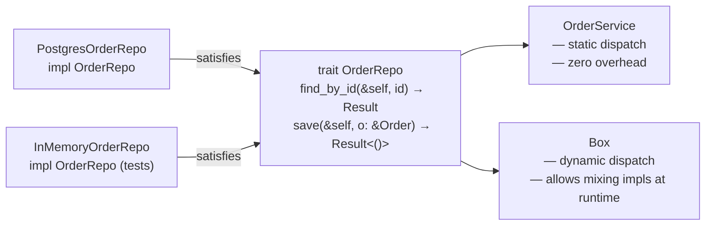

# Traits & Generics

## Category
Rust, Traits, Generics, Bounds, Associated Types

## Context

**Traits** are Rust's mechanism for shared behaviour — similar to interfaces but more powerful. **Generics** with trait bounds enable zero-cost polymorphism at compile time (monomorphisation). **Associated types** provide a way to attach output types to traits without additional type parameters.

| Concept | Description |
|---------|-------------|
| Trait | Named set of methods a type can implement |
| Trait bound | `fn foo<T: Display + Clone>(t: T)` — restrict what `T` can be |
| `where` clause | Alternative syntax for complex bounds |
| Associated type | `type Output` — attached type determined by the implementing type |
| Blanket impl | Implement a trait for all types satisfying a bound |
| `impl Trait` (return) | Opaque return type — hide concrete type from caller |
| `dyn Trait` | Dynamic dispatch — runtime polymorphism, heap allocation |
| Monomorphisation | Compiler generates a separate copy per concrete type — zero overhead |

### Static vs dynamic dispatch

| | `impl Trait` / generics | `dyn Trait` |
|-|------------------------|-------------|
| Dispatch | Compile-time (static) | Runtime (vtable) |
| Performance | No overhead | Indirect call + allocation |
| Flexibility | Type must be known at compile time | Any type at runtime |
| Use case | Libraries, hot paths | Plugin systems, heterogeneous collections |

---

## Pros

- Zero-cost abstractions: generic code compiles to the same assembly as hand-written type-specific code.
- Trait bounds express contracts — if `T: Send + Sync`, the compiler enforces thread safety.
- Blanket implementations extend existing types without modifying them: `impl Display for T where T: Debug`.
- Coherence rules (orphan rule) prevent ambiguous implementations — only one impl per type+trait pair in the ecosystem.
- `std::convert::{From, Into, TryFrom, TryInto}` form a standard conversion vocabulary.

---

## Cons

- Monomorphisation inflates binary size when many concrete types instantiate the same generic code.
- The orphan rule prevents implementing a foreign trait on a foreign type — the new-type pattern is the workaround.
- Complex nested bounds (`T: Iterator<Item = Result<U, E>> where U: Serialize`) hurt readability.
- `dyn Trait` objects cannot use generic methods — only object-safe methods are accessible.
- Lifetime bounds on traits (`T: 'static`) can be counter-intuitive when mixing owned and borrowed data.

---

## Design Diagram



---

## Code Sample

### Defining and implementing a trait

```rust
pub trait OrderRepo {
    async fn find_by_id(&self, id: &OrderId) -> Result<Order, OrderError>;
    async fn save(&self, order: &Order) -> Result<(), OrderError>;
    async fn delete(&self, id: &OrderId) -> Result<(), OrderError>;
}

pub struct PostgresOrderRepo {
    pool: sqlx::PgPool,
}

impl OrderRepo for PostgresOrderRepo {
    async fn find_by_id(&self, id: &OrderId) -> Result<Order, OrderError> {
        sqlx::query_as("SELECT * FROM orders WHERE id = $1")
            .bind(&id.0)
            .fetch_optional(&self.pool)
            .await?
            .ok_or_else(|| OrderError::NotFound { id: id.0.to_string() })
    }

    async fn save(&self, order: &Order) -> Result<(), OrderError> {
        sqlx::query("INSERT INTO orders ...")
            .bind(&order.id.0)
            .execute(&self.pool)
            .await?;
        Ok(())
    }

    async fn delete(&self, id: &OrderId) -> Result<(), OrderError> { todo!() }
}
```

### Generic service with trait bound (static dispatch)

```rust
pub struct OrderService<R: OrderRepo> {
    repo: R,
}

impl<R: OrderRepo> OrderService<R> {
    pub fn new(repo: R) -> Self {
        Self { repo }
    }

    pub async fn get_order(&self, id: &OrderId) -> Result<Order, OrderError> {
        self.repo.find_by_id(id).await
    }
}

// Zero-cost: compiler generates a specialised copy for PostgresOrderRepo
let svc = OrderService::new(PostgresOrderRepo { pool });
```

### Associated types

```rust
pub trait Transformer {
    type Input;
    type Output;
    type Error;

    fn transform(&self, input: Self::Input) -> Result<Self::Output, Self::Error>;
}

pub struct JsonToOrder;

impl Transformer for JsonToOrder {
    type Input  = serde_json::Value;
    type Output = Order;
    type Error  = serde_json::Error;

    fn transform(&self, input: serde_json::Value) -> Result<Order, serde_json::Error> {
        serde_json::from_value(input)
    }
}
```

### Blanket implementation

```rust
// Implement Display for anything that implements Debug (simplified example)
use std::fmt;

pub trait Summary {
    fn summary(&self) -> String;
}

// Blanket: any type implementing Display automatically gets Summary
impl<T: fmt::Display> Summary for T {
    fn summary(&self) -> String {
        format!("Summary: {self}")
    }
}
```

### From / Into conversions

```rust
#[derive(Debug)]
pub struct OrderId(pub Uuid);

// Implement From — Into is automatically derived
impl From<Uuid> for OrderId {
    fn from(id: Uuid) -> Self { OrderId(id) }
}

impl From<OrderId> for Uuid {
    fn from(id: OrderId) -> Self { id.0 }
}

// Usage
let id = OrderId::from(Uuid::new_v4());
let raw: Uuid = id.into();
```

### Dynamic dispatch — heterogeneous collection

```rust
// When you need to mix different repo implementations at runtime
fn build_repo(use_postgres: bool) -> Box<dyn OrderRepo> {
    if use_postgres {
        Box::new(PostgresOrderRepo { pool: create_pool() })
    } else {
        Box::new(InMemoryOrderRepo::new())
    }
}
```

---

## Related

- [01 — Ownership & Borrowing](./01-ownership-borrowing.md) — trait bounds often include lifetime bounds
- [02 — Type System](./02-type-system.md) — `#[derive]` auto-implements common traits
- [07 — Concurrency](./07-concurrency.md) — `Send` and `Sync` are marker traits enforced by the compiler
